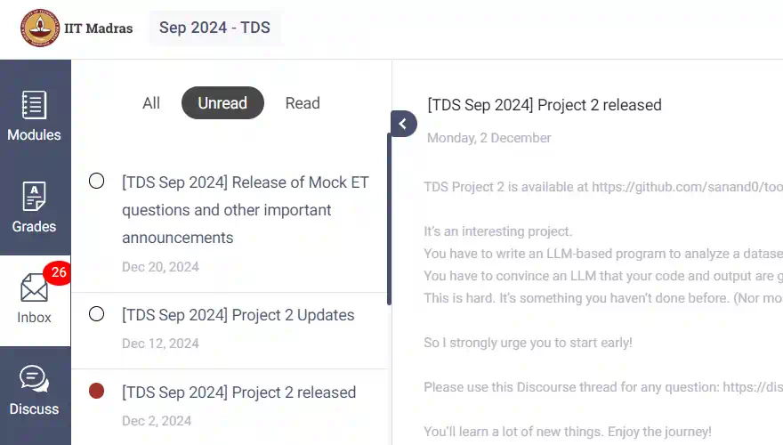

# Tools in Data Science - Jan 2025

[Tools in Data Science](https://study.iitm.ac.in/ds/course_pages/BSSE2002.html) is a practical diploma level data science course at IIT Madras that teaches
popular tools for sourcing data, transforming it, analyzing it, communicating these as visual stories, and deploying them in production.

<strong>This course exposes you to real-life tools</strong>

Courses teach you programming and data science. From statistics to algorithms to writing Python code to building models.

But one critical subject that's rarely covered is: what tools should I pick and how do I become proficient in them?

These tools might not help your CV much. But they will make things easier in real life. For example, at school:

- You learn from pristine datasets. But in the industry, you'll have to scrape them yourself.
- You learn how to train models. But soon, you'll just pick something from HuggingFace.
- You learn to write a log parser over weeks. Instead, your boss writes a `sed` + `grep` script in minutes.

[ "We lost the documentation on quantum mechanics. You'll have to decode the regexes yourself."](https://explainxkcd.com/224/)

In this course, we've curated the most important tools people use in data science.

Learn them well. You'll be a **_lot_ more productive** than your peers.

<strong>This course is quite hard</strong>

Here's students' feedback:

- It _used_ to be an easy course until 2024.
  [#](https://discourse.onlinedegree.iitm.ac.in/t/difficulty-rating-for-diploma-subjects-based-on-students-opinion/61194)
  [#](https://discourse.onlinedegree.iitm.ac.in/t/difficulty-rating-for-diploma-subjects-2-0-based-on-student-ratings-and-my-experience/85681)
  [#](https://discourse.onlinedegree.iitm.ac.in/t/what-should-i-take-next/44291/6)
- Now it's hard and covers more. Take it in your last semester if possible.
  [#](https://discourse.onlinedegree.iitm.ac.in/t/diploma-course-feedback-t32024-and-course-selection-t12025-thread/160032/45)
  [#](https://discourse.onlinedegree.iitm.ac.in/t/2024-t1-diploma-level-feedback-and-course-selection-for-may-2024-term/127856/60)
  [#](https://discourse.onlinedegree.iitm.ac.in/t/2024-t2-diploma-level-feedback-and-course-selection-for-september-2024-term/144976/62?u=s.anand)
- Plan extra time. It takes more time than typical 3-credit courses.
  [#](https://discourse.onlinedegree.iitm.ac.in/t/concerns-regarding-unfair-grading-practices-for-tds-project-2/160611/11)
  [#](https://discourse.onlinedegree.iitm.ac.in/t/diploma-level-course-combo-suggestion/158460/4)
  [#](https://discourse.onlinedegree.iitm.ac.in/t/diploma-level-course-combo-suggestion/158460/7)
- LLMs grade you -- unpredictably.
  [#](https://discourse.onlinedegree.iitm.ac.in/t/concerns-regarding-unfair-grading-practices-for-tds-project-2/160611/10)
  [#](https://discourse.onlinedegree.iitm.ac.in/t/wrong-marks-in-project-2/160355/9)
- The ROE is hard.
  [#](https://discourse.onlinedegree.iitm.ac.in/t/is-it-fair-to-consider-20-weightage-of-such-exam-which-is-impossible-to-solve-in-given-time-i-e-roe/141413/10)

**[Take Graded assignment 1](https://exam.sanand.workers.dev/tds-2025-01-ga1) to check if you're ready for this course.** Please drop this course (do it in a later term) if you score low. It'll be too tough for you now.

<strong>Programming skills are a pre-requisite</strong>

You need a _good_ understanding of Python, JavaScript, HTML, HTTP, Excel, and data science concepts.

**But isn't this a data science course?** Yes. Good data scientists are good programmers. Data scientists don't just analyze data or train models. They source data, clean it, transform it, visualize it, deploy it, and automate the whole process.

In some organizations, some of this work is done by others (e.g. data engineers, IT teams, etc.). But wherever you are, _some_ of the time, you need to write code for all of this yourself.

This course teaches you tools that will make you more productive. But you _do_ need programming to learn many of them.

<strong>We encourage learning by sharing</strong>

You _CAN_ copy from friends. You can work in groups. You can share code. Even in projects, assignments, and exams (except the final end-term exam).

**Why should you copy?** Because in real life, there's no time to re-invent the wheel. You'll be working in teams on the shoulders of giants. It's important to learn how to do that well.

**To learn well, understand** what you're copying. If you're short of time, prioritize.

**To learn better, teach** what you've learnt.

## We cover 7 modules in 12 weeks

The content evolves with technology and feedback.
Track the [commit history](https://github.com/sanand0/tools-in-data-science-public/commits/tds-2025-01/) for changes.

Released content:

1. **[Development Tools](../development-tools.md)** and concepts to **build** models and apps. [Discussion Thread](https://discourse.onlinedegree.iitm.ac.in/t/ga1-development-tools-discussion-thread-tds-jan-2025/161083)
2. **[Deployment Tools](../deployment-tools.md)** and concepts to **publish** what you built. [Discussion Thread](https://discourse.onlinedegree.iitm.ac.in/t/ga1-development-tools-discussion-thread-tds-jan-2025/161083)
3. **[Large Language Models](../large-language-models.md)** that make your work easier and your apps smarter. [Discussion Thread](https://discourse.onlinedegree.iitm.ac.in/t/ga3-large-language-models-discussion-thread-tds-jan-2025/163247)
4. **[Data Sourcing](../data-sourcing.md)** to get data from the web, files, and databases. [Discussion Thread](https://discourse.onlinedegree.iitm.ac.in/t/ga4-data-sourcing-discussion-thread-tds-jan-2025/165959)
5. **[Data Preparation](../data-preparation.md)** to clean up and convert the inputs to the right format. [Discussion Thread](https://discourse.onlinedegree.iitm.ac.in/t/ga5-data-preparation-discussion-thread-tds-jan-2025/166576)

**[Project 1](../project-1.md)** to build an LLM-based automation agent. [Discussion Thread](https://discourse.onlinedegree.iitm.ac.in/t/project-1-llm-based-automation-agent-discussion-thread-tds-jan-2025/164277)

Work in progress:

6. **[Data Analysis](../data-analysis.md)** to find surprising insights in the data.
7. **[Data Visualization](../data-visualization.md)** to communicate those insights as visual stories.

## Evaluations are mostly open Internet

| Exam                                                                       | Type                              | Weight |      Release Date |   Submission Date |
| -------------------------------------------------------------------------- | --------------------------------- | -----: | ----------------: | ----------------: |
| GA: Graded assignments                                                     | Best 4 out of 7 ‡                 |    15% |                   |                   |
| [Graded Assignment 1](https://exam.sanand.workers.dev/tds-2025-01-ga1)     | Online open MCQ                   |        |       30 Dec 2024 |       26 Jan 2025 |
| [Graded Assignment 2](https://exam.sanand.workers.dev/tds-2025-01-ga2)     | Online open MCQ                   |        |        3 Jan 2025 |        2 Feb 2025 |
| [Graded Assignment 3](https://exam.sanand.workers.dev/tds-2025-01-ga3)     | Online open MCQ                   |        |       15 Jan 2025 |        5 Feb 2025 |
| [Graded Assignment 4](https://exam.sanand.workers.dev/tds-2025-01-ga4)     | Online open MCQ                   |        |       31 Jan 2025 |        9 Feb 2025 |
| [P1: Project 1](../project-1.md)                                           | Take-home open-Internet           |    20% |       19 Jan 2025 |       16 Feb 2025 |
| [Graded Assignment 5](https://exam.sanand.workers.dev/tds-2025-01-ga5)     | Online open MCQ                   |        |        7 Feb 2025 |       21 Feb 2025 |
| [Graded Assignment 6][GA6]                                                 | Online open MCQ                   |        |       28 Feb 2025 |       16 Mar 2025 |
| [P2: Project 2](../project-2.md)                                           | Take-home open-Internet           |    20% |        3 Mar 2025 |       31 Mar 2025 |
| [Graded Assignment 7][GA7]                                                 | Online open MCQ                   |        |       14 Mar 2025 |       26 Mar 2025 |
| [ROE: Remote Online Exam](https://exam.sanand.workers.dev/tds-2025-01-roe) | Online open-Internet MCQ          |    20% | 02 Mar 2025 13:00 | 02 Mar 2025 13:45 |
| F: Final end-term                                                          | In-person, no internet, mandatory |    25% |       13 Apr 2025 |                   |

[GA6]: https://seek.onlinedegree.iitm.ac.in/courses/ns_25t1_se2002?id=25&type=assignment&tab=courses&unitId=23
[GA7]: https://seek.onlinedegree.iitm.ac.in/courses/ns_25t1_se2002?id=15&type=assignment&tab=courses&unitId=26

### Updates

- 13 Jan 2025: GA3 release date moved from 10 Jan 2025 to 15 Jan 2025 due to faculty delay. Students have till 2 Feb 2025 - more than the 10 days expected for a GA.
- 22 Jan 2025: GA2 submission date moved from 26 Jan 2025 to 2 Feb 2025. GA4 release date is moved from 24 Jan 2025 to 31 Jan 2025. This is to reduce the amount students have to learn in a short period.
- 29 Jan 2025: GA3 submission date moved from 2 Feb 2025 to 5 Feb 2025.
- 13 Feb 2025: GA5 submission date moved from 16 Feb 2025 to 21 Feb 2025.
- 15 Feb 2025: Project 1 deadline moved from 15 Jan 2025 to 16 Feb 2025.
- 26 Feb 2025:
  - Project 1 results will be released by 16 Mar 2025.
  - Graded Assignment 6 moved from 14 Feb to 28 Feb 2025. Submission date moved from 9 Mar to 16 Mar 2025.
  - Project 2 moved from 21 Feb to 3 Mar 2025. Submission date moved from 17 Mar to 31 Mar 2025.
  - Graded Assignment 7 moved from 28 Feb to 7 Mar 2025. Submission date moved from 16 Mar to 26 Mar 2025.
- 7 Mar 2025: GA7 release date moved from 7 Mar to 14 Mar 2025.

### Notes

- **[Graded Assignment 1](https://exam.sanand.workers.dev/tds-2025-01-ga1) checks course pre-requisites**. Please drop this course (do it in a later term) if you score low. It'll be too tough for you now.
- ‡ **Graded Assignments: Best 4 out 7**. We'll take the best 4 out of your graded assignments submissions. These, combined, will have a 15% weightage.
- **Remote exams are open and hard**
  - You can use the Internet, WhatsApp, ChatGPT, your notes, your friends, your pets...
  - The RoE is especially hard. Read: [What is the purpose of an impossible RoE exam?](https://discourse.onlinedegree.iitm.ac.in/t/whats-the-actual-purpose-of-impossible-roe-exam/99838/2)
- **Final exam is in-person and closed book**. It tests your memory. It's easy.
- **Projects test application**. The projects test how well you apply what you learnt in a real-world context.
- **Bonus activities may be posted on Discourse**. See [previous bonus activities](https://discourse.onlinedegree.iitm.ac.in/tags/c/courses/tds-kb/34/bonus-marks)
- **Evaluations are mostly automated**. This course uses pre-computed (for objective) or LLMs (for subjective) evaluations.
  - LLMs will evaluate you differently each time. Learn to prompt them _robustly_ to get higher marks.

## Constantly check communications

Check these three links regularly to keep up with the course.

1. **[Seek Inbox](https://seek.onlinedegree.iitm.ac.in/)** for Course Announcements. Log into [seek.onlinedegree.iitm.ac.in](https://seek.onlinedegree.iitm.ac.in/) and click on "Inbox" on the left. Check notifications daily.
   
2. **[Your email](https://mail.google.com/)** for Course Announcements. [Seek](https:/seek.onlinedegree.iitm.ac.in/) Inbox are forwarded to your email. Check daily. Check spam folders too.
3. **[TDS Discourse](https://discourse.onlinedegree.iitm.ac.in/c/courses/tds-kb/34)**: Faculty, instructors, and TAs will share updates and address queries here. Email [support@study.iitm.ac.in](mailto:support@study.iitm.ac.in) cc: [discourse-staff1@study.iitm.ac.in](mailto:discourse-staff1@study.iitm.ac.in) if you can't access Discourse.

## People who help you

- **Faculty** (who design the course)
  - [Anand S](https://www.linkedin.com/in/sanand0/),
    [s.anand@gramener.com](mailto:s.anand@gramener.com) |
    [@s.anand](https://discourse.onlinedegree.iitm.ac.in/u/s.anand)
- **Instructors** (who teach the course)
  - Carlton D'Silva.
    [22f3001919@ds.study.iitm.ac.in](mailto:22f3001919@ds.study.iitm.ac.in) |
    [@carlton](https://discourse.onlinedegree.iitm.ac.in/u/carlton)
  - [Prasanna S](https://www.linkedin.com/in/prasanna-sugumaran-ab980222/),
    [prasanna@study.iitm.ac.in](mailto:prasanna@study.iitm.ac.in) |
    [@iamprasna](https://discourse.onlinedegree.iitm.ac.in/u/iamprasna)
- **Teaching assistants** (who help you with your doubts)
  - Jivraj Singh,
    [22f3002542@ds.study.iitm.ac.in](mailto:22f3002542@ds.study.iitm.ac.in) |
    [@Jivraj](https://discourse.onlinedegree.iitm.ac.in/u/jivraj) |
    [LinkedIn Profile](https://www.linkedin.com/in/jivraj-singh-shekhawat-92a547269/)
  - Saransh Saini,
    [22f1001123@ds.study.iitm.ac.in](mailto:22f1001123@ds.study.iitm.ac.in) |
    [@Saransh_Saini](https://discourse.onlinedegree.iitm.ac.in/u/Saransh_Saini) |
    [LinkedIn Profile](https://www.linkedin.com/in/saranshsaini48/)
  - [Virtual TA](https://chatgpt.com/g/g-mZqKVxKDx-iitm-tds-teaching-assistant)
    ([GPT Instructions](../tds-ta-instructions.md))

<!--
- Mahesh Balan U (MS, PhD - IIT Madras)
- Dixon Prem Daniel (PhD - IIT Madras)
- Ravi Teja (MS - IIT Madras)
- Sathiesh (MS - IIT Madras)
- Rohith Srinivaas M (B.Tech, M.Tech - IIT Madras)

- [Amit Kumar Gupta](https://www.linkedin.com/in/amit-gupta-321994252/) (B.Sc. Delhi University).
  [21f1005763@ds.study.iitm.ac.in](mailto:21f1005763@ds.study.iitm.ac.in) |
  [@Amit1](https://discourse.onlinedegree.iitm.ac.in/u/Amit1)

-->

Their **job** is to help you. Trouble them for your slightest doubts!

## Course Links

- [TDS Discourse](https://discourse.onlinedegree.iitm.ac.in/c/courses/tds-kb/34) - Ask questions, get help, and discuss with your peers.
- [IITM BS Degree Programme - Student Handbook](https://docs.google.com/document/u/1/d/e/2PACX-1vQB7SYIXQPJr0-WcfekVVSt488MdlkNzRUPacbRh2QgOALXcinPybopWIFlY83tdr_mH1QtrhCIsFUq/pub)
- [Tools in Data Science Public course home page](https://study.iitm.ac.in/ds/course_pages/BSSE2002.html)

## Jan 2025 Links

- [Jan 2025 Grading Document]([https://docs.google.com/document/d/1e1l9ERBGYoS2jhKZHcTP6zZUH_NLzJv99xdcyi21Z1Y/pub](https://docs.google.com/document/d/e/2PACX-1vRBH1NuM3ML6MH5wfL2xPiPsiXV0waKlUUEj6C7LrHrARNUsAEA1sT2r7IHcFKi8hvQ45gSrREnFiTT/pub).
- [TDS: Course page - Jan 2025](https://seek.onlinedegree.iitm.ac.in/courses/ns_25t1_se2002) -- for students to access course content.
- [TDS: Course calendar - Jan 2025](https://calendar.google.com/calendar/u/0/r?cid=Y19ib2Y3bnMxbDduNm84azA1dHA4YTlxNWIwZ0Bncm91cC5jYWxlbmRhci5nb29nbGUuY29t)
- [TDS: Announcement group - Jan 2025](https://groups.google.com/a/study.iitm.ac.in/g/25t1_se2002-announce)
- [TDS: Course material](https://drive.google.com/drive/folders/1FE0YPAxcxMzZdjnp3FopuJCI3A2Vq6fC?usp=drive_link) -- Jupyter notebooks, datasets, etc.
- [TDS: TA Sessions - Jan 2025](https://www.youtube.com/playlist?list=PL_h5u1jMeBCl1BquBhgunA4t08XAxsA-C) -- YouTube playlist

<!--

- [Back-end for configuring the lessons](https://cb-prod.seek.study.iitm.ac.in/25t1_se2002/)

-->
