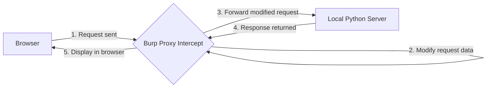

# Lab 1.2 — Web Traffic Debugging with Burp Suite

> **What you'll build**
> A local HTTP proxy laboratory. You will write a single-file Python script to host an interactive security & API sandbox, and then use **Burp Suite**'s Proxy and Repeater tools to intercept, analyze, modify, and replay HTTP traffic to solve three hands-on debugging challenges.

**Time:** 45–60 minutes.
**Difficulty:** ⭐⭐☆☆☆.
**Learning Outcomes:** Intercept and modify outgoing client requests, bypass client-side parameters, perform ID enumeration in the Repeater, and inject custom headers.

---

## What the Finished Thing Looks Like

By the end of this lab, you will have a local server running on port `8000` presenting a sleek, dark-themed diagnostic panel:

```
+-------------------------------------------------------------+
|              TDS Web Traffic Debugging Sandbox             |
+-------------------------------------------------------------+
|  [Challenge 1: Coupons]   [Challenge 2: API]   [Challenge 3: Dev]  |
+-------------------------------------------------------------+
| Challenge 1: The Coupon Bypass                              |
| Enter coupon: [ TDSFREE ]  Role: guest (ReadOnly)           |
|                                                             |
| [ CLAIM FREE COURSE ]                                       |
| Result: Only users with role 'admin' can apply coupons!     |
+-------------------------------------------------------------+
```

Using Burp Suite, you will capture this traffic and "tamper" with the headers and payloads on the fly to obtain **three flags**:
1. `FLAG{BURP_PROXY_BYPASS_SUCCESS}` — obtained by modifying the client's payload body.
2. `FLAG{BURP_REPEATER_FUZZ_FOUND}` — obtained by enumerating API parameters in the Repeater.
3. `FLAG{BURP_HEADER_INJECT_OK}` — obtained by injecting a custom HTTP header.

---

## Practical Context: Why Use a Proxy?

In modern web development:
- **Client-Side Code is Untrusted:** Validation written in HTML or JavaScript (e.g. hiding a button, restricting inputs, or setting a parameter like `is_admin = false`) only exists to provide a smooth user experience. It does **not** stop someone from sending arbitrary data directly to the server.
- **API Visibility:** Browser DevTools can display what requests are sent, but a local HTTP Proxy allows you to halt the request, modify its values *before* it leaves your machine, or replay it multiple times using different arguments without clicking buttons on the UI.



---

## The Steps

Each step below is collapsed by default. Click to expand, run the commands, then move to the next step.

<details>
<summary><b>Step 1 — Create a lab directory and setup with UV</b></summary>

Use `uv` to create a clean project directory. We don't need any external package dependencies since we will build the sandbox using Python's built-in `http.server` module, keeping the workspace light and fast.

```bash
# Create and navigate to the lab folder
mkdir -p tools-sandbox-lab
cd tools-sandbox-lab

# Initialize a project using uv
uv init --app
```

</details>

<details>
<summary><b>Step 2 — Write the Sandbox Server (<code>server.py</code>)</b></summary>

Create `server.py` in your new project folder and paste the complete Python code below. This code contains a micro web server and serves a dark-themed, glassmorphic UI directly.

```python title="server.py"
import json
import urllib.parse
from http.server import HTTPServer, BaseHTTPRequestHandler

# Premium dark-mode HTML & CSS template
HTML_CONTENT = """<!DOCTYPE html>
<html lang="en">
<head>
  <meta charset="UTF-8">
  <title>TDS Web Traffic Debugging Sandbox</title>
  <link href="https://fonts.googleapis.com/css2?family=Outfit:wght@300;400;600;700&display=swap" rel="stylesheet">
  <style>
    :root {
      --bg: #090d16;
      --card-bg: rgba(17, 24, 39, 0.65);
      --border: rgba(255, 255, 255, 0.08);
      --accent: #6366f1;
      --accent-hover: #818cf8;
      --accent-glow: rgba(99, 102, 241, 0.2);
      --text: #f3f4f6;
      --text-muted: #9ca3af;
      --success: #10b981;
      --success-glow: rgba(16, 185, 129, 0.1);
      --error: #ef4444;
      --error-glow: rgba(239, 68, 68, 0.1);
    }
    * { box-sizing: border-box; margin: 0; padding: 0; }
    body {
      font-family: 'Outfit', -apple-system, sans-serif;
      background: var(--bg);
      background-image: 
        radial-gradient(at 0% 0%, rgba(99, 102, 241, 0.12) 0px, transparent 50%),
        radial-gradient(at 100% 100%, rgba(16, 185, 129, 0.07) 0px, transparent 50%);
      color: var(--text);
      min-height: 100vh;
      display: flex;
      flex-direction: column;
      align-items: center;
      padding: 40px 20px;
    }
    header {
      text-align: center;
      margin-bottom: 40px;
      animation: fadeIn 0.6s ease;
    }
    h1 {
      font-size: 2.3rem;
      font-weight: 700;
      background: linear-gradient(135deg, #a5b4fc, #6366f1, #34d399);
      -webkit-background-clip: text;
      -webkit-text-fill-color: transparent;
      margin-bottom: 8px;
    }
    .subtitle {
      color: var(--text-muted);
      font-size: 1.05rem;
    }
    .sandbox-container {
      width: 100%;
      max-width: 760px;
      background: var(--card-bg);
      border: 1px solid var(--border);
      backdrop-filter: blur(16px);
      border-radius: 20px;
      overflow: hidden;
      box-shadow: 0 20px 50px rgba(0,0,0,0.6);
      animation: fadeIn 0.8s ease;
    }
    .tabs {
      display: flex;
      background: rgba(0, 0, 0, 0.25);
      border-bottom: 1px solid var(--border);
      padding: 12px 16px 0 16px;
    }
    .tab-btn {
      background: transparent;
      border: none;
      color: var(--text-muted);
      padding: 12px 20px;
      font-size: 0.95rem;
      font-weight: 600;
      cursor: pointer;
      border-radius: 10px 10px 0 0;
      transition: all 0.2s ease;
      margin-right: 4px;
    }
    .tab-btn:hover {
      color: var(--text);
      background: rgba(255, 255, 255, 0.03);
    }
    .tab-btn.active {
      color: var(--accent);
      background: var(--bg);
      border-top: 1px solid var(--border);
      border-left: 1px solid var(--border);
      border-right: 1px solid var(--border);
      position: relative;
    }
    .tab-btn.active::after {
      content: '';
      position: absolute;
      bottom: -1px;
      left: 0;
      right: 0;
      height: 2px;
      background: var(--bg);
    }
    .content-panel {
      padding: 36px;
      display: none;
    }
    .content-panel.active {
      display: block;
    }
    .challenge-title {
      font-size: 1.4rem;
      font-weight: 600;
      margin-bottom: 12px;
      color: #fff;
    }
    .challenge-desc {
      color: var(--text-muted);
      font-size: 0.95rem;
      line-height: 1.6;
      margin-bottom: 24px;
    }
    .form-group {
      margin-bottom: 20px;
      display: flex;
      flex-direction: column;
      gap: 8px;
    }
    label {
      font-size: 0.8rem;
      font-weight: 700;
      color: var(--text-muted);
      text-transform: uppercase;
      letter-spacing: 0.05em;
    }
    input {
      background: rgba(255, 255, 255, 0.03);
      border: 1px solid var(--border);
      color: #fff;
      padding: 12px 16px;
      border-radius: 10px;
      outline: none;
      font-size: 0.95rem;
      transition: all 0.2s ease;
      width: 100%;
    }
    input:focus {
      border-color: var(--accent);
      box-shadow: 0 0 0 3px var(--accent-glow);
    }
    input[disabled] {
      opacity: 0.6;
      cursor: not-allowed;
      background: rgba(255, 255, 255, 0.01);
    }
    .btn {
      background: var(--accent);
      color: #fff;
      border: none;
      padding: 12px 24px;
      font-size: 0.95rem;
      font-weight: 600;
      border-radius: 10px;
      cursor: pointer;
      transition: all 0.2s ease;
      display: inline-flex;
      align-items: center;
      justify-content: center;
      gap: 8px;
    }
    .btn:hover {
      background: var(--accent-hover);
      box-shadow: 0 0 15px var(--accent-glow);
      transform: translateY(-1px);
    }
    .btn:active {
      transform: translateY(0);
    }
    .result-box {
      margin-top: 24px;
      padding: 20px;
      border-radius: 10px;
      background: rgba(0,0,0,0.15);
      border: 1px solid var(--border);
      min-height: 60px;
      display: none;
      animation: slideDown 0.3s ease;
    }
    @keyframes slideDown {
      from { opacity: 0; transform: translateY(-5px); }
      to { opacity: 1; transform: translateY(0); }
    }
    .result-success {
      background: var(--success-glow);
      border-color: rgba(16, 185, 129, 0.2);
    }
    .result-error {
      background: var(--error-glow);
      border-color: rgba(239, 68, 68, 0.2);
    }
    .flag-badge {
      display: inline-block;
      margin-top: 12px;
      padding: 6px 12px;
      border-radius: 6px;
      background: rgba(245, 158, 11, 0.1);
      border: 1px solid rgba(245, 158, 11, 0.25);
      color: #fbbf24;
      font-family: monospace;
      font-weight: 700;
      font-size: 0.95rem;
      letter-spacing: 0.05em;
      box-shadow: 0 0 10px rgba(245, 158, 11, 0.1);
    }
    .badge-label {
      font-size: 0.75rem;
      text-transform: uppercase;
      color: #fbbf24;
      font-weight: 700;
      margin-bottom: 2px;
    }
    pre {
      font-family: monospace;
      white-space: pre-wrap;
      word-break: break-all;
      font-size: 0.9rem;
    }
    .status-badge {
      display: inline-flex;
      align-items: center;
      gap: 6px;
      padding: 6px 12px;
      border-radius: 20px;
      font-size: 0.85rem;
      font-weight: 600;
      margin-top: 10px;
    }
    .status-inactive {
      background: rgba(239, 68, 68, 0.12);
      color: #f87171;
      border: 1px solid rgba(239, 68, 68, 0.2);
    }
    .status-active {
      background: rgba(16, 185, 129, 0.12);
      color: #34d399;
      border: 1px solid rgba(16, 185, 129, 0.2);
    }
  </style>
</head>
<body>

  <header>
    <h1>TDS Web Traffic Debugging Sandbox</h1>
    <p class="subtitle">Solve three debugging challenges using Burp Suite</p>
  </header>

  <div class="sandbox-container">
    <div class="tabs">
      <button class="tab-btn active" onclick="switchTab('tab-coupon', this)">Challenge 1: Coupon Bypass</button>
      <button class="tab-btn" onclick="switchTab('tab-users', this)">Challenge 2: User API</button>
      <button class="tab-btn" onclick="switchTab('tab-dev', this)">Challenge 3: Dev Header</button>
    </div>

    <!-- Challenge 1 Panel -->
    <div id="tab-coupon" class="content-panel active">
      <h2 class="challenge-title">Challenge 1: The Coupon Bypass (Proxy Intercept)</h2>
      <p class="challenge-desc">
        Apply the code <strong>TDSFREE</strong> to claim the course. The server expects you to have the role of <strong>admin</strong> to successfully validate the coupon. The UI has locked your role to <strong>guest</strong>. Can you bypass this frontend constraint?
      </p>
      
      <div class="form-group">
        <label>Coupon Code</label>
        <input type="text" id="coupon-code" value="TDSFREE">
      </div>
      <div class="form-group">
        <label>User Role (Locked by UI)</label>
        <input type="text" id="user-role" value="guest" disabled>
      </div>
      
      <button class="btn" onclick="applyCoupon()">Apply Coupon</button>
      <div id="coupon-result" class="result-box"></div>
    </div>

    <!-- Challenge 2 Panel -->
    <div id="tab-users" class="content-panel">
      <h2 class="challenge-title">Challenge 2: Hidden API Discovery (Repeater)</h2>
      <p class="challenge-desc">
        The application queries user profile APIs directly. You can inspect public profiles by changing the ID. One specific hidden profile contains administrator credentials and a secret flag. Find it!
      </p>
      
      <div class="form-group">
        <label>User ID to Query</label>
        <input type="number" id="user-id-input" value="1" min="1">
      </div>
      
      <button class="btn" onclick="fetchUserProfile()">Query User API</button>
      <div id="users-result" class="result-box"></div>
    </div>

    <!-- Challenge 3 Panel -->
    <div id="tab-dev" class="content-panel">
      <h2 class="challenge-title">Challenge 3: Custom Dev Headers (Header Injection)</h2>
      <p class="challenge-desc">
        This panel checks the server's developer diagnostic mode. The backend expects a request header <code>X-TDS-Developer</code> set to the value <code>active</code>. Inject this header into your outgoing request to reveal the flag.
      </p>
      
      <button class="btn" onclick="checkDevStatus()">Check Developer Status</button>
      
      <div>
        <div id="dev-status-badge" class="status-badge status-inactive">Developer Mode: Inactive</div>
      </div>
      <div id="dev-result" class="result-box"></div>
    </div>
  </div>

  <script>
    function switchTab(panelId, btn) {
      document.querySelectorAll('.content-panel').forEach(p => p.classList.remove('active'));
      document.querySelectorAll('.tab-btn').forEach(b => b.classList.remove('active'));
      document.getElementById(panelId).classList.add('active');
      btn.classList.add('active');
    }

    async function applyCoupon() {
      const code = document.getElementById('coupon-code').value;
      const role = document.getElementById('user-role').value;
      const resBox = document.getElementById('coupon-result');
      
      resBox.style.display = 'block';
      resBox.className = 'result-box';
      resBox.innerHTML = 'Sending request...';

      try {
        const response = await fetch('/api/coupon', {
          method: 'POST',
          headers: { 'Content-Type': 'application/json' },
          body: JSON.stringify({ coupon: code, role: role })
        });
        
        const data = await response.json();
        if (response.ok) {
          resBox.classList.add('result-success');
          resBox.innerHTML = `<pre>${data.message}</pre>
            <div class="badge-label">Flag Received:</div>
            <div class="flag-badge">${data.flag}</div>`;
        } else {
          resBox.classList.add('result-error');
          resBox.innerHTML = `<pre>Error ${response.status}: ${data.message}</pre>`;
        }
      } catch (err) {
        resBox.classList.add('result-error');
        resBox.innerHTML = `<pre>Fetch Error: ${err.message}</pre>`;
      }
    }

    async function fetchUserProfile() {
      const id = document.getElementById('user-id-input').value;
      const resBox = document.getElementById('users-result');
      
      resBox.style.display = 'block';
      resBox.className = 'result-box';
      resBox.innerHTML = 'Fetching profile...';

      try {
        const response = await fetch(\`/api/users/\${id}\`);
        const data = await response.json();
        
        if (response.ok) {
          resBox.classList.add('result-success');
          let flagHtml = '';
          if (data.flag) {
            flagHtml = `<div class="badge-label">Flag Received:</div>
                        <div class="flag-badge">${data.flag}</div>`;
          }
          resBox.innerHTML = `<pre><b>Name:</b> ${data.name}\\n<b>Role:</b> ${data.role}\\n<b>Bio:</b> ${data.bio || 'None'}</pre>${flagHtml}`;
        } else {
          resBox.classList.add('result-error');
          resBox.innerHTML = `<pre>Error ${response.status}: ${data.error}</pre>`;
        }
      } catch (err) {
        resBox.classList.add('result-error');
        resBox.innerHTML = `<pre>Fetch Error: ${err.message}</pre>`;
      }
    }

    async function checkDevStatus() {
      const badge = document.getElementById('dev-status-badge');
      const resBox = document.getElementById('dev-result');
      
      resBox.style.display = 'block';
      resBox.className = 'result-box';
      resBox.innerHTML = 'Querying dev endpoint...';

      try {
        const response = await fetch('/api/dev-status');
        const data = await response.json();
        
        if (data.developer_mode === 'active') {
          badge.className = 'status-badge status-active';
          badge.innerText = 'Developer Mode: Active';
          resBox.classList.add('result-success');
          resBox.innerHTML = `<pre>Developer diagnostics online.</pre>
            <div class="badge-label">Flag Received:</div>
            <div class="flag-badge">${data.flag}</div>`;
        } else {
          badge.className = 'status-badge status-inactive';
          badge.innerText = 'Developer Mode: Inactive';
          resBox.classList.add('result-error');
          resBox.innerHTML = `<pre>${data.message}</pre>`;
        }
      } catch (err) {
        resBox.classList.add('result-error');
        resBox.innerHTML = `<pre>Fetch Error: ${err.message}</pre>`;
      }
    }
  </script>
</body>
</html>
"""

class ChallengeHandler(BaseHTTPRequestHandler):
    def send_json(self, status, data):
        self.send_response(status)
        self.send_header("Content-Type", "application/json")
        self.send_header("Access-Control-Allow-Origin", "*")
        self.send_header("Access-Control-Allow-Headers", "*")
        self.send_header("Access-Control-Allow-Methods", "GET, POST, OPTIONS")
        self.end_headers()
        self.wfile.write(json.dumps(data).encode("utf-8"))

    def do_OPTIONS(self):
        # Handle CORS preflight
        self.send_response(200)
        self.send_header("Access-Control-Allow-Origin", "*")
        self.send_header("Access-Control-Allow-Headers", "*")
        self.send_header("Access-Control-Allow-Methods", "GET, POST, OPTIONS")
        self.end_headers()

    def do_GET(self):
        parsed_path = urllib.parse.urlparse(self.path)
        path = parsed_path.path

        if path == "/" or path == "/index.html":
            self.send_response(200)
            self.send_header("Content-Type", "text/html")
            self.end_headers()
            self.wfile.write(HTML_CONTENT.encode("utf-8"))
        elif path.startswith("/api/users/"):
            # Challenge 2: ID Enumeration
            try:
                user_id = int(path.split("/")[-1])
                if user_id == 1:
                    self.send_json(200, {
                        "id": 1,
                        "name": "Asha (Student)",
                        "role": "User",
                        "bio": "Enrolled in Tools in Data Science 2026."
                    })
                elif user_id == 2:
                    self.send_json(200, {
                        "id": 2,
                        "name": "Dev (TA)",
                        "role": "Moderator",
                        "bio": "Struggling with git conflicts, help!"
                    })
                elif user_id == 1337:
                    self.send_json(200, {
                        "id": 1337,
                        "name": "SYSTEM ROOT",
                        "role": "Administrator",
                        "bio": "Hidden admin diagnostics user.",
                        "flag": "FLAG{BURP_REPEATER_FUZZ_FOUND}"
                    })
                else:
                    self.send_json(404, {"error": f"User ID {user_id} not found."})
            except ValueError:
                self.send_json(400, {"error": "Invalid user ID format."})
        elif path == "/api/dev-status":
            # Challenge 3: Header Injection
            dev_header = self.headers.get("X-TDS-Developer")
            if dev_header == "active":
                self.send_json(200, {
                    "developer_mode": "active",
                    "flag": "FLAG{BURP_HEADER_INJECT_OK}"
                })
            else:
                self.send_json(200, {
                    "developer_mode": "inactive",
                    "message": "Missing required header: 'X-TDS-Developer: active'"
                })
        else:
            self.send_json(404, {"error": "Not found"})

    def do_POST(self):
        parsed_path = urllib.parse.urlparse(self.path)
        path = parsed_path.path

        if path == "/api/coupon":
            content_length = int(self.headers.get('Content-Length', 0))
            post_data = self.rfile.read(content_length)
            try:
                data = json.loads(post_data.decode('utf-8'))
                coupon = data.get("coupon")
                role = data.get("role", "guest")

                if coupon == "TDSFREE":
                    if role == "admin":
                        self.send_json(200, {
                            "success": True,
                            "message": "Coupon successfully applied!",
                            "flag": "FLAG{BURP_PROXY_BYPASS_SUCCESS}"
                        })
                    else:
                        self.send_json(403, {
                            "success": False,
                            "message": f"Apply coupon failed. Only role 'admin' can apply 'TDSFREE'. Current role: '{role}'."
                        })
                else:
                    self.send_json(400, {
                        "success": False,
                        "message": "Invalid coupon code."
                    })
            except json.JSONDecodeError:
                self.send_json(400, {"success": False, "message": "Invalid JSON payload."})
        else:
            self.send_json(404, {"error": "Not found"})

def run(server_class=HTTPServer, handler_class=ChallengeHandler, port=8000):
    server_address = ('', port)
    httpd = server_class(server_address, handler_class)
    print(f"Server started on http://localhost:{port}")
    try:
        httpd.serve_forever()
    except KeyboardInterrupt:
        print("\nShutting down server.")
        httpd.server_close()

if __name__ == '__main__':
    run()
```

</details>

<details>
<summary><b>Step 3 — Run the server locally</b></summary>

Start your sandbox using Python. Because we are using Python's standard library, there is no need to compile packages or run heavy installation suites.

```bash
# Start the server using python
python server.py
```

Open your default browser and go to `http://localhost:8000` to confirm that the server is serving the sandbox dashboard.

</details>

<details>
<summary><b>Step 4 — Start Burp Suite and launch the Built-in Browser</b></summary>

Rather than setting up system-wide Firefox proxy listeners or importing local certificates (which can cause SSL warnings), we will use Burp Suite's built-in chromium browser. This browser is pre-configured to automatically route traffic through Burp.

1. Launch **Burp Suite**.
2. Select **Temporary project** → **Use Burp defaults** → Click **Start Burp**.
3. Inside Burp: Go to the **Proxy** tab (top menu row) → select the **Intercept** sub-tab.
4. Click **Open Browser** to launch Burp's built-in Chromium browser.
5. In this new browser window, navigate to `http://localhost:8000`.

</details>

<details>
<summary><b>Step 4b (Optional but Highly Recommended) — Configure Chrome Proxy & Install CA Certificate</b></summary>

While Burp's built-in browser is convenient, real-world traffic debugging is often performed using your own browser (such as Google Chrome). To intercept secure HTTPS traffic in Chrome without scary SSL security warnings, you must configure a proxy and trust Burp's Certificate Authority (CA).

#### Part A: Configure Chrome Proxy
Modern Google Chrome uses your computer's operating system proxy settings:
1. Open **Google Chrome**.
2. Click the **three dots menu** in the top-right corner and select **Settings** (or type `chrome://settings` in the address bar).
3. In the search settings box at the top, type `proxy`.
4. Click on **Open your computer's proxy settings**. This will open your operating system's network configuration panel:
   - **Windows:** Toggle the switch under **Use a proxy server** to **On**. Enter `127.0.0.1` in the **Address** field and `8080` in the **Port** field. Ensure the checkbox for "Don't use the proxy server for local (intranet) addresses" is **unchecked**. Click **Save**.
   - **macOS:** Check the boxes for both **Web Proxy (HTTP)** and **Secure Web Proxy (HTTPS)**. Set the proxy server address for both to `127.0.0.1` and the port to `8080`. Click **OK** and then **Apply**.
   - **Linux (Ubuntu/GNOME):** Go to Settings → Network → Network Proxy. Change the proxy type to **Manual**. Enter `127.0.0.1` for both HTTP and HTTPS proxies, and set the Port to `8080` for both. Apply the changes.

#### Part B: Download the CA Certificate
1. Ensure Burp Suite is running on your machine.
2. In Chrome, open a new tab and navigate to: `http://burpsuite` (you *must* use `http://`, do not use `https://`).
3. You should see a greeting page saying "Welcome to Burp Suite".
4. Click the **CA Certificate** button in the top-right corner to download the certificate file (`cacert.der`). Save it to your Downloads directory.

#### Part C: Import the CA Certificate to Chrome
1. Return to Chrome **Settings** (`chrome://settings`).
2. In the search box, search for `certificates`.
3. Click on **Security** under the **Privacy and security** section.
4. Scroll down and click on **Manage certificates** (or **Manage device certificates** depending on your OS).
5. Select the **Authorities** tab at the top.
6. Click the **Import** button.
7. Navigate to your Downloads folder and select the `cacert.der` file. (Note: On some operating systems, you may need to change the file selector filter from "PKCS#12" to "All files" in your system dialog to view files ending in `.der`).
8. In the trust prompt that appears, check the box next to **Trust this certificate for identifying websites** (this allows Chrome to trust secure connections signed by Burp).
9. Click **OK** or **Finish**.
10. **Restart Google Chrome** (close all Chrome windows and reopen it) to apply the certificate trust.

#### Part D: Test HTTPS Interception
1. In Burp Suite, go to the **Proxy** → **Intercept** tab and make sure **Intercept is off**.
2. In Chrome, try visiting a secure HTTPS website, such as `https://example.com` or `https://httpbin.org`.
3. If everything is configured correctly, the site should load normally without certificate warnings.
4. Turn **Intercept is on** in Burp Suite, then refresh your Chrome browser tab. Burp Suite should now capture the secure HTTPS request!
5. Toggle **Intercept is off** to resume normal browsing.

</details>


<details>
<summary><b>Step 5 — Solve Challenge 1 (Bypassing Client-Side Role Validation)</b></summary>

In this challenge, we bypass client-side validation using the Proxy Interceptor.

1. In Burp Suite: Under the **Proxy** → **Intercept** sub-tab, ensure that **Intercept is on** (the button should be colored/depressed).
2. In the Burp Browser (at `http://localhost:8000`): Go to the **Challenge 1** tab and click **Apply Coupon**.
3. Observe Burp Suite: The browser hangs, and Burp Suite catches the outgoing request.
4. Look at the request body in Burp:
   ```json
   {"coupon":"TDSFREE","role":"guest"}
   ```
5. Edit the payload: Change `"guest"` to `"admin"`.
6. Click the **Forward** button in Burp Suite to send the modified request to the server.
7. Click **Intercept is on** to toggle it to **Intercept is off** (so that subsequent responses flow back freely).
8. Go back to your browser window and look at the result box. The coupon has been successfully applied, and you should see the first flag: `FLAG{BURP_PROXY_BYPASS_SUCCESS}`.

</details>

<details>
<summary><b>Step 6 — Solve Challenge 2 (ID Enumeration via Repeater)</b></summary>

We use the Repeater to query hidden identifiers.

1. In the Burp Browser: Go to the **Challenge 2** tab, type `1` in the input field, and click **Query User API**.
2. Go to Burp Suite: Navigate to the **Proxy** → **HTTP history** tab.
3. Locate the row showing `GET /api/users/1` and click it to view the details.
4. Right-click anywhere in the raw request display → Select **Send to Repeater** (or press `Ctrl + R` / `Cmd + R`).
5. Click the **Repeater** tab in the main top-row menu.
6. Under Repeater, you will see the saved request. Change the path in the top line from:
   `GET /api/users/1 HTTP/1.1`
   to:
   `GET /api/users/1337 HTTP/1.1`
7. Click the **Send** button.
8. Look at the **Response** window on the right. You will see a `200 OK` JSON response containing the administrator bio and your second flag: `FLAG{BURP_REPEATER_FUZZ_FOUND}`.

</details>

<details>
<summary><b>Step 7 — Solve Challenge 3 (Custom Header Injection)</b></summary>

We inject the missing header.

1. Go to the **Proxy** → **Intercept** sub-tab in Burp Suite and toggle **Intercept is on**.
2. In the Burp Browser: Go to the **Challenge 3** tab and click **Check Developer Status**.
3. Observe Burp Suite: The request for `GET /api/dev-status` is caught.
4. Add the authorization header. Edit the raw headers by adding a new line right before the user-agent or below the host:
   ```http
   X-TDS-Developer: active
   ```
5. Click **Forward** in Burp Suite.
6. Toggle **Intercept is off** so the response gets displayed in the browser.
7. View the browser panel. The developer mode status should switch to **Active**, and the third flag is revealed: `FLAG{BURP_HEADER_INJECT_OK}`.

</details>

---

## Troubleshooting

<details>
<summary><b>"Port 8000 is already in use"</b></summary>

If you receive an error that address/port is already in use when launching `server.py`:
- Locate the process occupying port 8000 and close it:
  ```bash
  # Linux / MacOS: find PID on 8000 and kill it
  lsof -i :8000
  kill -9 <PID>
  ```
- Alternatively, modify the port parameter at the bottom of `server.py` to a different port (e.g. `8081` or `9000`), and navigate to `http://localhost:8081` instead.

</details>

<details>
<summary><b>"Built-in browser fails to load pages or fails to launch"</b></summary>

- If chromium fails to open, verify your OS system permissions or try downloading and running the standalone installer.
- If you must use external Google Chrome, configure your system's network proxy settings as described in Step 4b, and ensure any proxy exclusion list (e.g., "Bypass proxy for local addresses" or "No proxy for") is cleared so localhost traffic is captured.

</details>

---

## Knowledge Check

**Q1.** Why is client-side input validation insufficient on its own for security?
- [ ] A) Modern browsers block scripts from executing on local websites.
- [ ] B) Request interception tools bypass browser validation layers entirely.
- [ ] C) Client-side constraints can be easily bypassed by intercepting and editing the raw HTTP request payloads on transit.
- [ ] D) Server-side scripts do not support JSON verification.

<details>
<summary>Answer</summary>

**C** — The client browser has no control over the request payload once it is intercepted by a local proxy. A developer must always perform input authorization, validation, and sanitization on the **server-side**, treating all incoming parameters as untrusted.
</details>

**Q2.** What is the purpose of Burp Suite's Repeater tool?
- [ ] A) It captures every incoming request and blocks it on the fly.
- [ ] B) It enables developers to edit, send, and compare specific HTTP requests repeatedly without browser interaction.
- [ ] C) It automatically crawls and indexes all directories of a target website.
- [ ] D) It generates local CA certificates to sign requests.

<details>
<summary>Answer</summary>

**B** — Repeater is designed to facilitate quick, manual iteration and debugging of individual HTTP endpoints by tweaking request paths, methods, headers, or bodies, and observing the server's immediate responses.
</details>

**Q3.** What will happen if you set a browser manual proxy configuration to port 8080 but close Burp Suite?
- [ ] A) The browser will bypass the proxy and connect directly to the server.
- [ ] B) The browser will fail to fetch any webpages (network timeouts / connection refused).
- [ ] C) The browser will automatically run a fallback local proxy.
- [ ] D) The website will display with unstyled CSS.

<details>
<summary>Answer</summary>

**B** — The browser expects a listener service to accept traffic on `127.0.0.1:8080`. If Burp Suite is closed, no application is listening on that port, so all outgoing web requests will fail.
</details>

---

## Video Resources

Watch this video to learn the basics of Burp Suite Community Edition:

[](https://www.youtube.com/watch?v=G3hpAeoZ4ek)

---

## What You've Learned

- How to scaffold a local Python-based test API using built-in libraries.
- Intercepting active HTTP requests using Burp Proxy.
- Editing payloads to bypass client-side assumptions.
- Fuzzing and discovering API resources using Burp Repeater.
- Injecting custom request headers on the fly.
