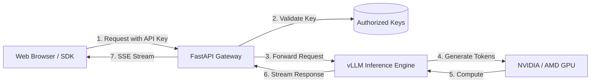
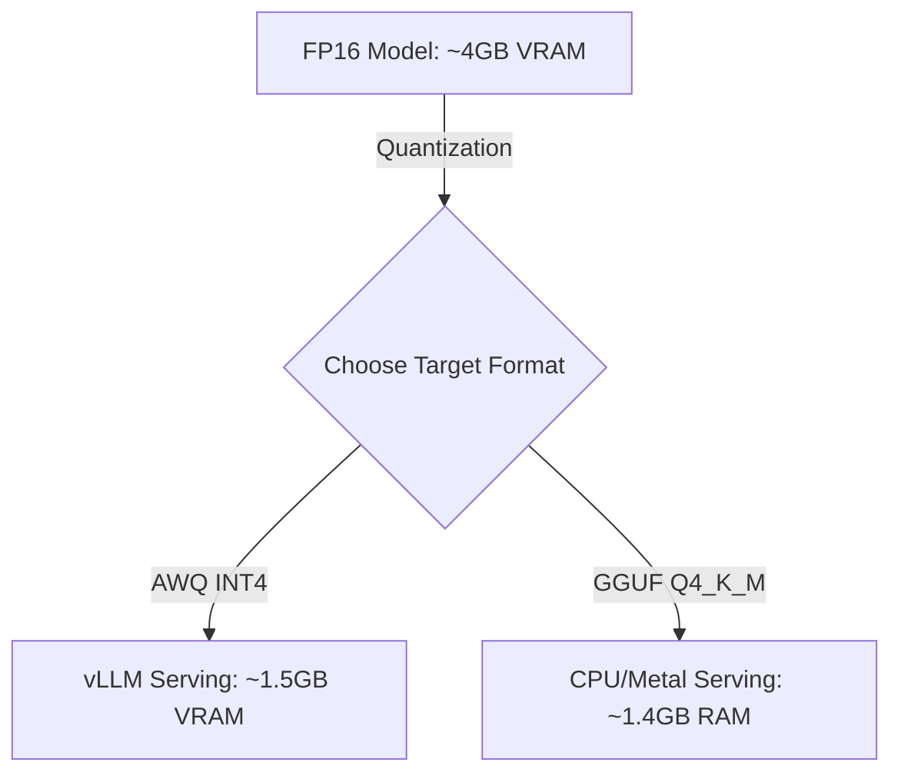
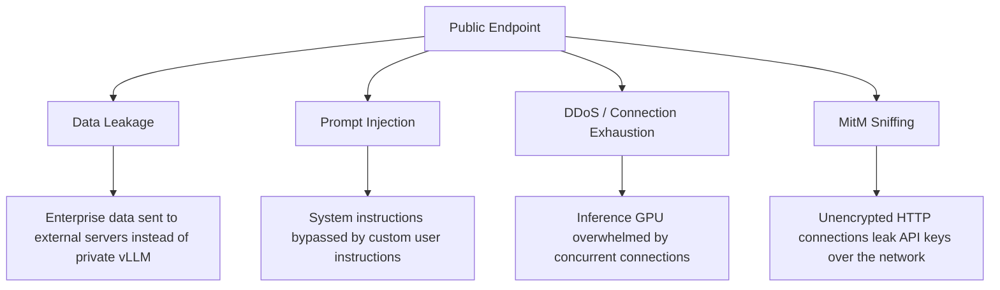

# Lab: Deploying Private LLMs with vLLM & API Gateway

This practical lab guides you through serving open-source Large Language Models (LLMs) like Gemma 2B or Qwen 2.5 locally and in production using **vLLM** (or Ollama/llama.cpp as a CPU fallback). To prevent data leakage and secure your infrastructure, you will build a FastAPI API Gateway that wraps your model server behind secure API keys and supports real-time OpenAI-compatible token streaming.



### Theoretical Context: vLLM & Quantization

#### Why vLLM?
Standard PyTorch or Hugging Face serving frameworks handle requests sequentially or in static batch queues. This causes massive latency and wastes GPU capacity. vLLM solves this with:
1. **PagedAttention:** Inspired by virtual memory paging in operating systems, it partitions the Key-Value (KV) cache into non-contiguous physical memory blocks, reducing memory waste by up to 96%.
2. **Continuous Batching:** Combines newly arrived requests with active sequences on a token-by-token basis. No request needs to wait for another request to finish generating completely.
3. **Enterprise Adoption:** Platforms like Anyscale, Together AI, RunPod, and scale-ups running sovereign AI workloads use vLLM as their standard inference backend.

#### What is Quantization?
Raw weights in model checkpoints are stored in 16-bit floating-point (FP16 or BF16) precision. A 2-billion parameter model requires ~4GB VRAM just to load. Quantization compresses these weights into lower bit-depth representations (e.g., INT8 or INT4) by mapping continuous weight values to discrete bins.
- **GGUF:** Highly optimized for CPU inference and partial GPU offloading (used by llama.cpp/Ollama).
- **AWQ (Activation-aware Weight Quantization):** Protects the most important weights (based on activation levels) during quantization. It is the preferred format for high-speed GPU serving with vLLM.
- **Compression Impact:**


---

### Step 1: Setup Local Environment & Services
<details>
<summary>Click to view project setup & container configuration</summary>

We will configure a local project directory and spin up a lightweight LLM inference server. 

> [!TIP]
> **GPU Users:** Run vLLM in Docker.
> **CPU/Mac Users:** Run Ollama as your inference server backend since vLLM is heavily optimized for Nvidia/AMD GPUs.

1. **Initialize Project:**
```bash
# Create directory and initialize project
mkdir llm-gateway
cd llm-gateway
uv init

# Add dependencies for gateway proxying
uv add fastapi "uvicorn[standard]" httpx python-dotenv
```

2. **Docker Compose Setup (`docker-compose.yml`):**
Create the orchestrator file. Select **Option A** if you have an Nvidia GPU, or **Option B** (Ollama CPU) for general local testing.

*Option A: Nvidia GPU (vLLM)*
```yaml
version: '3.8'

services:
  llm-server:
    image: vllm/vllm-openai:latest
    container_name: vllm_engine
    runtime: nvidia
    ports:
      - "8000:8000"
    environment:
      - HF_TOKEN=${HF_TOKEN}
    volumes:
      - ~/.cache/huggingface:/root/.cache/huggingface
    ipc: host
    deploy:
      resources:
        reservations:
          devices:
            - driver: nvidia
              count: all
              capabilities: [gpu]
    command: --model Qwen/Qwen2.5-1.5B-Instruct --port 8000 --max-model-len 2048
```

*Option B: CPU / General Fallback (Ollama)*
```yaml
version: '3.8'

services:
  llm-server:
    image: ollama/ollama:latest
    container_name: ollama_engine
    ports:
      - "11434:11434"
    volumes:
      - ollama:/root/.ollama

volumes:
  ollama:
```
*Note: If using Ollama, pull a small model after starting the service:*
```bash
docker compose exec llm-server ollama pull gemma:2b
```

3. **Environment Setup (`.env`):**
```env
# Gateway configuration
PORT=8080
API_KEYS=secret-user-one,secret-developer-two
ENV=development

# Model backend URL (Point to Option A or Option B)
# Option A (vLLM): http://localhost:8000
# Option B (Ollama): http://localhost:11434
MODEL_BACKEND_URL=http://localhost:8000
```
</details>

---

### Step 2: API Key Gatekeeper Middleware
<details>
<summary>Click to view security and authentication handler</summary>

To prevent data leaks and restrict server access, we construct a FastAPI dependency that checks incoming HTTP headers. We support both custom headers (`X-API-Key`) and standard bearer tokens (`Authorization: Bearer <key>`) so that downstream developers can use official OpenAI SDKs without modifications.

Create `auth.py`:
```python
# auth.py
import os
from typing import Optional
from fastapi import Header, HTTPException, status
from dotenv import load_dotenv

load_dotenv()

# Read valid keys from environment variable
VALID_KEYS = set(os.getenv("API_KEYS", "").split(","))

async def verify_api_key(
    x_api_key: Optional[str] = Header(None),
    authorization: Optional[str] = Header(None)
) -> str:
    token = None
    
    # 1. Check custom X-API-Key header
    if x_api_key:
        token = x_api_key
    # 2. Check standard Authorization: Bearer token
    elif authorization and authorization.startswith("Bearer "):
        token = authorization.split(" ")[1]
        
    if not token or token not in VALID_KEYS:
        raise HTTPException(
            status_code=status.HTTP_401_UNAUTHORIZED,
            detail="Unauthorized: Access denied. Invalid API Key."
        )
        
    # Return validated token
    return token
```
</details>

---

### Step 3: OpenAI-Compatible Streaming Forwarder
<details>
<summary>Click to view FastAPI proxy and SSE streaming implementation</summary>

Streaming tokens as they are generated is essential for a fluid user experience. We will use `httpx.AsyncClient`'s stream mode to listen to the model backend and pipe chunks back to the client in real-time as Server-Sent Events (SSE).

Create `main.py`:
```python
# main.py
import os
import json
import httpx
from fastapi import FastAPI, Depends, Request, HTTPException
from fastapi.responses import StreamingResponse, HTMLResponse
from fastapi.middleware.cors import CORSMiddleware
from auth import verify_api_key

MODEL_BACKEND_URL = os.getenv("MODEL_BACKEND_URL", "http://localhost:8000")

app = FastAPI(title="Private LLM Gateway")

# Enable CORS for frontend client interactions
app.add_middleware(
    CORSMiddleware,
    allow_origins=["*"],
    allow_credentials=True,
    allow_methods=["*"],
    allow_headers=["*"],
)

# Shared HTTPX client to prevent connection exhaustion
client = httpx.AsyncClient()

@app.on_event("shutdown")
async def shutdown():
    await client.aclose()

@app.get("/")
async def serve_ui():
    # Serve UI defined in Step 4
    if os.path.exists("static/index.html"):
        with open("static/index.html", "r") as f:
            return HTMLResponse(content=f.read())
    return HTMLResponse("<h1>Gateway running. See static/index.html to interact.</h1>")

@app.get("/v1/models")
async def list_models(authenticated: str = Depends(verify_api_key)):
    # Proxy models list request to backend
    try:
        response = await client.get(f"{MODEL_BACKEND_URL}/v1/models")
        return response.json()
    except Exception as e:
        raise HTTPException(status_code=502, detail=f"Inference server unreachable: {str(e)}")

@app.post("/v1/chat/completions")
async def chat_completions(
    request: Request,
    authenticated: str = Depends(verify_api_key)
):
    body = await request.json()
    is_stream = body.get("stream", False)

    # 1. Handle Streaming completions
    if is_stream:
        async def event_generator():
            try:
                # Forward request to downstream vLLM/Ollama in streaming mode
                async with client.stream(
                    "POST",
                    f"{MODEL_BACKEND_URL}/v1/chat/completions",
                    json=body,
                    headers={"Content-Type": "application/json"},
                    timeout=120.0
                ) as response:
                    if response.status_code != 200:
                        yield f"data: {json.dumps({'error': 'Downstream inference failure'})}\n\n"
                        return
                    
                    # Read incoming chunks and pipe them directly to the client
                    async for chunk in response.aiter_text():
                        yield chunk
            except Exception as e:
                yield f"data: {json.dumps({'error': f'Gateway proxy exception: {str(e)}'})}\n\n"

        return StreamingResponse(event_generator(), media_type="text/event-stream")

    # 2. Handle standard Non-Streaming completions
    else:
        try:
            response = await client.post(
                f"{MODEL_BACKEND_URL}/v1/chat/completions",
                json=body,
                headers={"Content-Type": "application/json"},
                timeout=120.0
            )
            return response.json()
        except Exception as e:
            raise HTTPException(status_code=502, detail=f"Proxy error: {str(e)}")
```
</details>

---

### Step 4: Private Chat Interface
<details>
<summary>Click to view single-page glassmorphic UI code</summary>

Create `static/index.html`. This frontend handles stream reading using browser `ReadableStream` readers. It allows inputting custom system prompts and API keys to connect securely.

```html
<!-- static/index.html -->
<!DOCTYPE html>
<html lang="en">
<head>
  <meta charset="UTF-8">
  <title>Private LLM Chat Console</title>
  <style>
    :root {
      --bg: #0b0f19;
      --glass: rgba(255, 255, 255, 0.03);
      --glass-border: rgba(255, 255, 255, 0.08);
      --accent: #3b82f6;
      --accent-hover: #60a5fa;
      --text: #f3f4f6;
      --text-muted: #9ca3af;
    }
    * { box-sizing: border-box; margin: 0; padding: 0; }
    body {
      font-family: -apple-system, BlinkMacSystemFont, "Segoe UI", Roboto, sans-serif;
      background: var(--bg);
      color: var(--text);
      display: flex;
      justify-content: center;
      align-items: center;
      min-height: 100vh;
      padding: 20px;
    }
    .chat-card {
      background: var(--glass);
      border: 1px solid var(--glass-border);
      backdrop-filter: blur(12px);
      width: 100%;
      max-width: 800px;
      height: 650px;
      border-radius: 16px;
      display: flex;
      flex-direction: column;
      overflow: hidden;
      box-shadow: 0 20px 40px rgba(0,0,0,0.5);
    }
    .header {
      padding: 20px;
      border-bottom: 1px solid var(--glass-border);
      display: flex;
      flex-direction: column;
      gap: 10px;
    }
    .auth-bar {
      display: flex;
      gap: 10px;
    }
    .input-field {
      background: rgba(255,255,255,0.05);
      border: 1px solid var(--glass-border);
      padding: 8px 12px;
      border-radius: 8px;
      color: white;
      outline: none;
      font-size: 13px;
    }
    .feed {
      flex: 1;
      overflow-y: auto;
      padding: 20px;
      display: flex;
      flex-direction: column;
      gap: 16px;
    }
    .msg {
      max-width: 80%;
      padding: 12px 16px;
      border-radius: 12px;
      line-height: 1.5;
      font-size: 14px;
      white-space: pre-wrap;
    }
    .msg-user {
      align-self: flex-end;
      background: var(--accent);
      border-bottom-right-radius: 2px;
    }
    .msg-bot {
      align-self: flex-start;
      background: rgba(255,255,255,0.07);
      border-bottom-left-radius: 2px;
    }
    .control-bar {
      padding: 20px;
      border-top: 1px solid var(--glass-border);
      display: flex;
      gap: 10px;
    }
    .btn {
      background: var(--accent);
      color: white;
      border: none;
      padding: 10px 20px;
      border-radius: 8px;
      cursor: pointer;
      font-weight: 600;
      transition: background 0.2s;
    }
    .btn:hover { background: var(--accent-hover); }
  </style>
</head>
<body>

  <div class="chat-card">
    <div class="header">
      <h2>Private LLM Chat Console</h2>
      <div class="auth-bar">
        <input type="password" id="api-key-input" class="input-field" placeholder="Enter Gateway API Key" style="flex:1;">
        <input type="text" id="system-input" class="input-field" placeholder="System Prompt (e.g. You are a helpful assistant)" style="flex:1;">
      </div>
    </div>
    
    <div class="feed" id="chat-feed">
      <div class="msg msg-bot">Welcome! Enter your gateway credentials above and type a message to start chatting with your private backend model.</div>
    </div>

    <div class="control-bar">
      <input type="text" id="user-input" class="input-field" style="flex:1;" placeholder="Ask the private model..." onkeydown="if(event.key === 'Enter') sendPrompt()">
      <button class="btn" onclick="sendPrompt()">Send</button>
    </div>
  </div>

  <script>
    let chatHistory = [];

    async function sendPrompt() {
      const keyInput = document.getElementById("api-key-input");
      const systemInput = document.getElementById("system-input");
      const userInput = document.getElementById("user-input");
      const feed = document.getElementById("chat-feed");

      const apiKey = keyInput.value.trim();
      const userText = userInput.value.trim();
      const systemText = systemInput.value.trim() || "You are a helpful assistant.";

      if (!apiKey) {
        alert("API Key is required to connect to the gateway.");
        return;
      }
      if (!userText) return;

      // Display User message
      displayMessage(userText, "user");
      userInput.value = "";

      // Construct system context if new chat
      if (chatHistory.length === 0) {
        chatHistory.push({ role: "system", content: systemText });
      }
      chatHistory.push({ role: "user", content: userText });

      // Create placeholder Bot message bubble
      const botBubble = displayMessage("Generating response...", "bot");

      try {
        const response = await fetch("/v1/chat/completions", {
          method: "POST",
          headers: {
            "Content-Type": "application/json",
            "Authorization": `Bearer ${apiKey}`
          },
          body: JSON.stringify({
            model: "Qwen/Qwen2.5-1.5B-Instruct", // Update to match backend model name
            messages: chatHistory,
            stream: true
          })
        });

        if (!response.ok) {
          botBubble.innerText = `Error: HTTP ${response.status} - check key or logs.`;
          return;
        }

        // Initialize Reader to parse Server-Sent Events (SSE) stream
        const reader = response.body.getReader();
        const decoder = new TextDecoder("utf-8");
        botBubble.innerText = ""; // Clear loader
        let fullResponse = "";

        while (true) {
          const { done, value } = await reader.read();
          if (done) break;

          const textChunk = decoder.decode(value);
          // Split chunk by lines since SSE sends events starting with "data: "
          const lines = textChunk.split("\n");
          
          for (let line of lines) {
            line = line.trim();
            if (!line || line === "data: [DONE]") continue;
            
            if (line.startsWith("data: ")) {
              try {
                const parsed = JSON.parse(line.slice(6));
                const deltaContent = parsed.choices[0]?.delta?.content || "";
                fullResponse += deltaContent;
                botBubble.innerText = fullResponse;
                feed.scrollTop = feed.scrollHeight;
              } catch (e) {
                // Ignore parsing errors for empty or truncated lines
              }
            }
          }
        }
        
        chatHistory.push({ role: "assistant", content: fullResponse });

      } catch (err) {
        botBubble.innerText = `Network connection failed: ${err.message}`;
      }
    }

    function displayMessage(text, sender) {
      const feed = document.getElementById("chat-feed");
      const div = document.createElement("div");
      div.className = `msg msg-${sender}`;
      div.innerText = text;
      feed.appendChild(div);
      feed.scrollTop = feed.scrollHeight;
      return div;
    }
  </script>
</body>
</html>
```
</details>

---

### Step 5: Quantization & Hardware Scaling Guide
<details>
<summary>Click to view VRAM sizing and quantization instructions</summary>

Selecting model formats determines whether your inference server operates efficiently or crashes with Out-Of-Memory (OOM) errors. Use this standard guide to size your local or cloud nodes:

#### Calculating VRAM Footprint
To calculate the raw memory required to load a model:
$$\text{Memory (GB)} \approx \frac{\text{Parameter Count (Billions)} \times \text{Quantization Bit-Width}}{8} \times 1.25\ \text{(KV Cache Overhead)}$$

Example profiles:
- **Gemma 2B (FP16):** $2 \times 2 \times 1.25 = 5.0\text{ GB}$ (Needs at least a 6GB GPU).
- **Gemma 2B (AWQ INT4):** $2 \times 0.5 \times 1.25 = 1.25\text{ GB}$ (Runs smoothly on cheap 2GB GPUs/CPUs).
- **Llama 3B (Q8_0):** $3 \times 1.0 \times 1.25 = 3.75\text{ GB}$ (Needs at least a 6GB GPU).

#### AWQ Quantization Workflow
If you want to quantize a custom PyTorch model into vLLM-compatible AWQ format:
```bash
# Install quantization toolkit
pip install autoawq

# Run conversion script on Python
cat << 'PY' > quantize.py
from awq import AutoAWQForCausalLM
from transformers import AutoTokenizer

model_path = "google/gemma-2b-it"
quant_path = "gemma-2b-it-awq"
quant_config = { "zero_point": True, "q_group_size": 128, "w_bit": 4, "version": "GEMM" }

# Load model and tokenizer
model = AutoAWQForCausalLM.from_pretrained(model_path)
tokenizer = AutoTokenizer.from_pretrained(model_path, use_fast=True)

# Quantize model using standard calibration dataset
model.quantize(tokenizer, quant_config=quant_config)

# Save output GGUF/AWQ weights
model.save_quantized(quant_path)
PY
python quantize.py
```
</details>

---

### Step 6: Production Cloud Deployment
<details>
<summary>Click to view production guide on RunPod & Caddy Reverse Proxy</summary>

To deploy this in production with secure SSL (HTTPS) and API Keys:

#### 1. Provision GPU Server (RunPod / Vast.ai)
- Select a GPU instance (e.g. RTX 4090 or A10G with 24GB VRAM).
- Set the template to use the official vLLM Docker image (`vllm/vllm-openai:latest`).
- Pass the command to run on startup:
```bash
python3 -m vllm.entrypoints.openai.api_server --model Qwen/Qwen2.5-7B-Instruct --port 8000
```

#### 2. Run the Gateway on Render or Railway
- Connect your GitHub repository containing the files created in Steps 2-4.
- Set the environment variables:
  * `API_KEYS`: `your-long-secure-random-production-keys-here`
  * `MODEL_BACKEND_URL`: `http://[your-gpu-server-ip]:8000`
  * `ENV`: `production`

#### 3. Setup Caddy as SSL Reverse Proxy (On the Gateway server)
Caddy automatically provisions free Let's Encrypt certificates.
```caddy
# /etc/caddy/Caddyfile
yourdomain.com {
    reverse_proxy localhost:8080
}
```
Start Caddy:
```bash
sudo systemctl start caddy
```
Now, all traffic to `https://yourdomain.com/v1/chat/completions` is fully encrypted via TLS, and requires a valid API key header, guaranteeing **zero data leakage**.
</details>

---

## What attacks/issues are possible?



---

## Beginner Mistakes and Safe Habits

- **Mistake: Exposing the raw vLLM server port (8000) directly to the internet.**
  * *Safe habit:* Keep the vLLM port bound to localhost or behind a firewall, and route all user requests through the authenticated FastAPI Gateway.
- **Mistake: Forgetting to set limit limits on user prompts.**
  * *Safe habit:* Always define `--max-model-len` or configure token limits in your gateway to prevent users from sending massive texts that crash your GPU's KV cache.
- **Mistake: Transmitting API keys over unencrypted HTTP protocol.**
  * *Safe habit:* Always run production gateways behind SSL/TLS (using Caddy or Nginx reverse proxies).

---

## Important Q&A

**Q: Does vLLM support CPU execution for local testing?**
A: Yes, vLLM supports a basic OpenVINO or CPU backend, but performance (tokens per second) is extremely low. For CPU-only deployment, you should run `llama.cpp` or `Ollama` instead of vLLM.

**Q: Do large companies use vLLM for their core infrastructure?**
A: Yes, major AI companies (such as Anyscale, RunPod, and Together AI) use vLLM or similar continuous-batching engines in production to maximize hardware efficiency.

**Q: What is the main benefit of streaming over standard JSON responses?**
A: Large models take seconds to fully generate responses. Streaming returns tokens to the client character-by-character as they are computed. This reduces the **Time-To-First-Token (TTFT)** to under 100ms, making the application feel instantaneous to the end-user.

---

## Video Resources

Watch this video to learn how to deploy and run large language models locally using Ollama:

[](https://youtu.be/Lb5D892-2HY)

---

## Revision Checklist

- [ ] A local model service is running (vLLM or Ollama).
- [ ] The FastAPI Gateway intercepts requests and blocks unauthorized calls lacking API Keys.
- [ ] Streaming requests (`stream=true`) return continuous tokens over Server-Sent Events (SSE).
- [ ] Model VRAM usage is correctly estimated before launching.
- [ ] Production instances are protected by HTTPS encryption.
