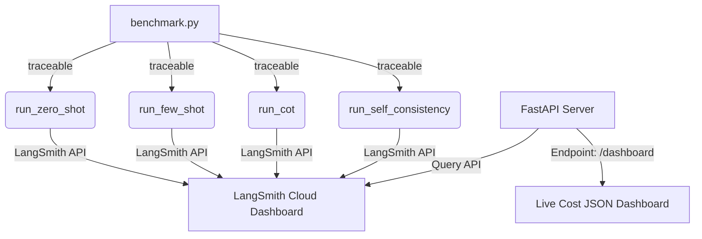

# Lab 3.2 — Cost-Tracking Dashboard via LangSmith

**What you'll build:** A benchmark system that runs the same task using four different prompt strategies — zero-shot, few-shot, Chain-of-Thought, and Self-Consistency — traces every call to LangSmith, then exposes a FastAPI endpoint that returns a live cost comparison dashboard.

```
┌────────────────────────────────────────────────────────────┐
│  Input: "What is 15% of 840?"                              │
│                                                            │
│  Strategy 1: Zero-shot     → "126"          $0.000012     │
│  Strategy 2: Few-shot      → "126"          $0.000018     │
│  Strategy 3: CoT           → "...= 126"     $0.000042     │
│  Strategy 4: Self-Consist. → "126 (7/7)"    $0.000294     │
│                                                            │
│  → LangSmith shows every call with token counts & cost     │
│  → /dashboard endpoint returns live comparison JSON        │
└────────────────────────────────────────────────────────────┘
```

---

## Architecture



---

<details>
<summary>**Step 1 — Project Setup**</summary>

```bash
mkdir tds-lab-3-2
cd tds-lab-3-2
uv init --no-workspace
```

Install dependencies:

```bash
uv add fastapi "uvicorn[standard]" openai anthropic \
       langsmith pydantic python-dotenv rich
```

Create `.env`:
```bash title=".env"
ANTHROPIC_API_KEY=sk-ant-...
OPENAI_API_KEY=sk-...
LANGCHAIN_TRACING_V2=true
LANGCHAIN_API_KEY=ls__...
LANGCHAIN_PROJECT=tds-week-3-lab-2
```

Get your LangSmith API key:
1. Go to [smith.langchain.com](https://smith.langchain.com)
2. Sign up (free — 5,000 traces/month free tier)
3. Settings → API Keys → Create API Key

Project structure:

```
tds-lab-3-2/
├── benchmark.py        ← prompt strategy benchmarking
├── strategies.py       ← zero-shot, few-shot, CoT, self-consistency
├── dashboard.py        ← FastAPI cost analytics endpoint
├── langsmith_client.py ← query LangSmith for cost data
├── tasks.py            ← benchmark task definitions
├── .env
└── pyproject.toml
```

</details>

<details>
<summary>**Step 2 — Define Benchmark Tasks**</summary>

These are the tasks we'll run all four strategies on. They cover the main categories where strategies differ in performance and cost:

```python title="tasks.py"
"""
Benchmark task definitions.
Each task is a dict with 'input' and 'expected_answer' for accuracy checking.
"""
from dataclasses import dataclass

@dataclass
class Task:
    id: str
    category: str          # math | logic | extraction | classification
    input: str
    expected: str          # ground truth for accuracy measurement
    description: str

BENCHMARK_TASKS = [
    # Math — CoT and Self-Consistency shine here
    Task("math_1", "math",
         "A train travels at 80 km/h. How long does it take to travel 260 km?",
         "3 hours 15 minutes",
         "Speed-distance-time calculation"),

    Task("math_2", "math",
         "If a shirt costs ₹850 after a 15% discount, what was the original price?",
         "₹1000",
         "Reverse percentage calculation"),

    Task("math_3", "math",
         "A class has 35 students. 60% are girls. How many boys are there?",
         "14",
         "Percentage to count"),

    # Logic — CoT helps, Self-Consistency overkill
    Task("logic_1", "logic",
         "All birds can fly. Penguins are birds. Can penguins fly? Explain.",
         "No — the premise is false",
         "Syllogism with false premise"),

    Task("logic_2", "logic",
         "If it rains, the ground gets wet. The ground is wet. Did it rain?",
         "Not necessarily — other causes possible",
         "Affirming the consequent fallacy"),

    # Extraction — Few-shot shines, CoT unnecessary
    Task("extract_1", "extraction",
         "Extract name, email, phone: 'Contact Priya Sharma at priya@iitm.ac.in or call 9876543210'",
         '{"name": "Priya Sharma", "email": "priya@iitm.ac.in", "phone": "9876543210"}',
         "Contact info extraction"),

    Task("extract_2", "extraction",
         "From 'Meeting on 15-Jan-2026 at 3:30 PM in Room 204', extract: date, time, location",
         '{"date": "15-Jan-2026", "time": "3:30 PM", "location": "Room 204"}',
         "Meeting detail extraction"),

    # Classification — Zero-shot works well, others are overkill
    Task("class_1", "classification",
         "Classify this support ticket: 'The login button is broken on Chrome but works on Firefox'",
         "BUG",
         "Browser-specific bug report"),

    Task("class_2", "classification",
         "Classify this email: 'I wanted to say thank you, the team was incredibly helpful!'",
         "POSITIVE_FEEDBACK",
         "Customer appreciation message"),
]
```

</details>

<details>
<summary>**Step 3 — Implement the Four Prompt Strategies**</summary>

```python title="strategies.py"
"""
Four prompt engineering strategies, all traced to LangSmith.
Each function returns: {answer, tokens_used, cost_usd, strategy}
"""
import os
import time
from collections import Counter
from typing import Optional
from openai import OpenAI
from langsmith import traceable
from dotenv import load_dotenv

load_dotenv()

client = OpenAI()

# OpenAI pricing for gpt-4o-mini (May 2026)
INPUT_PRICE_PER_TOK = 0.15 / 1_000_000   # $0.15 per MTok
OUTPUT_PRICE_PER_TOK = 0.60 / 1_000_000  # $0.60 per MTok

def compute_cost(prompt_tokens: int, completion_tokens: int) -> float:
    return (prompt_tokens * INPUT_PRICE_PER_TOK
            + completion_tokens * OUTPUT_PRICE_PER_TOK)

# ── Strategy 1: Zero-Shot ──────────────────────────────────────────────────────

@traceable(
    name="zero_shot",
    tags=["strategy:zero-shot"],
    metadata={"strategy": "zero_shot"},
)
def run_zero_shot(task_input: str, task_id: str = "") -> dict:
    """
    Zero-shot: just ask the question directly.
    Cheapest, fastest. Works well for simple tasks.
    """
    response = client.chat.completions.create(
        model="gpt-4o-mini",
        max_tokens=128,
        temperature=0,
        messages=[
            {"role": "system", "content": "Answer the question concisely and accurately."},
            {"role": "user", "content": task_input},
        ],
    )

    usage = response.usage
    cost = compute_cost(usage.prompt_tokens, usage.completion_tokens)

    return {
        "strategy": "zero_shot",
        "task_id": task_id,
        "answer": response.choices[0].message.content.strip(),
        "prompt_tokens": usage.prompt_tokens,
        "completion_tokens": usage.completion_tokens,
        "total_tokens": usage.total_tokens,
        "cost_usd": cost,
        "model": "gpt-4o-mini",
    }

# ── Strategy 2: Few-Shot ───────────────────────────────────────────────────────

FEW_SHOT_EXAMPLES = {
    "math": [
        ("A car travels at 60 km/h for 2.5 hours. How far does it go?", "150 km"),
        ("If a product costs ₹480 after a 20% discount, what was the original price?", "₹600"),
    ],
    "logic": [
        ("All cats are mammals. Tigers are cats. Are tigers mammals?", "Yes — tigers are cats and cats are mammals, so tigers are mammals."),
        ("If it snows, schools close. Schools are open. Did it snow?", "No — if schools are open, it did not snow (modus tollens)."),
    ],
    "extraction": [
        ("Extract name and email: 'Please contact Arjun at arjun@ds.study.iitm.ac.in'", '{"name": "Arjun", "email": "arjun@ds.study.iitm.ac.in"}'),
        ("Extract date and time: 'Call scheduled for 20-Feb-2026 at 10:00 AM'", '{"date": "20-Feb-2026", "time": "10:00 AM"}'),
    ],
    "classification": [
        ("Classify: 'The app crashes whenever I upload a file larger than 10MB'", "BUG"),
        ("Classify: 'Could you add dark mode? It would really help at night'", "FEATURE_REQUEST"),
    ],
}

@traceable(
    name="few_shot",
    tags=["strategy:few-shot"],
    metadata={"strategy": "few_shot"},
)
def run_few_shot(task_input: str, task_id: str = "", category: str = "math") -> dict:
    """
    Few-shot: provide 2 examples before the question.
    Better than zero-shot for structured tasks.
    """
    examples = FEW_SHOT_EXAMPLES.get(category, FEW_SHOT_EXAMPLES["math"])
    example_text = "\n\n".join(
        f"Q: {q}\nA: {a}" for q, a in examples
    )

    prompt = f"{example_text}\n\nQ: {task_input}\nA:"

    response = client.chat.completions.create(
        model="gpt-4o-mini",
        max_tokens=128,
        temperature=0,
        messages=[
            {"role": "system", "content": "Answer following the pattern shown in the examples."},
            {"role": "user", "content": prompt},
        ],
    )

    usage = response.usage
    cost = compute_cost(usage.prompt_tokens, usage.completion_tokens)

    return {
        "strategy": "few_shot",
        "task_id": task_id,
        "answer": response.choices[0].message.content.strip(),
        "prompt_tokens": usage.prompt_tokens,
        "completion_tokens": usage.completion_tokens,
        "total_tokens": usage.total_tokens,
        "cost_usd": cost,
        "model": "gpt-4o-mini",
    }

# ── Strategy 3: Chain-of-Thought ──────────────────────────────────────────────

@traceable(
    name="chain_of_thought",
    tags=["strategy:cot"],
    metadata={"strategy": "chain_of_thought"},
)
def run_cot(task_input: str, task_id: str = "") -> dict:
    """
    Chain-of-Thought: ask the model to reason step by step.
    Better accuracy on reasoning tasks; costs more tokens.
    """
    prompt = f"""{task_input}

Think step by step. Show your reasoning, then give the final answer on the last line starting with "Answer:"."""

    response = client.chat.completions.create(
        model="gpt-4o-mini",
        max_tokens=512,   # needs more tokens for reasoning
        temperature=0,
        messages=[
            {"role": "system", "content": "You are a careful reasoner. Always show your work."},
            {"role": "user", "content": prompt},
        ],
    )

    text = response.choices[0].message.content.strip()

    # Extract the final answer from the last "Answer:" line
    final_answer = text
    for line in reversed(text.split("\n")):
        if line.strip().startswith("Answer:"):
            final_answer = line.replace("Answer:", "").strip()
            break

    usage = response.usage
    cost = compute_cost(usage.prompt_tokens, usage.completion_tokens)

    return {
        "strategy": "chain_of_thought",
        "task_id": task_id,
        "answer": final_answer,
        "full_reasoning": text,
        "prompt_tokens": usage.prompt_tokens,
        "completion_tokens": usage.completion_tokens,
        "total_tokens": usage.total_tokens,
        "cost_usd": cost,
        "model": "gpt-4o-mini",
    }

# ── Strategy 4: Self-Consistency ──────────────────────────────────────────────

@traceable(
    name="self_consistency",
    tags=["strategy:self-consistency"],
    metadata={"strategy": "self_consistency"},
)
def run_self_consistency(
    task_input: str,
    task_id: str = "",
    n: int = 7,
    temperature: float = 0.8,
) -> dict:
    """
    Self-Consistency: run CoT N times with temperature>0, take majority vote.
    Highest accuracy on math/logic; costs N× more than single CoT.
    """
    prompt = f"""{task_input}

Think step by step. Give the final answer on the last line as: Answer: [your answer]"""

    answers = []
    total_prompt_tokens = 0
    total_completion_tokens = 0

    for i in range(n):
        response = client.chat.completions.create(
            model="gpt-4o-mini",
            max_tokens=512,
            temperature=temperature,
            messages=[
                {"role": "system", "content": "Solve this carefully, step by step."},
                {"role": "user", "content": prompt},
            ],
        )
        text = response.choices[0].message.content

        # Extract answer
        answer = text.strip()
        for line in reversed(text.split("\n")):
            if "Answer:" in line:
                answer = line.split("Answer:")[-1].strip()
                break
        answers.append(answer)

        total_prompt_tokens += response.usage.prompt_tokens
        total_completion_tokens += response.usage.completion_tokens

    # Majority vote
    vote = Counter(answers).most_common(1)[0]
    final_answer = vote[0]
    vote_count = vote[1]

    total_cost = compute_cost(total_prompt_tokens, total_completion_tokens)

    return {
        "strategy": "self_consistency",
        "task_id": task_id,
        "answer": final_answer,
        "vote_count": f"{vote_count}/{n}",
        "all_answers": answers,
        "n_samples": n,
        "prompt_tokens": total_prompt_tokens,
        "completion_tokens": total_completion_tokens,
        "total_tokens": total_prompt_tokens + total_completion_tokens,
        "cost_usd": total_cost,
        "model": "gpt-4o-mini",
    }
```

</details>

<details>
<summary>**Step 4 — Build the Benchmark Runner**</summary>

```python title="benchmark.py"
"""
Run all four strategies on all tasks and save results.
All calls are traced to LangSmith automatically via @traceable.
"""
import json
import time
from pathlib import Path
from rich.console import Console
from rich.table import Table
from dotenv import load_dotenv
from tasks import BENCHMARK_TASKS, Task
from strategies import run_zero_shot, run_few_shot, run_cot, run_self_consistency

load_dotenv()
console = Console()

def run_benchmark(
    tasks: list[Task] = None,
    n_self_consistency: int = 5,   # reduce to 3 if budget-conscious
    output_file: str = "benchmark_results.json",
) -> list[dict]:
    """Run all strategies on all tasks. Returns list of result dicts."""
    if tasks is None:
        tasks = BENCHMARK_TASKS

    all_results = []

    console.rule("[bold blue]Starting Benchmark")
    console.print(f"Tasks: {len(tasks)} | Self-consistency N: {n_self_consistency}")
    console.print(f"Estimated cost: ~${len(tasks) * (0.00002 + 0.00003 + 0.00005 + n_self_consistency * 0.00005):.4f}\n")

    for task in tasks:
        console.print(f"\n[bold cyan]Task: {task.id}[/bold cyan] ({task.category})")
        console.print(f"[dim]{task.input[:80]}...[/dim]" if len(task.input) > 80 else f"[dim]{task.input}[/dim]")

        task_results = []

        # Strategy 1: Zero-shot
        console.print("  Running zero-shot...", end=" ")
        try:
            r = run_zero_shot(task.input, task_id=task.id)
            r["expected"] = task.expected
            r["category"] = task.category
            task_results.append(r)
            console.print(f"[green]✓[/green] ${r['cost_usd']:.6f} | {r['total_tokens']} tok | '{r['answer'][:40]}'")
        except Exception as e:
            console.print(f"[red]✗ {e}[/red]")

        time.sleep(0.3)  # avoid rate limits

        # Strategy 2: Few-shot
        console.print("  Running few-shot...", end=" ")
        try:
            r = run_few_shot(task.input, task_id=task.id, category=task.category)
            r["expected"] = task.expected
            r["category"] = task.category
            task_results.append(r)
            console.print(f"[green]✓[/green] ${r['cost_usd']:.6f} | {r['total_tokens']} tok | '{r['answer'][:40]}'")
        except Exception as e:
            console.print(f"[red]✗ {e}[/red]")

        time.sleep(0.3)

        # Strategy 3: CoT
        console.print("  Running CoT...", end=" ")
        try:
            r = run_cot(task.input, task_id=task.id)
            r["expected"] = task.expected
            r["category"] = task.category
            task_results.append(r)
            console.print(f"[green]✓[/green] ${r['cost_usd']:.6f} | {r['total_tokens']} tok | '{r['answer'][:40]}'")
        except Exception as e:
            console.print(f"[red]✗ {e}[/red]")

        time.sleep(0.3)

        # Strategy 4: Self-Consistency (most expensive!)
        console.print(f"  Running self-consistency (N={n_self_consistency})...", end=" ")
        try:
            r = run_self_consistency(task.input, task_id=task.id, n=n_self_consistency)
            r["expected"] = task.expected
            r["category"] = task.category
            task_results.append(r)
            console.print(
                f"[green]✓[/green] ${r['cost_usd']:.6f} | {r['total_tokens']} tok"
                f" | '{r['answer'][:30]}' ({r['vote_count']})"
            )
        except Exception as e:
            console.print(f"[red]✗ {e}[/red]")

        all_results.extend(task_results)
        time.sleep(0.5)

    # Save results
    Path(output_file).write_text(json.dumps(all_results, indent=2))
    console.rule("[bold green]Benchmark Complete")
    console.print(f"Results saved to: {output_file}")

    # Print summary table
    _print_summary_table(all_results)

    return all_results

def _print_summary_table(results: list[dict]):
    """Print a Rich table summarizing costs by strategy."""
    from collections import defaultdict

    by_strategy = defaultdict(lambda: {"total_cost": 0, "total_tokens": 0, "count": 0})
    for r in results:
        s = r["strategy"]
        by_strategy[s]["total_cost"] += r.get("cost_usd", 0)
        by_strategy[s]["total_tokens"] += r.get("total_tokens", 0)
        by_strategy[s]["count"] += 1

    table = Table(title="Cost Summary by Strategy", show_header=True)
    table.add_column("Strategy", style="cyan")
    table.add_column("Calls", justify="right")
    table.add_column("Total Tokens", justify="right")
    table.add_column("Total Cost (USD)", justify="right")
    table.add_column("Avg Cost/Call", justify="right")

    strategy_order = ["zero_shot", "few_shot", "chain_of_thought", "self_consistency"]
    for strategy in strategy_order:
        if strategy in by_strategy:
            data = by_strategy[strategy]
            avg_cost = data["total_cost"] / max(data["count"], 1)
            table.add_row(
                strategy.replace("_", "-"),
                str(data["count"]),
                f"{data['total_tokens']:,}",
                f"${data['total_cost']:.6f}",
                f"${avg_cost:.6f}",
            )

    console.print(table)
    total_cost = sum(d["total_cost"] for d in by_strategy.values())
    console.print(f"\nTotal benchmark cost: [bold green]${total_cost:.4f}[/bold green]")

if __name__ == "__main__":
    run_benchmark(n_self_consistency=5)
```

Run the benchmark:

```bash
python benchmark.py
```

Expected output (condensed):
```
Starting Benchmark
Tasks: 9 | Self-consistency N: 5

Task: math_1 (math)
A train travels at 80 km/h...
  Running zero-shot...       ✓ $0.000015 | 98 tok  | '3 hours 15 minutes'
  Running few-shot...        ✓ $0.000023 | 152 tok | '3 hours and 15 minutes'
  Running CoT...             ✓ $0.000058 | 384 tok | '3 hours 15 minutes'
  Running self-consistency.. ✓ $0.000285 | 1893 tok| '3 hours 15 minutes' (5/5)
...

╭─────────────────── Cost Summary by Strategy ───────────────────╮
│ Strategy            Calls  Total Tokens  Total Cost  Avg Cost  │
│ zero-shot           9      882           $0.000135   $0.000015 │
│ few-shot            9      1368          $0.000207   $0.000023 │
│ chain-of-thought    9      3456          $0.000518   $0.000058 │
│ self-consistency    9      17046         $0.002557   $0.000284 │
╰────────────────────────────────────────────────────────────────╯

Total benchmark cost: $0.0034
```

Now check [smith.langchain.com](https://smith.langchain.com) → your project → you should see all 4 × 9 = 36+ runs with full traces.

</details>

<details>
<summary>**Step 5 — Query LangSmith for Analytics**</summary>

```python title="langsmith_client.py"
"""
Query the LangSmith API to fetch cost and performance data from our benchmark runs.
"""
import os
from langsmith import Client
from collections import defaultdict
from datetime import datetime, timedelta
from dotenv import load_dotenv

load_dotenv()

ls = Client()

def get_project_stats(project_name: str = None, hours_back: int = 24) -> dict:
    """Get cost and token stats for our benchmark project."""
    if project_name is None:
        project_name = os.getenv("LANGCHAIN_PROJECT", "tds-week-3-lab-2")

    # Fetch runs from last N hours
    start_time = datetime.utcnow() - timedelta(hours=hours_back)

    runs = list(ls.list_runs(
        project_name=project_name,
        run_type="llm",           # only LLM API calls
        start_time=start_time,
        limit=500,
    ))

    if not runs:
        return {"error": "No runs found. Run the benchmark first."}

    # Group by strategy (stored as tags or run name)
    by_strategy = defaultdict(lambda: {
        "calls": 0,
        "total_tokens": 0,
        "prompt_tokens": 0,
        "completion_tokens": 0,
        "total_cost_usd": 0,
        "latencies_ms": [],
        "errors": 0,
    })

    for run in runs:
        # Determine strategy from the run name
        name = run.name or "unknown"
        strategy = "unknown"
        for s in ["zero_shot", "few_shot", "chain_of_thought", "self_consistency"]:
            if s in name.lower():
                strategy = s
                break

        stats = by_strategy[strategy]
        stats["calls"] += 1

        if run.total_tokens:
            stats["total_tokens"] += run.total_tokens
        if run.prompt_tokens:
            stats["prompt_tokens"] += run.prompt_tokens
        if run.completion_tokens:
            stats["completion_tokens"] += run.completion_tokens
        if run.total_cost:
            stats["total_cost_usd"] += float(run.total_cost)

        if run.end_time and run.start_time:
            latency_ms = (run.end_time - run.start_time).total_seconds() * 1000
            stats["latencies_ms"].append(latency_ms)

        if run.error:
            stats["errors"] += 1

    # Compute averages
    result = {}
    for strategy, stats in by_strategy.items():
        n = max(stats["calls"], 1)
        latencies = stats["latencies_ms"]
        result[strategy] = {
            "calls": stats["calls"],
            "errors": stats["errors"],
            "total_tokens": stats["total_tokens"],
            "avg_tokens_per_call": round(stats["total_tokens"] / n),
            "prompt_tokens": stats["prompt_tokens"],
            "completion_tokens": stats["completion_tokens"],
            "total_cost_usd": round(stats["total_cost_usd"], 6),
            "avg_cost_per_call_usd": round(stats["total_cost_usd"] / n, 6),
            "avg_latency_ms": round(sum(latencies) / len(latencies)) if latencies else None,
            "p95_latency_ms": round(sorted(latencies)[int(len(latencies) * 0.95)]) if latencies else None,
        }

    total_cost = sum(s["total_cost_usd"] for s in result.values())
    total_calls = sum(s["calls"] for s in result.values())

    return {
        "project": project_name,
        "period_hours": hours_back,
        "total_calls": total_calls,
        "total_cost_usd": round(total_cost, 6),
        "by_strategy": result,
        "most_expensive_strategy": max(result, key=lambda k: result[k]["total_cost_usd"]) if result else None,
        "cheapest_strategy": min(result, key=lambda k: result[k]["avg_cost_per_call_usd"]) if result else None,
    }

def get_cost_by_category(project_name: str = None, hours_back: int = 24) -> dict:
    """Get cost breakdown by task category."""
    if project_name is None:
        project_name = os.getenv("LANGCHAIN_PROJECT", "tds-week-3-lab-2")

    runs = list(ls.list_runs(
        project_name=project_name,
        run_type="chain",         # parent runs that have category info
        start_time=datetime.utcnow() - timedelta(hours=hours_back),
        limit=500,
    ))

    by_category = defaultdict(lambda: {"calls": 0, "cost": 0.0})
    for run in runs:
        cat = (run.extra or {}).get("metadata", {}).get("category", "unknown")
        by_category[cat]["calls"] += 1
        by_category[cat]["cost"] += float(run.total_cost or 0.0)

    return dict(by_category)
```

</details>

<details>
<summary>**Step 6 — Build the FastAPI Dashboard Endpoint**</summary>

```python title="dashboard.py"
"""
FastAPI service exposing cost analytics from LangSmith.
Run with: uvicorn dashboard:app --reload
"""
import json
from pathlib import Path
from fastapi import FastAPI, HTTPException, Query
from fastapi.responses import HTMLResponse
from dotenv import load_dotenv
from langsmith_client import get_project_stats, get_cost_by_category

load_dotenv()

app = FastAPI(
    title="TDS Lab 3.2 — Prompt Strategy Cost Dashboard",
    description="Compare cost and performance of different prompt engineering strategies",
    version="1.0.0",
)

@app.get("/health")
def health():
    return {"status": "ok"}

@app.get("/dashboard")
def get_dashboard(hours: int = Query(default=24, ge=1, le=168)):
    """
    Returns live cost comparison from LangSmith.
    Shows cost by strategy, tokens used, latency.
    """
    try:
        stats = get_project_stats(hours_back=hours)
        return stats
    except Exception as e:
        raise HTTPException(500, f"Failed to fetch LangSmith data: {str(e)}")

@app.get("/dashboard/local")
def get_local_results():
    """
    Returns benchmark results from the local JSON file (no LangSmith API call).
    Use this if you don't have LangSmith set up.
    """
    results_file = Path("benchmark_results.json")
    if not results_file.exists():
        raise HTTPException(
            404,
            "benchmark_results.json not found. Run `python benchmark.py` first."
        )

    results = json.loads(results_file.read_text())

    # Aggregate by strategy
    from collections import defaultdict
    by_strategy = defaultdict(lambda: {"calls": 0, "total_tokens": 0, "total_cost": 0})
    for r in results:
        s = r["strategy"]
        by_strategy[s]["calls"] += 1
        by_strategy[s]["total_tokens"] += r.get("total_tokens", 0)
        by_strategy[s]["total_cost"] += r.get("cost_usd", 0)

    summary = {}
    for strategy, data in by_strategy.items():
        n = max(data["calls"], 1)
        summary[strategy] = {
            "calls": data["calls"],
            "total_tokens": data["total_tokens"],
            "avg_tokens": data["total_tokens"] // n,
            "total_cost_usd": round(data["total_cost"], 6),
            "avg_cost_usd": round(data["total_cost"] / n, 6),
        }

    return {
        "source": "local_file",
        "total_results": len(results),
        "by_strategy": summary,
    }

@app.get("/dashboard/comparison")
def get_comparison_table():
    """
    Returns a cost × accuracy comparison table.
    Compares each strategy against the expected answer.
    """
    results_file = Path("benchmark_results.json")
    if not results_file.exists():
        raise HTTPException(404, "Run benchmark.py first")

    results = json.loads(results_file.read_text())

    # Build comparison: for each task, show all strategies side-by-side
    from collections import defaultdict
    by_task = defaultdict(dict)
    for r in results:
        task_id = r.get("task_id", "unknown")
        strategy = r["strategy"]
        by_task[task_id][strategy] = {
            "answer": r.get("answer", ""),
            "cost_usd": r.get("cost_usd", 0),
            "total_tokens": r.get("total_tokens", 0),
            "expected": r.get("expected", ""),
        }

    # For each task-strategy, check if answer is "close enough" to expected
    for task_id, strategies in by_task.items():
        if not strategies:
            continue
        expected = list(strategies.values())[0].get("expected", "")
        for strategy, data in strategies.items():
            answer_lower = data["answer"].lower()
            expected_lower = expected.lower()
            
            is_correct = False
            if len(expected_lower) <= 3:
                is_correct = (expected_lower in answer_lower)
            else:
                if expected_lower in answer_lower:
                    is_correct = True
                else:
                    parts = [p.strip(".,?!₹$") for p in expected_lower.split()]
                    parts = [p for p in parts if len(p) >= 2]
                    if parts:
                        is_correct = any(p in answer_lower for p in parts)
                    else:
                        is_correct = (expected_lower in answer_lower)
            data["is_correct"] = is_correct

    return {
        "tasks": dict(by_task),
        "strategies": ["zero_shot", "few_shot", "chain_of_thought", "self_consistency"],
    }

@app.get("/dashboard/ui", response_class=HTMLResponse)
def dashboard_ui():
    """Simple HTML dashboard for visual comparison."""
    return """
<!DOCTYPE html>
<html>
<head>
    <title>TDS Lab 3.2 — Cost Dashboard</title>
    <style>
        body { font-family: system-ui; max-width: 900px; margin: 2rem auto; padding: 0 1rem; }
        h1 { color: #1a1a2e; }
        .card { border: 1px solid #e0e0e0; border-radius: 8px; padding: 1rem; margin: 1rem 0; }
        table { width: 100%; border-collapse: collapse; }
        th, td { padding: 0.5rem 1rem; text-align: left; border-bottom: 1px solid #f0f0f0; }
        th { background: #f8f8f8; font-weight: 600; }
        .cheap { color: #16a34a; font-weight: bold; }
        .expensive { color: #dc2626; }
        pre { background: #f8f8f8; padding: 1rem; border-radius: 4px; overflow-x: auto; }
    </style>
</head>
<body>
    <h1>🔬 Prompt Strategy Cost Dashboard</h1>
    <p>Comparing: Zero-Shot vs Few-Shot vs CoT vs Self-Consistency</p>

    <div class="card">
        <h2>Live Data from LangSmith</h2>
        <div id="live-data">Loading...</div>
    </div>

    <div class="card">
        <h2>Local Benchmark Results</h2>
        <div id="local-data">Loading...</div>
    </div>

    <script>
        async function load(url, elementId) {
            try {
                const r = await fetch(url);
                const data = await r.json();
                document.getElementById(elementId).innerHTML =
                    '<pre>' + JSON.stringify(data, null, 2) + '</pre>';
            } catch(e) {
                document.getElementById(elementId).innerHTML =
                    '<p style="color:red">Error: ' + e + '</p>';
            }
        }

        load('/dashboard', 'live-data');
        load('/dashboard/local', 'local-data');
    </script>
</body>
</html>
"""
```

Start the dashboard:

```bash
uvicorn dashboard:app --reload
# → http://localhost:8000/dashboard/ui  (visual UI)
# → http://localhost:8000/dashboard     (live LangSmith data)
# → http://localhost:8000/dashboard/local  (local JSON data)
# → http://localhost:8000/dashboard/comparison  (per-task comparison)
```

</details>

<details>
<summary>**Step 7 — Verify in LangSmith**</summary>

1. Open [smith.langchain.com](https://smith.langchain.com)
2. Click your project: `tds-week-3-lab-2`
3. You should see all runs listed with:
   - Run name (zero_shot, few_shot, chain_of_thought, self_consistency)
   - Input and output text
   - Token counts
   - Cost (if model pricing is configured)
   - Latency

**Filter by strategy tag:**
- Click **Filters** → **Tags** → `strategy:cot`
- You'll see only CoT runs

**View token cost distribution:**
- Click any run → expand the "Metrics" panel
- Shows prompt_tokens, completion_tokens, total_cost

**Create a custom chart:**
- Dashboard → New Chart → Query: `sum(total_tokens)` grouped by `name`
- Shows token usage per strategy

</details>

<details>
<summary>**Step 8 — Analysis: When is Each Strategy Worth It?**</summary>

Use the comparison endpoint to analyze results:

```bash
curl http://localhost:8000/dashboard/comparison | python -m json.tool
```

Now fill in this analysis table based on your benchmark results:

```python
# analysis.py — run this after the benchmark

import json
from pathlib import Path
from collections import defaultdict

results = json.loads(Path("benchmark_results.json").read_text())

# Group by task category and strategy
by_cat_strat = defaultdict(lambda: defaultdict(lambda: {"costs": [], "correct": 0, "total": 0}))

for r in results:
    cat = r.get("category", "unknown")
    strategy = r["strategy"]
    cost = r.get("cost_usd", 0)
    expected = r.get("expected", "").lower()
    answer = r.get("answer", "").lower()

    # Simple correctness heuristic
    is_correct = False
    if len(expected) <= 3:
        is_correct = (expected in answer)
    else:
        if expected in answer:
            is_correct = True
        else:
            parts = [p.strip(".,?!₹$") for p in expected.split()]
            parts = [p for p in parts if len(p) >= 2]
            if parts:
                is_correct = any(p in answer for p in parts)
            else:
                is_correct = (expected in answer)

    s = by_cat_strat[cat][strategy]
    s["costs"].append(cost)
    s["total"] += 1
    s["correct"] += int(is_correct)

print("\n=== COST × ACCURACY BY CATEGORY ===\n")
print(f"{'Category':<15} {'Strategy':<22} {'Avg Cost':<14} {'Accuracy':<10}")
print("-" * 65)

for cat in ["math", "logic", "extraction", "classification"]:
    if cat not in by_cat_strat:
        continue
    for strategy in ["zero_shot", "few_shot", "chain_of_thought", "self_consistency"]:
        if strategy not in by_cat_strat[cat]:
            continue
        data = by_cat_strat[cat][strategy]
        avg_cost = sum(data["costs"]) / len(data["costs"])
        accuracy = data["correct"] / data["total"] * 100
        print(f"{cat:<15} {strategy:<22} ${avg_cost:.6f}     {accuracy:.0f}%")
    print()

print("=== KEY FINDINGS ===")
print("Fill in after running your benchmark:")
print("1. Best strategy for MATH (accuracy vs cost)?")
print("2. Best strategy for EXTRACTION tasks?")
print("3. Cost multiplier: self-consistency vs zero-shot?")
print("4. Does CoT help for classification tasks?")
```

</details>

<details>
<summary>**Step 9 — Write Tests**</summary>

```python title="tests/test_strategies.py"
"""
Tests for prompt strategies.
These make real API calls — set OPENAI_API_KEY in .env.
Skip in CI if no key is set.
"""
import pytest
import os
from dotenv import load_dotenv

load_dotenv()

@pytest.mark.skipif(
    not os.getenv("OPENAI_API_KEY"),
    reason="Requires OPENAI_API_KEY"
)
class TestStrategies:
    def test_zero_shot_returns_answer(self):
        from strategies import run_zero_shot
        result = run_zero_shot("What is 2 + 2?", task_id="test")
        assert result["strategy"] == "zero_shot"
        assert "answer" in result
        assert len(result["answer"]) > 0
        assert result["total_tokens"] > 0
        assert result["cost_usd"] > 0

    def test_few_shot_higher_token_count_than_zero_shot(self):
        from strategies import run_zero_shot, run_few_shot
        task = "What is 10% of 250?"
        zs = run_zero_shot(task, task_id="cmp")
        fs = run_few_shot(task, task_id="cmp", category="math")
        # Few-shot sends more tokens (examples included)
        assert fs["prompt_tokens"] > zs["prompt_tokens"]

    def test_self_consistency_returns_vote_count(self):
        from strategies import run_self_consistency
        result = run_self_consistency("What is 3 × 4?", task_id="test", n=3)
        assert "vote_count" in result
        assert "/3" in result["vote_count"]
        assert result["n_samples"] == 3
        assert len(result["all_answers"]) == 3

    def test_cot_has_full_reasoning(self):
        from strategies import run_cot
        result = run_cot("If a car goes 100km in 2 hours, what is its speed?", task_id="test")
        assert "full_reasoning" in result
        # CoT should produce longer reasoning than zero-shot
        assert len(result["full_reasoning"]) > len(result["answer"])

class TestLangSmithClient:
    def test_get_project_stats_structure(self):
        """Test that get_project_stats returns the expected structure."""
        from langsmith_client import get_project_stats
        # This may return empty if no runs yet — that's ok
        try:
            stats = get_project_stats(hours_back=1)
            assert "total_calls" in stats or "error" in stats
        except Exception:
            pytest.skip("LangSmith not configured")
```

```python title="tests/test_tasks.py"
from tasks import BENCHMARK_TASKS, Task

def test_all_tasks_have_required_fields():
    for task in BENCHMARK_TASKS:
        assert task.id, f"Task missing id"
        assert task.category in ["math", "logic", "extraction", "classification"]
        assert task.input, f"Task {task.id} missing input"
        assert task.expected, f"Task {task.id} missing expected answer"

def test_task_ids_are_unique():
    ids = [t.id for t in BENCHMARK_TASKS]
    assert len(ids) == len(set(ids)), "Duplicate task IDs found"
```

Run tests:
```bash
uv run pytest tests/ -v
```

</details>

---

## Final Project Structure

```
tds-lab-3-2/
├── benchmark.py                ← runs all 4 strategies on all tasks
├── strategies.py               ← zero-shot, few-shot, CoT, self-consistency
├── dashboard.py                ← FastAPI cost analytics endpoints
├── langsmith_client.py         ← queries LangSmith API
├── tasks.py                    ← 9 benchmark task definitions
├── analysis.py                 ← post-benchmark analysis script
├── tests/
│   ├── test_strategies.py
│   └── test_tasks.py
├── benchmark_results.json      ← generated after running benchmark.py
├── .env
└── pyproject.toml
```

---

## Deliverables

Submit on the course portal:

1. **GitHub repo URL** — code pushed, no `.env`, `benchmark_results.json` included
2. **LangSmith project link** — share your project URL from smith.langchain.com
3. **Screenshot of LangSmith dashboard** showing all 36+ traced runs with costs
4. **Screenshot of `/dashboard/comparison` endpoint** in browser
5. **Analysis write-up** (max 200 words) answering:
   - Which strategy gave the best accuracy/cost ratio for math tasks?
   - For extraction tasks, was CoT worth the extra cost?
   - What is the actual cost multiplier between zero-shot and self-consistency?
   - When would you **not** use self-consistency in production?

---

## Troubleshooting

| Problem | Fix |
|---------|-----|
| LangSmith shows no runs | Check `LANGCHAIN_TRACING_V2=true` in `.env`, restart Python |
| `ls.list_runs()` returns empty | Wait 30s after benchmark; LangSmith ingestion has a slight delay |
| Rate limit on OpenAI | Add more `time.sleep()` between calls in `benchmark.py` |
| `/dashboard` shows error | Run `python benchmark.py` first to generate data in LangSmith |
| Token counts missing | Some LangSmith runs may have null `total_tokens`; check `if run.total_tokens` |

---

## Going Further

- Add **Anthropic Claude Haiku** as a fifth model to compare (costs 5× less than GPT-4o-mini)
- Add **accuracy scoring** using an LLM-as-judge (call Claude to evaluate whether each answer matches expected)
- Add a **streaming endpoint** (`/run-live`) that streams the benchmark results as they come in using FastAPI `StreamingResponse`
- Add per-user budget tracking using LiteLLM's `BudgetManager` so each student gets a $0.10 daily quota

---

