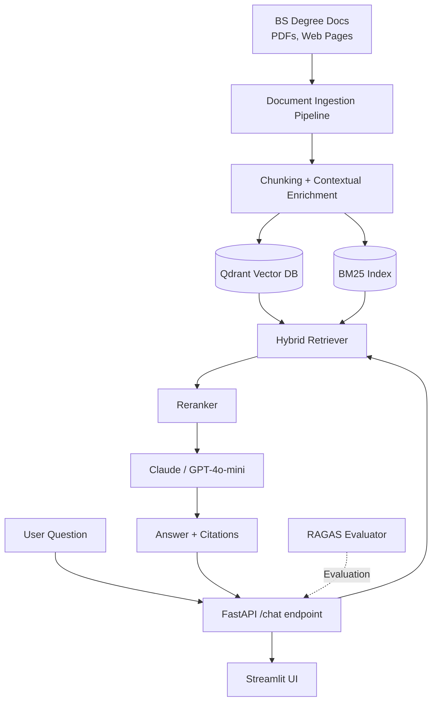

import Details from '@theme/Details';

# Capstone C1: BS Degree Chatbot

**Real deployment** — this chatbot powers the IIT Madras BS Degree information portal.

**Owners:** Priyanshu, Abhimanyu · CyStar & BS Office Intern team

---

## What You're Building

A production-grade RAG chatbot that answers questions about the IIT Madras BS Data Science programme:

- Eligibility, admission, fees, course structure
- Degree requirements, credit rules
- Exam schedules, deadlines
- Contact information

```
User: "Can I take TDS in my first term?"
Bot:  "No, TDS is recommended for your last term because it requires 
       prerequisite courses including Statistics, Python programming, 
       and data analysis fundamentals. [Source: Programme Guide, p.12]"
```

**Tech Stack:**
- **Retrieval:** Hybrid (dense + BM25) + Reranking
- **LLM:** Claude claude-haiku-4-5 or GPT-4o-mini
- **Vector DB:** Qdrant (Docker)
- **Evaluation:** RAGAS dashboard
- **Backend:** FastAPI
- **Frontend:** Streamlit or Next.js

---

## Architecture



---

## Step-by-Step Guide

<Details summary="Step 1 — Scrape & Prepare BS Degree Documents">

The BS Degree information lives on several web pages and PDF documents. You need to collect and clean them.

```bash
uv add crawl4ai markdownify PyMuPDF requests beautifulsoup4
```

**Target pages to scrape:**
- `https://study.iitm.ac.in/ds/` — main programme page
- `https://study.iitm.ac.in/ds/academics/` — academics
- `https://study.iitm.ac.in/ds/courses/` — all courses
- `https://study.iitm.ac.in/ds/qualifier/` — qualifier exam
- `https://docs.google.com/...` — any public programme guides

```python
# scripts/scrape_bs_docs.py
import asyncio
from crawl4ai import AsyncWebCrawler, CrawlerRunConfig
from markdownify import markdownify
import json

TARGET_URLS = [
    "https://study.iitm.ac.in/ds/",
    "https://study.iitm.ac.in/ds/academics/",
    "https://study.iitm.ac.in/ds/courses/",
    # Add more URLs here
]

async def scrape_all():
    crawled_docs = []
    
    async with AsyncWebCrawler() as crawler:
        for url in TARGET_URLS:
            config = CrawlerRunConfig(
                remove_overlay_elements=True,
                exclude_external_links=True,
            )
            result = await crawler.arun(url=url, config=config)
            
            if result.success:
                # Convert to clean markdown
                markdown_content = result.markdown_v2.raw_markdown
                crawled_docs.append({
                    "url": url,
                    "content": markdown_content,
                    "title": result.metadata.get("title", url),
                })
                print(f"✅ Scraped: {url} ({len(markdown_content)} chars)")
            else:
                print(f"❌ Failed: {url}")
    
    # Save
    with open("data/bs_docs.json", "w") as f:
        json.dump(crawled_docs, f, indent=2)
    
    print(f"\nSaved {len(crawled_docs)} documents")

asyncio.run(scrape_all())
```

**Also extract from PDFs:**

```python
# scripts/extract_pdfs.py
import fitz  # PyMuPDF
import os

def extract_pdf_text(pdf_path: str) -> str:
    doc = fitz.open(pdf_path)
    text = ""
    for page in doc:
        text += page.get_text() + "\n"
    return text

# Process all PDFs in data/pdfs/
os.makedirs("data/pdfs", exist_ok=True)
# Download PDFs manually or via requests, place in data/pdfs/

for pdf_file in os.listdir("data/pdfs"):
    if pdf_file.endswith(".pdf"):
        text = extract_pdf_text(f"data/pdfs/{pdf_file}")
        with open(f"data/extracted/{pdf_file}.txt", "w") as f:
            f.write(text)
        print(f"Extracted: {pdf_file}")
```

</Details>

<Details summary="Step 2 — Ingestion Pipeline">

```python
# src/ingestion.py
"""
Parse, chunk, enrich with context, and index into Qdrant.
"""

import json
import uuid
import anthropic
from langchain.text_splitter import MarkdownHeaderTextSplitter, RecursiveCharacterTextSplitter
from qdrant_client import QdrantClient
from qdrant_client.models import Distance, VectorParams, PointStruct
from openai import OpenAI

openai_client = OpenAI()
anthropic_client = anthropic.Anthropic()
qdrant = QdrantClient("http://localhost:6333")

COLLECTION_NAME = "bs_degree_chatbot"
EMBEDDING_MODEL = "text-embedding-3-small"
EMBEDDING_DIM = 1536

def setup_qdrant():
    """Create Qdrant collection if it doesn't exist."""
    existing = [c.name for c in qdrant.get_collections().collections]
    if COLLECTION_NAME not in existing:
        qdrant.create_collection(
            collection_name=COLLECTION_NAME,
            vectors_config=VectorParams(size=EMBEDDING_DIM, distance=Distance.COSINE),
        )
        print(f"Created collection: {COLLECTION_NAME}")
    else:
        print(f"Collection {COLLECTION_NAME} already exists")

def chunk_markdown_document(content: str, source: str) -> list[dict]:
    """Chunk a Markdown document preserving header structure."""
    # First split by headers
    header_splitter = MarkdownHeaderTextSplitter(
        headers_to_split_on=[("#", "h1"), ("##", "h2"), ("###", "h3")]
    )
    header_chunks = header_splitter.split_text(content)
    
    # Then sub-chunk large sections
    text_splitter = RecursiveCharacterTextSplitter(chunk_size=600, chunk_overlap=60)
    
    all_chunks = []
    for hchunk in header_chunks:
        sub_chunks = text_splitter.split_text(hchunk.page_content)
        for sub in sub_chunks:
            if len(sub.strip()) < 50:  # Skip tiny chunks
                continue
            all_chunks.append({
                "content": sub,
                "metadata": {**hchunk.metadata, "source": source}
            })
    
    return all_chunks

def generate_context(full_doc: str, chunk: str) -> str:
    """Generate a context sentence for a chunk (with caching)."""
    try:
        resp = anthropic_client.beta.messages.create(
            model="claude-haiku-4-5",
            max_tokens=100,
            system="Write 1-2 sentences of context for this chunk from the BS programme document. Be specific about what section it's from.",
            messages=[{
                "role": "user",
                "content": [
                    {
                        "type": "text",
                        "text": f"<doc>{full_doc[:3000]}</doc>",
                        "cache_control": {"type": "ephemeral"}
                    },
                    {"type": "text", "text": f"<chunk>{chunk}</chunk>\nContext:"}
                ]
            }],
            betas=["prompt-caching-2024-07-31"],
        )
        return resp.content[0].text.strip()
    except Exception:
        return ""

def embed_texts(texts: list[str]) -> list[list[float]]:
    """Batch embed texts with OpenAI."""
    response = openai_client.embeddings.create(
        input=texts,
        model=EMBEDDING_MODEL
    )
    return [item.embedding for item in response.data]

def ingest_documents(docs_json_path: str, use_contextual: bool = True):
    """Full ingestion pipeline: load → chunk → contextual enrich → embed → index."""
    setup_qdrant()
    
    with open(docs_json_path) as f:
        docs = json.load(f)
    
    all_points = []
    
    for doc in docs:
        print(f"\nProcessing: {doc['url']}")
        chunks = chunk_markdown_document(doc["content"], doc["url"])
        print(f"  {len(chunks)} chunks")
        
        for i, chunk in enumerate(chunks):
            text = chunk["content"]
            
            # Optionally add contextual prefix
            if use_contextual:
                context = generate_context(doc["content"], text)
                contextualized_text = f"{context}\n\n{text}" if context else text
            else:
                contextualized_text = text
            
            embedding = embed_texts([contextualized_text])[0]
            
            point = PointStruct(
                id=str(uuid.uuid4()),
                vector=embedding,
                payload={
                    "text": text,                      # original (for display)
                    "contextualized_text": contextualized_text,
                    "source_url": doc["url"],
                    "title": doc.get("title", ""),
                    **chunk["metadata"],
                }
            )
            all_points.append(point)
        
        # Batch upsert every 50 points
        if len(all_points) >= 50:
            qdrant.upsert(collection_name=COLLECTION_NAME, points=all_points)
            print(f"  Upserted {len(all_points)} points")
            all_points = []
    
    # Upsert remaining
    if all_points:
        qdrant.upsert(collection_name=COLLECTION_NAME, points=all_points)
    
    count = qdrant.count(collection_name=COLLECTION_NAME)
    print(f"\n✅ Ingestion complete. Total vectors: {count.count}")

if __name__ == "__main__":
    ingest_documents("data/bs_docs.json", use_contextual=True)
```

</Details>

<Details summary="Step 3 — Hybrid Retriever with Qdrant + BM25">

```python
# src/retriever.py
import json
import numpy as np
from rank_bm25 import BM25Okapi
from qdrant_client import QdrantClient
from qdrant_client.models import Filter, FieldCondition, MatchValue
from openai import OpenAI
from sentence_transformers import CrossEncoder

client = OpenAI()
qdrant = QdrantClient("http://localhost:6333")
COLLECTION_NAME = "bs_degree_chatbot"
EMBEDDING_MODEL = "text-embedding-3-small"

class BSDegreeChatbotRetriever:
    def __init__(self, enable_reranking: bool = True):
        self.enable_reranking = enable_reranking
        self.reranker = CrossEncoder("cross-encoder/ms-marco-MiniLM-L-6-v2") if enable_reranking else None
        self._build_bm25_index()
    
    def _build_bm25_index(self):
        """Load all texts from Qdrant and build BM25 index."""
        print("Building BM25 index from Qdrant...")
        all_points = []
        offset = None
        
        while True:
            result = qdrant.scroll(
                collection_name=COLLECTION_NAME,
                limit=100,
                offset=offset,
                with_payload=True,
                with_vectors=False,
            )
            points, next_offset = result
            all_points.extend(points)
            if next_offset is None:
                break
            offset = next_offset
        
        self.bm25_texts = [p.payload["text"] for p in all_points]
        self.bm25_ids = [p.id for p in all_points]
        
        tokenized = [t.lower().split() for t in self.bm25_texts]
        self.bm25 = BM25Okapi(tokenized)
        print(f"BM25 index built: {len(self.bm25_texts)} documents")
    
    def _embed_query(self, query: str) -> list[float]:
        resp = client.embeddings.create(input=[query], model=EMBEDDING_MODEL)
        return resp.data[0].embedding
    
    def _dense_search(self, query: str, k: int) -> list[tuple[str, float]]:
        """Return list of (point_id, score)."""
        query_vector = self._embed_query(query)
        results = qdrant.search(
            collection_name=COLLECTION_NAME,
            query_vector=query_vector,
            limit=k,
        )
        return [(str(r.id), r.score) for r in results]
    
    def _sparse_search(self, query: str, k: int) -> list[str]:
        """Return ranked list of point_ids via BM25."""
        scores = self.bm25.get_scores(query.lower().split())
        ranked = sorted(range(len(scores)), key=lambda i: scores[i], reverse=True)[:k]
        return [self.bm25_ids[i] for i in ranked]
    
    def _rrf_fusion(
        self,
        dense_ranking: list[str],
        sparse_ranking: list[str],
        k: int = 60
    ) -> list[str]:
        """Combine rankings with RRF."""
        scores: dict[str, float] = {}
        for rank, pid in enumerate(dense_ranking, 1):
            scores[pid] = scores.get(pid, 0.0) + 1.0 / (k + rank)
        for rank, pid in enumerate(sparse_ranking, 1):
            scores[pid] = scores.get(pid, 0.0) + 1.0 / (k + rank)
        return [pid for pid, _ in sorted(scores.items(), key=lambda x: x[1], reverse=True)]
    
    def retrieve(self, query: str, k: int = 5) -> list[dict]:
        """Hybrid retrieve: dense + BM25 + RRF + optional reranking."""
        fetch_k = k * 4
        
        dense_ranked = [pid for pid, _ in self._dense_search(query, fetch_k)]
        sparse_ranked = self._sparse_search(query, fetch_k)
        
        fused_ids = self._rrf_fusion(dense_ranked, sparse_ranked)[:fetch_k]
        
        # Fetch full payloads for top candidates
        points = qdrant.retrieve(
            collection_name=COLLECTION_NAME,
            ids=fused_ids[:20],
            with_payload=True,
        )
        id_to_point = {str(p.id): p for p in points}
        candidates = [id_to_point[pid] for pid in fused_ids[:20] if pid in id_to_point]
        
        if self.enable_reranking and self.reranker:
            texts = [p.payload["text"] for p in candidates]
            pairs = [(query, t) for t in texts]
            scores = self.reranker.predict(pairs)
            reranked = sorted(zip(candidates, scores), key=lambda x: x[1], reverse=True)
            candidates = [p for p, _ in reranked]
        
        return [
            {
                "text": p.payload["text"],
                "source": p.payload.get("source_url", ""),
                "title": p.payload.get("title", ""),
            }
            for p in candidates[:k]
        ]
```

</Details>

<Details summary="Step 4 — FastAPI Backend">

```python
# app/main.py
from fastapi import FastAPI, HTTPException
from fastapi.middleware.cors import CORSMiddleware
from pydantic import BaseModel
from openai import OpenAI
import anthropic

from src.retriever import BSDegreeChatbotRetriever

app = FastAPI(title="BS Degree Chatbot API")

app.add_middleware(
    CORSMiddleware,
    allow_origins=["*"],
    allow_methods=["*"],
    allow_headers=["*"],
)

retriever = BSDegreeChatbotRetriever(enable_reranking=True)
oai_client = OpenAI()

SYSTEM_PROMPT = """You are a helpful assistant for the IIT Madras BS Data Science Programme.
Answer questions using ONLY the provided context from the official programme documentation.
If the information is not in the context, say: "I don't have that information. Please check the official website at study.iitm.ac.in/ds or contact the programme office."
Always cite your sources using [Source: URL] notation.
Be concise and accurate."""

class ChatRequest(BaseModel):
    query: str
    k: int = 5

class ChatResponse(BaseModel):
    answer: str
    sources: list[str]
    contexts_used: int

@app.post("/chat", response_model=ChatResponse)
async def chat(request: ChatRequest):
    if not request.query.strip():
        raise HTTPException(status_code=400, detail="Query cannot be empty")
    
    # Retrieve relevant context
    results = retriever.retrieve(request.query, k=request.k)
    
    if not results:
        return ChatResponse(
            answer="I couldn't find relevant information for your question. Please check the official BS programme website.",
            sources=[],
            contexts_used=0,
        )
    
    # Format context with source attribution
    context_parts = []
    sources = []
    for i, r in enumerate(results, 1):
        context_parts.append(f"[{i}] {r['text']}\n(Source: {r['source']})")
        if r["source"] not in sources:
            sources.append(r["source"])
    
    context = "\n\n".join(context_parts)
    
    # Generate answer
    response = oai_client.chat.completions.create(
        model="gpt-4o-mini",
        messages=[
            {"role": "system", "content": SYSTEM_PROMPT},
            {
                "role": "user",
                "content": f"Context:\n{context}\n\nQuestion: {request.query}"
            }
        ],
        temperature=0,
        max_tokens=500,
    )
    
    answer = response.choices[0].message.content
    
    return ChatResponse(
        answer=answer,
        sources=sources,
        contexts_used=len(results),
    )

@app.get("/health")
async def health():
    return {"status": "ok"}
```

```bash
# Run the API
uvicorn app.main:app --reload --port 8000
```

</Details>

<Details summary="Step 5 — Streamlit Chatbot UI">

```python
# chatbot_ui.py
import streamlit as st
import requests

API_URL = "http://localhost:8000"

st.set_page_config(
    page_title="IIT Madras BS Degree Chatbot",
    page_icon="🎓",
    layout="centered",
)

st.title("🎓 IIT Madras BS Degree Assistant")
st.caption("Ask anything about the BS Data Science programme")

# Initialize chat history
if "messages" not in st.session_state:
    st.session_state.messages = []

# Display chat history
for message in st.session_state.messages:
    with st.chat_message(message["role"]):
        st.markdown(message["content"])
        if message.get("sources"):
            with st.expander("📚 Sources"):
                for src in message["sources"]:
                    st.write(f"• [{src}]({src})")

# Chat input
if prompt := st.chat_input("Ask about the BS programme..."):
    # Show user message
    st.session_state.messages.append({"role": "user", "content": prompt})
    with st.chat_message("user"):
        st.markdown(prompt)
    
    # Get response from API
    with st.chat_message("assistant"):
        with st.spinner("Searching programme documents..."):
            try:
                resp = requests.post(
                    f"{API_URL}/chat",
                    json={"query": prompt, "k": 5},
                    timeout=30,
                )
                resp.raise_for_status()
                data = resp.json()
                
                answer = data["answer"]
                sources = data["sources"]
                
                st.markdown(answer)
                
                if sources:
                    with st.expander("📚 Sources"):
                        for src in sources:
                            st.write(f"• [{src}]({src})")
                
                st.session_state.messages.append({
                    "role": "assistant",
                    "content": answer,
                    "sources": sources,
                })
            
            except requests.exceptions.RequestException as e:
                error_msg = f"Error connecting to API: {e}"
                st.error(error_msg)
                st.session_state.messages.append({
                    "role": "assistant",
                    "content": error_msg,
                })

# Sidebar with example questions
with st.sidebar:
    st.header("Example Questions")
    example_questions = [
        "What is the eligibility to join the BS programme?",
        "How many credits do I need to graduate?",
        "Can I take TDS in my first term?",
        "What is the qualifier exam?",
        "How is the final grade calculated?",
        "What are the diploma exit requirements?",
    ]
    
    for q in example_questions:
        if st.button(q, use_container_width=True):
            st.session_state["prefill_query"] = q
            st.rerun()
```

```bash
streamlit run chatbot_ui.py
```

</Details>

<Details summary="Step 6 — RAGAS Evaluation for the Chatbot">

```python
# scripts/evaluate_chatbot.py
"""
Run RAGAS evaluation on the BS Degree chatbot.
Create a set of ground-truth Q&A pairs for your domain.
"""

import requests
from ragas import evaluate, EvaluationDataset
from ragas.metrics import Faithfulness, LLMContextRecall, FactualCorrectness
from ragas.llms import LangchainLLMWrapper
from langchain_openai import ChatOpenAI

API_URL = "http://localhost:8000"

# Ground truth Q&A pairs — MUST be verified against official docs
EVAL_QUESTIONS = [
    {
        "query": "What is the minimum eligibility for the BS programme?",
        "ground_truth": "Students must have passed 10+2 or equivalent with Mathematics as a subject.",
    },
    {
        "query": "How many foundation level courses are there?",
        "ground_truth": "There are 4 foundation level courses in the BS programme.",
    },
    # Add more verified Q&A pairs
]

def collect_eval_data() -> list[dict]:
    eval_data = []
    
    for item in EVAL_QUESTIONS:
        resp = requests.post(
            f"{API_URL}/chat",
            json={"query": item["query"], "k": 5}
        )
        data = resp.json()
        
        eval_data.append({
            "user_input": item["query"],
            "retrieved_contexts": [data["answer"]],  # approximate — ideally log actual contexts
            "response": data["answer"],
            "reference": item["ground_truth"],
        })
    
    return eval_data

eval_data = collect_eval_data()
dataset = EvaluationDataset.from_list(eval_data)
evaluator_llm = LangchainLLMWrapper(ChatOpenAI(model="gpt-4o-mini"))

result = evaluate(
    dataset=dataset,
    metrics=[Faithfulness(llm=evaluator_llm), LLMContextRecall(llm=evaluator_llm)],
    llm=evaluator_llm,
)

print("\n=== BS Degree Chatbot RAGAS Evaluation ===")
print(result)
```

</Details>

---

## Deployment

```bash
# Docker Compose for local production
cat > docker-compose.yml << 'EOF'
version: '3.8'
services:
  qdrant:
    image: qdrant/qdrant
    ports:
      - "6333:6333"
    volumes:
      - ./qdrant_storage:/qdrant/storage

  api:
    build: .
    ports:
      - "8000:8000"
    environment:
      - OPENAI_API_KEY=${OPENAI_API_KEY}
      - ANTHROPIC_API_KEY=${ANTHROPIC_API_KEY}
    depends_on:
      - qdrant
EOF

docker compose up -d
```

---

## Submission Checklist

- [ ] Scraped and cleaned BS programme documents
- [ ] Ingestion pipeline with contextual chunking working
- [ ] FastAPI backend with `/chat` endpoint
- [ ] Streamlit chatbot UI deployed
- [ ] RAGAS evaluation run with ≥ 10 Q&A pairs
- [ ] Comparison: Naive RAG vs Hybrid RAG vs Contextual RAG scores documented
- [ ] GitHub repo with README

---

## 💬 Ask the AI Assistant

Have questions about this guide? Ask our virtual Teaching Assistant below!

<ai-widget prompt="Explain key concepts or solve questions related to the guide above." button="✨ Ask Virtual TA" placeholder="Ask a question about this guide..."></ai-widget>

