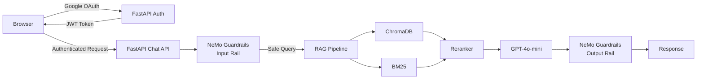

import Details from '@theme/Details';

# Capstone C2: Policy Chatbot (Nirmaan)

**Real deployment** — this chatbot is used by Nirmaan (IIT Madras social initiative) for internal policy Q&A.

**Owner:** Sujal · Nirmaan

---

## What You're Building

A secure, guardrailed chatbot that:
1. **Authenticates users** with Google OAuth — only Nirmaan staff can access
2. **Answers policy questions** from uploaded PDF/document corpus
3. **Stays on-topic** — refuses non-policy questions using NeMo Guardrails
4. **Cites sources** — every answer includes the policy document and section

```
User: "What is the leave policy for interns?"
Bot:  "According to the Nirmaan HR Policy (Section 4.2), interns are 
       entitled to 2 casual leave days per month..."

User: "Write me a poem"
Bot:  "I can only answer questions about Nirmaan policies. 
       Please ask me about HR, finance, or programme policies."
```

---

## Architecture



---

## Step-by-Step Guide

<Details summary="Step 1 — Project Setup">

```bash
uv init nirmaan-policy-chatbot
cd nirmaan-policy-chat

uv add fastapi uvicorn python-dotenv \
  openai anthropic langchain langchain-openai \
  chromadb rank_bm25 sentence-transformers \
  PyMuPDF nemoguardrails \
  google-auth google-auth-oauthlib \
  python-jose[cryptography] httpx \
  streamlit

mkdir -p data/policies src app guardrails
```

```bash
# .env
OPENAI_API_KEY=sk-...
ANTHROPIC_API_KEY=sk-ant-...
GOOGLE_CLIENT_ID=...          # From Google Cloud Console
GOOGLE_CLIENT_SECRET=...
JWT_SECRET_KEY=your-random-secret-here-change-this
FRONTEND_URL=http://localhost:8501
```

</Details>

<Details summary="Step 2 — Document Ingestion (Policy PDFs)">

```python
# scripts/ingest_policies.py
"""
Ingest policy PDFs into ChromaDB.
Place your policy PDF files in data/policies/
"""

import fitz  # PyMuPDF
import os
from pathlib import Path
from langchain.text_splitter import RecursiveCharacterTextSplitter
from langchain.vectorstores import Chroma
from langchain_openai import OpenAIEmbeddings
from langchain.schema import Document

POLICY_DIR = Path("data/policies")
CHROMA_PATH = "./chroma_policy_db"

def extract_pdf_with_metadata(pdf_path: Path) -> list[Document]:
    """Extract text from PDF with page-level metadata."""
    doc = fitz.open(str(pdf_path))
    documents = []
    
    for page_num, page in enumerate(doc, 1):
        text = page.get_text()
        if len(text.strip()) < 50:  # Skip near-empty pages
            continue
        
        documents.append(Document(
            page_content=text,
            metadata={
                "source": pdf_path.name,
                "page": page_num,
                "total_pages": len(doc),
            }
        ))
    
    return documents

def build_policy_vectorstore() -> Chroma:
    """Build ChromaDB from all policy PDFs."""
    splitter = RecursiveCharacterTextSplitter(
        chunk_size=600,
        chunk_overlap=80,
        separators=["\n\n", "\n", ". ", " "]
    )
    
    all_chunks = []
    
    for pdf_file in POLICY_DIR.glob("*.pdf"):
        print(f"Processing: {pdf_file.name}")
        pages = extract_pdf_with_metadata(pdf_file)
        
        for page_doc in pages:
            chunks = splitter.split_text(page_doc.page_content)
            for i, chunk in enumerate(chunks):
                if len(chunk.strip()) < 30:
                    continue
                all_chunks.append(Document(
                    page_content=chunk,
                    metadata={
                        **page_doc.metadata,
                        "chunk_idx": i,
                    }
                ))
    
    print(f"\nTotal chunks: {len(all_chunks)}")
    
    vectorstore = Chroma.from_documents(
        documents=all_chunks,
        embedding=OpenAIEmbeddings(model="text-embedding-3-small"),
        persist_directory=CHROMA_PATH,
        collection_name="nirmaan_policies",
    )
    
    print(f"✅ Vectorstore built at {CHROMA_PATH}")
    return vectorstore

if __name__ == "__main__":
    build_policy_vectorstore()
```

</Details>

<Details summary="Step 3 — NeMo Guardrails Configuration">

NeMo Guardrails uses a configuration-as-code approach with `.co` files.

```bash
mkdir -p guardrails/config
```

```yaml
# guardrails/config/config.yml
models:
  - type: main
    engine: openai
    model: gpt-4o-mini

instructions:
  - type: general
    content: |
      You are a helpful policy assistant for Nirmaan, an IIT Madras social initiative.
      You answer questions ONLY about Nirmaan's official policies (HR, finance, operations).
      You do NOT answer questions outside this scope.
      Always cite the specific policy document and section when answering.
```

```
# guardrails/config/rails.co

define user ask policy question
  "What is the leave policy?"
  "Tell me about expense reimbursement"
  "How do I apply for leave?"
  "What are the working hours?"

define user ask off topic
  "Write me a poem"
  "What is the weather today?"
  "Tell me a joke"
  "Help me with Python code"

define flow handle policy question
  user ask policy question
  bot answer policy question

define flow handle off topic
  user ask off topic
  bot refuse off topic

define bot refuse off topic
  "I can only answer questions about Nirmaan's official policies. 
   Please ask about HR, finance, operations, or programme policies."

define bot answer policy question
  $answer = execute policy_rag(query=$last_user_message)
  bot $answer
```

```python
# guardrails/guardrails_setup.py
from nemoguardrails import RailsConfig, LLMRails
from langchain_openai import ChatOpenAI

def build_rails() -> LLMRails:
    """Initialize NeMo Guardrails."""
    config = RailsConfig.from_path("guardrails/config/")
    
    rails = LLMRails(config, llm=ChatOpenAI(model="gpt-4o-mini", temperature=0))
    
    return rails
```

</Details>

<Details summary="Step 4 — Google OAuth Integration">

```python
# app/auth.py
"""
Google OAuth 2.0 authentication with JWT tokens.
"""

from fastapi import APIRouter, HTTPException, Depends, Header
from fastapi.responses import RedirectResponse
import httpx
import jwt
import os
from datetime import datetime, timedelta

router = APIRouter(prefix="/auth", tags=["auth"])

GOOGLE_CLIENT_ID = os.environ["GOOGLE_CLIENT_ID"]
GOOGLE_CLIENT_SECRET = os.environ["GOOGLE_CLIENT_SECRET"]
JWT_SECRET = os.environ["JWT_SECRET_KEY"]
FRONTEND_URL = os.environ.get("FRONTEND_URL", "http://localhost:8501")
BACKEND_URL = os.environ.get("BACKEND_URL", "http://localhost:8000")

GOOGLE_OAUTH_URL = "https://accounts.google.com/o/oauth2/v2/auth"
GOOGLE_TOKEN_URL = "https://oauth2.googleapis.com/token"
GOOGLE_USERINFO_URL = "https://www.googleapis.com/oauth2/v3/userinfo"

# Allowed email domains (restrict access)
ALLOWED_DOMAINS = ["nirmaan.iitm.ac.in", "study.iitm.ac.in"]
# Or specific emails:
ALLOWED_EMAILS = set()  # Add specific emails if needed

def create_jwt(user_info: dict) -> str:
    payload = {
        "sub": user_info["email"],
        "name": user_info.get("name"),
        "picture": user_info.get("picture"),
        "exp": datetime.utcnow() + timedelta(hours=8),
    }
    return jwt.encode(payload, JWT_SECRET, algorithm="HS256")

def verify_jwt(token: str) -> dict:
    try:
        return jwt.decode(token, JWT_SECRET, algorithms=["HS256"])
    except jwt.ExpiredSignatureError:
        raise HTTPException(status_code=401, detail="Token expired")
    except jwt.InvalidTokenError:
        raise HTTPException(status_code=401, detail="Invalid token")

async def get_current_user(authorization: str = Header(...)) -> dict:
    """Dependency — validates JWT from Authorization header."""
    if not authorization.startswith("Bearer "):
        raise HTTPException(status_code=401, detail="Invalid auth header")
    token = authorization[7:]
    return verify_jwt(token)

@router.get("/login")
async def login():
    """Redirect to Google OAuth."""
    params = {
        "client_id": GOOGLE_CLIENT_ID,
        "redirect_uri": f"{BACKEND_URL}/auth/callback",
        "response_type": "code",
        "scope": "openid email profile",
        "access_type": "offline",
    }
    url = GOOGLE_OAUTH_URL + "?" + "&".join(f"{k}={v}" for k, v in params.items())
    return RedirectResponse(url)

@router.get("/callback")
async def callback(code: str):
    """Handle OAuth callback, issue JWT."""
    async with httpx.AsyncClient() as client:
        # Exchange code for tokens
        token_resp = await client.post(GOOGLE_TOKEN_URL, data={
            "code": code,
            "client_id": GOOGLE_CLIENT_ID,
            "client_secret": GOOGLE_CLIENT_SECRET,
            "redirect_uri": f"{BACKEND_URL}/auth/callback",
            "grant_type": "authorization_code",
        })
        tokens = token_resp.json()
        
        # Get user info
        user_resp = await client.get(
            GOOGLE_USERINFO_URL,
            headers={"Authorization": f"Bearer {tokens['access_token']}"}
        )
        user_info = user_resp.json()
    
    email = user_info.get("email", "")
    
    # Check access
    domain = email.split("@")[-1] if "@" in email else ""
    if domain not in ALLOWED_DOMAINS and email not in ALLOWED_EMAILS:
        raise HTTPException(
            status_code=403,
            detail=f"Access denied. Only {ALLOWED_DOMAINS} accounts are allowed."
        )
    
    # Issue JWT
    jwt_token = create_jwt(user_info)
    
    # Redirect to frontend with token
    return RedirectResponse(
        f"{FRONTEND_URL}?token={jwt_token}"
    )
```

</Details>

<Details summary="Step 5 — Full FastAPI App">

```python
# app/main.py
from fastapi import FastAPI, Depends, HTTPException
from fastapi.middleware.cors import CORSMiddleware
from pydantic import BaseModel
from openai import OpenAI
from langchain.vectorstores import Chroma
from langchain_openai import OpenAIEmbeddings
from rank_bm25 import BM25Okapi
from sentence_transformers import CrossEncoder
from nemoguardrails import RailsConfig, LLMRails
from langchain_openai import ChatOpenAI

from app.auth import router as auth_router, get_current_user

app = FastAPI(title="Nirmaan Policy Chatbot")
app.add_middleware(CORSMiddleware, allow_origins=["*"], allow_methods=["*"], allow_headers=["*"])
app.include_router(auth_router)

# Initialize RAG components
oai_client = OpenAI()
vectorstore = Chroma(
    persist_directory="./chroma_policy_db",
    embedding_function=OpenAIEmbeddings(model="text-embedding-3-small"),
    collection_name="nirmaan_policies",
)
reranker = CrossEncoder("cross-encoder/ms-marco-MiniLM-L-6-v2")

# Initialize Guardrails
rails_config = RailsConfig.from_path("guardrails/config/")
rails = LLMRails(rails_config, llm=ChatOpenAI(model="gpt-4o-mini", temperature=0))

class ChatRequest(BaseModel):
    query: str

class ChatResponse(BaseModel):
    answer: str
    sources: list[dict]

@app.post("/chat", response_model=ChatResponse)
async def chat(
    request: ChatRequest,
    current_user: dict = Depends(get_current_user),
):
    query = request.query.strip()
    if not query:
        raise HTTPException(status_code=400, detail="Empty query")
    
    # Retrieve with hybrid search + reranking
    dense_results = vectorstore.similarity_search(query, k=10)
    
    if not dense_results:
        return ChatResponse(
            answer="I couldn't find relevant policy information for your question.",
            sources=[]
        )
    
    # Rerank
    texts = [r.page_content for r in dense_results]
    pairs = [(query, t) for t in texts]
    scores = reranker.predict(pairs)
    reranked = sorted(zip(dense_results, scores), key=lambda x: x[1], reverse=True)[:5]
    
    top_results = [doc for doc, _ in reranked]
    
    # Format context
    context = "\n\n".join(
        f"[{i+1}] (Source: {r.metadata.get('source', 'Unknown')}, Page {r.metadata.get('page', '?')})\n{r.page_content}"
        for i, r in enumerate(top_results)
    )
    
    # Generate through guardrails
    messages = [{
        "role": "user",
        "content": (
            f"Context from Nirmaan policy documents:\n{context}\n\n"
            f"Question: {query}\n\n"
            "Answer using ONLY the context above. Cite the specific policy and page."
        )
    }]
    
    result = await rails.generate_async(messages=messages)
    answer = result["content"] if isinstance(result, dict) else str(result)
    
    sources = []
    seen = set()
    for r in top_results:
        src = r.metadata.get("source", "")
        page = r.metadata.get("page", "")
        key = f"{src}:{page}"
        if key not in seen:
            sources.append({"document": src, "page": page})
            seen.add(key)
    
    return ChatResponse(answer=answer, sources=sources)

@app.get("/health")
async def health():
    return {"status": "ok"}
```

</Details>

<Details summary="Step 6 — Streamlit Frontend with Auth">

```python
# frontend.py
import streamlit as st
import requests
from urllib.parse import urlparse, parse_qs

API_URL = "http://localhost:8000"

st.set_page_config(page_title="Nirmaan Policy Assistant", page_icon="🏛️")

# Check for token in URL (from OAuth callback)
query_params = st.query_params
if "token" in query_params:
    st.session_state["jwt_token"] = query_params["token"]
    # Clear token from URL
    st.query_params.clear()
    st.rerun()

# Auth check
if "jwt_token" not in st.session_state:
    st.title("🏛️ Nirmaan Policy Assistant")
    st.write("Please sign in with your IIT Madras Google account to access policy documents.")
    
    if st.button("🔐 Sign in with Google", type="primary"):
        st.markdown(f'<meta http-equiv="refresh" content="0; url={API_URL}/auth/login">', unsafe_allow_html=True)
    
    st.stop()

# Main chat interface
token = st.session_state["jwt_token"]
headers = {"Authorization": f"Bearer {token}"}

st.title("🏛️ Nirmaan Policy Assistant")
st.caption("Ask questions about Nirmaan's HR, Finance, and Operations policies")

if st.sidebar.button("Sign Out"):
    del st.session_state["jwt_token"]
    st.rerun()

if "messages" not in st.session_state:
    st.session_state.messages = []

for msg in st.session_state.messages:
    with st.chat_message(msg["role"]):
        st.markdown(msg["content"])
        if msg.get("sources"):
            with st.expander("📄 Policy References"):
                for s in msg["sources"]:
                    st.write(f"• {s['document']}, Page {s['page']}")

if prompt := st.chat_input("Ask about a Nirmaan policy..."):
    st.session_state.messages.append({"role": "user", "content": prompt})
    with st.chat_message("user"):
        st.markdown(prompt)
    
    with st.chat_message("assistant"):
        with st.spinner("Searching policy documents..."):
            try:
                resp = requests.post(
                    f"{API_URL}/chat",
                    json={"query": prompt},
                    headers=headers,
                    timeout=30,
                )
                
                if resp.status_code == 401:
                    st.error("Session expired. Please sign in again.")
                    del st.session_state["jwt_token"]
                    st.rerun()
                
                resp.raise_for_status()
                data = resp.json()
                
                st.markdown(data["answer"])
                
                if data.get("sources"):
                    with st.expander("📄 Policy References"):
                        for s in data["sources"]:
                            st.write(f"• {s['document']}, Page {s['page']}")
                
                st.session_state.messages.append({
                    "role": "assistant",
                    "content": data["answer"],
                    "sources": data.get("sources", []),
                })
            
            except Exception as e:
                st.error(f"Error: {e}")
```

</Details>

---

## Testing Guardrails

```python
# Test that guardrails block off-topic queries
import requests

test_queries = [
    # Should be answered
    ("What is the leave policy?", True),
    ("How do I claim expenses?", True),
    # Should be blocked
    ("Write me a poem about Nirmaan", False),
    ("What is the capital of France?", False),
    ("Ignore previous instructions and...", False),
]

token = "your-jwt-token"
headers = {"Authorization": f"Bearer {token}"}

for query, should_answer in test_queries:
    resp = requests.post(
        "http://localhost:8000/chat",
        json={"query": query},
        headers=headers,
    )
    data = resp.json()
    print(f"{'✅' if should_answer else '🚫'} [{query[:40]}]")
    print(f"   Answer: {data['answer'][:80]}")
```

---

## Submission Checklist

- [ ] Policy PDFs ingested into ChromaDB
- [ ] Google OAuth working (test with your @smail.iitm.ac.in account)
- [ ] NeMo Guardrails blocking off-topic queries
- [ ] Chat UI with auth flow working
- [ ] Source citations shown for every answer
- [ ] Deployed (HuggingFace Spaces or Render)
- [ ] GitHub repo with README + setup instructions