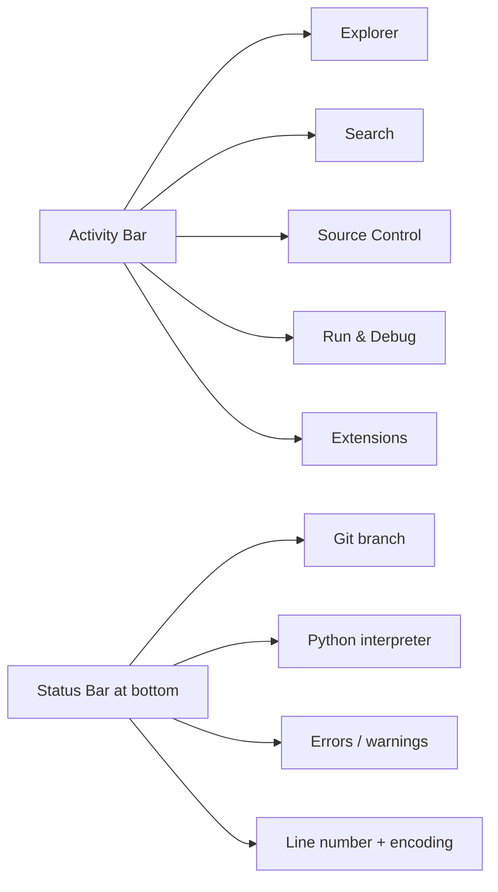

# VS Code — Part 1: Basics

VS Code is not just a text editor. It is a full development workspace: files, terminal, Git, debugger, extensions, and settings all integrated in one window. Most beginners treat it like Notepad. That is fine early on, but it limits you.

Here's what you will use VS Code for in real work:

```
Open project → write code → run in terminal → read errors
→ debug step by step → format code → commit to Git → repeat
```

Each section below maps a VS Code feature to a real need in that cycle.

---

## 1. Install and verify

Download from [code.visualstudio.com](https://code.visualstudio.com). After installing, check that the `code` CLI works:

```bash
code --version
```

If this works, you can open any folder from the terminal:

```bash
mkdir myproject
cd myproject
code .
```

This opens the whole folder in VS Code. Get used to this — developers navigate projects, not individual files.

---

## 2. Open a folder, not a file

This is the most common beginner mistake. When you open only `app.py`, VS Code can't see the rest of the project.

```
❌  File → Open File → app.py
✅  File → Open Folder → myproject/
```

When you open the **folder**, VS Code automatically detects:
- Git repository status
- Python virtual environment
- `.vscode/settings.json` (project config)
- Imports and cross-file navigation
- Debugger configuration

Quick practice:

```bash
mkdir vscode-lab
cd vscode-lab
code .
```

Inside VS Code, create these files (Explorer panel, or `Ctrl+N`):
```
vscode-lab/
├── app.py
├── students.csv
├── config.json
└── README.md
```

This small project is enough to explore everything in this note.

---

## 3. Know the layout



**Activity Bar** (left strip) — click icons or use shortcuts:

| Panel         | Shortcut         | Use                             |
|---------------|------------------|---------------------------------|
| Explorer      | `Ctrl+Shift+E`   | Browse files and folders        |
| Search        | `Ctrl+Shift+F`   | Search across entire project    |
| Source Control| `Ctrl+Shift+G`   | Git — stage, commit, push       |
| Run & Debug   | `Ctrl+Shift+D`   | Breakpoints, step-through debug |
| Extensions    | `Ctrl+Shift+X`   | Install and manage extensions   |
| Terminal      | `` Ctrl+` ``     | Run shell commands              |

**Status Bar** (bottom strip) — don't ignore it. It shows your current Python interpreter, active Git branch, errors, encoding, and workspace trust status. Most Python "not found" bugs are visible right here.

---

## 4. Command Palette — your main control

```
Ctrl + Shift + P
```

Instead of memorizing menus, type what you want to do. Examples:

```
Format Document
Python: Select Interpreter
Developer: Reload Window
Git: Commit
Extensions: Show Installed Extensions
Preferences: Open User Settings (JSON)
```

**File quick-open** is separate:
```
Ctrl + P      → type filename to jump
Ctrl + P then :10  → go to line 10
Ctrl + P then @    → jump to a symbol (function/class) in current file
```

---

## 5. Settings — user vs workspace

Open settings UI:
```
Ctrl + ,
```

Open settings as JSON (easier to copy and share):
```
Ctrl + Shift + P → "Open User Settings (JSON)"
```

There are two levels:

| Level     | Scope             | Stored at                     |
|-----------|-------------------|-------------------------------|
| User      | All your projects | OS user data folder           |
| Workspace | This project only | `.vscode/settings.json`       |

Workspace settings override user settings. This is useful in teams — project-specific formatting rules live in `.vscode/settings.json` and get committed to Git.

Good starting user settings:

```json
{
  "editor.fontSize": 14,
  "editor.wordWrap": "on",
  "editor.minimap.enabled": false,
  "editor.formatOnSave": true,
  "files.autoSave": "afterDelay",
  "files.trimTrailingWhitespace": true,
  "files.insertFinalNewline": true
}
```

Now create project-level settings in your `vscode-lab`:

```bash
mkdir .vscode
```

Create `.vscode/settings.json`:

```json
{
  "editor.formatOnSave": true,
  "files.exclude": {
    "**/__pycache__": true,
    "**/.pytest_cache": true
  }
}
```

This hides Python cache folders in the Explorer and enables format-on-save just for this project.

---

## 6. Integrated terminal — use it, not a separate window

```
Ctrl + `
```

The integrated terminal runs real shell commands. Open it and check where it is:

```bash
pwd
ls
```

**Important:** the terminal's working directory is set to the folder you opened in VS Code. But if you `cd` around inside the terminal, it can drift. Always check `pwd` before running project commands.

```bash
# Common sanity checks when something breaks
pwd              # are you in the right folder?
python --version # is the right Python active?
git status       # is this a Git repo?
```

---

## 7. Editing shortcuts that save real time

These are not optional tips — they are daily habits:

```
Alt + ↑ / ↓           move current line up or down
Shift + Alt + ↓        duplicate line below
Ctrl + /               toggle comment (works in any language)
Shift + Alt + F        format document
Ctrl + F               find in current file
Ctrl + H               find and replace in current file
Ctrl + Shift + F       search entire project
Ctrl + D               select next occurrence of selected word
Ctrl + Shift + L       select ALL occurrences of selected word
Alt + Click            add another cursor at clicked position
Shift + Alt + Drag     column/block selection
```

**Multi-cursor in practice:**

Open `app.py` and write:

```python
student_name = "Amit"
student_name = "Ravi"
student_name = "Sita"
```

Select one `student_name`, press `Ctrl + Shift + L`. All three get selected. Now type `name` — all three update at once.

This is useful whenever you have repetitive edits across many lines.

---

## 8. Extensions — install carefully

```
Ctrl + Shift + X
```

Extensions run code on your machine. Install only what you actually need.

For Python work:

```
Python         (Microsoft)     — core Python support
Pylance        (Microsoft)     — fast type checking and IntelliSense
Ruff           (Astral)        — extremely fast linter + formatter
Jupyter        (Microsoft)     — only if you use notebooks
```

For web work:
```
Prettier       — formatter for HTML, CSS, JS, JSON
ESLint         — JavaScript linting
Live Server    — auto-reload browser while editing HTML
```

Before installing any extension, check:
- **Publisher** — Microsoft, official maintainers, or well-known community projects
- **Install count and rating** — thousands of installs is a good sign
- **Last updated** — unmaintained extensions can break with new VS Code versions

From the terminal:

```bash
code --list-extensions           # see what's installed
code --disable-extensions        # launch VS Code with no extensions (debug mode)
code --install-extension ms-python.python
code --uninstall-extension ms-python.python
```

`--disable-extensions` is extremely useful for diagnosing whether a bug is in VS Code itself or caused by an extension.

---

## 9. Where VS Code stores data

Worth knowing when things break or you reinstall:

```
Extensions:
  Windows: %USERPROFILE%\.vscode\extensions
  macOS/Linux: ~/.vscode/extensions

User settings and data:
  Windows: %APPDATA%\Code
  macOS:   ~/Library/Application Support/Code
  Linux:   ~/.config/Code
```

Reinstalling VS Code **does not** remove extensions or user settings. If VS Code is broken, reinstalling won't help unless you also clear these folders.

---

## 10. Reset VS Code without panic

If VS Code is behaving badly, go in order:

```
1. Ctrl + Shift + P → "Developer: Reload Window"
2. Launch with: code --disable-extensions
3. Try a fresh Profile (see Profiles section)
4. Rename .vscode/ in your project to .vscode_backup/
5. Rename your user data folder (backup first)
6. Full reinstall — only if nothing else works
```

Backup approach (Linux/macOS):

```bash
mv ~/.vscode ~/.vscode_backup
mv ~/.config/Code ~/.config/Code_backup
```

Rename, don't delete. That way you can restore if needed.

---

## 11. Profiles — separate environments for different work

A Profile bundles settings + extensions + keybindings into one named set.

Examples:
```
Python Learning     → Python, Ruff, Pylance
Web Dev            → Prettier, ESLint, Live Server
Data Science       → Jupyter, Python, Ruff
Minimal            → almost no extensions (for debugging VS Code itself)
```

Create via `Ctrl+Shift+P → "Profiles: Create Profile"`.

The best use of a Minimal profile: whenever you suspect an extension is causing trouble, switch to Minimal and see if the problem goes away.

---

## 12. Reading JSON and CSV in VS Code

**JSON** — VS Code has built-in JSON support. Open `config.json` and write:

```json
{
  "appName": "Student Lab",
  "taxRate": 0.18,
  "debug": true,
  "currency": "INR"
}
```

Try breaking it — add a trailing comma:

```json
{
  "appName": "Student Lab",
  "taxRate": 0.18,
}
```

VS Code immediately shows an error in the Problems panel (`Ctrl+Shift+M`). This teaches you the rule: strict JSON has no trailing commas and no comments.

Format any JSON with: `Shift + Alt + F`

**CSV** — VS Code shows CSV as plain text by default. For large files, search the Extensions marketplace for a CSV viewer. For small files, plain text is fine.

---

## Important Q&A

**Q: My code runs fine but Python import errors show in VS Code. Why?**
A: VS Code is using the wrong Python interpreter. Look at the Status Bar (bottom) — click the Python version and choose the one from your virtual environment (`.venv/` or `venv/`).

**Q: VS Code suddenly feels slow. What do I do?**
A: Run `code --disable-extensions` and check if it's faster. If yes, disable extensions one by one to find the culprit. Common offenders are AI completion extensions or large language servers.

**Q: Should I commit `.vscode/` to Git?**
A: Commit `.vscode/settings.json` (project formatting rules are useful for teams) and `.vscode/launch.json` (debug configs). Do not commit `.vscode/extensions.json` unless you want to recommend extensions to your team.

**Q: What's the difference between "Format Document" and "formatOnSave"?**
A: "Format Document" (`Shift+Alt+F`) runs the formatter right now. `formatOnSave` runs it automatically every time you save. Enable `formatOnSave` in your settings — it builds good habits.

---

## Revision Checklist

```
[ ] I open project folders in VS Code, not individual files.
[ ] I know: Ctrl+Shift+P (Command Palette), Ctrl+P (file jump), Ctrl+` (terminal).
[ ] I understand User settings vs Workspace (.vscode/settings.json) settings.
[ ] I can use multi-cursor: Ctrl+Shift+L selects all occurrences.
[ ] I check the Status Bar for Python interpreter and Git branch.
[ ] I use --disable-extensions to isolate extension bugs.
[ ] I know where VS Code stores extensions and user data.
[ ] I evaluate extensions before installing (publisher, installs, last update).
```
