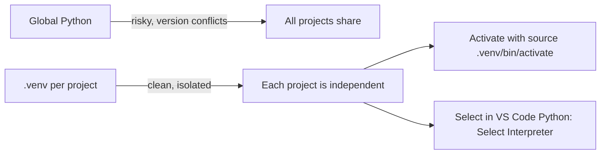
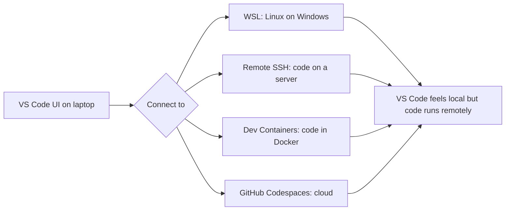

# VS Code — Part 2: Python, Debugging, Git, and Workflow

This continues from Part 1. Make sure you have the `vscode-lab/` folder open in VS Code with `app.py`, `students.csv`, `config.json`, and `README.md` created.

---

## Python Setup: interpreter first, packages second

Write this in `app.py`:

```python
import csv
import json

with open("config.json", "r") as f:
    config = json.load(f)

print("App:", config["appName"])
print("Currency:", config["currency"])

with open("students.csv", "r") as f:
    reader = csv.DictReader(f)
    for row in reader:
        print(row["name"], row["marks"], row["city"])
```

Run it:

```bash
python app.py
```

If it fails, check these in order:
1. Are you in the right folder? (`pwd`)
2. Is Python installed? (`python --version`)
3. Is the right interpreter selected in VS Code?
4. Is `config.json` valid JSON?
5. Is `students.csv` in the same folder?

**Selecting the Python interpreter** — this is the #1 Python issue students face. VS Code may use system Python while your packages are in a virtual environment.

```
Ctrl + Shift + P → "Python: Select Interpreter"
```

Or click the Python version on the Status Bar at the bottom.

---

## Virtual environments — keep projects isolated

Never install all packages globally. A virtual environment keeps each project's dependencies separate.

```bash
# Create it
python -m venv .venv

# Activate (Linux/macOS)
source .venv/bin/activate

# Activate (Windows PowerShell)
.venv\Scripts\Activate.ps1
```

After activating, select it in VS Code via `Python: Select Interpreter` and choose `.venv`.

Install packages into it:

```bash
pip install requests
pip freeze > requirements.txt    # save what's installed
```

Create `.gitignore` so you don't commit the `.venv` folder:

```gitignore
.venv/
__pycache__/
.pytest_cache/
```



---

## Debugging: stop guessing, start observing

Most beginners only use `print()`. That works but gets messy for complex logic. VS Code's debugger lets you pause code mid-run and look inside variables.

Update `app.py` to add a function:

```python
import csv
import json

def calculate_grade(marks):
    marks = int(marks)
    if marks >= 90:
        return "A"
    elif marks >= 75:
        return "B"
    else:
        return "C"

with open("config.json", "r") as f:
    config = json.load(f)

print("App:", config["appName"])

with open("students.csv", "r") as f:
    reader = csv.DictReader(f)
    for row in reader:
        grade = calculate_grade(row["marks"])
        print(row["name"], row["marks"], grade)
```

**Set a breakpoint:** click in the gutter (the space left of the line number) on the `marks = int(marks)` line. A red dot appears.

Open Run and Debug:
```
Ctrl + Shift + D
```

Press **F5** to start debugging (or click the green play button). Execution pauses at your breakpoint.

**Debug controls:**

| Button | Shortcut | Action |
|--------|----------|--------|
| Continue | F5 | Run until next breakpoint |
| Step Over | F10 | Execute current line, stay in function |
| Step Into | F11 | Enter the function being called |
| Step Out | Shift+F11 | Exit the current function |
| Stop | Shift+F5 | Stop the session |

**What to look at while paused:**
- **Variables panel** — every local variable and its current value
- **Watch panel** — type any expression (e.g. `marks * 2`) to evaluate it live
- **Call Stack** — shows which function called which
- **Debug Console** — type Python expressions to evaluate mid-run

This teaches you what's happening *inside* your code, not just what it prints.

---

## `launch.json` — save your debug configuration

For complex projects, create `.vscode/launch.json` so you don't have to set up the debugger every time:

```json
{
  "version": "0.2.0",
  "configurations": [
    {
      "name": "Run current Python file",
      "type": "debugpy",
      "request": "launch",
      "program": "${file}",
      "console": "integratedTerminal"
    }
  ]
}
```

For projects that need arguments:

```json
{
  "name": "Run app with mode",
  "type": "debugpy",
  "request": "launch",
  "program": "${workspaceFolder}/app.py",
  "console": "integratedTerminal",
  "args": ["--mode", "dev"]
}
```

`${file}` means "whatever file is currently open". `${workspaceFolder}` is the root of your project.

---

## Problems, Output, Terminal, Debug Console — use the right panel

When something breaks, students stare at the editor. Instead, open the right panel:

| Panel | Shortcut | Shows |
|-------|----------|-------|
| Terminal | `` Ctrl+` `` | Output of commands you ran |
| Problems | `Ctrl+Shift+M` | Linter and syntax warnings |
| Output | `View → Output` | Logs from VS Code and extensions |
| Debug Console | During debug session | Evaluate live expressions |

To diagnose why a formatter isn't running: `View → Output → select "Ruff"` or `"Prettier"` from the dropdown. The actual error will be there.

---

## Formatting and linting

A **formatter** changes code style (indentation, spacing). A **linter** warns about bugs and style issues.

For Python, use Ruff (fast, handles both):

```json
{
  "[python]": {
    "editor.defaultFormatter": "charliermarsh.ruff"
  },
  "editor.formatOnSave": true
}
```

Put this in `.vscode/settings.json` for project-level settings, or in User Settings for all projects.

**If formatting isn't working:**
1. Check file language mode (bottom Status Bar — should say "Python")
2. Check `Output → Ruff` for error messages
3. Make sure Ruff extension is installed
4. Confirm only one formatter is set as default

---

## Git inside VS Code

Git tracking is built into VS Code. You use it from the Source Control panel or the terminal — both work.

```bash
# Terminal approach
git init
git add .
git commit -m "Add student lab files"
```

Or from **Source Control** (`Ctrl+Shift+G`):
1. You'll see changed files listed
2. Click `+` next to a file to stage it (or stage all with the `+` at the top)
3. Type a commit message in the box
4. Click the checkmark to commit

**Reviewing diffs:** before committing, click any changed file in Source Control to see exactly what lines changed. Develop the habit of reading diffs before every commit — you'll catch accidental changes.

File status indicators:
```
U = Untracked (new file, not yet in Git)
M = Modified
A = Added (staged)
D = Deleted
```

Advanced actions in the Source Control panel:
- Stage only selected lines (right-click on a diff hunk)
- Discard specific changes without losing everything
- Resolve merge conflicts with the 3-way diff editor
- Switch branches from the Status Bar (bottom)

---

## Navigation and refactoring

Move through code quickly instead of scrolling:

```
Ctrl + P              → quick-open any file
Ctrl + Shift + F      → search across entire project
F12                   → go to definition
Alt + F12             → peek definition (without leaving current file)
Shift + F12           → find all references
F2                    → rename symbol (updates all usages everywhere)
Ctrl + Shift + O      → list symbols (functions, classes) in current file
Ctrl + G              → go to line number
```

**Why use `F2` for renaming?** If you use find-replace to rename a variable, it can hit strings and comments too. `F2` (Rename Symbol) only changes actual code references.

---

## Tasks — save repeated commands

If you run `python app.py` or `pytest` repeatedly, save it as a task.

Create `.vscode/tasks.json`:

```json
{
  "version": "2.0.0",
  "tasks": [
    {
      "label": "Run app",
      "type": "shell",
      "command": "python app.py",
      "group": "build",
      "problemMatcher": []
    },
    {
      "label": "Run tests",
      "type": "shell",
      "command": "pytest",
      "group": "test",
      "problemMatcher": []
    }
  ]
}
```

Run a task:
```
Ctrl + Shift + P → "Tasks: Run Task"
```

---

## Testing with pytest in VS Code

Create `test_app.py`:

```python
from app import calculate_grade

def test_grade_a():
    assert calculate_grade(95) == "A"

def test_grade_b():
    assert calculate_grade(80) == "B"

def test_grade_c():
    assert calculate_grade(60) == "C"
```

Install pytest:

```bash
pip install pytest
```

Run from terminal:
```bash
pytest
```

VS Code also has a **Testing panel** (beaker icon in Activity Bar). It can discover, run, and debug individual tests. You can click a failing test and jump directly to the failure.

**Always save your files before running tests.** VS Code does not auto-save when you click "run tests".

---

## Snippets — shortcuts for repeated code patterns

Open:
```
Ctrl + Shift + P → "Snippets: Configure User Snippets" → Python
```

Add a snippet:

```json
{
  "Print variable with name": {
    "prefix": "pv",
    "body": ["print('${1:var} =', ${1:var})"],
    "description": "Print a variable with its name"
  },
  "New test function": {
    "prefix": "tdef",
    "body": [
      "def test_${1:name}():",
      "    ${2:assert True}"
    ],
    "description": "New pytest function"
  }
}
```

Type `pv` in a `.py` file and press Tab — it expands to `print('var =', var)`. Type the variable name once and both places update.

---

## Workspace Trust — don't blindly run unknown code

When you open a folder downloaded from the internet, VS Code may ask:
```
Do you trust the authors of this folder?
```

Before clicking Trust, inspect:
- `README.md` — what does this project do?
- `.vscode/tasks.json` — does it run any shell commands automatically?
- `package.json` or `requirements.txt` — what does it install?
- Any shell scripts in the root

In **Restricted Mode**, some features are disabled (terminal commands from tasks, some extensions). That is intentional — it prevents malicious projects from executing code immediately.

Rule: read before trusting.

---

## Remote development (when code runs elsewhere)

After mastering local development, you'll encounter:



The "Remote - SSH" extension lets you edit files on a cloud server as if they were local. The terminal runs on the remote machine too.

Dev Containers are useful for teams — every team member develops in an identical Docker environment, no "works on my machine" problems.

---

## Daily workflow (put this on a sticky note)

**Starting a session:**
```
1. Open project folder (not a single file)
2. Check terminal location: pwd
3. Check interpreter: Status Bar → Python version
4. Check Git branch: Status Bar → branch name
5. git pull (if working with a remote)
6. Activate .venv if needed
7. Run the project to confirm it works
```

**While coding:**
```
Ctrl + P          find files
Ctrl + Shift + F  search project
F12               go to definition
F2                rename symbol
Ctrl + /          comment/uncomment
Shift + Alt + F   format now
```

**When something breaks:**
```
1. Read the full error message
2. Check: are you in the right folder?
3. Check: is the right interpreter/runtime selected?
4. Open Problems panel (Ctrl+Shift+M)
5. Open Output panel (View → Output), select the relevant tool
6. Reload window: Ctrl+Shift+P → "Developer: Reload Window"
7. Try: code --disable-extensions
8. Check .vscode/settings.json for conflicting settings
```

---

## Important Q&A

**Q: VS Code says "No module named X" but I installed the package. Why?**
A: The package is installed in the wrong environment. Your terminal may have a different Python active than VS Code's selected interpreter. Run `which python` (Linux/Mac) or `where python` (Windows) in the VS Code terminal to see which one it's using. Then align VS Code's interpreter to match.

**Q: What is the difference between Terminal, Problems, and Output?**
A: Terminal = where *you* run commands and see their output. Problems = syntax errors and linter warnings VS Code found in your code. Output = internal logs from VS Code's extensions (useful when a formatter or linter silently fails).

**Q: Why use the debugger instead of just adding print statements?**
A: `print()` works but you have to add it, run, read, remove it, repeat. The debugger pauses execution so you can explore everything at once — variables, call stack, watch expressions — without changing any code.

**Q: Should I commit `.vscode/` to Git?**
A: Commit `.vscode/settings.json` (project formatting config is useful for the whole team) and `.vscode/launch.json` (debug configs). Do not commit `.vscode/extensions.json` (recommendations) unless your team actively uses it.

---

## Revision Checklist

```
[ ] I can create and activate a .venv virtual environment.
[ ] I select the correct Python interpreter in VS Code after creating .venv.
[ ] I can set a breakpoint and step through code with the debugger.
[ ] I know what Variables, Watch, Call Stack, and Debug Console panels show.
[ ] I have a .vscode/launch.json for my Python project.
[ ] I check the Output panel (not just Problems) when something breaks.
[ ] I review diffs in Source Control before committing.
[ ] I can use F2 to safely rename a symbol across the whole project.
[ ] I understand Workspace Trust and don't blindly trust unknown projects.
[ ] I have a .gitignore that excludes .venv/ and __pycache__/.
```
