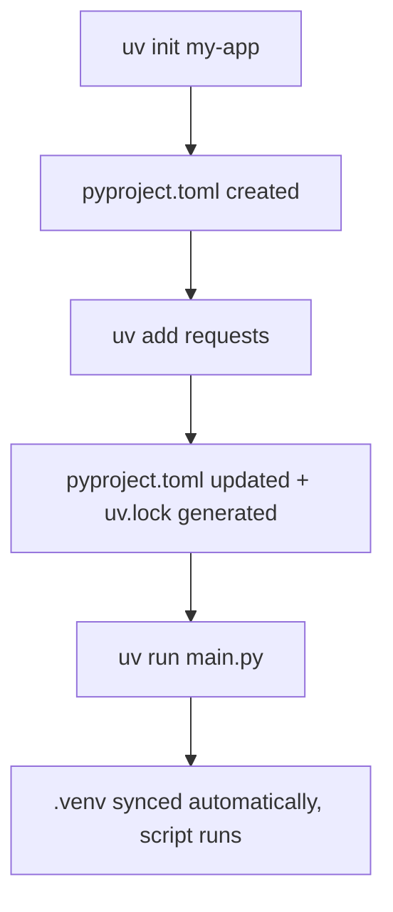

# uv — Part 1: Python Environment Management

`uv` is a fast, modern replacement for `pip`, `venv`, `pyenv`, and `pipx` — all rolled into one tool built by Astral. Instead of juggling multiple tools, you use `uv` for almost everything Python-environment-related.

Here's the comparison at a glance:

| What you need | Old way | With `uv` |
|---|---|---|
| Install Python | system installer / pyenv | `uv python install 3.12` |
| Create virtual env | `python -m venv .venv` | `uv venv` |
| Install packages | `pip install requests` | `uv pip install requests` |
| Project dependencies | `requirements.txt` manually | `pyproject.toml` + `uv.lock` |
| Run one-off tools | `pipx run ruff` | `uvx ruff` |
| Run a script | activate venv → python file.py | `uv run file.py` |

---

## Install uv

```bash
# Linux/macOS
curl -LsSf https://astral.sh/uv/install.sh | sh

# Verify
uv --version
```

`uv` is a standalone binary — it doesn't depend on Python being installed. You can install it on a fresh machine and let it manage Python for you.

To uninstall:

```bash
rm -f ~/.local/bin/uv ~/.local/bin/uvx
rm -rf ~/.cache/uv
```

---

## Why virtual environments matter

Different projects need different package versions. Without isolation, they conflict:

```
Project A needs pandas==2.1
Project B needs pandas==2.3
→ Installing one breaks the other if both use global Python
```

A virtual environment is just a folder containing its own Python + packages:

```
my-project/
├── .venv/          ← isolated Python environment
├── main.py
└── pyproject.toml
```

`uv` creates and manages this for you automatically.

---

## Running a single script

For small scripts, you don't even need a project folder.

```bash
mkdir uv-practice && cd uv-practice

# Create a simple script
cat > hello.py << 'PY'
print("Hello from uv!")
PY

# Run it
uv run hello.py
```

`uv` finds or downloads Python and runs the file.

Now suppose your script needs `requests`:

```bash
cat > weather.py << 'PY'
import requests

response = requests.get("https://httpbin.org/get")
print(response.status_code)
print(response.json()["url"])
PY

# Add requests as an inline dependency
uv add --script weather.py requests
```

This modifies your script to add a metadata block at the top:

```python
# /// script
# dependencies = [
#   "requests",
# ]
# ///

import requests
...
```

Now run it:

```bash
uv run weather.py
```

`uv` reads the metadata, creates an isolated environment in its cache (`~/.cache/uv`), installs `requests` there, and runs the script. You don't need to `pip install` or activate anything.

This is great for:
- One-file automation scripts
- API testing scripts
- Sharing reproducible scripts with others (they just run `uv run script.py`)

---

## Traditional workflow: `requirements.txt`

Many existing projects still use this approach. `uv` supports it fully.

```bash
mkdir old-style-project && cd old-style-project

# Create virtual environment
uv venv
# .venv/ is created

# Activate it (needed for this workflow)
source .venv/bin/activate          # Linux/macOS
# .venv\Scripts\Activate.ps1      # Windows PowerShell

# Install packages
uv pip install requests pandas

# Save what's installed
uv pip freeze > requirements.txt

# Run Python
python main.py
```

To reproduce the environment later (e.g., on another machine):

```bash
uv pip install -r requirements.txt   # adds required packages
# or
uv pip sync requirements.txt         # makes env exactly match (removes extras too)
```

Use `sync` when you want a clean, reproducible environment.

---

## You don't always need to activate `.venv`

Activation adds `.venv/bin` to your shell `PATH`. It's useful for interactive sessions, but for running project commands you can skip it:

```bash
# Instead of:
source .venv/bin/activate
python main.py

# Just use:
uv run main.py
uv run pytest
uv run ruff check .
```

`uv run` automatically uses the project's `.venv` if it exists in the current directory or any parent.

---

## Modern project workflow: `pyproject.toml`

This is the recommended approach for any project you're building from scratch.

```bash
uv init my-app
cd my-app
```

You get:

```
my-app/
├── .python-version    ← pins the Python version
├── README.md
├── main.py
└── pyproject.toml
```

Add dependencies:

```bash
uv add requests
uv add --dev pytest ruff    # dev-only dependencies
```

`pyproject.toml` updates automatically:

```toml
[project]
name = "my-app"
version = "0.1.0"
requires-python = ">=3.12"
dependencies = [
    "requests",
]

[tool.uv]
dev-dependencies = [
    "pytest",
    "ruff",
]
```

Run your app:

```bash
uv run main.py
```

`uv` syncs the environment automatically before running.



**What each file does:**

| File | Purpose |
|---|---|
| `pyproject.toml` | You edit this — project name, deps, Python version |
| `uv.lock` | Auto-generated — exact pinned versions, commit to Git |
| `.venv/` | Auto-created — local environment, do not commit to Git |
| `.python-version` | Pins Python version for this project |

---

## Manage dependencies

```bash
uv add requests          # add a dependency
uv add --dev pytest      # add a dev dependency
uv remove requests       # remove a dependency
uv tree                  # show full dependency tree
uv lock                  # regenerate uv.lock
uv sync                  # sync .venv to match uv.lock
```

---

## Managing Python versions

`uv` can download and manage Python versions without `pyenv`:

```bash
uv python install 3.12   # install Python 3.12
uv python install 3.11   # install another version
uv python list           # see all available/installed versions
uv python pin 3.12       # pin this version for the current project
```

Create a virtual environment with a specific version:

```bash
uv venv --python 3.11
```

If that version isn't installed, `uv` downloads it automatically.

---

## Full practical example: FastAPI project

```bash
uv init fastapi-demo
cd fastapi-demo

uv add fastapi uvicorn

cat > main.py << 'PY'
from fastapi import FastAPI

app = FastAPI()

@app.get("/")
def home():
    return {"message": "Hello from FastAPI"}
PY

uv run uvicorn main:app --reload
```

Open `http://localhost:8000` — your API is running. No manual `pip install`, no activation needed.

---

## Common mistakes

```
❌ pip install requests          (installs globally)
✅ uv add requests               (installs in project, updates pyproject.toml)

❌ Forgetting to commit uv.lock  (other machines get different versions)
✅ Always commit uv.lock to Git

❌ Committing .venv/             (it's large and auto-generated)
✅ Add .venv/ to .gitignore

❌ Using system Python for a project
✅ Always use uv run or activate .venv
```

---

## Important Q&A

**Q: Do I need Python installed before using `uv`?**
A: No. `uv` is standalone and can download Python itself via `uv python install 3.12`.

**Q: When should I use `uv pip install` vs `uv add`?**
A: Use `uv add` for projects with `pyproject.toml` — it records the dependency and keeps `uv.lock` updated. Use `uv pip install` for quick scripts or when working with a `requirements.txt`-based project.

**Q: Should I commit `uv.lock`?**
A: Yes. `uv.lock` contains exact pinned versions, ensuring everyone on the team (and CI/CD) gets the same environment. Commit it.

---

## Video Resources

[](https://youtu.be/igWlYl3asKw)

---

## Revision Checklist

```
[ ] I understand what a virtual environment is and why it's needed.
[ ] I can install uv and verify it with uv --version.
[ ] I can run a single-file script with inline dependencies using uv run.
[ ] I know the difference between uv pip install and uv pip sync.
[ ] I can create a modern project with uv init and manage deps with uv add/remove.
[ ] I know which files to commit to Git (pyproject.toml, uv.lock) and which not (.venv/).
[ ] I can install a specific Python version with uv python install.
```
