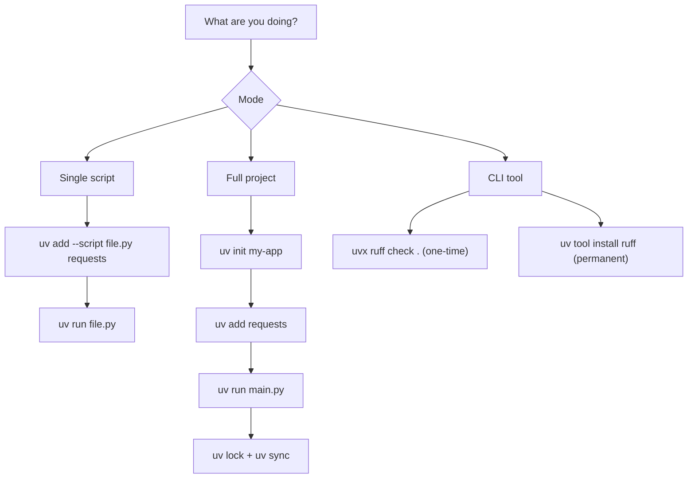

# uv — Part 2: Tools, Advanced Workflows, and Best Practices

This continues from Part 1. You should already know `uv venv`, `uv pip install`, `uv init`, and `uv add`.

---

## `requirements.txt` vs `pyproject.toml` — when to use which

| Situation | Use |
|---|---|
| Working on an old project or cloning from GitHub | `requirements.txt` |
| Your deployment platform expects `requirements.txt` | `requirements.txt` |
| Starting a new project | `pyproject.toml` + `uv.lock` |
| Want reproducible, locked environments | `pyproject.toml` + `uv.lock` |
| May eventually publish as a package | `pyproject.toml` |

For learning: understand `requirements.txt` to work with existing projects. Use `pyproject.toml` for everything you build yourself.

---

## Migrating an old project to uv

```bash
git clone <repo-url>
cd repo

# Install old-style dependencies
uv venv
uv pip install -r requirements.txt

# Confirm it works
uv run python main.py

# If you want to modernize it
uv init        # creates pyproject.toml in current folder
uv add requests pandas   # re-add your key dependencies
```

For platforms that still need `requirements.txt` (like some cloud hosts), generate one from `pyproject.toml`:

```bash
uv pip compile pyproject.toml -o requirements.txt
```

---

## `uvx` — run tools without installing them

Sometimes you just want to run a CLI tool once without adding it to your project.

```bash
uvx ruff check .
uvx black .
uvx httpie GET https://httpbin.org/get
```

`uvx` is shorthand for `uv tool run`. It downloads the tool, runs it in an isolated temporary environment, and leaves your project unchanged.

Run a specific version:

```bash
uvx ruff@0.3.0 check .
uvx ruff@latest check .
```

**When to use `uvx` vs `uv add --dev`:**

```
One-time check or formatting run?  → uvx ruff check .
Tool is part of your daily workflow? → uv add --dev ruff
                                       uv run ruff check .
```

---

## `uv tool install` — global tools

If you want a tool available system-wide (not just in one project):

```bash
uv tool install ruff          # install globally
ruff check .                  # run it directly from anywhere

uv tool list                  # see what's installed
uv tool upgrade --all         # update all tools
uv tool uninstall ruff        # remove it
```

Good candidates for global tool install:

```
ruff          - linter/formatter used across all Python projects
httpie        - HTTP client for API testing
pre-commit    - Git hooks manager
cookiecutter  - project template generator
```

---

## Building and publishing a Python package

If you want to create a reusable package (not just a script or app):

```bash
uv init --package my-package
cd my-package
```

Project structure:

```
my-package/
├── pyproject.toml
├── README.md
└── src/
    └── my_package/
        └── __init__.py
```

Build it:

```bash
uv build
```

This creates:

```
dist/
├── my_package-0.1.0.tar.gz
└── my_package-0.1.0-py3-none-any.whl
```

Publish to PyPI:

```bash
uv publish
```

Only do this when you understand package publishing, versioning, and PyPI credentials.

---

## Common real-world workflows

**Quick data analysis script:**

```bash
cat > analysis.py << 'PY'
import pandas as pd
df = pd.DataFrame({"score": [85, 91, 78]})
print(df.describe())
PY

uv add --script analysis.py pandas
uv run analysis.py
```

**Clone and run an old GitHub project:**

```bash
git clone <repo-url>
cd repo
uv venv
uv pip install -r requirements.txt
uv run python main.py
```

**New FastAPI backend:**

```bash
uv init api
cd api
uv add fastapi uvicorn
uv add --dev pytest ruff
uv run uvicorn main:app --reload
```

**Run tests and lint:**

```bash
uv run pytest
uv run ruff check .
uv run ruff format .
```

---

## What to commit and what not to

```
✅ Commit:
  pyproject.toml       → your dependency declarations
  uv.lock              → exact pinned versions for reproducibility
  .python-version      → pins Python version for the project
  src/                 → your actual code
  tests/               → your tests

❌ Don't commit:
  .venv/               → large, auto-regenerated
  __pycache__/         → auto-generated bytecode
  .pytest_cache/       → test cache
  dist/                → build output
```

`.gitignore` template:

```gitignore
.venv/
__pycache__/
.pytest_cache/
.ruff_cache/
dist/
*.egg-info/
```

---

## The three modes of uv



---

## Daily command reference

```bash
# Check
uv --version

# Python versions
uv python install 3.12
uv python list
uv run --python 3.12 python --version

# Virtual environment
uv venv
source .venv/bin/activate
deactivate

# Old-style project (requirements.txt)
uv pip install requests
uv pip install -r requirements.txt
uv pip freeze > requirements.txt
uv pip sync requirements.txt

# Modern project (pyproject.toml)
uv init my-app
uv add requests
uv add --dev pytest ruff
uv remove requests
uv run main.py
uv run pytest
uv tree
uv lock
uv sync

# Single-file script
uv add --script script.py requests
uv run script.py

# CLI tools
uvx ruff check .
uv tool install ruff
uv tool list
uv tool uninstall ruff
```

---

## Complete example: student grade API

```bash
uv init grade-api
cd grade-api

uv add fastapi uvicorn
uv add --dev pytest ruff
```

`main.py`:

```python
from fastapi import FastAPI

app = FastAPI()

def calculate_grade(marks: int) -> str:
    if marks >= 90:
        return "A"
    elif marks >= 75:
        return "B"
    else:
        return "C"

@app.get("/grade/{marks}")
def get_grade(marks: int):
    return {"marks": marks, "grade": calculate_grade(marks)}
```

`tests/test_main.py`:

```python
from main import calculate_grade

def test_a():
    assert calculate_grade(95) == "A"

def test_b():
    assert calculate_grade(80) == "B"

def test_c():
    assert calculate_grade(60) == "C"
```

Run:

```bash
uv run uvicorn main:app --reload     # start the API
uv run pytest                        # run tests
uv run ruff check .                  # lint
uv run ruff format .                 # format
```

Visit `http://localhost:8000/grade/85` — returns `{"marks": 85, "grade": "B"}`.

---

## Important Q&A

**Q: When should I use `uvx` vs `uv add --dev`?**
A: `uvx` is for one-off tool runs you don't want recorded in your project. `uv add --dev ruff` is for tools that are part of your project's workflow — they get saved in `pyproject.toml` so every contributor uses the same version.

**Q: Why does `uv lock` matter if `pyproject.toml` already lists versions?**
A: `pyproject.toml` declares version *ranges* (e.g., `requests>=2.0`). `uv.lock` records the *exact* version that was resolved (e.g., `requests==2.32.1`). Without the lockfile, two people running `uv sync` at different times might get different package versions.

**Q: How do I install a tool globally so I can run it from any folder?**
A: `uv tool install ruff` installs `ruff` globally. It lives in its own isolated environment but its binary is available anywhere. Run `uv tool list` to see all globally installed tools.

---

## Revision Checklist

```
[ ] I know when to use requirements.txt vs pyproject.toml.
[ ] I can use uvx to run a tool without adding it to my project.
[ ] I can install global tools with uv tool install.
[ ] I know what to commit to Git: pyproject.toml and uv.lock.
[ ] I know what NOT to commit: .venv/ and __pycache__/.
[ ] I understand the three modes: script, project, and tool.
[ ] I can run tests, linting, and formatting all through uv run.
```
