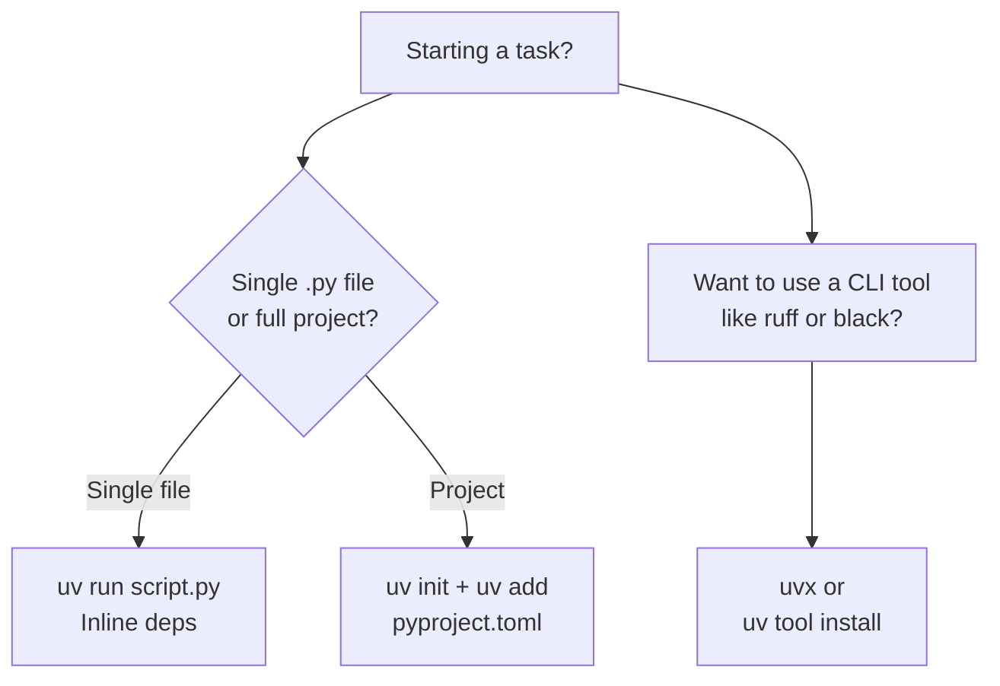

# 02 · UV — The Python Package Manager

?> **TL;DR**
?> `uv` is a single, blazingly fast binary from [Astral](https://astral.sh) (the team behind Ruff) that replaces **pip + virtualenv + pyenv + pipx + pip-tools + poetry**. In April 2026 it's at version **0.11.7** and is the default recommendation for all new Python projects at IIT Madras.

## Why UV?

If you've used Python for a while, you know the pain:

```
# The old way (circa 2023)
pyenv install 3.12
pyenv local 3.12
python -m venv .venv
source .venv/bin/activate
pip install -r requirements.txt      # ⏳ 30 seconds
pip install poetry                    # 🤔 but then what about lockfiles?
```

Six tools. Slow. Error-prone. Every OS has quirks.

**uv does all of this in one tool, 10–100× faster.**

```bash
# The new way
uv init my-project
cd my-project
uv add fastapi uvicorn               # ⚡ < 1 second
uv run python main.py
```

[](https://youtu.be/6E7Zvl_4Cdw "uv — The Future of Python Tooling (Astral)")

## Install UV

UV is a standalone binary — it doesn't even need Python installed first (it'll install Python for you!).

<details>
<summary><b>macOS / Linux</b></summary>

```bash
curl -LsSf https://astral.sh/uv/install.sh | sh
```

Restart your shell or `source ~/.bashrc` / `source ~/.zshrc`.
</details>

<details>
<summary><b>Windows (PowerShell)</b></summary>

```powershell
powershell -ExecutionPolicy ByPass -c "irm https://astral.sh/uv/install.ps1 | iex"
```
</details>

<details>
<summary><b>Via package managers</b></summary>

```bash
# macOS
brew install uv

# pipx (if you already have Python)
pipx install uv

# Cargo (if you have Rust)
cargo install --git https://github.com/astral-sh/uv uv
```
</details>

Verify:

```bash
uv --version
# uv 0.11.7
```

## The Mental Model

UV has three ways to work. Pick the one that matches your task.



## Way 1 — Single-File Scripts with Inline Dependencies

Perfect for quick data explorations or automation scripts.

```bash
# Create a script with dependencies declared inside
uv init --script example.py --python 3.12
uv add --script example.py requests rich
```

This adds a PEP 723 header to `example.py`:

```python title="example.py"
# /// script
# requires-python = ">=3.12"
# dependencies = [
#     "requests",
#     "rich",
# ]
# ///

import requests
from rich import print
print(requests.get("https://api.github.com/zen").text)
```

Run it — UV handles the environment invisibly:

```bash
uv run example.py
# ✨ Creates a cached venv, installs requests + rich, runs the script
```

?> **No more activating virtualenvs**
?> `uv run` auto-creates and caches a venv per set of dependencies. You never type `source .venv/bin/activate` again.

## Way 2 — Full Projects with `pyproject.toml`

This is how real libraries and apps are structured.

```bash
uv init my-library --python 3.13
cd my-library
```

You get a scaffolded project:

```
my-library/
├── .git/
├── .gitignore
├── .python-version      # says 3.13
├── main.py
├── pyproject.toml       # project metadata
└── README.md
```

Add dependencies:

```bash
uv add fastapi "uvicorn[standard]"       # runtime
uv add --dev pytest ruff mypy             # dev-only
uv add --optional plot matplotlib        # optional extra
```

This updates `pyproject.toml`:

```toml title="pyproject.toml"
[project]
name = "my-library"
version = "0.1.0"
requires-python = ">=3.13"
dependencies = [
    "fastapi",
    "uvicorn[standard]",
]

[dependency-groups]
dev = ["pytest", "ruff", "mypy"]

[project.optional-dependencies]
plot = ["matplotlib"]
```

And creates a **lockfile** (`uv.lock`) — the exact pinned versions of every transitive dependency. Commit this file.

Sync the environment to exactly match the lockfile:

```bash
uv sync                # normal install
uv sync --frozen       # use in CI — fails if lockfile is outdated
uv sync --all-groups   # include dev deps
```

Run commands in the project's environment without activating:

```bash
uv run pytest
uv run uvicorn main:app --reload
uv run python -c "import fastapi; print(fastapi.__version__)"
```

## Way 3 — Install CLI Tools Globally (pipx-style)

```bash
# Run once in a throwaway env (uvx = uv tool run)
uvx pycowsay "hello"
uvx ruff check .

# Install for reuse on your PATH
uv tool install ruff
uv tool install sqlite-utils
uv tool install datasette

# List installed tools
uv tool list

# Upgrade all tools
uv tool upgrade --all
```

## Python Version Management — Forget About pyenv

```bash
# Install specific Python versions
uv python install 3.12 3.13 3.14

# List what's installed and available
uv python list

# Pin a project to a specific Python
uv python pin 3.13        # writes .python-version

# Run a one-off with a different interpreter
uv run --python 3.11 python --version
```

## Essential Command Reference

| Command | What it does |
|---------|--------------|
| `uv init <name>` | Create a new project |
| `uv add <pkg>` | Add a dependency + update lockfile + install |
| `uv add --dev <pkg>` | Add a dev-only dependency |
| `uv remove <pkg>` | Remove a dependency |
| `uv sync` | Install exactly what's in `uv.lock` |
| `uv sync --frozen` | Like `uv sync` but error if lockfile is stale (CI) |
| `uv lock` | Refresh the lockfile without installing |
| `uv run <cmd>` | Run a command inside the project env |
| `uv pip <cmd>` | pip-compatible interface (for migration) |
| `uv python install <ver>` | Install a Python version |
| `uv build` | Build sdist + wheel into `dist/` |
| `uv publish` | Upload `dist/*` to PyPI |
| `uvx <tool>` | Run a tool in an ephemeral env (= `uv tool run`) |
| `uv tool install <tool>` | Install a CLI tool on your PATH |
| `uv cache clean` | Clear the UV cache |

## Migrating from `requirements.txt`

Already have a `requirements.txt` file? UV can consume it directly.

```bash
# Resolve a cross-platform universal requirements file
uv pip compile requirements.in --universal -o requirements.txt

# Create a venv and install
uv venv
uv pip sync requirements.txt
```

Or move to a `pyproject.toml` project:

```bash
uv init
# Paste each line of requirements.txt into `uv add`:
cat requirements.txt | xargs uv add
```

## UV in CI (GitHub Actions)

```yaml title=".github/workflows/ci.yml"
name: CI
on: [push, pull_request]

jobs:
  test:
    runs-on: ubuntu-latest
    steps:
      - uses: actions/checkout@v4
      - name: Install uv
        uses: astral-sh/setup-uv@v7
        with:
          enable-cache: true       # caches ~/.cache/uv
      - name: Install Python
        run: uv python install
      - name: Install deps
        run: uv sync --frozen
      - name: Lint
        run: uv run ruff check .
      - name: Test
        run: uv run pytest
```

No `actions/setup-python` needed — `uv` does that itself.

## Workspaces (monorepos)

For a monorepo with multiple Python packages:

```toml title="pyproject.toml (root)"
[tool.uv.workspace]
members = ["packages/*", "apps/*"]
```

```
my-monorepo/
├── pyproject.toml      # workspace config
├── uv.lock             # single shared lockfile
├── packages/
│   ├── core/
│   │   └── pyproject.toml
│   └── utils/
│       └── pyproject.toml
└── apps/
    └── api/
        └── pyproject.toml
```

Run commands per package:

```bash
uv run --package api uvicorn main:app
uv sync --all-packages
uv add --package api core       # cross-package dep
```

## Common Pitfalls

!> **Don't mix `pip install` into a `uv`-managed project**
!> Never run `pip install ...` inside a project that already has a `uv.lock`. It will desynchronize the lockfile. Always use `uv add`, `uv remove`, or `uv sync`.

!> **Don't commit `.venv/`**
!> Your `.gitignore` should include `.venv/`. Commit `pyproject.toml` and `uv.lock` instead — they are the source of truth. Anyone who clones your repo runs `uv sync` and gets an identical env.

?> **CI always uses `--frozen`**
?> In CI, use `uv sync --frozen`. This fails fast if someone adds a dep but forgets to commit `uv.lock`.

## 5-Minute Exercise

1. `uv init hello-uv && cd hello-uv`
2. `uv add requests`
3. Write `main.py`:
   ```python
   import requests
   print(requests.get("https://api.github.com/zen").text)
   ```
4. `uv run main.py` — should print a zen quote.
5. Inspect `uv.lock`. Notice it pins not just `requests` but also its transitive deps (`urllib3`, `certifi`, ...).
6. Commit `pyproject.toml` and `uv.lock` to Git. **Don't** commit `.venv/`.

## Further Reading

- [UV official docs](https://docs.astral.sh/uv/)
- [UV GitHub repo](https://github.com/astral-sh/uv)
- [PEP 723 — Inline Script Metadata](https://peps.python.org/pep-0723/)
- [Trusted publishing guide](https://docs.astral.sh/uv/guides/integration/github/) — used in Lab 1.1

---

