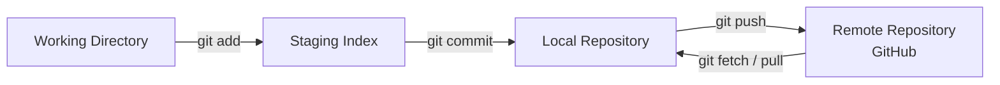
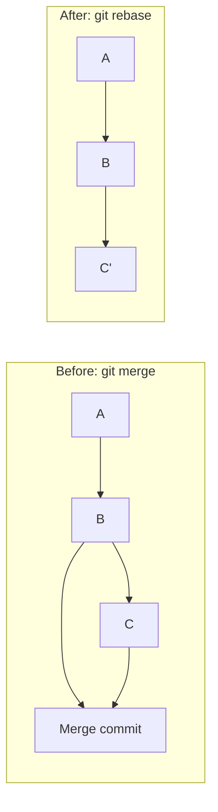

# 04 · Git & GitHub

?> **TL;DR**
?> **Git** is a distributed version control system created by Linus Torvalds in 2005. **GitHub** is a hosted Git service owned by Microsoft. Together they are how >90% of the world's software is built. Learn the mental model — don't just memorize commands.

## The Mental Model

Git doesn't really store "versions" of files. It stores **snapshots of your project tree**, each identified by a SHA-1 hash. Branches and tags are just pointers to snapshots. Once you understand this, every Git command becomes obvious.



[](https://youtu.be/hwP7WQkmECE "Git in 100 Seconds")

## Install + Configure

```bash
# macOS
brew install git

# Ubuntu / Debian
sudo apt install git

# Windows
winget install -e --id Git.Git
```

One-time global setup:

```bash
git config --global user.name  "Your Name"
git config --global user.email "you@example.com"
git config --global init.defaultBranch main
git config --global pull.rebase true          # fewer merge commits
git config --global core.editor "code --wait" # use VS Code for commit msgs
```

## Your First Repo — The 5 Daily Commands

```bash
mkdir my-project && cd my-project
git init                           # 1. create a repo

echo "# my-project" > README.md
git status                         # shows README.md as untracked

git add README.md                  # 2. stage
git commit -m "init: add README"   # 3. commit

# Later...
git log --oneline                  # see history
git diff                           # see unstaged changes
git diff --staged                  # see staged changes
```

These five commands (`status`, `add`, `commit`, `log`, `diff`) are 80% of what you do every day.

## Branching — Lightweight and Cheap

A branch is just a pointer to a commit. Creating one is instant.

```bash
git branch feature/login           # create (doesn't switch)
git switch feature/login           # switch to it
# or combined:
git switch -c feature/login

# work, commit, work, commit
git switch main
git merge feature/login            # or: git rebase feature/login
git branch -d feature/login        # delete
```

?> **`git switch` vs `git checkout`**
?> The old `git checkout` does two unrelated things: switches branches AND restores files. In 2019 Git split this into `git switch` (branches) and `git restore` (files). Use them.

## Remotes — Connecting Local ↔ GitHub

After creating a repo on GitHub:

```bash
git remote add origin https://github.com/you/my-project.git
git branch -M main
git push -u origin main            # -u sets upstream so future `git push` is enough
```

The three commands you'll run 1000 times:

```bash
git pull            # fetch + merge from remote
git push            # push local commits to remote
git fetch           # fetch without merging (safer)
```

## The Staging Index — Why It Matters

Unlike other VCS, Git has a *staging index* (aka "the index") between your working directory and the commit. This lets you commit only part of your changes:

```bash
# You edited 3 files. Stage only 2 of them:
git add src/auth.py src/models.py
git status                         # the third file is still unstaged
git commit -m "feat(auth): add JWT validation"
```

Even better: stage **parts of a file**:

```bash
git add -p app.py                  # interactively stage hunks
```

## Undoing Things

| Situation | Command |
|-----------|---------|
| Discard unstaged changes to a file | `git restore <file>` |
| Unstage a file | `git restore --staged <file>` |
| Rewrite the last commit message | `git commit --amend` |
| Add more changes to the last commit | `git add . && git commit --amend --no-edit` |
| Undo last commit, keep changes unstaged | `git reset HEAD~1` |
| Undo last commit, throw away changes | `git reset --hard HEAD~1` ⚠️ |
| Create a new commit that undoes another | `git revert <sha>` |

!> **`reset --hard` is destructive**
!> `git reset --hard` throws away uncommitted work. If you accidentally nuke something, check `git reflog` — Git keeps a hidden log of every HEAD move for 90 days.

## Rebasing — Rewriting History

Rebasing is the art of moving a branch onto a new base commit. It creates a linear, clean history.



```bash
git switch feature-x
git rebase main                    # replay my commits on top of main
# resolve conflicts if any
git add . && git rebase --continue
```

**Interactive rebase** lets you squash, reorder, or rewrite commits:

```bash
git rebase -i HEAD~5               # edit the last 5 commits
```

Opens an editor with commands: `pick`, `reword`, `squash`, `fixup`, `drop`, etc.

!> **Never rebase public branches**
!> Only rebase commits that exist **only on your machine**. Rebasing commits that others have pulled creates painful conflicts for everyone.

## Stash — Temporary Shelf

You're in the middle of a feature and need to switch to `main` to fix an urgent bug:

```bash
git stash                          # shelve working changes
git switch main
# fix the bug, commit, push
git switch feature-x
git stash pop                      # bring changes back
```

```bash
git stash list                     # see all stashes
git stash show -p stash@{1}        # show diff of one stash
git stash drop stash@{0}           # delete one
```

## Bisect — Find the Bug Commit Automatically

"Something used to work, now it doesn't. Find the commit that broke it."

```bash
git bisect start
git bisect bad                     # current commit is bad
git bisect good v1.2.0             # but v1.2.0 was good
# Git checks out a commit halfway between
# You test it, then:
git bisect bad   # or: git bisect good
# Repeat until Git names the culprit
git bisect reset                   # go back to normal
```

With a test script, bisect can run fully automatically:

```bash
git bisect run ./run-tests.sh
```

## Hooks — Automate on Git Events

Hooks are shell scripts in `.git/hooks/` that run on Git events. Use them for pre-commit linting, commit-msg validation, pre-push tests.

Modern way: use **pre-commit** (Python tool):

```bash
uv tool install pre-commit
```

```yaml title=".pre-commit-config.yaml"
repos:
  - repo: https://github.com/astral-sh/ruff-pre-commit
    rev: v0.11.0
    hooks:
      - id: ruff
      - id: ruff-format
  - repo: https://github.com/pre-commit/pre-commit-hooks
    rev: v5.0.0
    hooks:
      - id: trailing-whitespace
      - id: end-of-file-fixer
      - id: check-yaml
      - id: check-added-large-files
```

```bash
pre-commit install        # installs git hooks
git commit                # hooks now run automatically
```

## `.gitignore` — What Not to Commit

```gitignore title=".gitignore"
# Python
__pycache__/
*.py[cod]
.venv/
.pytest_cache/
.ruff_cache/
dist/
*.egg-info/

# Env
.env
.env.local

# OS
.DS_Store
Thumbs.db

# Editors
.vscode/settings.json
.idea/

# Data
data/raw/
*.sqlite
```

?> **Use the community-maintained templates**
?> [github/gitignore](https://github.com/github/gitignore) has excellent starter `.gitignore` files for every language. Also `gitignore.io` generates combined templates.

## GitHub — The Hosted Side

A GitHub repo has five main surfaces:

| Surface | What it's for |
|---------|---------------|
| **Code** | Browse, edit, blame files |
| **Issues** | Bug reports, feature requests, discussions |
| **Pull Requests** | Proposed changes with review |
| **Actions** | CI/CD workflows (covered in Week 7) |
| **Projects** | Kanban / task boards linked to issues |

## The Pull Request Workflow

```bash
# 1. Fork or clone
git clone https://github.com/org/repo.git
cd repo

# 2. Branch
git switch -c fix/typo-in-readme

# 3. Change + commit
# edit README.md
git add README.md
git commit -m "docs: fix typo in README"

# 4. Push
git push -u origin fix/typo-in-readme

# 5. Open PR via the GitHub UI, or:
gh pr create --web
```

A good PR:

- Has a clear title (`feat(auth): add JWT middleware`, `fix: handle empty payload`).
- Has a description explaining **why** (not just what).
- Is as small as possible (< 400 lines changed is the sweet spot).
- Links to an issue (`Closes #42`).
- Passes CI.

## GitHub CLI — `gh`

```bash
# Install
brew install gh
# or: sudo apt install gh
# or: winget install GitHub.cli

gh auth login
```

Common commands:

```bash
gh repo create my-new-project --public --clone
gh issue create --title "Bug in login" --body "..."
gh issue list
gh pr create                       # interactive
gh pr checkout 42                  # check out a PR locally
gh pr view --web                   # open in browser
gh run list                        # list workflow runs
gh run view --log                  # view a specific run
```

## Branch Protection — A Professional Default

On GitHub: **Settings → Branches → Add rule for `main`**. Enable:

- ✅ Require a pull request before merging
- ✅ Require 1+ approving reviews
- ✅ Require status checks (CI) to pass
- ✅ Require conversation resolution
- ✅ Require linear history (no merge commits)
- ✅ Do not allow bypassing (even for admins)

This turns `main` from a free-for-all into a reviewed, tested, linear branch.

## Commit Messages — Conventional Commits

Adopt a convention so your history is searchable and tooling-friendly:

```
<type>(<scope>): <subject>

<body>

<footer>
```

Types: `feat`, `fix`, `docs`, `style`, `refactor`, `test`, `chore`, `ci`, `build`, `perf`.

```
feat(auth): add OAuth2 refresh-token flow

- Refresh endpoint returns new pair (access+refresh)
- Rotates refresh token on each use
- Clients should hit /refresh on 401

Closes #127
```

## 5-Minute Exercise

1. Create a new repo on GitHub via `gh repo create --public --clone`.
2. Make two commits on `main`.
3. Create a branch `feature/change`, make a commit, push.
4. Open a PR with `gh pr create`.
5. Merge it with `gh pr merge --squash`.
6. Locally: `git switch main && git pull` to sync.
7. `git log --all --oneline --graph --decorate` — admire your first tree.

## Further Reading

- [Pro Git book](https://git-scm.com/book) — free, comprehensive
- [Learn Git Branching](https://learngitbranching.js.org/) — interactive browser tutorial
- [Oh Shit, Git!?!](https://ohshitgit.com/) — how to recover from mistakes
- [Conventional Commits](https://www.conventionalcommits.org/)
- [GitHub CLI manual](https://cli.github.com/manual/)

---

## 💬 Ask the AI Assistant

Have questions about this guide? Ask our virtual Teaching Assistant below!

<ai-widget prompt="Explain key concepts or solve questions related to the guide above." button="✨ Ask Virtual TA" placeholder="Ask a question about this guide..."></ai-widget>

