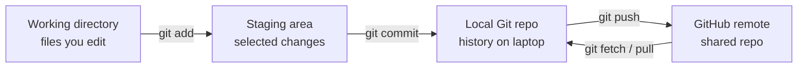
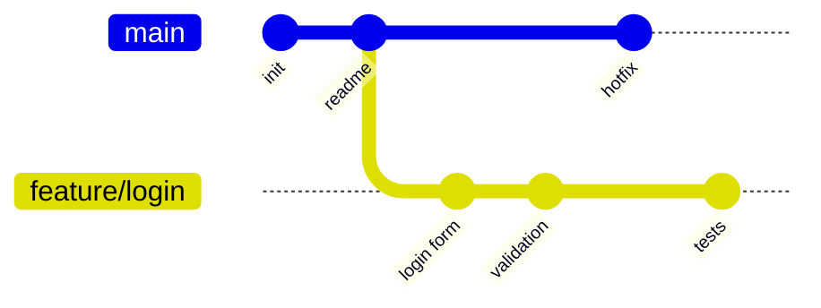
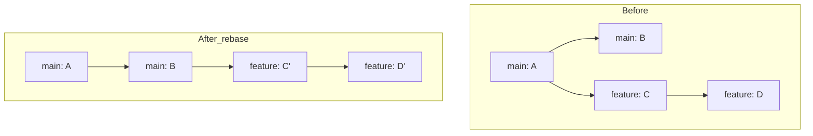
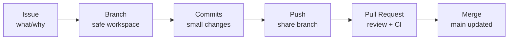

# Practical Git + GitHub Notes

Git is used by developers to **track code changes, work safely in branches, collaborate through GitHub, review changes through PRs, and recover from mistakes**. Think of Git as your local project history machine, and GitHub as the hosted collaboration platform.



Git stores snapshots of your project, not just file versions. Branches are lightweight pointers to commits, which is why branching is fast and cheap.

Start once on your laptop:

```bash
# Ubuntu / Debian
sudo apt update
sudo apt install git

# macOS
brew install git

# Windows
winget install -e --id Git.Git

# Check installation
git --version

# One-time identity setup
git config --global user.name "Your Name"
git config --global user.email "your-email@example.com"

# Good modern defaults
git config --global init.defaultBranch main
git config --global pull.rebase true
git config --global core.editor "code --wait"

# See all global settings
git config --global --list
```

The daily Git loop is small: **status → diff → add → commit → log**.

```bash
# Create a new project repo
mkdir my-project
cd my-project
git init

# Create first file
echo "# my-project" > README.md

# See what changed
git status

# See exact file changes
git diff

# Stage selected file
git add README.md

# Save staged change into history
git commit -m "docs: add README"

# See short history
git log --oneline
```

The staging area is important because you do **not** have to commit everything you edited. You can make clean, small commits.

```bash
# Suppose you edited 3 files but want only 2 in this commit
git add src/app.py tests/test_app.py
git commit -m "feat(app): add greeting endpoint"

# Stage only parts of a file
git add -p app.py

# See staged changes before committing
git diff --staged
```

Good commits are small and explain intent. Use Conventional Commits: `type(scope): subject`. Common types: `feat`, `fix`, `docs`, `test`, `refactor`, `chore`, `ci`.

```bash
git commit -m "feat(api): add user search"
git commit -m "fix(auth): reject expired tokens"
git commit -m "docs(readme): add setup steps"
git commit -m "test(api): cover empty response"
git commit -m "chore(deps): update lockfile"
```

Branches let you work without damaging `main`.



```bash
# Create and switch to a branch
git switch -c feature/login

# Work normally
echo "login work" > login.txt
git add login.txt
git commit -m "feat(login): add login draft"

# Go back to main
git switch main

# Merge branch into main
git merge feature/login

# Delete local branch after merge
git branch -d feature/login
```

Use `git switch` for branches and `git restore` for files. Older tutorials use `git checkout`, but modern Git split branch switching and file restoring into clearer commands.

Connect local Git to GitHub:

```bash
# Add GitHub repo as remote
git remote add origin https://github.com/USERNAME/my-project.git

# Rename current branch to main
git branch -M main

# Push first time and set upstream
git push -u origin main

# After upstream is set
git push
git pull
```

Use `fetch` when you want to inspect remote changes before merging.

```bash
# Download remote updates but do not merge
git fetch origin

# See difference between local main and remote main
git log --oneline main..origin/main

# Then merge/rebase when ready
git pull
```

Safe undo commands matter more than advanced commands.

```bash
# Discard unstaged changes in one file
git restore app.py

# Unstage a file but keep changes
git restore --staged app.py

# Fix last commit message
git commit --amend -m "docs: improve README setup"

# Add forgotten file to previous commit
git add missing_file.py
git commit --amend --no-edit

# Undo last commit but keep changes
git reset HEAD~1

# Create a new commit that reverses an old commit
git revert <commit-sha>

# Dangerous: deletes uncommitted work
git reset --hard HEAD~1

# Recovery history if you moved HEAD accidentally
git reflog
```

Safe habit: **prefer `git revert` on shared branches**. Use `reset` only when you understand whether the commits are private or already pushed.

Rebase means “replay my branch commits on top of a newer base.” It keeps history linear, but it rewrites commits, so do not rebase commits that teammates already pulled.



```bash
# Update feature branch with latest main
git switch feature/login
git fetch origin
git rebase origin/main

# If conflict happens, edit files, then:
git add .
git rebase --continue

# Abort rebase if confused
git rebase --abort

# Clean up last 3 local commits
git rebase -i HEAD~3
```

Stash is a temporary shelf when your work is unfinished but you need to switch context.

```bash
# Save unfinished work
git stash push -m "half done login UI"

# Move elsewhere
git switch main

# Return and restore work
git switch feature/login
git stash pop

# Inspect stashes
git stash list
git stash show -p stash@{0}

# Delete stash
git stash drop stash@{0}
```

Bisect finds which commit introduced a bug.

```bash
# Start binary search
git bisect start

# Current version is broken
git bisect bad

# This older version was good
git bisect good v1.0.0

# Git checks out a middle commit
# Run your test manually, then mark result
git bisect good
git bisect bad

# End bisect and return to normal branch
git bisect reset
```

Automatic bisect is powerful when you have a test script:

```bash
# Script must exit 0 when good, non-zero when bad
git bisect start
git bisect bad
git bisect good v1.0.0
git bisect run ./run-tests.sh
git bisect reset
```

Use `.gitignore` to avoid committing generated files, secrets, virtual environments, caches, local data, and OS junk.

```gitignore
# Python cache and virtual environment
__pycache__/
*.py[cod]
.venv/
.pytest_cache/
.ruff_cache/

# Build outputs
dist/
build/
*.egg-info/

# Secrets and local env
.env
.env.local

# OS/editor files
.DS_Store
Thumbs.db
.vscode/settings.json
.idea/

# Local data
data/raw/
*.sqlite
```

Never commit secrets. If you accidentally commit `.env`, remove it from history carefully and rotate the key. Simply deleting it in a later commit is not enough because Git history still contains the old secret.

Hooks automate checks on Git events. A common future-ready habit is to run formatting/linting before every commit.

```bash
# Install pre-commit as a user tool
uv tool install pre-commit

# Create config file
cat > .pre-commit-config.yaml <<'EOF'
repos:
  - repo: https://github.com/pre-commit/pre-commit-hooks
    rev: v5.0.0
    hooks:
      - id: trailing-whitespace
      - id: end-of-file-fixer
      - id: check-yaml
      - id: check-added-large-files
EOF

# Install Git hook
pre-commit install

# Run on all files once
pre-commit run --all-files
```

GitHub adds collaboration: code browsing, issues, pull requests, actions, and projects. Its main surfaces are: **Code, Issues, Pull Requests, Actions, and Projects**.



Pull Request workflow:

```bash
# Clone repo
git clone https://github.com/org/repo.git
cd repo

# Create branch
git switch -c fix/readme-typo

# Edit file, then commit
git add README.md
git commit -m "docs: fix README typo"

# Push branch
git push -u origin fix/readme-typo

# Open PR in browser using GitHub CLI
gh pr create --web
```

A good PR is small, has a clear title, explains why the change is needed, links issues like `Closes #42`, and passes checks.

Install and use GitHub CLI:

```bash
# Ubuntu
sudo apt install gh

# macOS
brew install gh

# Windows
winget install GitHub.cli

# Login
gh auth login

# Create repo
gh repo create my-demo --public --clone

# Create issue
gh issue create --title "Add README setup" --body "Document local setup"

# Create PR
gh pr create

# Checkout PR locally
gh pr checkout 42

# View PR in browser
gh pr view --web

# See workflow runs
gh run list
```

Branch protection is a professional default. For `main`, set rules to: require PR reviews, require passing CI checks, and block force pushes.

For `main`, use this mindset:

```text
main = production-quality branch
feature/* = work branches
PR = review gate
CI = automated testing gate
merge = only after review + checks
```

GitHub Actions CI runs automatically on push or pull request. Here's a minimal example:

```yaml
# .github/workflows/ci.yml
name: CI

on:
  push:
  pull_request:

jobs:
  test:
    runs-on: ubuntu-latest

    steps:
      # Checkout repo code
      - uses: actions/checkout@v4

      # Install Python
      - uses: actions/setup-python@v5
        with:
          python-version: "3.12"

      # Run a simple check
      - run: python --version
```

Future-ready habits:

```bash
# Show beautiful commit graph
git log --all --oneline --graph --decorate

# See who changed each line
git blame app.py

# Create a version tag
git tag v1.0.0
git push origin v1.0.0

# List remotes
git remote -v

# Rename current branch
git branch -m new-branch-name

# Delete remote branch
git push origin --delete old-branch-name

# See ignored files
git status --ignored
```

Avoid these beginner mistakes:

```bash
# Mistake: committing everything blindly
git add .

# Better: inspect first
git status
git diff
git add -p

# Mistake: pulling without knowing remote changes
git pull

# Safer when unsure
git fetch
git log --oneline HEAD..origin/main

# Mistake: force pushing shared branch
git push --force

# Safer if you must update your own remote branch after rebase
git push --force-with-lease

# Mistake: committing secrets
git add .env

# Better: ignore secrets
echo ".env" >> .gitignore
```

## One complete practical example

This combines local Git, GitHub, branch, commit, `.gitignore`, PR, `gh`, stash, rebase, and cleanup.

```bash
# Create GitHub repo and clone it
gh repo create git-practice-notes --public --clone
cd git-practice-notes

# Add useful files
cat > README.md <<'EOF'
# Git Practice Notes

Small project to practice Git and GitHub workflow.
EOF

cat > .gitignore <<'EOF'
# Python
__pycache__/
.venv/
.pytest_cache/

# Secrets
.env

# OS/editor
.DS_Store
.vscode/settings.json
EOF

# First commit on main
git status
git add README.md .gitignore
git commit -m "docs: add initial project notes"
git push

# Create feature branch
git switch -c feat/add-script

# Add small script
cat > hello.py <<'EOF'
name = input("Name: ")
print(f"Hello, {name}!")
EOF

# Check changes and commit
git diff
git add hello.py
git commit -m "feat(cli): add greeting script"

# Make unfinished change
echo "# TODO: add validation" >> hello.py

# Need to switch urgently, so stash
git stash push -m "wip: validation idea"

# Update main
git switch main
git pull

# Return to feature branch
git switch feat/add-script
git rebase main

# Restore unfinished work
git stash pop

# Decide to commit TODO too
git add hello.py
git commit -m "docs(cli): add validation todo"

# Push branch and open PR
git push -u origin feat/add-script
gh pr create --title "feat(cli): add greeting script" --body "Adds a small Python script for Git practice."

# After PR merge on GitHub, sync local main
git switch main
git pull

# Delete local feature branch
git branch -d feat/add-script

# See final history
git log --all --oneline --graph --decorate
```

## Important Q&A

**Q: Should I use `git pull` or `git fetch`?**
A: `git fetch` safely downloads remote changes so you can inspect them without altering your local files. `git pull` does a `fetch` and then immediately tries to `merge` those changes into your current branch. When in doubt or to avoid unexpected merge conflicts, use `git fetch` first.

**Q: Why shouldn't I use `git rebase` on `main`?**
A: Rebasing rewrites Git history. If you rebase commits that other people have already pulled, their local histories will diverge from the remote, causing massive headaches. Only rebase your own private feature branches before merging them.

**Q: What do I do if I accidentally committed a `.env` file with a secret?**
A: Do not just delete the file in a new commit. The secret will remain in the Git history. You must rewrite the Git history (e.g., using `git filter-repo` or `BFG Repo-Cleaner`) to completely remove the file, and more importantly, immediately revoke and rotate the leaked secret.

---

## Video Resources

Watch these introductory videos to learn the basics of Git and GitHub (98 min):

[](https://youtu.be/HVsySz-h9r4)

[](https://youtu.be/RGOj5yH7evk)

---

## Final revision checklist

```text
[ ] I know working directory → staging area → local repo → remote repo.
[ ] I can use status, diff, add, commit, log every day.
[ ] I can create and switch branches with git switch -c.
[ ] I can connect local repo to GitHub with remote + push -u.
[ ] I understand fetch vs pull.
[ ] I can unstage with git restore --staged.
[ ] I can discard file changes with git restore.
[ ] I avoid reset --hard unless I truly want to delete work.
[ ] I use revert for undoing shared commits.
[ ] I know rebase rewrites history and should not be used carelessly on public commits.
[ ] I can stash unfinished work.
[ ] I can use bisect when a bug appeared somewhere in history.
[ ] I keep .env, .venv, caches, data, and build files out of Git.
[ ] I write clear commits like feat:, fix:, docs:, test:, chore:.
[ ] I use PRs for review instead of pushing directly to main.
[ ] I understand branch protection: PR review + CI before merge.
[ ] I can use gh for repo, issue, PR, and workflow commands.
```
