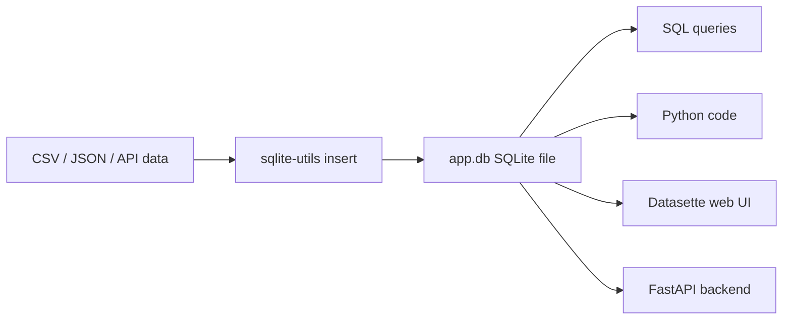

# SQLite — Practical Notes

SQLite = **one database inside one file**. No server to install, no process to manage — just a `.db` file you can copy, query, and share.

```text
CSV / JSON          SQLite .db file              PostgreSQL
simple files   →    real queryable DB      →     big server DB
weak search         local + portable             multi-user production
```

Use SQLite when you want:

```text
scraping data
course projects
local APIs
small dashboards
RAG metadata
logs / cache
searchable notes
quick demos
```

Avoid SQLite when many machines/users must write to the same DB at the same time. Then use PostgreSQL.

---

## 1. Setup

```bash
sudo apt install sqlite3          # Linux
brew install sqlite               # macOS

uv tool install sqlite-utils
uv tool install datasette

sqlite3 --version
sqlite-utils --version
datasette --version
```

Uninstall:

```bash
uv tool uninstall sqlite-utils
uv tool uninstall datasette
```

---

## 2. The SQLite workflow



Example:

```bash
sqlite-utils insert app.db users users.csv --csv
sqlite-utils tables app.db --counts
sqlite-utils schema app.db
sqlite-utils app.db "select * from users limit 5"
```

This means:

```text
app.db     = database file
users      = table
columns    = fields
rows       = records
```

---

## 3. Core SQL you must know

Create table:

```sql
CREATE TABLE tasks (
  id INTEGER PRIMARY KEY,
  title TEXT NOT NULL,
  done INTEGER DEFAULT 0,
  due_date TEXT,
  created_at TEXT DEFAULT (datetime('now'))
);
```

Insert:

```sql
INSERT INTO tasks (title, due_date)
VALUES ('Read SQLite notes', '2026-06-15');
```

Read:

```sql
SELECT * FROM tasks;
```

Filter:

```sql
SELECT * FROM tasks
WHERE done = 0;
```

Sort:

```sql
SELECT * FROM tasks
ORDER BY due_date;
```

Update:

```sql
UPDATE tasks
SET done = 1
WHERE id = 1;
```

Delete:

```sql
DELETE FROM tasks
WHERE id = 1;
```

Group:

```sql
SELECT due_date, COUNT(*) AS total
FROM tasks
GROUP BY due_date
ORDER BY due_date;
```

Remember:

```text
SELECT  → read
WHERE   → filter
ORDER BY → sort
GROUP BY → summarize
JOIN    → connect tables
```

---

## 4. Table design mental model

Bad table:

```text
orders(id, user_name, user_email, product_name, price)
```

Better:

```text
users
 ├─ id
 ├─ name
 └─ email

products
 ├─ id
 ├─ name
 └─ price

orders
 ├─ id
 ├─ user_id     → users.id
 ├─ product_id  → products.id
 └─ ordered_at
```

SQL version:

```sql
CREATE TABLE users (
  id INTEGER PRIMARY KEY,
  name TEXT NOT NULL,
  email TEXT UNIQUE NOT NULL
);

CREATE TABLE products (
  id INTEGER PRIMARY KEY,
  name TEXT NOT NULL,
  price REAL NOT NULL
);

CREATE TABLE orders (
  id INTEGER PRIMARY KEY,
  user_id INTEGER NOT NULL,
  product_id INTEGER NOT NULL,
  ordered_at TEXT NOT NULL,
  FOREIGN KEY (user_id) REFERENCES users(id),
  FOREIGN KEY (product_id) REFERENCES products(id)
);
```

Always enable foreign keys:

```sql
PRAGMA foreign_keys = ON;
```

Simple rule:

```text
One real-world thing  → one table
Repeated data         → separate table
Connection            → foreign key
```

---

## 5. Joins are very important

Tables become useful when connected.

```sql
SELECT
  orders.id,
  users.name,
  products.name AS product,
  products.price,
  orders.ordered_at
FROM orders
JOIN users ON users.id = orders.user_id
JOIN products ON products.id = orders.product_id;
```

Visual:

```text
orders.user_id     ─────→ users.id
orders.product_id  ─────→ products.id
```

Use:

```text
JOIN       → matching rows only
LEFT JOIN  → keep left table rows even if match missing
```

---

## 6. Python + SQLite

Python already has SQLite.

```python
import sqlite3

con = sqlite3.connect("app.db")
con.row_factory = sqlite3.Row

con.execute("PRAGMA journal_mode = WAL")
con.execute("PRAGMA foreign_keys = ON")

rows = con.execute(
    "SELECT * FROM tasks WHERE done = ?",
    (0,)
)

for row in rows:
    print(row["title"])

con.close()
```

Most important rule: **never use f-string SQL**.

Bad:

```python
con.execute(f"SELECT * FROM users WHERE name = '{name}'")
```

Good:

```python
con.execute("SELECT * FROM users WHERE name = ?", (name,))
```

Why? It protects against SQL injection.

---

## 7. WAL mode: practical default

Use these for app-style work:

```sql
PRAGMA journal_mode = WAL;
PRAGMA synchronous = NORMAL;
PRAGMA foreign_keys = ON;
```

Meaning:

```text
WAL = Write-Ahead Log

Better for:
- local apps
- readers + writers
- safer database writes
```

When WAL is active, you may see:

```text
app.db
app.db-wal
app.db-shm
```

Keep these together while the DB is active.

---

## 8. Transactions: fast and safe inserts

Bad style:

```python
for row in rows:
    con.execute("INSERT INTO logs VALUES (?, ?)", row)
    con.commit()
```

Better:

```python
with con:
    con.executemany(
        "INSERT INTO logs VALUES (?, ?)",
        rows
    )
```

Transaction idea:

```text
BEGIN
  many inserts / updates
COMMIT
```

Use transactions for:

```text
scraping
bulk import
ETL
logs
dataset building
```

---

## 9. Indexes: make queries fast

If you often filter by a column, index it.

```sql
CREATE INDEX idx_tasks_due_date
ON tasks(due_date);
```

Use indexes on columns used in:

```text
WHERE
JOIN
ORDER BY
GROUP BY
```

Check query plan:

```sql
EXPLAIN QUERY PLAN
SELECT * FROM tasks
WHERE due_date > '2026-06-01';
```

Mental model:

```text
Without index → SQLite scans many rows
With index    → SQLite jumps directly to useful rows
```

---

## 10. Full-text search with FTS5

Normal search:

```sql
SELECT * FROM notes
WHERE body LIKE '%sqlite%';
```

Better search:

```bash
sqlite-utils enable-fts notes.db notes title body --create-triggers
sqlite-utils search notes.db notes "database"
```

FTS5 gives:

```text
word search      database
phrase search    "full text search"
prefix search    data*
ranked results   best match first
```

Use FTS5 for:

```text
searchable notes
document search
logs search
RAG keyword search
course material search
support chatbot search
```

RAG mental model:

```text
SQLite FTS5      → keyword search
Vector database  → semantic search
SQL filters      → metadata filtering
```

---

## 11. JSON in SQLite

Sometimes data is flexible:

```json
{"user":"alice","score":10,"tags":["sql","tds"]}
```

Store JSON:

```sql
CREATE TABLE events (
  id INTEGER PRIMARY KEY,
  ts TEXT,
  payload TEXT CHECK (json_valid(payload))
);
```

Query JSON:

```sql
SELECT
  payload ->> 'user' AS user,
  payload ->> 'score' AS score
FROM events;
```

Use JSON columns for:

```text
API response
scraped raw data
LLM output
metadata
event logs
```

But important fields should become real columns.

```text
Search/filter often?  → make it a column
Store extra details?  → JSON is fine
```

---

## 12. Datasette: instant database web app

```bash
datasette serve app.db
```

Then open:

```text
http://localhost:8001
```

Datasette gives:

```text
table browser
SQL editor
filters
CSV export
JSON API
quick demo UI
```

Project flow:

```text
scrape/API/CSV
    ↓
SQLite
    ↓
Datasette
    ↓
shareable mini data app
```

---

## 13. Useful command sheet

```bash
# Import CSV
sqlite-utils insert app.db users users.csv --csv

# Import JSON
sqlite-utils insert app.db events events.json

# See tables
sqlite-utils tables app.db --counts

# See schema
sqlite-utils schema app.db

# Query
sqlite-utils app.db "select * from users limit 5"

# Add index
sqlite-utils create-index app.db users email

# Enable search
sqlite-utils enable-fts app.db notes title body --create-triggers

# Search
sqlite-utils search app.db notes "sqlite"

# Serve
datasette serve app.db

# Open SQLite shell
sqlite3 app.db
```

SQLite shell basics:

```sql
.tables
.schema
.headers on
.mode table
SELECT * FROM users LIMIT 5;
.quit
```

---

## 14. Mini practical script: build searchable notes DB

Create `notes.csv`:

```csv
title,body,week
SQLite Basics,SQLite is a single-file database,1
FTS5 Search,FTS5 enables full-text search,1
Datasette,Datasette serves SQLite as a web UI,1
```

Run:

```bash
sqlite-utils insert notes.db notes notes.csv --csv
sqlite-utils tables notes.db --counts
sqlite-utils schema notes.db

sqlite-utils enable-fts notes.db notes title body --create-triggers
sqlite-utils search notes.db notes "single-file database"

datasette serve notes.db
```

This one mini project teaches:

```text
CSV import
SQL database
schema inspection
full-text search
web publishing
```

---

## 15. SQLite in future projects

Use SQLite like this:

```text
Data analysis:
CSV → SQLite → SQL queries → charts/reports

Scraping:
Website/API → SQLite → clean data → export

Backend:
FastAPI/Flask → SQLite → local app database

RAG:
documents → chunks table → FTS5 search → metadata filter

Dashboard:
SQLite → Datasette → quick web UI

Testing:
SQLite → simple local DB before PostgreSQL
```

---

## 16. Common mistakes

```text
❌ No primary key
✅ Use id INTEGER PRIMARY KEY

❌ Dates like 15/06/26
✅ Use 2026-06-15

❌ SQL with f-strings
✅ Use ? parameters

❌ No index on filter columns
✅ Index WHERE/JOIN columns

❌ One huge messy table
✅ Separate repeated entities

❌ PostgreSQL too early
✅ Start with SQLite for local projects

❌ SQLite for heavy multi-user writes
✅ Move to PostgreSQL
```

---

## Important Q&A

**Q: Why shouldn't I use f-strings for SQL queries in Python?**
A: Using f-strings or string concatenation for SQL queries makes your code vulnerable to SQL Injection attacks. A malicious user could input something like `'; DROP TABLE users; --` which would be executed directly. Always use parameterized queries (with `?`) instead.

**Q: When should I use SQLite instead of PostgreSQL?**
A: Use SQLite for local development, desktop apps, mobile apps, smaller websites, logs, testing, and anywhere where you don't have high concurrency writes from multiple servers. Switch to PostgreSQL when your application scales up and requires a dedicated database server with many concurrent users modifying data.

**Q: What is WAL mode and why should I enable it?**
A: WAL (Write-Ahead Log) mode improves performance and concurrency by allowing readers to continue reading from the database even while another process is writing to it.

## Final revision checklist

```text
[ ] I can use `sqlite-utils` to import CSV or JSON data into a local DB.
[ ] I know the basic SQL commands: `SELECT`, `INSERT`, `UPDATE`, `DELETE`, `JOIN`.
[ ] I understand why parameterized queries (using `?`) are essential for security.
[ ] I know how to create tables with a primary key and foreign keys.
[ ] I can set `PRAGMA journal_mode = WAL` for better performance.
[ ] I understand when to use SQLite vs a large server database like PostgreSQL.
```

## Final memory map

```text
SQLite = local data engine

sqlite-utils  → import/query/manage DB from terminal
sqlite3       → raw SQLite shell
Python sqlite3 → use DB inside code
FTS5          → full-text search
JSON1         → flexible metadata
Indexes       → speed
Transactions  → safe + fast writes
Datasette     → instant web UI/API
PostgreSQL    → when SQLite becomes too small
```

Best learning order:

```text
1. Import CSV/JSON
2. SELECT, WHERE, ORDER BY, GROUP BY
3. CREATE, INSERT, UPDATE, DELETE
4. Keys and JOINs
5. Python sqlite3
6. Indexes and transactions
7. FTS5 search
8. JSON metadata
9. Datasette publishing
```

**One-line understanding:**
SQLite is not “just a small database.” It is a **portable local data engine** for practical developer work.
