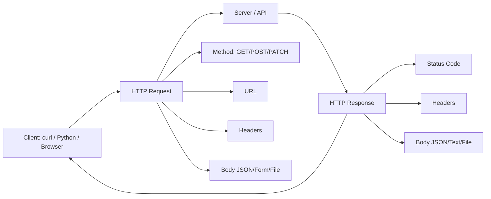
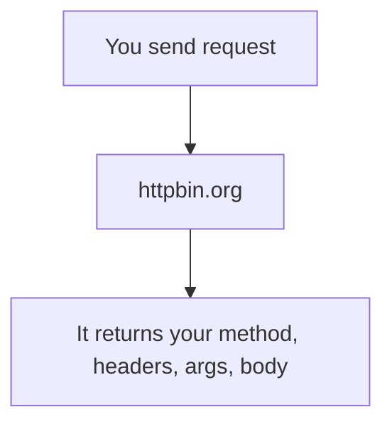
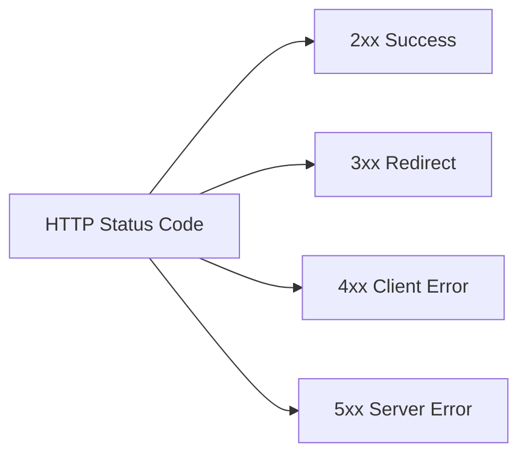
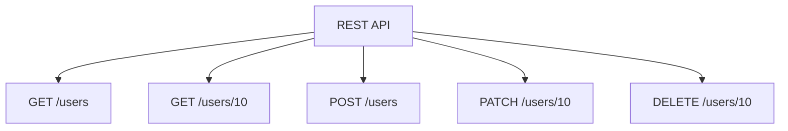
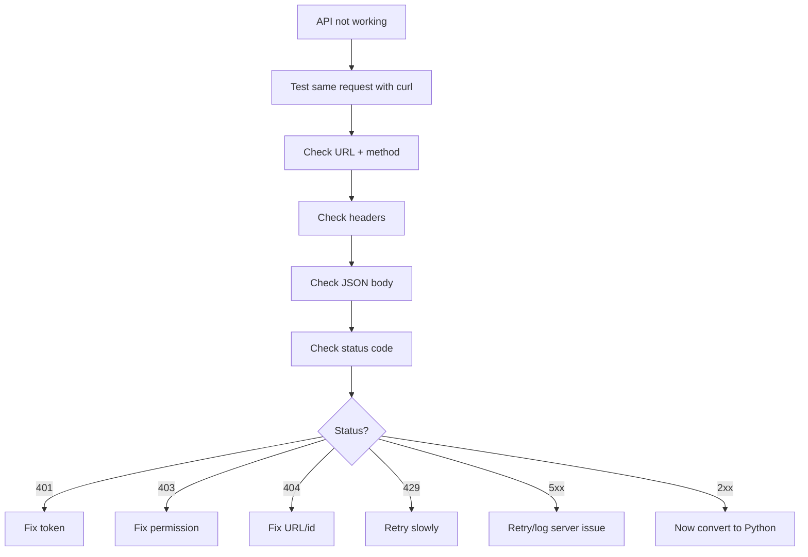
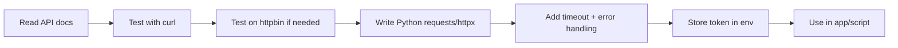

# HTTP Clients — Practical Notes

## 1. Big Picture



HTTP client means: **a tool or library used to talk to APIs**.

Common clients:

| Client                | Best use                         |
| --------------------- | -------------------------------- |
| `curl`                | Test/debug APIs from terminal    |
| Python `requests`     | Simple Python API work           |
| Python `httpx`        | Modern sync + async API work     |
| httpbin               | Safe API testing playground      |
| Postman / REST Client | GUI or project-based API testing |

---

## 2. HTTP Request Structure

```txt
METHOD URL
Headers
Body
```

Example:

```bash
curl -X POST https://httpbin.org/post \
  -H "Content-Type: application/json" \
  -H "Authorization: Bearer $TOKEN" \
  -d '{"name":"Alice","course":"TDS"}'
```

Meaning:

| Part            | Meaning                  |
| --------------- | ------------------------ |
| `POST`          | Send/create data         |
| URL             | API endpoint             |
| `Content-Type`  | Body format is JSON      |
| `Authorization` | Login/API token          |
| `-d`            | Data/body sent to server |

---

## 3. HTTP Methods

| Method   | Meaning             | Example            |
| -------- | ------------------- | ------------------ |
| `GET`    | Read data           | Get user info      |
| `POST`   | Create/send data    | Login, create user |
| `PUT`    | Replace full data   | Replace profile    |
| `PATCH`  | Update partial data | Change only name   |
| `DELETE` | Delete data         | Delete record      |

Simple rule:

```txt
GET = read
POST = create/action
PUT/PATCH = update
DELETE = remove
```

---

## 4. `curl` Essentials

### GET request

```bash
curl https://httpbin.org/get
```

With query parameters:

```bash
curl "https://httpbin.org/get?name=Alice&course=TDS"
```

Better safe version:

```bash
curl -G https://httpbin.org/get \
  --data-urlencode "name=Alice" \
  --data-urlencode "course=TDS"
```

---

### Show headers + body

```bash
curl -i https://httpbin.org/get
```

---

### Debug request deeply

```bash
curl -v https://httpbin.org/get
```

Use `-v` when something is not working.

---

### Send JSON

```bash
curl -X POST https://httpbin.org/post \
  -H "Content-Type: application/json" \
  -d '{"name":"Alice"}'
```

---

### Send token

```bash
export TOKEN="your_token_here"

curl https://httpbin.org/headers \
  -H "Authorization: Bearer $TOKEN"
```

Never hardcode real tokens in files.

---

### Send JSON from file

```bash
curl -X POST https://httpbin.org/post \
  -H "Content-Type: application/json" \
  -d @payload.json
```

---

### Upload file

```bash
curl -X POST https://httpbin.org/post \
  -F "file=@report.pdf" \
  -F "description=My report"
```

---

### Follow redirect

```bash
curl -L https://httpbin.org/redirect/2
```

---

### Important curl flags

| Flag               | Use                           |
| ------------------ | ----------------------------- |
| `-X`               | Set method                    |
| `-H`               | Add header                    |
| `-d`               | Send body data                |
| `-F`               | Upload form/file              |
| `-i`               | Show response headers         |
| `-v`               | Debug details                 |
| `-L`               | Follow redirects              |
| `-u user:pass`     | Basic auth                    |
| `-sS`              | Silent but show errors        |
| `--fail-with-body` | Fail on 4xx/5xx but show body |

Good script-style curl:

```bash
curl -sS --fail-with-body \
  -w "\nStatus: %{http_code}\n" \
  https://httpbin.org/status/404
```

---

## 5. httpbin — API Practice Playground

`httpbin.org` echoes what you send.



Useful endpoints:

| Endpoint                | Use              |
| ----------------------- | ---------------- |
| `/get`                  | Test GET         |
| `/post`                 | Test POST        |
| `/headers`              | See sent headers |
| `/status/404`           | Test status code |
| `/delay/3`              | Test slow API    |
| `/basic-auth/user/pass` | Test basic auth  |
| `/redirect/2`           | Test redirects   |

Practice:

```bash
curl https://httpbin.org/get
curl -X POST https://httpbin.org/post -d '{"x":1}' -H "Content-Type: application/json"
curl -i https://httpbin.org/status/429
curl https://httpbin.org/delay/3
```

---

## 6. HTTP Status Codes



| Code          | Meaning              | What to do            |
| ------------- | -------------------- | --------------------- |
| `200`         | OK                   | Parse response        |
| `201`         | Created              | New resource made     |
| `204`         | No content           | Do not call `.json()` |
| `301/302`     | Redirect             | Use/follow redirect   |
| `400`         | Bad request          | Fix body/params       |
| `401`         | Unauthorized         | Check token/login     |
| `403`         | Forbidden            | Check permission      |
| `404`         | Not found            | Check URL/id          |
| `409`         | Conflict             | Duplicate/state issue |
| `422`         | Validation error     | Check fields          |
| `429`         | Rate limited         | Wait/retry slowly     |
| `500`         | Server error         | Retry/log             |
| `502/503/504` | Gateway/down/timeout | Retry later           |

Golden rule:

```txt
2xx = success
4xx = your request problem
5xx = server problem
429 = slow down
```

---

## 7. Python `requests`

Use for simple Python scripts and normal API work.

Install:

```bash
uv add requests
```

### GET

```python
import requests

r = requests.get(
    "https://httpbin.org/get",
    params={"name": "Alice"},
    timeout=10,
)

r.raise_for_status()
print(r.json())
```

### POST JSON

```python
import requests

r = requests.post(
    "https://httpbin.org/post",
    json={"name": "Alice", "course": "TDS"},
    timeout=10,
)

r.raise_for_status()
print(r.json())
```

### With token

```python
import os
import requests

token = os.environ["TOKEN"]

r = requests.get(
    "https://httpbin.org/headers",
    headers={"Authorization": f"Bearer {token}"},
    timeout=10,
)

print(r.json())
```

### Error handling

```python
import requests

try:
    r = requests.get("https://httpbin.org/status/404", timeout=10)
    r.raise_for_status()
    print(r.json())

except requests.exceptions.Timeout:
    print("Request timed out")

except requests.exceptions.HTTPError as e:
    print("HTTP error:", e)

except requests.exceptions.RequestException as e:
    print("Network error:", e)
```

Practical rules:

```txt
Always use timeout
Use params= for query parameters
Use json= for JSON body
Use raise_for_status() for 4xx/5xx
Use environment variables for tokens
```

---

## 8. Python `httpx`

Use when you want modern API code, especially async.

Install:

```bash
uv add httpx
```

### Sync GET

```python
import httpx

r = httpx.get(
    "https://httpbin.org/get",
    params={"name": "Alice"},
    timeout=10,
)

r.raise_for_status()
print(r.json())
```

### Better: use Client

```python
import httpx

with httpx.Client(
    base_url="https://httpbin.org",
    headers={"Accept": "application/json"},
    timeout=10,
) as client:
    r = client.get("/get", params={"topic": "httpx"})
    r.raise_for_status()
    print(r.json())
```

### Async example

```python
import asyncio
import httpx

async def main():
    async with httpx.AsyncClient(timeout=10) as client:
        r = await client.get("https://httpbin.org/get")
        r.raise_for_status()
        print(r.json())

asyncio.run(main())
```

When to use:

| Library    | Use                                    |
| ---------- | -------------------------------------- |
| `requests` | Simple scripts, beginner-friendly      |
| `httpx`    | Modern apps, async, FastAPI-style work |

---

## 9. REST API

REST usually means: **URLs represent resources, methods represent actions.**



Example:

```txt
GET    /users        # list users
GET    /users/10     # get one user
POST   /users        # create user
PATCH  /users/10     # update user
DELETE /users/10     # delete user
```

REST is best for normal CRUD apps.

---

## 10. GraphQL

GraphQL usually uses one endpoint:

```txt
POST /graphql
```

Client asks exactly what fields it wants.

```graphql
{
  user(id: 10) {
    name
    email
    posts {
      title
    }
  }
}
```

With curl:

```bash
curl -X POST https://api.example.com/graphql \
  -H "Content-Type: application/json" \
  -H "Authorization: Bearer $TOKEN" \
  -d '{"query":"{ viewer { login name } }"}'
```

REST vs GraphQL:

| Topic         | REST           | GraphQL                |
| ------------- | -------------- | ---------------------- |
| Endpoints     | Many           | Usually one            |
| Data shape    | Server decides | Client decides         |
| Easy to learn | Yes            | Medium                 |
| Best for      | CRUD APIs      | Complex nested UI data |

---

## 11. Best Debugging Flow



Use this command when stuck:

```bash
curl -v -i --fail-with-body \
  -H "Content-Type: application/json" \
  -d '{"name":"Alice"}' \
  https://httpbin.org/post
```

---

## 12. Professional Habit



## Important Q&A

**Q: When should I use `requests` vs `httpx`?**
A: `requests` is the industry standard for simple, synchronous Python scripts and is very beginner-friendly. `httpx` is newer and provides both synchronous and asynchronous capabilities. If you're building a modern async app (e.g., with FastAPI) or need HTTP/2 support, use `httpx`.

**Q: Why do I need to use `raise_for_status()`?**
A: By default, `requests` and `httpx` will not raise an exception if a request fails with a 4xx or 5xx status code; they simply return the error response. Calling `raise_for_status()` explicitly tells Python to throw an error so your code doesn't silently continue failing.

**Q: What is the difference between POST and PUT/PATCH?**
A: POST is used to create a new resource or perform an action. PUT completely replaces an existing resource with the data you send. PATCH updates only the specific fields you send, leaving the rest of the existing resource unchanged.

## Final revision checklist

```text
[ ] I can use `curl` to make GET and POST requests.
[ ] I understand the structure of an HTTP request (Method, URL, Headers, Body).
[ ] I know how to test APIs safely using `httpbin.org`.
[ ] I know what the 2xx, 4xx, and 5xx status codes generally mean.
[ ] I can use Python's `requests` library to fetch JSON data.
[ ] I always use `raise_for_status()` and `timeout` in my Python requests.
[ ] I understand the high-level difference between REST and GraphQL.
```

Final summary:

```txt
curl      = test/debug API
httpbin   = safe practice server
requests  = simple Python API calls
httpx     = modern sync/async Python API calls
status codes = understand result
REST      = resource-based API
GraphQL   = query-based API
```

Most important line:

```txt
First make the API work in curl, then write Python code.
```
