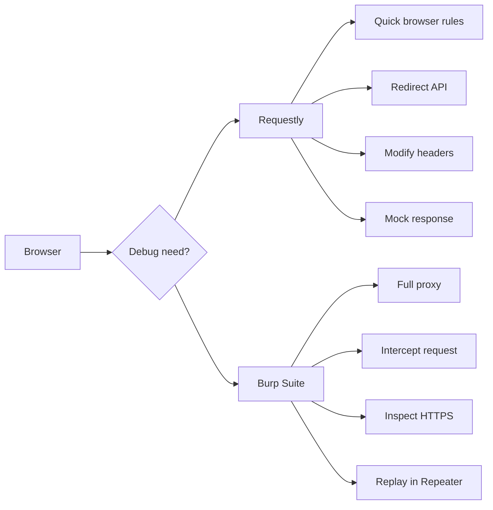
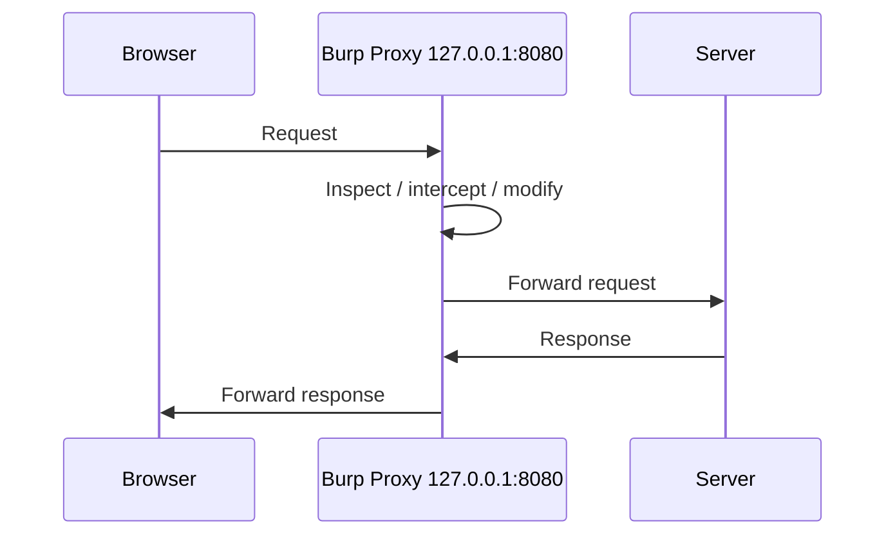
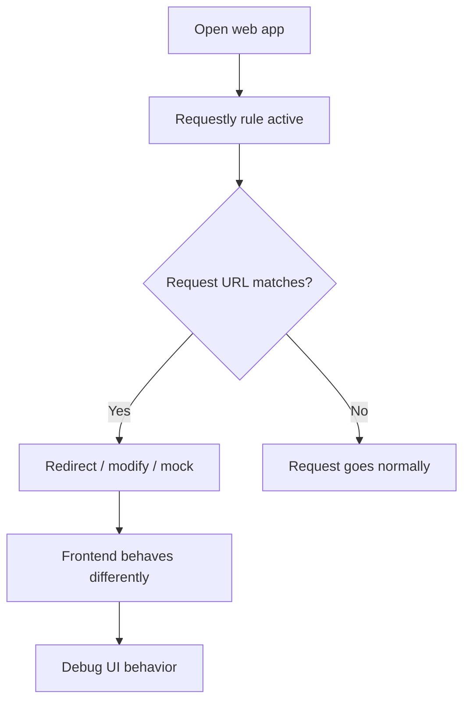
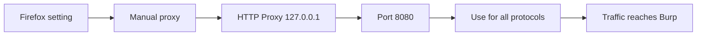
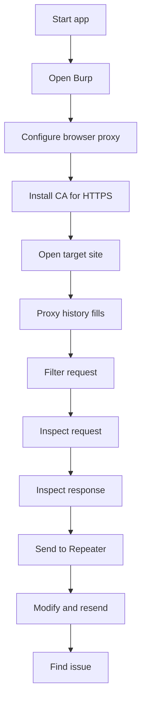
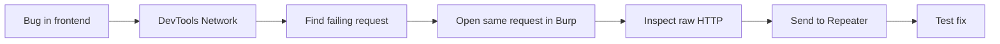

# Requestly + Burp Suite — practical network debugging notes

Use these tools only on **your own apps, local projects, staging systems, or targets where you have permission**. They are powerful because they can inspect and modify HTTP/HTTPS traffic.



## What these tools are used for

**Requestly** is best for quick frontend/QA debugging directly in the browser: redirect URLs, modify headers/query params, mock API responses, and inject scripts/styles. Its browser extension works without setting up a local proxy, and Requestly describes it as useful for frontend debugging and simulating API responses. 

**Burp Suite** is a professional web security and HTTP debugging proxy. It sits between browser and server, captures requests/responses, lets you intercept, edit, replay, and analyze traffic. Burp’s official docs say its proxy listener monitors and intercepts requests and responses, and by default it listens on `127.0.0.1:8080`. 



## DNS vs proxy: understand this first

DNS decides **which IP address a name points to**.

Proxy decides **where browser traffic passes through before going to the server**.

```text
DNS:
api.test.local -> 127.0.0.1

Proxy:
Browser -> Burp at 127.0.0.1:8080 -> real server
```

For local development, you may use both:

```mermaid
flowchart LR
    A[api.test.local] --> B[/etc/hosts]
    B --> C[127.0.0.1]
    C --> D[Local backend :8000]

    E[Firefox] --> F[Proxy 127.0.0.1:8080]
    F --> G[Burp]
    G --> D
```

## Local DNS mapping on Ubuntu

Linux uses `/etc/hosts` to manually map hostnames to IP addresses. The Linux manual describes `/etc/hosts` as a simple text file that associates IP addresses with hostnames. 

```bash
# Open hosts file
sudo nano /etc/hosts
```

Add:

```text
127.0.0.1 api.test.local
127.0.0.1 app.test.local
```

Test:

```bash
# Check name resolution
ping api.test.local

# Start a local app
python -m http.server 8000

# Open this in browser
# http://app.test.local:8000
```

Important: changing DNS/hosts alone does **not** make Burp intercept traffic. You still need browser proxy settings or Burp’s built-in browser.

## Requestly: quick browser debugging

Requestly is useful when you do not need full proxy setup. The official docs say it can modify outgoing requests, mock responses, redirect traffic, and inject scripts/styles. 

Use it when:

```text
Frontend is ready but backend is not ready
API URL should temporarily go to localhost/staging
Need to test 500 error, empty response, slow response
Need to add/remove request/response headers
Need to test CORS/header/cache behavior
```

Typical Requestly rules:

```text
Redirect Rule:
https://api.example.com/users
-> http://localhost:8000/users

Modify Header Rule:
Add request header:
X-Debug-User: student

Modify Response Rule:
Return custom JSON:
{"name": "Test User", "role": "admin"}

Query Param Rule:
Add:
?debug=true

Script Rule:
Inject temporary JS/CSS for frontend testing
```

Example frontend testing flow:



Safe habits:

```text
Keep rules grouped by project
Name rules clearly
Disable rules after testing
Do not store real tokens/passwords in rules
Use mocks only for dev/staging testing
```

## Burp Suite installation and startup

Download Burp Suite Community Edition from PortSwigger. PortSwigger describes Community Edition as a free manual toolkit for learning web security testing, and the official install flow is download, run installer, launch Burp, then start with default project/configuration. 

After opening Burp:

```text
Temporary project
→ Use Burp defaults
→ Start Burp
```

Easiest option:

```text
Burp → Proxy → Intercept → Open Browser
```

Burp’s built-in browser is already configured to use Burp Proxy, so it avoids manual Firefox proxy and certificate setup. PortSwigger recommends this as the simpler option for manual testing. 

## Burp with Firefox: manual setup

Use this when you specifically want external Firefox traffic to pass through Burp.

First check Burp listener:

```text
Burp → Settings → Tools → Proxy → Proxy listeners
```

You should see:

```text
127.0.0.1:8080
Running: checked
```

Burp creates this default listener on the loopback interface and port `8080`. 

Now configure Firefox:

```text
Firefox → Settings
→ General
→ Network Settings
→ Settings
→ Manual proxy configuration
```

Set:

```text
HTTP Proxy: 127.0.0.1
Port: 8080
Use this proxy server for all protocols: checked
No proxy for: empty
```

PortSwigger’s Firefox setup guide gives these exact defaults and says to clear the “No proxy for” field. This matters if you want to intercept localhost/local-domain traffic too. 



## HTTPS interception: install Burp CA certificate

For normal HTTP, proxy setup is enough. For HTTPS, Burp needs a trusted CA certificate so Firefox accepts Burp’s generated per-site certificates.

With Burp running and Firefox already proxied:

```text
Open in Firefox:
http://burpsuite
```

Then:

```text
Click CA Certificate
Download certificate
Firefox → Settings → Privacy & Security
→ Certificates → View Certificates
→ Authorities → Import
→ Select Burp certificate
→ Trust this CA to identify websites
→ Restart Firefox
```

PortSwigger documents this flow for Firefox and also says you can remove the certificate later from Firefox’s Authorities list. 

Security note: PortSwigger warns that installing a trusted root certificate can allow TLS interception if someone gets that certificate’s private key, so only install Burp’s CA on your own trusted testing machine. 

## Step-by-step: debug each browser network call in Burp

Use this flow for your own local or staging app.



Start a local test app:

```bash
mkdir burp-debug-demo
cd burp-debug-demo

cat > index.html <<'HTML'
<!doctype html>
<html>
<body>
  <h1>Burp Debug Demo</h1>
  <button onclick="loadData()">Call API</button>
  <pre id="out"></pre>

  <script>
    async function loadData() {
      const res = await fetch("/api.json", {
        headers: {
          "X-Debug-From": "browser"
        }
      })
      const data = await res.json()
      document.querySelector("#out").textContent = JSON.stringify(data, null, 2)
    }
  </script>
</body>
</html>
HTML

cat > api.json <<'JSON'
{
  "name": "TDS Student",
  "status": "debugging"
}
JSON

python -m http.server 8000
```

Open through proxied Firefox or Burp browser:

```text
http://localhost:8000
```

If `localhost` does not appear in Burp, clear Firefox’s “No proxy for” field or use this custom local domain:

```bash
sudo nano /etc/hosts
```

Add:

```text
127.0.0.1 app.test.local
```

Open:

```text
http://app.test.local:8000
```

Now debug in Burp:

```text
Burp → Proxy → HTTP history
```

Look for:

```text
GET / HTTP/1.1
GET /api.json HTTP/1.1
```

Click a request and inspect:

```text
Request:
Method       GET / POST / PUT / DELETE
Path         /api.json
Host         app.test.local:8000
Headers      Cookie, Authorization, Content-Type, Accept
Body         JSON/form data if present

Response:
Status       200 / 301 / 401 / 403 / 404 / 500
Headers      Content-Type, Set-Cookie, Cache-Control, CORS
Body         HTML / JSON / error message
```

Turn on interception:

```text
Burp → Proxy → Intercept
Intercept is on
```

Reload page or click button. Burp pauses the request.

Now you can:

```text
Forward  -> send request normally
Drop     -> cancel request
Edit     -> change header/body before forwarding
```

Example safe edit for debugging your own app:

```http
X-Debug-From: burp-edited
```

Send to Repeater:

```text
Right-click request
→ Send to Repeater
→ Repeater tab
→ Send
```

In Repeater, try small changes:

```text
Change query param
Change test header
Change JSON body
Change method if your own API supports it
Observe response status and body
```

Do not use this to attack third-party systems. For learning, keep it on localhost, DVWA-style labs, PortSwigger Web Security Academy labs, or systems where you have explicit permission.

## Browser DevTools + Burp together

Use both.

```text
Browser DevTools Network:
Best for frontend timing, waterfall, JS errors, blocked CORS, initiator file

Burp HTTP history:
Best for exact raw request/response, cookies, headers, replay, modification
```



Practical debugging checklist for one failed request:

```text
[ ] Is the request URL correct?
[ ] Is it calling localhost/staging/prod accidentally?
[ ] Is method correct: GET vs POST?
[ ] Are query params correct?
[ ] Is Content-Type correct?
[ ] Is request body valid JSON?
[ ] Is auth/cookie present?
[ ] Is CORS header missing?
[ ] Is server returning 401, 403, 404, 422, or 500?
[ ] Is browser cache hiding the real behavior?
[ ] Does the same request work in Burp Repeater?
```

## Ubuntu proxy from terminal

For browser debugging, prefer Firefox settings or Burp’s built-in browser. For terminal tools like `curl`, set proxy only for the command:

```bash
# Send one curl request through Burp
curl -x http://127.0.0.1:8080 http://app.test.local:8000/api.json

# For HTTPS with Burp CA issues, browser setup is easier
# Avoid -k except for local testing because it skips TLS verification
curl -x http://127.0.0.1:8080 -k https://example.test/api
```

Temporary shell proxy:

```bash
export HTTP_PROXY=http://127.0.0.1:8080
export HTTPS_PROXY=http://127.0.0.1:8080
export NO_PROXY=""

# Test
curl http://app.test.local:8000/api.json

# Turn off
unset HTTP_PROXY HTTPS_PROXY NO_PROXY
```

Do not set system-wide Ubuntu proxy unless you really want all apps to use Burp. It can break package managers, login apps, and normal browsing.

## Requestly vs Burp Suite

| Need                                   | Better tool   |
| -------------------------------------- | ------------- |
| Quickly redirect API to localhost      | Requestly     |
| Mock frontend API response             | Requestly     |
| Add/remove headers in browser          | Requestly     |
| See every raw HTTP request/response    | Burp          |
| Pause request before it reaches server | Burp          |
| Replay request many times              | Burp Repeater |
| Debug HTTPS traffic deeply             | Burp          |
| Security testing workflow              | Burp          |
| No proxy setup wanted                  | Requestly     |
| Local/staging app request tracing      | Burp          |

## Beginner mistakes and safe habits

```text
Mistake:
Proxy set to 127.0.0.1:8080 but Burp is closed.

Fix:
Open Burp or turn off browser proxy.
```

```text
Mistake:
HTTPS sites show certificate warning.

Fix:
Install Burp CA certificate in the browser, or use Burp’s built-in browser.
```

```text
Mistake:
Localhost requests not appearing in Burp.

Fix:
Clear Firefox “No proxy for” field or use app.test.local mapped to 127.0.0.1.
```

```text
Mistake:
Leaving proxy enabled after debugging.

Fix:
Set Firefox back to “No proxy” or “Use system proxy settings”.
```

```text
Mistake:
Forgetting Requestly rule is active.

Fix:
Disable rule group after testing.
```

```text
Mistake:
Capturing personal banking/email traffic.

Fix:
Use a separate testing browser/profile only for Burp.
```

```text
Mistake:
Putting real secrets in Requestly or screenshots.

Fix:
Use fake tokens and local/staging data.
```

## One complete practice flow

```bash
# 1. Create local app
mkdir network-debug-lab
cd network-debug-lab

cat > index.html <<'HTML'
<!doctype html>
<html>
<body>
  <h1>Network Debug Lab</h1>
  <button onclick="callApi()">Fetch user</button>
  <pre id="out"></pre>

  <script>
    async function callApi() {
      const res = await fetch("http://api.test.local:8000/user.json", {
        headers: {
          "X-App-Version": "1.0"
        }
      })
      const data = await res.json()
      document.querySelector("#out").textContent = JSON.stringify(data, null, 2)
    }
  </script>
</body>
</html>
HTML

cat > user.json <<'JSON'
{
  "id": 1,
  "name": "Asha",
  "role": "student"
}
JSON

# 2. Map local DNS name
echo "127.0.0.1 api.test.local" | sudo tee -a /etc/hosts
echo "127.0.0.1 app.test.local" | sudo tee -a /etc/hosts

# 3. Start server
python -m http.server 8000
```

Now:

```text
1. Start Burp.
2. Confirm listener: 127.0.0.1:8080 running.
3. Open Burp browser, or configure Firefox proxy.
4. Open: http://app.test.local:8000
5. Click “Fetch user”.
6. Go to Burp → Proxy → HTTP history.
7. Find GET /user.json.
8. Inspect request headers.
9. Send request to Repeater.
10. Add/remove test headers.
11. Send again and compare response.
12. Turn off proxy when done.
```

## Important Q&A

**Q: Why do I need a proxy like Burp Suite if I can just use Browser DevTools?**
A: Browser DevTools is great for seeing what the frontend sent. Burp Suite acts as an intermediary, allowing you to intercept, pause, modify, and replay requests *before* they reach the server, which is essential for deep API debugging and security testing.

**Q: Why does my browser show a certificate warning when intercepting HTTPS with Burp?**
A: Because Burp intercepts the traffic, it has to present its own SSL certificate to the browser instead of the real website's certificate. To stop the warning, you must tell your browser to trust Burp's custom Certificate Authority (CA).

**Q: How do I test an API error state if the backend is perfectly healthy?**
A: You can use Requestly to create a "Modify Response" or "Redirect" rule that intercepts the API call and returns a mock 500 error or empty JSON object. This lets you test how your frontend handles failures without touching the backend code.


---

## Video Resources

Watch these tutorials to understand how to use Requestly and Burp Suite for HTTP debugging and API testing:

[](https://www.youtube.com/watch?v=xrqmAffe86k)

[](https://www.youtube.com/watch?v=G3hpAeoZ4ek)

---

## Final revision checklist

```text
[ ] Requestly is for fast browser-level request/response rules.
[ ] Burp Suite is a local proxy for deeper HTTP/HTTPS debugging.
[ ] Burp default listener is 127.0.0.1:8080.
[ ] DNS/hosts maps names to IPs; proxy routes traffic through Burp.
[ ] For HTTPS interception, install Burp CA certificate or use Burp browser.
[ ] Firefox must use manual proxy 127.0.0.1 port 8080.
[ ] Clear “No proxy for” if localhost traffic is not captured.
[ ] Use HTTP history for passive debugging.
[ ] Use Intercept only when you need to pause/edit a request.
[ ] Use Repeater to resend and compare requests.
[ ] Disable Requestly rules and browser proxy after testing.
[ ] Never intercept or test systems without permission.
```
