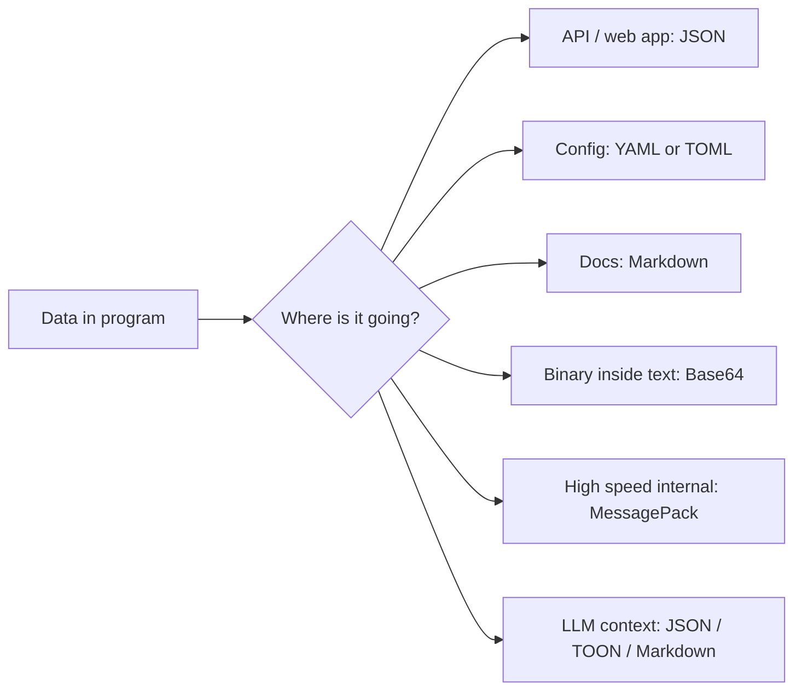
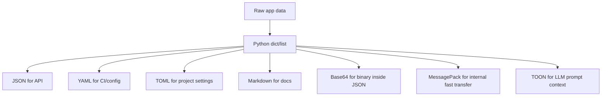

# Data Formats — Practical Notes

Data formats are how programs **store, send, read, and explain data**.

In real developer work:

```text
API response        -> JSON
Python project      -> TOML / pyproject.toml
GitHub Actions      -> YAML
README / notes      -> Markdown
Image/PDF in JSON   -> Base64
Fast internal data  -> MessagePack / Protobuf
LLM prompt data     -> JSON / Markdown / TOON
All text            -> UTF-8
```



## Start with a small lab

```bash
mkdir data-formats-lab
cd data-formats-lab

# Use uv if you have it
uv init --bare
uv add pyyaml msgpack tomli-w

# Optional but very useful for JSON
sudo apt-get update
sudo apt-get install -y jq

# Check tools
python --version
jq --version
```

## UTF-8: the rule below every format

Always assume text is **Unicode**, and store/send it as **UTF-8**. Unicode gives each character a number; UTF-8 turns that character into bytes. Normal ASCII characters use 1 byte, many non-Latin characters use 2–3 bytes, and emoji can use 4 bytes.

```bash
cat > unicode_demo.py <<'PY'
text = "नमस्ते 🙏"

print(text)
print(len(text))                    # number of Python characters/code points
print(len(text.encode("utf-8")))    # number of bytes
print(text.encode("utf-8"))         # actual UTF-8 bytes

# Safe habit: always mention encoding when reading/writing text files
with open("hello.txt", "w", encoding="utf-8") as f:
    f.write(text)

with open("hello.txt", "r", encoding="utf-8") as f:
    print(f.read())
PY

uv run python unicode_demo.py
```

Safe habit:

```python
# Good
open("data.txt", encoding="utf-8")

# Risky on some systems
open("data.txt")
```

## JSON: the API language

JSON is the default format for REST APIs, webhooks, browser apps, config exchange, and LLM tools. It is strict and machine-readable. JSON supports: strings, numbers, booleans, null, objects, and arrays — but **not** comments, trailing commas, native dates, or binary blobs.

Create a file:

```bash
cat > user.json <<'JSON'
{
  "name": "Alice",
  "age": 30,
  "is_admin": false,
  "roles": ["editor", "reviewer"],
  "address": {
    "city": "Chennai",
    "pin": "600113"
  },
  "deleted_at": null
}
JSON
```

Use JSON from terminal:

```bash
cat user.json | jq .

# Validate JSON
jq empty user.json

# Extract one field
jq '.name' user.json

# Extract nested field
jq '.address.city' user.json

# Change a field and save as new file
jq '.name = "Bob"' user.json > user2.json

# Compact JSON for APIs
jq -c . user.json
```

Use JSON in Python:

```bash
cat > json_demo.py <<'PY'
import json

data = {
    "project": "tds-2026",
    "language": "हिन्दी",
    "scores": [10, 20, 30],
}

# ensure_ascii=False keeps Unicode readable
text = json.dumps(data, indent=2, ensure_ascii=False)
print(text)

with open("project.json", "w", encoding="utf-8") as f:
    json.dump(data, f, indent=2, ensure_ascii=False)

with open("project.json", "r", encoding="utf-8") as f:
    loaded = json.load(f)

print(loaded["language"])
PY

uv run python json_demo.py
```

Beginner mistakes:

```json
{
  "name": "Alice",
  "age": 30
}
```

Good JSON uses **double quotes**, no comments, no trailing comma.

```json
{
  "name": "Alice",
  "age": 30,
}
```

Bad strict JSON because of the trailing comma.

Use ISO date strings:

```json
{
  "created_at": "2026-06-15T10:30:00Z"
}
```

Use Base64 for binary:

```json
{
  "filename": "photo.png",
  "content_base64": "iVBORw0KGgo..."
}
```

## YAML: human-friendly config, but be careful

YAML is common in GitHub Actions, Docker Compose, Kubernetes, Ansible, and CI/CD configs. It is readable, but indentation and automatic type conversion can surprise beginners. Be careful with values like `yes`, `no`, `on`, and `off` — some parsers treat them as booleans.

```bash
cat > config.yml <<'YAML'
app:
  name: tds-demo
  debug: true
  port: 8000

database:
  host: localhost
  port: 5432

countries:
  - "no"   # quote this, otherwise some parsers may treat it as false
  - "in"
  - "se"

commands:
  setup: |
    uv sync
    uv run pytest
YAML
```

Read YAML safely in Python:

```bash
cat > yaml_demo.py <<'PY'
import yaml

with open("config.yml", "r", encoding="utf-8") as f:
    # Safe habit: use safe_load, not yaml.load
    config = yaml.safe_load(f)

print(config["app"]["name"])
print(config["countries"])

with open("config.out.yml", "w", encoding="utf-8") as f:
    yaml.safe_dump(config, f, sort_keys=False, allow_unicode=True)
PY

uv run python yaml_demo.py
```

Good YAML habits:

```yaml
# Use 2 spaces, not tabs
app:
  name: tds-demo

# Quote strings that look like booleans or numbers
country_code: "no"
pin: "600113"
version: "1.0"

# Use | for multi-line shell blocks
run: |
  uv sync
  uv run pytest
```

## TOML: best for Python project config

TOML is stricter than YAML and easier to read than JSON for config. Python projects use `pyproject.toml` — it's the standard config format for modern Python projects.

```bash
cat > pyproject.toml <<'TOML'
[project]
name = "data-formats-lab"
version = "0.1.0"
description = "Practice project for data formats"
requires-python = ">=3.11"
dependencies = [
    "pyyaml",
    "msgpack",
]

[project.optional-dependencies]
dev = ["pytest", "ruff"]

[tool.ruff]
line-length = 100

[database]
host = "localhost"
port = 5432
debug = true
TOML
```

Read TOML in Python:

```bash
cat > toml_demo.py <<'PY'
import tomllib

# tomllib needs binary mode: "rb"
with open("pyproject.toml", "rb") as f:
    data = tomllib.load(f)

print(data["project"]["name"])
print(data["database"]["port"])
PY

uv run python toml_demo.py
```

TOML mental model:

```toml
# key-value
name = "Alice"
age = 30
debug = true

# array
tags = ["python", "api", "tds"]

# table = nested dict/object
[server]
host = "localhost"
port = 8000

# array of tables = list of objects
[[users]]
name = "Alice"

[[users]]
name = "Bob"
```

Use TOML for stable config. Use YAML when ecosystem demands it, such as GitHub Actions or Kubernetes.

## Markdown: documentation that developers actually read

Markdown is for README files, notes, docs, GitHub issues, project explanations, and LLM-friendly structured text. GitHub Flavored Markdown adds task lists, tables, strikethrough, autolinks, mentions, and issue references.

````bash
cat > README.md <<'MD'
# Data Formats Lab

This project practices common developer data formats.

## Run

```bash
uv run python json_demo.py
uv run python yaml_demo.py
uv run python toml_demo.py
````

## Checklist

* [x] JSON validation
* [x] YAML config
* [x] TOML project config
* [ ] Base64 image payload
* [ ] MessagePack binary payload

| Format   | Use                   |
| -------- | --------------------- |
| JSON     | APIs                  |
| YAML     | CI/config             |
| TOML     | Python project config |
| Markdown | Docs                  |
| MD       |                       |

````

Markdown safe habits:

```md
# One main heading

Use short paragraphs.

Use tables only when they improve scanning.

Use fenced code blocks with language names:

```python
print("hello")
````

Add alt text for images:


````

## Base64: binary data as text

Base64 converts bytes into plain text, useful when binary data must travel inside JSON, HTTP headers, or text-only systems. **Base64 is encoding, not encryption.** Anyone can decode it.

```bash
echo -n "hello" | base64

echo -n "aGVsbG8=" | base64 -d
````

Encode and decode a file:

```bash
echo "small image or pdf placeholder" > file.bin

# Binary file -> base64 text
base64 < file.bin > file.b64

# Base64 text -> binary file
base64 -d < file.b64 > file.copy.bin

diff file.bin file.copy.bin
```

Python version:

```bash
cat > base64_demo.py <<'PY'
import base64

raw = b"hello"
encoded = base64.b64encode(raw).decode("ascii")
decoded = base64.b64decode(encoded)

print(encoded)
print(decoded)

# Safe habit: do not store passwords/secrets as "base64" thinking it is secure
PY

uv run python base64_demo.py
```

Common real use:

```text
Authorization: Basic dXNlcjpwYXNz
data:image/png;base64,iVBORw0KGgo...
```

But remember:

```text
Base64 = encoding
Encryption = security
Hashing = one-way fingerprint
```

## MessagePack: compact binary JSON

MessagePack stores JSON-like data as binary bytes. Useful when both sides of the system are controlled by you and you want smaller/faster payloads. Prefer JSON for public APIs and MessagePack for internal high-throughput machine-to-machine data.

```bash
cat > msgpack_demo.py <<'PY'
import json
import msgpack

data = {
    "name": "Alice",
    "scores": [10, 20, 30],
    "active": True,
}

json_bytes = json.dumps(data).encode("utf-8")
packed = msgpack.packb(data)

print("JSON bytes:", len(json_bytes))
print("MessagePack bytes:", len(packed))

unpacked = msgpack.unpackb(packed, raw=False)
print(unpacked)
PY

uv run python msgpack_demo.py
```

Use:

```text
Public API?       JSON
Internal service? MessagePack / Protobuf
Need schema?      Protobuf / Avro
Need analytics?   Parquet / Arrow
```

## TOON: compact JSON-like format for LLM prompts

TOON means **Token-Oriented Object Notation**. It is a compact, human-readable encoding of the JSON data model designed for LLM input. Use JSON in programs, convert to TOON when sending structured data to an LLM. It works best for uniform arrays of objects where many rows share the same fields. 

JSON:

```json
{
  "students": [
    {"id": 1, "name": "Asha", "score": 91},
    {"id": 2, "name": "Ravi", "score": 85},
    {"id": 3, "name": "Meera", "score": 94}
  ]
}
```

TOON-style representation:

```toon
students[3]{id,name,score}:
  1,Asha,91
  2,Ravi,85
  3,Meera,94
```

Why TOON helps:

```text
JSON repeats keys many times:
{"id":1,"name":"Asha","score":91}
{"id":2,"name":"Ravi","score":85}

TOON declares keys once:
students[3]{id,name,score}:
  1,Asha,91
  2,Ravi,85
```

Try TOON CLI:

```bash
cat > students.json <<'JSON'
{
  "students": [
    {"id": 1, "name": "Asha", "score": 91},
    {"id": 2, "name": "Ravi", "score": 85},
    {"id": 3, "name": "Meera", "score": 94}
  ]
}
JSON

# Convert JSON to TOON with the official CLI
npx @toon-format/cli students.json

# Show token/stat information
npx @toon-format/cli students.json --stats
```


Use TOON when:

```text
Good:
- LLM prompt has many similar records
- You want fewer tokens
- Data is mostly table-like
- You still want structure, not plain CSV

Avoid / benchmark:
- Deeply nested objects
- Very irregular arrays
- Public API contracts
- When the model must generate strict output
```

TOON can be useful for token efficiency, but JSON often remains more reliable for generation, especially when structured output or constrained decoding is available. **TOON is useful for LLM input context, but JSON is still safer for APIs and strict outputs.**

## One practical conversion flow



Create one dataset and convert it:

```bash
cat > course.json <<'JSON'
{
  "project": "tds-2026",
  "semester": 2,
  "instructors": ["Anand", "Priyanshu"],
  "grading": {
    "ga": 0.4,
    "projects": 0.4,
    "roe": 0.2
  },
  "students": [
    {"id": 1, "name": "Asha", "score": 91},
    {"id": 2, "name": "Ravi", "score": 85}
  ]
}
JSON

# Validate and pretty-print
jq . course.json

# Extract useful values
jq '.grading.projects' course.json
jq '.students[] | select(.score > 90)' course.json

# Compact JSON for APIs
jq -c . course.json > course.compact.json

# Base64 encode compact JSON
base64 < course.compact.json > course.json.b64

# Decode back
base64 -d < course.json.b64 > course.decoded.json

# Check both are same
diff course.compact.json course.decoded.json

# Convert JSON to TOON for LLM context
npx @toon-format/cli course.json > course.toon
cat course.toon
```

Now convert JSON to YAML, TOML-ish config, MessagePack, and Markdown:

```bash
cat > convert_all.py <<'PY'
import json
import base64
import yaml
import msgpack
import tomli_w

with open("course.json", "r", encoding="utf-8") as f:
    data = json.load(f)

# JSON pretty
with open("course.pretty.json", "w", encoding="utf-8") as f:
    json.dump(data, f, indent=2, ensure_ascii=False)

# YAML config
with open("course.yml", "w", encoding="utf-8") as f:
    yaml.safe_dump(data, f, sort_keys=False, allow_unicode=True)

# TOML works best for config-like data
# TOML supports nested tables, but very complex JSON may not map nicely
with open("course.toml", "wb") as f:
    f.write(tomli_w.dumps(data).encode("utf-8"))

# MessagePack binary
with open("course.msgpack", "wb") as f:
    f.write(msgpack.packb(data))

# Base64 JSON text
json_bytes = json.dumps(data, separators=(",", ":"), ensure_ascii=False).encode("utf-8")
with open("course.b64", "w", encoding="ascii") as f:
    f.write(base64.b64encode(json_bytes).decode("ascii"))

# Markdown summary
with open("COURSE.md", "w", encoding="utf-8") as f:
    f.write("# Course Summary\n\n")
    f.write(f"Project: **{data['project']}**\n\n")
    f.write("| Component | Weight |\n")
    f.write("|---|---:|\n")
    for key, value in data["grading"].items():
        f.write(f"| {key} | {value} |\n")

print("Created JSON, YAML, TOML, MessagePack, Base64, and Markdown files.")
PY

uv run python convert_all.py

ls -lh
```

## Format decision table

| Need                              | Use                    | Why                                             |
| --------------------------------- | ---------------------- | ----------------------------------------------- |
| API request/response              | JSON                   | universal, strict, language-independent         |
| Python project settings           | TOML                   | standard `pyproject.toml` format                |
| CI/CD, Docker Compose, Kubernetes | YAML                   | ecosystem expects it                            |
| README, notes, docs               | Markdown               | readable in GitHub and docs tools               |
| Binary inside JSON/HTTP           | Base64                 | binary becomes text                             |
| Internal fast payload             | MessagePack            | compact binary JSON-like data                   |
| Huge analytics table              | Parquet                | compressed columnar storage                     |
| Streaming logs                    | NDJSON                 | one JSON object per line                        |
| Strict service contracts          | Protobuf / Avro        | schema + compact binary                         |
| LLM prompt data                   | JSON / Markdown / TOON | JSON for safety, TOON for compact repeated rows |

Small future-ready extras:

```text
NDJSON:
{"event":"login","user":"asha"}
{"event":"logout","user":"asha"}

CSV:
id,name,score
1,Asha,91
2,Ravi,85

Parquet:
Best for large analytics datasets, not manual editing.

Protobuf:
Best when services need fast, typed, schema-controlled communication.

TOON:
Best when sending repeated structured data into LLM prompts.
```

## Beginner mistakes and safe habits

```text
Mistake: treating Base64 as secure
Safe: remember Base64 is only encoding

Mistake: using yaml.load on untrusted files
Safe: use yaml.safe_load

Mistake: forgetting UTF-8
Safe: open files with encoding="utf-8"

Mistake: writing comments in strict JSON
Safe: use YAML/TOML for config comments, JSON for data exchange

Mistake: storing PIN/IDs as numbers
Safe: store "600113" as string if leading zeros or exact formatting matter

Mistake: using YAML without quoting yes/no/on/off
Safe: quote suspicious strings

Mistake: using TOML for arbitrary deeply nested API data
Safe: use JSON for data, TOML for config

Mistake: sending huge JSON tables to LLMs
Safe: test TOON/CSV/Markdown table and compare token cost + accuracy

Mistake: assuming one format is always best
Safe: choose by consumer: API, human, config, database, LLM, analytics
```

## Important Q&A

**Q: Should I use YAML or TOML for my Python project config?**
A: Use TOML. `pyproject.toml` is the standard configuration file format for modern Python projects. YAML is generally used for CI/CD pipelines (like GitHub Actions) and infrastructure config (like Kubernetes).

**Q: If Base64 makes data unreadable, is it safe for passwords?**
A: No! Base64 is *encoding*, not encryption. Anyone can decode it easily using `base64 -d`. It is only used to safely transmit binary data (like images) over text-based protocols (like JSON), not to protect secrets.

**Q: When should I use TOON instead of JSON for LLM prompts?**
A: Use TOON when your prompt includes a large array of highly uniform objects (like rows from a database). TOON's syntax saves significant tokens in these cases. For highly nested or irregular data, or when requiring strict output generation from an LLM, JSON is still preferred.


## Final revision checklist

```text
[ ] I know JSON is best for APIs.
[ ] I know YAML is common for CI/infra config.
[ ] I know TOML is standard for Python pyproject.toml.
[ ] I know Markdown is for docs and README files.
[ ] I know Base64 is not encryption.
[ ] I know MessagePack is binary and good for internal systems.
[ ] I know UTF-8 should be used explicitly for text files.
[ ] I can validate JSON with jq empty.
[ ] I can read/write JSON, YAML, TOML in Python.
[ ] I can convert binary/text with base64.
[ ] I understand TOON is mainly for compact LLM input, not a general API replacement.
[ ] I choose data formats based on where the data is going.
```
