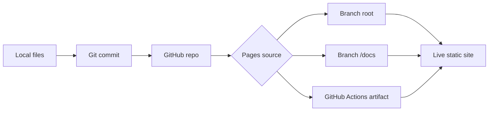
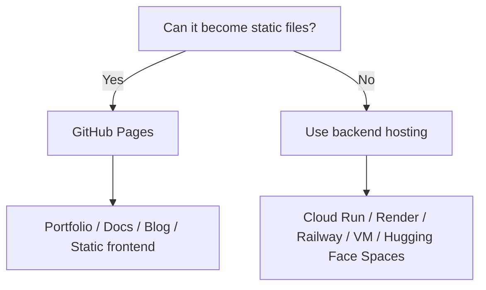
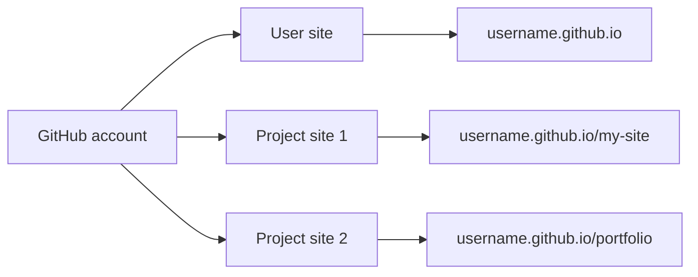
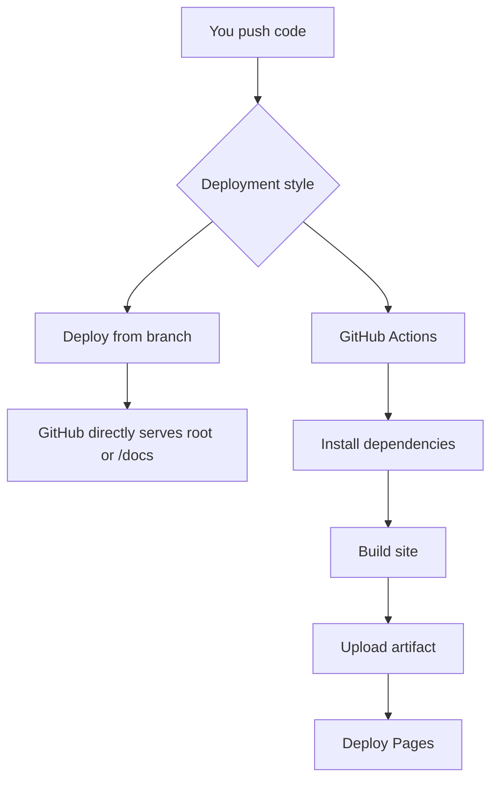
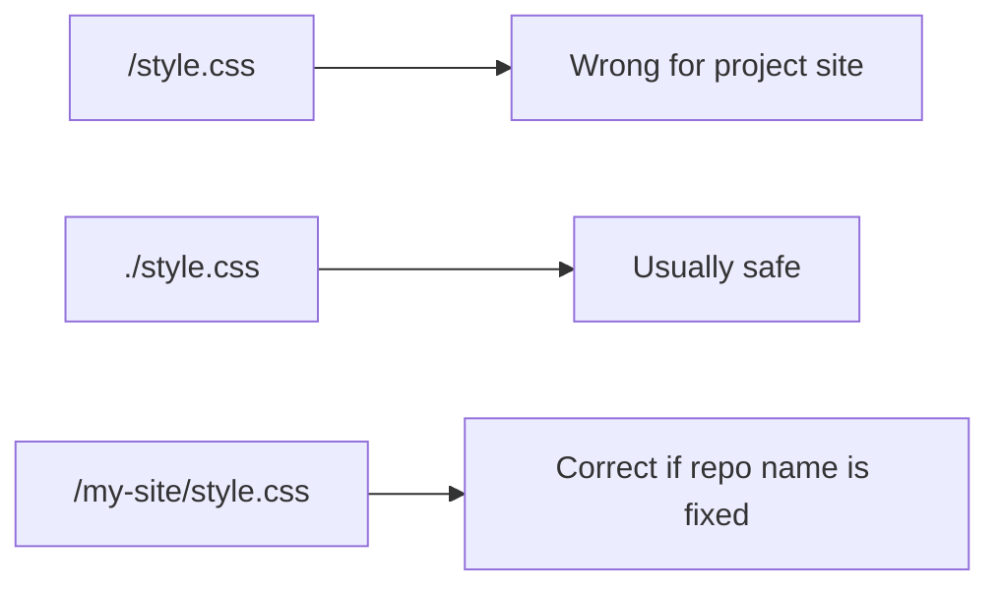
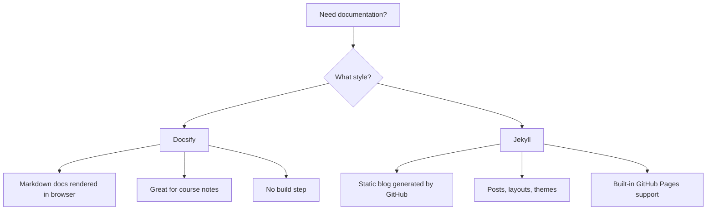
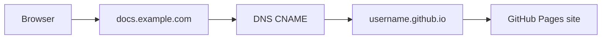
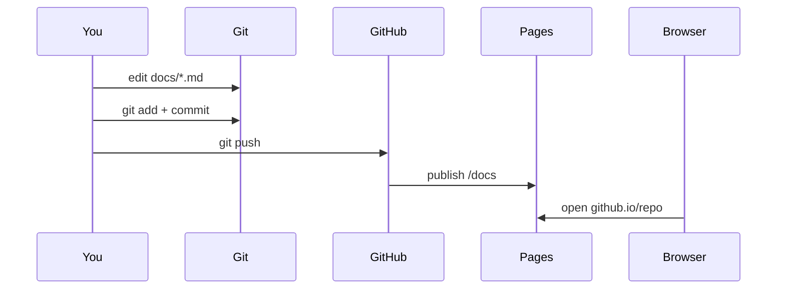

# GitHub Pages — Practical Notes

GitHub Pages hosts **static websites** directly from a GitHub repository. Static means the final output is only:

```text
HTML + CSS + JavaScript + images + fonts + JSON files
```

No backend server, no database server, no secret server-side environment variables. It is good for portfolios, documentation, project demos, blogs, landing pages, static dashboards, and built frontend apps. GitHub Pages supports free HTTPS and custom domains; project sites usually live at `https://<username>.github.io/<repo>/`. 



## The mental model first

GitHub Pages does not run your Python, Node, Flask, FastAPI, Django, or database code.

It only serves finished files:

```text
Good:
index.html
style.css
script.js
README.md
docs/index.html
dist/index.html
assets/logo.png

Not good:
app.py
server.js
.env
database.sqlite used as live backend
private API keys
```

For real developer work, use GitHub Pages when you need to quickly publish:

```text
student portfolio
course assignment demo
project documentation
API documentation
resume website
static frontend app
Docsify documentation
Jekyll blog
Vite / React / Vue / Svelte build output
```

If the app needs login, database writes, private keys, background jobs, or Python APIs, deploy the backend somewhere else and let GitHub Pages only host the frontend.



## Two types of GitHub Pages sites

```text
User site:
repo name must be <username>.github.io
URL becomes https://<username>.github.io/

Project site:
repo can have any name
URL becomes https://<username>.github.io/<repo>/
```

A GitHub account gets one user/organization site, but can have many project sites. 



## Fastest possible deploy: plain HTML

Install GitHub CLI first if needed:

```bash
# Ubuntu / WSL
sudo apt update
sudo apt install gh git -y

# Login once
gh auth login
```

Create a static site:

```bash
mkdir my-site
cd my-site

git init

cat > index.html <<'HTML'
<!doctype html>
<html lang="en">
<head>
  <meta charset="utf-8">
  <title>Hello GitHub Pages</title>
  <meta name="viewport" content="width=device-width, initial-scale=1">
  <style>
    body {
      font-family: system-ui, sans-serif;
      max-width: 720px;
      margin: 48px auto;
      padding: 0 16px;
      line-height: 1.6;
    }
    code {
      background: #f2f2f2;
      padding: 2px 6px;
      border-radius: 4px;
    }
  </style>
</head>
<body>
  <h1>Hello GitHub Pages</h1>
  <p>This site is served from a GitHub repository.</p>
  <p>Edit <code>index.html</code>, commit, push, and refresh after deployment.</p>
</body>
</html>
HTML

cat > README.md <<'MD'
# My Site

Small GitHub Pages demo.
MD

git add .
git commit -m "Create first GitHub Pages site"

# Create public GitHub repo and push
gh repo create my-site --public --source=. --push
```

Now enable Pages:

```text
GitHub repo
→ Settings
→ Pages
→ Source: Deploy from a branch
→ Branch: main
→ Folder: / root
→ Save
```

Your project site becomes:

```text
https://<username>.github.io/my-site/
```


## Branch source vs GitHub Actions

There are two common deployment styles.



Use branch deploy when:

```text
site is plain HTML/CSS/JS
Docsify site is directly in /docs or root
no build command is needed
you want simplest setup
```

Use GitHub Actions when:

```text
you use npm build
you use Vite / React / Vue / Svelte / Astro / Hugo
you need to generate docs
you need reproducible deploys
you want build logs
```

Use GitHub Actions for real projects that need a build step. The official Pages deployment flow supports deploying an uploaded artifact from Actions. 

## Deploy with GitHub Actions

For a built frontend, the output folder is often:

```text
Vite / React: dist
Docusaurus: build
Astro: dist
Next static export: out
Hugo: public
Docsify: usually no build needed
```

Create this workflow:

```bash
mkdir -p .github/workflows

cat > .github/workflows/pages.yml <<'YAML'
name: Deploy to GitHub Pages

on:
  push:
    branches: [main]
  workflow_dispatch:

permissions:
  contents: read
  pages: write
  id-token: write

concurrency:
  group: pages
  cancel-in-progress: true

jobs:
  build:
    runs-on: ubuntu-latest

    steps:
      - name: Checkout repo
        uses: actions/checkout@v4

      - name: Setup Node
        uses: actions/setup-node@v4
        with:
          node-version: 22
          cache: npm

      - name: Install dependencies
        run: npm ci

      - name: Build site
        run: npm run build
        env:
          # Project site path example: /my-site/
          BASE_URL: /${{ github.event.repository.name }}/

      - name: Add nojekyll file
        run: touch dist/.nojekyll

      - name: Upload Pages artifact
        uses: actions/upload-pages-artifact@v3
        with:
          path: dist

  deploy:
    needs: build
    runs-on: ubuntu-latest

    environment:
      name: github-pages
      url: ${{ steps.deployment.outputs.page_url }}

    steps:
      - name: Deploy to Pages
        id: deployment
        uses: actions/deploy-pages@v4
YAML

git add .github/workflows/pages.yml
git commit -m "Add GitHub Pages deployment workflow"
git push
```

Then set:

```text
Repo → Settings → Pages → Source: GitHub Actions
```

After every push to `main`, check:

```text
Repo → Actions → Deploy to GitHub Pages
```

## Important base URL problem

This is the most common beginner bug.

User site:

```text
https://<username>.github.io/
```

Project site:

```text
https://<username>.github.io/my-site/
```

If your HTML says:

```html
<link rel="stylesheet" href="/style.css">
```

the browser asks for:

```text
https://<username>.github.io/style.css
```

But your file is actually at:

```text
https://<username>.github.io/my-site/style.css
```

So for project sites, prefer relative paths:

```html
<link rel="stylesheet" href="./style.css">
<script src="./script.js"></script>

```

For frameworks, set the base path:

```text
Vite: base: "/my-site/"
React Router: basename="/my-site"
Astro: base: "/my-site"
Hugo: baseURL = "https://username.github.io/my-site/"
Next.js static export: basePath: "/my-site"
```

Project sites live under a subpath, so absolute asset paths can break unless the framework base URL is configured.



## Docsify: excellent for documentation

Docsify is great when you want documentation from Markdown files without building static HTML. Start with an `index.html` and deploy to GitHub Pages. No npm build required.


Best structure:

```text
my-docs/
├── docs/
│   ├── index.html
│   ├── README.md
│   ├── _sidebar.md
│   └── week-1/
│       └── github-pages.md
└── README.md
```

Create a Docsify site:

```bash
mkdir my-docs
cd my-docs
git init

mkdir docs

cat > docs/index.html <<'HTML'
<!doctype html>
<html>
<head>
  <meta charset="utf-8">
  <title>My Docs</title>
  <meta name="viewport" content="width=device-width, initial-scale=1">
  <link rel="stylesheet" href="//cdn.jsdelivr.net/npm/docsify@4/lib/themes/vue.css">
</head>
<body>
  <div id="app">Loading...</div>

  <script>
    window.$docsify = {
      name: "My Docs",
      repo: "",
      loadSidebar: true,
      subMaxLevel: 2,
      search: "auto"
    }
  </script>

  <script src="//cdn.jsdelivr.net/npm/docsify@4"></script>
  <script src="//cdn.jsdelivr.net/npm/docsify@4/lib/plugins/search.min.js"></script>
</body>
</html>
HTML

cat > docs/README.md <<'MD'
# My Docs

Welcome to my Docsify documentation site.

## Start here

- Read the sidebar
- Edit Markdown files
- Push to GitHub
MD

cat > docs/_sidebar.md <<'MD'
- [Home](/)
- Week 1
  - [GitHub Pages](week-1/github-pages.md)
MD

mkdir -p docs/week-1

cat > docs/week-1/github-pages.md <<'MD'
# GitHub Pages

This page is written in Markdown and rendered by Docsify in the browser.
MD

touch docs/.nojekyll

git add .
git commit -m "Create Docsify documentation site"

gh repo create my-docs --public --source=. --push
```

Enable Pages:

```text
Repo → Settings → Pages
Source: Deploy from a branch
Branch: main
Folder: /docs
Save
```

Docsify recommends saving files in the `docs/` folder on the main branch, then selecting `main branch /docs folder` as the Pages source.

Docsify is useful because:

```text
Markdown becomes pages
_sidebar.md becomes navigation
No npm build required
Good for course notes and project docs
Easy GitHub Pages deployment
```

## Jekyll: GitHub Pages built-in blog engine

Jekyll is built into GitHub Pages. If your repository looks like a Jekyll site, GitHub Pages can build it without you writing your own Action. The basic pattern uses `_config.yml` and posts in a `_posts/` directory.

Create a small Jekyll blog:

```bash
mkdir jekyll-blog
cd jekyll-blog
git init

cat > _config.yml <<'YAML'
title: My Blog
description: Notes about learning and projects
theme: minima
YAML

mkdir -p _posts

cat > index.md <<'MD'
---
layout: home
title: Home
---
MD

cat > _posts/2026-06-15-first-post.md <<'MD'
---
layout: post
title: "My first post"
date: 2026-06-15
---

This is my first Jekyll post on GitHub Pages.
MD

git add .
git commit -m "Create Jekyll blog"

gh repo create jekyll-blog --public --source=. --push
```

Enable:

```text
Settings → Pages → Deploy from branch → main → / root
```

Jekyll is good for:

```text
blogs
simple documentation
posts with dates
themes
GitHub-native Pages builds
```

Docsify vs Jekyll:



## `.nojekyll`: small file, big importance

By default, branch-based GitHub Pages may process files with Jekyll. Files and folders beginning with `_` can be ignored by Jekyll. To bypass Jekyll processing, add an empty `.nojekyll` file in the publishing source.

```bash
# If publishing from root
touch .nojekyll

# If publishing from docs/
touch docs/.nojekyll

# If publishing from build output in Actions
touch dist/.nojekyll
```

Use `.nojekyll` especially for:

```text
Docsify
Vite / React build
Next.js static export with _next
Sphinx docs with _static
Any site with folders starting with _
```

Common mistake:

```text
Pages source: /docs
.nojekyll location: repository root

Wrong. Put .nojekyll inside docs/ if /docs is the published folder.
```

## Custom domain

GitHub Pages can use a custom domain instead of the default `github.io` URL. Both repository settings and DNS records must point to GitHub Pages.

For apex domain:

```text
example.com
```

Add A records at your DNS provider:

```text
185.199.108.153
185.199.109.153
185.199.110.153
185.199.111.153
```

For subdomain:

```text
docs.example.com
```

Add CNAME:

```text
docs.example.com → <username>.github.io
```

Then in GitHub:

```text
Repo → Settings → Pages → Custom domain
Enter: docs.example.com
Save
Enable: Enforce HTTPS
```

GitHub automatically requests and manages a Let’s Encrypt TLS certificate after DNS is correctly configured. 



Safe habit:

```text
Verify custom domains in GitHub settings to reduce domain takeover risk.
```

Domain verification helps stop other users from taking over your custom domain for Pages.

## GitHub Pages limits

GitHub Pages is generous for student/project websites, but not for heavy file hosting or high-traffic media. Limits: published sites up to 1 GB, deployments time out after 10 minutes, soft bandwidth limit of 100 GB/month, and 10 builds/hour for source-branch builds.

```text
Good:
small docs
portfolio
demo frontend
course notes
project landing page

Avoid:
large video hosting
large dataset hosting
private file storage
high traffic download server
backend application
```

GitHub warns for files over 50 MiB and blocks files at 100 MiB.


## One complete practical example: Docsify docs site

This creates a clean documentation website with Docsify and GitHub Pages.

````bash
mkdir tds-notes-site
cd tds-notes-site
git init

mkdir -p docs/week-1 docs/assets

cat > docs/index.html <<'HTML'
<!doctype html>
<html>
<head>
  <meta charset="utf-8">
  <title>TDS Notes</title>
  <meta name="viewport" content="width=device-width, initial-scale=1">
  <link rel="stylesheet" href="//cdn.jsdelivr.net/npm/docsify@4/lib/themes/vue.css">
</head>
<body>
  <div id="app">Loading...</div>

  <script>
    window.$docsify = {
      name: "TDS Notes",
      repo: "",
      loadSidebar: true,
      subMaxLevel: 3,
      search: {
        paths: "auto",
        placeholder: "Search notes",
        noData: "No result found"
      }
    }
  </script>

  <script src="//cdn.jsdelivr.net/npm/docsify@4"></script>
  <script src="//cdn.jsdelivr.net/npm/docsify@4/lib/plugins/search.min.js"></script>
</body>
</html>
HTML

cat > docs/README.md <<'MD'
# TDS Notes

These are practical notes for Tools in Data Science.

## How to use

Read one topic, run commands locally, and keep improving the notes.
MD

cat > docs/_sidebar.md <<'MD'
- [Home](/)

- Week 1
  - [GitHub Pages](week-1/github-pages.md)
  - [Data Formats](week-1/data-formats.md)
MD

cat > docs/week-1/github-pages.md <<'MD'
# GitHub Pages

GitHub Pages hosts static websites from a GitHub repository.

## Minimal workflow

```bash
git add .
git commit -m "Update notes"
git push
````

After Pages is enabled, every push updates the site.
MD

cat > docs/week-1/data-formats.md <<'MD'

# Data Formats

Use JSON for APIs, YAML for CI/config, TOML for Python projects, Markdown for docs, and Base64 for binary-as-text.
MD

# Important for Docsify and folders starting with _

touch docs/.nojekyll

cat > README.md <<'MD'

# TDS Notes Site

Docsify documentation site hosted with GitHub Pages.

## Publish

GitHub repo → Settings → Pages → main branch → /docs
MD

git add .
git commit -m "Create Docsify notes site"

gh repo create tds-notes-site --public --source=. --push

````

Then enable:

```text
GitHub repo
→ Settings
→ Pages
→ Source: Deploy from a branch
→ Branch: main
→ Folder: /docs
→ Save
````

Your site becomes:

```text
https://<username>.github.io/tds-notes-site/
```

Update notes anytime:

```bash
# Edit any Markdown file under docs/
nano docs/week-1/github-pages.md

git status
git add docs/week-1/github-pages.md
git commit -m "Improve GitHub Pages notes"
git push
```



## Common problems and fixes

```text
Problem:
404 page after enabling Pages

Fix:
Wait a minute, check Settings → Pages, confirm branch and folder.
```

```text
Problem:
CSS or JS not loading

Fix:
Use relative paths like ./style.css or configure base path for project site.
```

```text
Problem:
Docsify sidebar not showing

Fix:
Check loadSidebar: true and docs/_sidebar.md exists.
```

```text
Problem:
Files under _static or _next missing

Fix:
Add .nojekyll inside the published folder.
```

```text
Problem:
GitHub Actions says permission denied

Fix:
Add permissions: pages: write and id-token: write.
```

```text
Problem:
Site works locally but not at github.io/repo

Fix:
You probably used absolute / paths. Project sites need /repo/ base path or relative paths.
```

```text
Problem:
Custom domain HTTPS not active

Fix:
Check DNS records, wait for DNS propagation, then enable Enforce HTTPS.
```

## Developer-safe habits

```bash
# Always check what will be committed
git status

# Test simple static site locally
python -m http.server 8000

# Open locally
# http://localhost:8000

# For Docsify from docs folder
cd docs
python -m http.server 8000

# Validate that important files exist
ls -la docs
ls -la docs/.nojekyll
```

```text
Do:
- keep site files small
- use relative paths when possible
- commit .nojekyll for Docsify/static generators
- use /docs for documentation sites
- use Actions for build-based frameworks
- keep secrets out of frontend code
- check Actions logs when deploy fails

Do not:
- put .env secrets in GitHub Pages
- expect Python/Node backend code to run
- host huge datasets/videos
- forget project-site base path
- ignore 404 and asset path errors
```

## Important Q&A

**Q: Can I run a Python Flask or Django app on GitHub Pages?**
A: No. GitHub Pages only serves *static* files (HTML, CSS, JS, images). It does not have a backend server to run Python, Node.js, or database queries. You must host backend apps on services like Render, Railway, or Heroku.

**Q: Why do I get a 404 error on my CSS/JS files when deploying a project site?**
A: Project sites are hosted at `username.github.io/repo-name/`. If your HTML links to `/style.css`, the browser looks for it at the root (`username.github.io/style.css`), which doesn't exist. You must use relative paths like `./style.css` or configure your framework's base URL.

**Q: What does the `.nojekyll` file actually do?**
A: By default, GitHub Pages uses Jekyll to build your site and ignores folders starting with an underscore (like `_next` or `_static`). Placing an empty `.nojekyll` file tells GitHub to skip the Jekyll build step and serve your files exactly as they are.


## Final revision checklist

```text
[ ] GitHub Pages serves static files only.
[ ] User site repo must be <username>.github.io.
[ ] Project site URL is /<repo>/.
[ ] Simple HTML sites can deploy from branch root.
[ ] Docsify sites work well from /docs.
[ ] Jekyll is built into GitHub Pages for blogs/static sites.
[ ] GitHub Actions is best when a build step is needed.
[ ] .nojekyll disables Jekyll processing for the published folder.
[ ] Project sites need correct base paths.
[ ] Custom domains need DNS + Pages settings + HTTPS.
[ ] GitHub Pages is not for backend servers, databases, or secrets.
[ ] For every update: edit → commit → push → check Pages/Actions.
```
