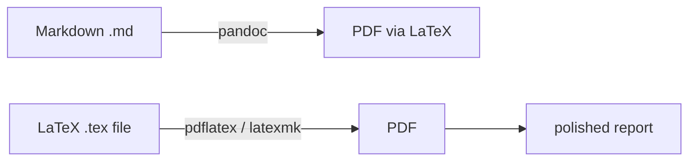
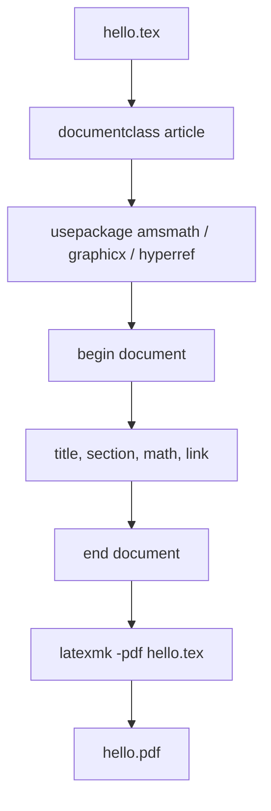

# LaTeX — Practical Notes

LaTeX is used when Markdown is not enough: **math equations, project reports, research-style PDFs, citations, figures, tables, and academic documents**. Pandoc can convert Markdown to LaTeX/PDF without writing raw `.tex` files.



## Use LaTeX in two ways

For beginners, start with **Overleaf** (overleaf.com) — no install, browser-based editor, live PDF preview. For local or automated work, install LaTeX and Pandoc so reports can be built from the terminal or GitHub Actions.

```bash
# Ubuntu / WSL: full install, large but easiest
sudo apt update
sudo apt install texlive-full pandoc -y

# Lighter install
sudo apt install texlive-latex-recommended texlive-fonts-recommended texlive-latex-extra pandoc -y

# Check installation
pdflatex --version
pandoc --version
```

## Smallest LaTeX document

Create `hello.tex`:

```tex
\documentclass[11pt]{article}

\usepackage[a4paper,margin=1in]{geometry}
\usepackage{hyperref}
\usepackage{graphicx}
\usepackage{amsmath,amssymb}

\title{My First LaTeX Report}
\author{Your Name}
\date{\today}

\begin{document}

\maketitle

\section{Introduction}

LaTeX is useful for writing clean PDFs with \textbf{math}, figures, tables, and references.

\section{Math}

Inline math: $E = mc^2$.

Display math:

\[
\sum_{i=1}^{n} i = \frac{n(n+1)}{2}
\]

\section{Link}

Visit \url{https://iitm.ac.in}.

\end{document}
```

Compile:

```bash
pdflatex hello.tex

# Run twice when using references, table of contents, labels, etc.
pdflatex hello.tex
```

Better compile command:

```bash
latexmk -pdf hello.tex

# Clean generated files
latexmk -C
```

## Basic structure to remember

```tex
\documentclass{article}

\usepackage{amsmath}     % math
\usepackage{graphicx}    % images
\usepackage{hyperref}    % clickable links

\begin{document}

\title{Title}
\author{Name}
\date{\today}
\maketitle

\tableofcontents

\section{Main heading}
\subsection{Sub heading}

\end{document}
```



## Text formatting

```tex
\textbf{bold text}

\textit{italic text}

\texttt{code style}

\emph{important text}

This is a footnote.\footnote{Extra explanation at bottom of page.}
```

Special characters must be escaped:

```tex
\%   % percent
\&   % ampersand
\$   % dollar
\#   % hash
\_   % underscore
\{ \} % braces
```

Beginner mistake:

```tex
accuracy_score
```

This may break because `_` is special.

Correct:

```tex
accuracy\_score
```

## Math mode

Use `$...$` for inline math:

```tex
The model predicts $\hat{y}$ from input $x$.
```

Use `\[...\]` for display math:

```tex
\[
P(y \mid x) = \frac{P(x \mid y)P(y)}{P(x)}
\]
```

Common math patterns:

```tex
\frac{a}{b}          % fraction

x^2                 % superscript

x_i                 % subscript

\sqrt{x}            % square root

\sum_{i=1}^{n} x_i  % summation

\int_a^b f(x)\,dx   % integral

\alpha \beta \gamma % Greek letters

\leq \geq \neq \approx
```

Matrix:

```tex
\[
A =
\begin{pmatrix}
1 & 2 \\
3 & 4
\end{pmatrix}
\]
```

## Images and figures

Folder structure:

```text
project/
├── main.tex
└── figures/
    └── loss.png
```

Use image:

```tex
\usepackage{graphicx}

\begin{figure}[h]
  \centering
  \includegraphics[width=0.75\linewidth]{figures/loss.png}
  \caption{Training loss over epochs.}
  \label{fig:loss}
\end{figure}

As shown in Figure~\ref{fig:loss}, loss decreases.
```

Safe habit: use PNG/JPG for screenshots and PDF/SVG-like exports for diagrams when possible.

## Tables

Simple table:

```tex
\begin{table}[h]
  \centering
  \begin{tabular}{lrr}
    \hline
    Model & Accuracy & F1 \\
    \hline
    BM25 & 0.72 & 0.69 \\
    Dense & 0.81 & 0.78 \\
    Hybrid & \textbf{0.86} & \textbf{0.84} \\
    \hline
  \end{tabular}
  \caption{Retrieval results.}
  \label{tab:results}
\end{table}
```

Column alignment:

```text
l = left
c = center
r = right
```

Cleaner table with `booktabs`:

```tex
\usepackage{booktabs}

\begin{tabular}{lrr}
\toprule
Model & Accuracy & F1 \\
\midrule
BM25 & 0.72 & 0.69 \\
Dense & 0.81 & 0.78 \\
Hybrid & 0.86 & 0.84 \\
\bottomrule
\end{tabular}
```

## Citations with BibTeX

Create `references.bib`:

```bibtex
@article{vaswani2017attention,
  title={Attention Is All You Need},
  author={Vaswani, Ashish and others},
  journal={NeurIPS},
  year={2017}
}
```

Use in `main.tex`:

```tex
Transformers were introduced by \cite{vaswani2017attention}.

\bibliographystyle{plain}
\bibliography{references}
```

Compile order:

```bash
pdflatex main.tex
bibtex main
pdflatex main.tex
pdflatex main.tex
```

Or easier:

```bash
latexmk -pdf main.tex
```

## Pandoc: Markdown to PDF

Pandoc converts Markdown to PDF using LaTeX in the background. Write in Markdown, get a polished PDF — without writing raw `.tex` for most documents.

Create `report.md`:

```md
---
title: "TDS Report"
author: "Your Name"
date: today
---

# Introduction

This report was written in Markdown and converted to PDF.

## Equation

The sum is:

$$
\sum_{i=1}^{n} i = \frac{n(n+1)}{2}
$$
```

Convert:

```bash
pandoc report.md -o report.pdf

# Better Unicode/font support
pandoc report.md -o report.pdf --pdf-engine=xelatex

# With useful report options
pandoc report.md -o report.pdf \
  --pdf-engine=xelatex \
  --toc \
  --number-sections \
  -V geometry:margin=1in \
  -V fontsize=11pt \
  -V colorlinks=true
```

## Good project structure

```text
latex-report/
├── main.tex
├── references.bib
├── figures/
│   └── architecture.png
├── sections/
│   ├── intro.tex
│   ├── method.tex
│   └── results.tex
└── Makefile
```

`main.tex`:

```tex
\documentclass{article}

\usepackage[a4paper,margin=1in]{geometry}
\usepackage{graphicx}
\usepackage{amsmath}
\usepackage{hyperref}

\title{Project Report}
\author{Your Name}
\date{\today}

\begin{document}

\maketitle
\tableofcontents

\input{sections/intro}
\input{sections/method}
\input{sections/results}

\bibliographystyle{plain}
\bibliography{references}

\end{document}
```

`Makefile`:

```makefile
main.pdf: main.tex sections/*.tex references.bib
	latexmk -pdf main.tex

clean:
	latexmk -C
```

Run:

```bash
make
make clean
```

## Common mistakes

```text
Mistake: forgetting to escape _ % & #
Fix: use \_ \% \& \#

Mistake: image not found
Fix: check folder path and file extension

Mistake: citations show [?]
Fix: run latexmk -pdf or compile BibTeX sequence

Mistake: table/figure appears somewhere else
Fix: LaTeX floats figures/tables; use labels and references, not “below image”

Mistake: writing everything in LaTeX when Markdown is enough
Fix: use Markdown for notes, LaTeX for serious PDFs/math-heavy documents

Mistake: package missing
Fix: install missing TeX package or use texlive-full if disk space is okay
```

## Tiny complete example

```bash
mkdir latex-small-demo
cd latex-small-demo

cat > main.tex <<'TEX'
\documentclass[11pt]{article}

\usepackage[a4paper,margin=1in]{geometry}
\usepackage{amsmath}
\usepackage{hyperref}
\usepackage{booktabs}

\title{Small LaTeX Demo}
\author{Your Name}
\date{\today}

\begin{document}

\maketitle

\section{Goal}

This PDF shows text, math, table, and link usage.

\section{Math}

The average of $n$ values is:

\[
\bar{x} = \frac{1}{n}\sum_{i=1}^{n}x_i
\]

\section{Result Table}

\begin{table}[h]
\centering
\begin{tabular}{lr}
\toprule
Method & Score \\
\midrule
Baseline & 72 \\
Improved & \textbf{86} \\
\bottomrule
\end{tabular}
\caption{Simple experiment result.}
\end{table}

\section{Link}

Course website: \url{https://tds.s-anand.net}

\end{document}
TEX

latexmk -pdf main.tex
```

## Important Q&A

**Q: When should I use LaTeX instead of Markdown?**
A: Use Markdown for 90% of your daily notes, READMEs, and quick documentation. Use LaTeX when you need to write a formal research paper, a thesis, a document with complex mathematical equations, or when you need strict control over PDF typography and layout.

**Q: Why does my LaTeX document show `[?]` instead of the citation number?**
A: LaTeX processes files sequentially. When it first sees a `\cite{}`, it doesn't know the number yet. You have to compile multiple times (usually `pdflatex`, then `bibtex`, then `pdflatex` twice) or just use `latexmk -pdf` which automates the multi-pass compilation for you.

**Q: Why do I get an error when I type `100% accuracy` in my document?**
A: In LaTeX, the `%` symbol is used for comments (everything after it on the line is ignored). To print a literal percent sign, you must escape it with a backslash: `100\% accuracy`.

---

## Video Resources

Watch this tutorial to learn how to write documents in LaTeX:

[](https://www.youtube.com/watch?v=ydOTMQC7np0)

---

## Final checklist

```text
[ ] I know LaTeX is best for math-heavy PDF reports.
[ ] I can create a .tex file and compile it.
[ ] I know inline math uses $...$.
[ ] I know display math uses \[...\].
[ ] I can add sections, tables, images, and citations.
[ ] I know special characters like _ and % need escaping.
[ ] I know latexmk is easier than manual multiple compiles.
[ ] I can use Pandoc to convert Markdown to PDF.
[ ] I use Markdown for simple notes and LaTeX for polished reports.
```
