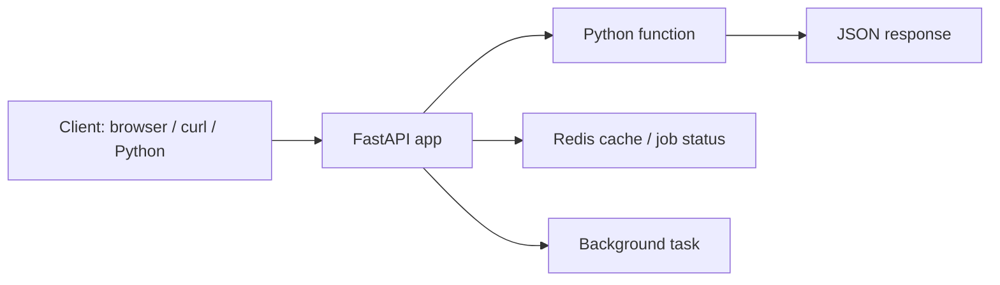
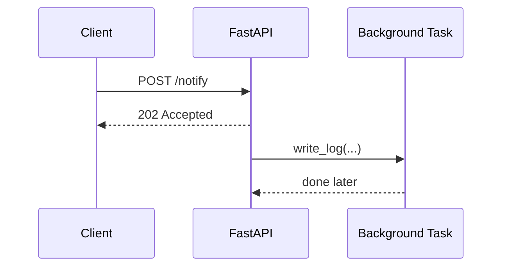
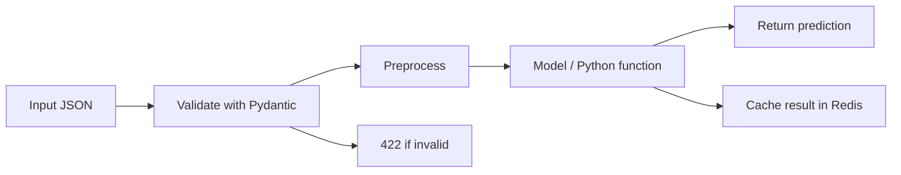

# FastAPI — Practical Notes

FastAPI is used when you want to turn Python code into an HTTP API. In real developer/data-science work, this means:

```text
Python function → API endpoint → browser/app/script can call it
```

Examples:

```text
train model locally → expose /predict
clean CSV → expose /clean
summarize text → expose /summarize
long job → start it now, check result later
cache expensive result → Redis
```



Start a project first.

```bash
# Create project
uv init fastapi-demo
cd fastapi-demo

# Add FastAPI, server, Redis client, email validation support
uv add fastapi "uvicorn[standard]" redis pydantic[email]

# Optional: run Redis locally using Docker
docker run --name tds-redis -p 6379:6379 -d redis:latest

# Check Redis is running
docker exec -it tds-redis redis-cli ping
# PONG
```

Create `main.py`.

```python
from fastapi import FastAPI

app = FastAPI(
    title="TDS FastAPI Demo",
    version="1.0.0",
    description="Small practical API for learning FastAPI"
)

@app.get("/")
def root():
    return {"message": "FastAPI is running"}

@app.get("/health")
def health():
    return {"status": "ok"}
```

Run it.

```bash
# main means main.py
# app means the FastAPI object named app
# --reload restarts server when code changes
uv run uvicorn main:app --reload
```

Open:

```text
http://localhost:8000
http://localhost:8000/docs
http://localhost:8000/redoc
http://localhost:8000/openapi.json
```

`/docs` is the most useful while learning because you can test GET, POST, PUT, PATCH, DELETE directly from the browser.

```mermaid
flowchart TD
    A[main.py] --> B[uvicorn main:app --reload]
    B --> C[localhost:8000]
    C --> D[/docs interactive API]
    C --> E[/redoc readable API docs]
    C --> F[/openapi.json machine-readable spec]
```

FastAPI routes are made using decorators. A decorator connects an HTTP method and URL path to a Python function.

```python
@app.get("/items")
def list_items():
    return {"items": ["laptop", "phone"]}

@app.post("/items")
def create_item():
    return {"message": "item created"}

@app.put("/items/{item_id}")
def replace_item(item_id: int):
    return {"message": f"item {item_id} replaced"}

@app.patch("/items/{item_id}")
def update_item_partly(item_id: int):
    return {"message": f"item {item_id} partly updated"}

@app.delete("/items/{item_id}")
def delete_item(item_id: int):
    return {"message": f"item {item_id} deleted"}
```

Think of HTTP methods like this:

```text
GET     read data
POST    create or submit data
PUT     replace full object
PATCH   update part of object
DELETE  remove object
```

Path parameters come from the URL path.

```python
@app.get("/users/{user_id}")
def get_user(user_id: int):
    # FastAPI converts user_id to int
    # /users/10 works
    # /users/abc gives 422 validation error
    return {"user_id": user_id}
```

Query parameters come after `?`.

```python
@app.get("/search")
def search(q: str, page: int = 1, limit: int = 10, active: bool | None = None):
    # q is required because it has no default
    # page and limit are optional because they have defaults
    return {
        "q": q,
        "page": page,
        "limit": limit,
        "active": active,
    }
```

Test it:

```bash
curl "http://localhost:8000/search?q=python&page=2&limit=5"
```

Request body means JSON sent by the client, usually with POST, PUT, or PATCH. Use Pydantic models to validate it.

```python
from pydantic import BaseModel, EmailStr, Field

class UserCreate(BaseModel):
    name: str = Field(min_length=2)
    email: EmailStr
    age: int | None = Field(default=None, ge=0)

class UserResponse(BaseModel):
    id: int
    name: str
    email: str

@app.post("/users", response_model=UserResponse, status_code=201)
def create_user(user: UserCreate):
    # user is already validated
    # response_model filters and validates output
    return {
        "id": 1,
        "name": user.name,
        "email": user.email,
        "password": "hidden-from-response"
    }
```

Test it:

```bash
curl -X POST "http://localhost:8000/users" \
  -H "content-type: application/json" \
  -d '{"name":"Arjun","email":"arjun@example.com","age":22}'
```

Important status codes:

```text
200 OK                 normal success
201 Created            created something
202 Accepted           accepted, processing later
204 No Content         success, no response body
400 Bad Request        client sent wrong request
404 Not Found          item does not exist
422 Validation Error   FastAPI/Pydantic validation failed
500 Server Error       bug or unexpected failure
```

Use `HTTPException` for clean API errors.

```python
from fastapi import HTTPException

items = {
    1: {"id": 1, "name": "Laptop"},
    2: {"id": 2, "name": "Phone"},
}

@app.get("/items/{item_id}")
def get_item(item_id: int):
    if item_id not in items:
        raise HTTPException(status_code=404, detail="Item not found")
    return items[item_id]
```

A small CRUD API uses the same pattern repeatedly.

```python
from fastapi import FastAPI, HTTPException
from pydantic import BaseModel
from uuid import uuid4

app = FastAPI(title="Tasks API")

class TaskCreate(BaseModel):
    title: str
    done: bool = False
    priority: int = 3

class Task(TaskCreate):
    id: str

tasks: dict[str, Task] = {}

@app.get("/tasks", response_model=list[Task])
def list_tasks(done: bool | None = None):
    # /tasks returns all
    # /tasks?done=true returns completed only
    data = list(tasks.values())

    if done is not None:
        data = [task for task in data if task.done == done]

    return data

@app.post("/tasks", response_model=Task, status_code=201)
def create_task(payload: TaskCreate):
    task = Task(id=str(uuid4()), **payload.model_dump())
    tasks[task.id] = task
    return task

@app.get("/tasks/{task_id}", response_model=Task)
def get_task(task_id: str):
    if task_id not in tasks:
        raise HTTPException(404, "Task not found")
    return tasks[task_id]

@app.put("/tasks/{task_id}", response_model=Task)
def replace_task(task_id: str, payload: TaskCreate):
    if task_id not in tasks:
        raise HTTPException(404, "Task not found")

    tasks[task_id] = Task(id=task_id, **payload.model_dump())
    return tasks[task_id]

@app.patch("/tasks/{task_id}", response_model=Task)
def mark_done(task_id: str, done: bool):
    if task_id not in tasks:
        raise HTTPException(404, "Task not found")

    old = tasks[task_id]
    tasks[task_id] = Task(
        id=old.id,
        title=old.title,
        priority=old.priority,
        done=done
    )
    return tasks[task_id]

@app.delete("/tasks/{task_id}", status_code=204)
def delete_task(task_id: str):
    if task_id not in tasks:
        raise HTTPException(404, "Task not found")

    del tasks[task_id]
    # 204 should not return a body
```

Test with curl:

```bash
# Create task
curl -X POST "http://localhost:8000/tasks" \
  -H "content-type: application/json" \
  -d '{"title":"Revise FastAPI","priority":2}'

# List tasks
curl "http://localhost:8000/tasks"

# Filter tasks
curl "http://localhost:8000/tasks?done=false"

# Mark done
curl -X PATCH "http://localhost:8000/tasks/TASK_ID?done=true"

# Delete task
curl -X DELETE "http://localhost:8000/tasks/TASK_ID"
```

Background tasks are for small work after sending the response: logging, sending notification, saving an audit file, light post-processing. Do not use them for heavy model training or long reliable jobs.

```python
from fastapi import BackgroundTasks
from datetime import datetime

def write_log(message: str):
    # This runs after response is returned
    with open("events.log", "a", encoding="utf-8") as f:
        f.write(f"{datetime.now().isoformat()} {message}\n")

@app.post("/notify", status_code=202)
def notify(email: str, background_tasks: BackgroundTasks):
    background_tasks.add_task(write_log, f"notify requested for {email}")
    return {"status": "accepted", "message": "Notification will be processed"}
```

Flow:



Redis is useful when memory should survive across requests and be shared by multiple app workers. For beginner FastAPI, use it for:

```text
cache expensive prediction
store temporary job status
count API calls
avoid recomputing same result
expire old data automatically
```

Start/stop Redis safely:

```bash
# Start Redis container
docker run --name tds-redis -p 6379:6379 -d redis:latest

# See logs
docker logs tds-redis

# Open Redis shell
docker exec -it tds-redis redis-cli

# Try commands inside redis-cli
PING
SET name fastapi
GET name
INCR visits
EXPIRE name 60
TTL name

# Stop and remove when finished
docker stop tds-redis
docker rm tds-redis
```

Use Redis in FastAPI.

```python
import redis

r = redis.Redis(
    host="localhost",
    port=6379,
    db=0,
    decode_responses=True
)

@app.get("/visits")
def visits():
    count = r.incr("api:visits")
    return {"visits": count}
```

Simple cache pattern:

```python
import json
import time
import redis

r = redis.Redis(host="localhost", port=6379, decode_responses=True)

def slow_summary(text: str) -> dict:
    # Fake slow data-science work
    time.sleep(2)
    return {
        "length": len(text),
        "words": len(text.split()),
        "preview": text[:30]
    }

@app.get("/summary")
def summary(text: str):
    cache_key = f"summary:{text}"

    cached = r.get(cache_key)
    if cached:
        return {
            "source": "redis-cache",
            "result": json.loads(cached)
        }

    result = slow_summary(text)

    # Cache for 60 seconds
    r.setex(cache_key, 60, json.dumps(result))

    return {
        "source": "computed",
        "result": result
    }
```

Data-science APIs usually follow this shape:



Complete practical example: prediction API with GET, POST, PATCH, DELETE, Redis cache, and background task.

Create `main.py`.

```python
from fastapi import FastAPI, HTTPException, BackgroundTasks
from pydantic import BaseModel, Field
from uuid import uuid4
from datetime import datetime
import hashlib
import json
import redis

app = FastAPI(
    title="TDS Mini Data Science API",
    version="1.0.0",
    description="Prediction API with validation, cache, job status, and background logging"
)

r = redis.Redis(
    host="localhost",
    port=6379,
    db=0,
    decode_responses=True
)

class PredictRequest(BaseModel):
    text: str = Field(min_length=1)
    language: str = "en"

class PredictResponse(BaseModel):
    id: str
    label: str
    score: float
    source: str

class FeedbackRequest(BaseModel):
    correct_label: str

def fake_model(text: str) -> dict:
    # Replace this with a real ML model later
    text_lower = text.lower()

    if "good" in text_lower or "great" in text_lower or "excellent" in text_lower:
        return {"label": "positive", "score": 0.90}

    if "bad" in text_lower or "poor" in text_lower or "wrong" in text_lower:
        return {"label": "negative", "score": 0.85}

    return {"label": "neutral", "score": 0.60}

def log_event(event: dict):
    # Small background task only
    with open("api-events.log", "a", encoding="utf-8") as f:
        f.write(json.dumps(event) + "\n")

def make_cache_key(payload: PredictRequest) -> str:
    # Same input should produce same cache key
    raw = payload.model_dump_json()
    digest = hashlib.sha256(raw.encode()).hexdigest()
    return f"predict:cache:{digest}"

@app.get("/")
def root():
    return {
        "message": "Mini data-science API is running",
        "docs": "/docs"
    }

@app.get("/health")
def health():
    try:
        r.ping()
        redis_status = "ok"
    except Exception:
        redis_status = "down"

    return {
        "api": "ok",
        "redis": redis_status
    }

@app.post("/predict", response_model=PredictResponse, status_code=201)
def predict(payload: PredictRequest, background_tasks: BackgroundTasks):
    cache_key = make_cache_key(payload)

    cached = r.get(cache_key)
    if cached:
        data = json.loads(cached)
        return PredictResponse(**data, source="redis-cache")

    prediction = fake_model(payload.text)

    prediction_id = str(uuid4())

    response = {
        "id": prediction_id,
        "label": prediction["label"],
        "score": prediction["score"],
        "source": "computed"
    }

    # Store full prediction for lookup
    r.setex(f"predict:item:{prediction_id}", 3600, json.dumps(response))

    # Cache same input for 5 minutes
    r.setex(cache_key, 300, json.dumps(response))

    # Store temporary job/status style information
    r.setex(f"predict:status:{prediction_id}", 3600, "completed")

    background_tasks.add_task(log_event, {
        "time": datetime.now().isoformat(),
        "event": "prediction_created",
        "id": prediction_id,
        "label": prediction["label"]
    })

    return response

@app.get("/predict/{prediction_id}")
def get_prediction(prediction_id: str):
    data = r.get(f"predict:item:{prediction_id}")

    if not data:
        raise HTTPException(404, "Prediction not found or expired")

    return json.loads(data)

@app.patch("/predict/{prediction_id}/feedback")
def add_feedback(prediction_id: str, feedback: FeedbackRequest):
    data = r.get(f"predict:item:{prediction_id}")

    if not data:
        raise HTTPException(404, "Prediction not found or expired")

    item = json.loads(data)
    item["feedback"] = feedback.correct_label

    r.setex(f"predict:item:{prediction_id}", 3600, json.dumps(item))

    return {
        "message": "feedback saved",
        "prediction": item
    }

@app.delete("/predict/{prediction_id}", status_code=204)
def delete_prediction(prediction_id: str):
    deleted = r.delete(
        f"predict:item:{prediction_id}",
        f"predict:status:{prediction_id}"
    )

    if deleted == 0:
        raise HTTPException(404, "Prediction not found")

    # 204 response should return no body
```

Run everything:

```bash
# Terminal 1: Redis
docker run --name tds-redis -p 6379:6379 -d redis:latest

# Terminal 2: FastAPI
uv run uvicorn main:app --reload
```

Test:

```bash
# Health check
curl "http://localhost:8000/health"

# Create prediction
curl -X POST "http://localhost:8000/predict" \
  -H "content-type: application/json" \
  -d '{"text":"This course is excellent","language":"en"}'

# Send same request again to see Redis cache
curl -X POST "http://localhost:8000/predict" \
  -H "content-type: application/json" \
  -d '{"text":"This course is excellent","language":"en"}'

# Get prediction by ID
curl "http://localhost:8000/predict/PASTE_ID_HERE"

# Add feedback
curl -X PATCH "http://localhost:8000/predict/PASTE_ID_HERE/feedback" \
  -H "content-type: application/json" \
  -d '{"correct_label":"positive"}'

# Delete prediction
curl -X DELETE "http://localhost:8000/predict/PASTE_ID_HERE"
```

Beginner mistakes and safe habits:

```text
Mistake: returning passwords/secrets accidentally
Safe habit: always use response_model

Mistake: using GET for actions that change data
Safe habit: GET only reads, POST/PUT/PATCH/DELETE change data

Mistake: ignoring status codes
Safe habit: use 201 for create, 202 for accepted background work, 204 for delete

Mistake: doing heavy model training inside request
Safe habit: request should be fast; use background only for small tasks

Mistake: storing important data only in Python dict
Safe habit: dict is okay for learning; Redis is better for temporary shared state

Mistake: no validation
Safe habit: define Pydantic models for request and response

Mistake: hardcoding production secrets
Safe habit: use environment variables later

Mistake: forgetting Redis is temporary unless configured
Safe habit: use Redis for cache/status, not main permanent database in this beginner setup
```

Important patterns to remember:

```python
@app.get("/x")
# read

@app.post("/x", status_code=201)
# create

@app.put("/x/{id}")
# replace full object

@app.patch("/x/{id}")
# update partial object

@app.delete("/x/{id}", status_code=204)
# delete

raise HTTPException(404, "Not found")
# clean API error

response_model=SomeModel
# validate and filter output

background_tasks.add_task(func, arg1, arg2)
# run small task after response

r.setex(key, seconds, value)
# Redis cache with expiry

r.get(key)
# read from Redis

r.delete(key)
# remove from Redis
```

Important Q&A:

Q: Why do we need `uvicorn` if we already have `FastAPI`?
A: FastAPI is the web framework that writes the logic. Uvicorn is the ASGI web server that actually runs the code, listens on ports, and handles the HTTP connections.

Q: What is the difference between `BackgroundTasks` and `Redis/Celery/RQ`?
A: `BackgroundTasks` run in the same process and memory space after the response is sent. If the server crashes, the task is lost. Tools like Celery+Redis store tasks in a separate queue so they are resilient, retryable, and run on separate worker processes.

Q: Can I return Python objects directly?
A: FastAPI will automatically convert dictionaries, lists, and Pydantic models to JSON. However, complex objects like custom classes or ML models will throw an error unless converted.

Final revision checklist:

```text
[ ] Can I create and run a FastAPI app with uvicorn?
[ ] Do I know /docs, /redoc, and /openapi.json?
[ ] Can I explain decorators like @app.get and @app.post?
[ ] Can I use path parameters like /items/{item_id}?
[ ] Can I use query parameters like /search?q=x&page=1?
[ ] Can I validate JSON body using Pydantic BaseModel?
[ ] Can I use response_model to control output?
[ ] Can I raise HTTPException for 404 errors?
[ ] Can I build GET, POST, PUT, PATCH, DELETE routes?
[ ] Can I use BackgroundTasks for small after-response work?
[ ] Can I run Redis locally and use get/set/setex/delete?
[ ] Can I cache expensive data-science results in Redis?
[ ] Can I test endpoints using /docs and curl?
```

