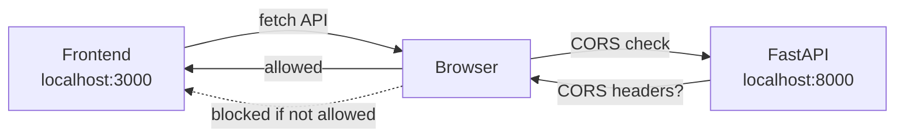
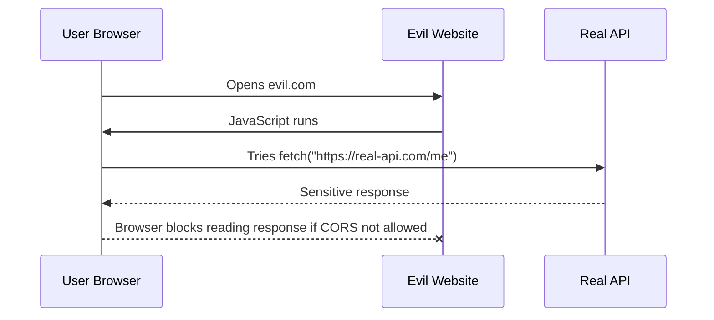
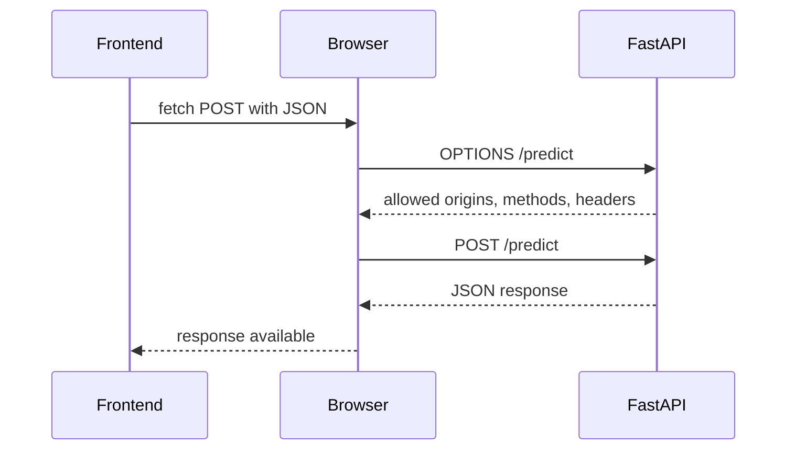
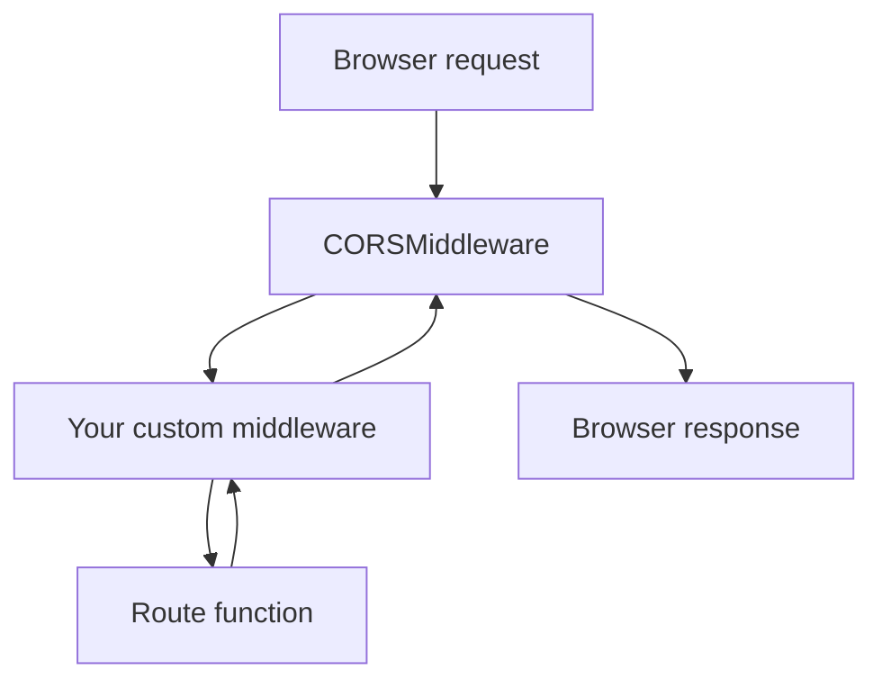

## Browser security → CORS → Middleware in FastAPI

When a frontend in the browser calls an API, the browser checks **origin**.

```text
Origin = scheme + domain + port

http://localhost:3000
https://localhost:3000
http://localhost:8000
https://api.example.com
```

These are different origins:

```text
http://localhost:3000  frontend
http://localhost:8000  backend API
```

So this frontend call is **cross-origin**:

```javascript
fetch("http://localhost:8000/predict")
```

The browser has a security rule called **Same-Origin Policy**. It stops JavaScript on one origin from freely reading sensitive data from another origin. CORS is the controlled way for a server to say: “This frontend origin is allowed to read my API response.” MDN defines CORS as an HTTP-header mechanism where the server indicates which other origins may access resources.



### What attack is the browser trying to reduce?

Imagine you are logged into your bank or college portal. Then you open a malicious website.



CORS mainly controls whether browser JavaScript can **read** a cross-origin response. It is not full security for your API. `curl`, Postman, Python scripts, and servers are not blocked by browser CORS rules. So you still need real authentication and authorization.

Important safe idea:

```text
CORS controls browser access.
Auth controls user access.
Validation controls input safety.
Rate limit/logging controls abuse.
```

CORS does **not** replace login, API keys, JWT, session checks, or permissions.

### Simple request vs preflight request

For some cross-origin requests, the browser first sends an `OPTIONS` request called a **preflight**. MDN describes preflight as a CORS check where the browser asks whether the server understands and allows the actual method/headers.



Typical preflight happens when using:

```text
POST with application/json
Authorization header
custom headers
PUT / PATCH / DELETE
```

That is why APIs often fail in browser but work in `curl`.

```bash
# curl can work even when browser says CORS error
curl http://localhost:8000/health
```

## Add CORS in FastAPI

Install and run as usual:

```bash
uv add fastapi "uvicorn[standard]"

uv run uvicorn main:app --reload
```

Create `main.py`.

```python
from fastapi import FastAPI
from fastapi.middleware.cors import CORSMiddleware

app = FastAPI(title="CORS Demo")

# These are frontend origins allowed to call this API from browser
origins = [
    "http://localhost:3000",
    "http://localhost:5173",
    "https://my-frontend.example.com",
]

app.add_middleware(
    CORSMiddleware,
    allow_origins=origins,          # Do not use ["*"] for real apps with login/cookies
    allow_credentials=True,         # Allow cookies / Authorization headers
    allow_methods=["GET", "POST", "PATCH", "DELETE"],
    allow_headers=["Authorization", "Content-Type"],
)

@app.get("/health")
def health():
    return {"status": "ok"}

@app.post("/predict")
def predict(payload: dict):
    return {
        "received": payload,
        "label": "demo"
    }
```

FastAPI’s official CORS docs recommend creating a list of allowed origins and adding `CORSMiddleware`; it can also control credentials, methods, and headers.

For local development, common frontend origins are:

```text
React / Next.js often: http://localhost:3000
Vite often:           http://localhost:5173
FastAPI backend:      http://localhost:8000
```

Test from browser frontend:

```javascript
fetch("http://localhost:8000/predict", {
  method: "POST",
  headers: {
    "Content-Type": "application/json"
  },
  body: JSON.stringify({ text: "FastAPI is useful" })
})
  .then(res => res.json())
  .then(data => console.log(data))
```

### Unsafe CORS pattern

Avoid this in real apps:

```python
app.add_middleware(
    CORSMiddleware,
    allow_origins=["*"],
    allow_credentials=True,
    allow_methods=["*"],
    allow_headers=["*"],
)
```

Why unsafe/confusing?

```text
["*"] means any website origin.
allow_credentials=True means cookies/auth headers may be involved.
For real apps, explicitly list trusted frontend origins.
```

FastAPI’s docs note that wildcard origins allow all origins, but credentialed requests need explicit origins rather than the wildcard style.

Good beginner pattern:

```python
origins = [
    "http://localhost:3000",
    "http://localhost:5173",
    "https://your-real-frontend.com",
]
```

## Middleware: code that runs around every request

Middleware sits between the client and your route function.

FastAPI describes middleware as a function that works with every request before it reaches a path operation, and with every response before it returns to the client.


Use middleware for cross-cutting work:

```text
request timing
logging
request ID
security headers
simple rate-limit checks
response headers
CORS
compression
```

Do not put business logic inside middleware. Keep routes responsible for actual work like prediction, search, upload, or task creation.

### Simple timing middleware

```python
from fastapi import FastAPI, Request
import time

app = FastAPI(title="Middleware Demo")

@app.middleware("http")
async def add_process_time_header(request: Request, call_next):
    # Runs before the route
    start = time.perf_counter()

    response = await call_next(request)

    # Runs after the route
    duration = time.perf_counter() - start
    response.headers["X-Process-Time"] = str(round(duration, 4))

    return response

@app.get("/slow")
def slow():
    return {"message": "done"}
```

Test:

```bash
curl -i http://localhost:8000/slow
```

You should see a header like:

```text
X-Process-Time: 0.0012
```

### Logging middleware

```python
from fastapi import FastAPI, Request
import time

app = FastAPI()

@app.middleware("http")
async def log_requests(request: Request, call_next):
    start = time.perf_counter()

    response = await call_next(request)

    duration = time.perf_counter() - start

    print(
        request.method,
        request.url.path,
        response.status_code,
        round(duration, 4)
    )

    return response

@app.get("/items/{item_id}")
def get_item(item_id: int):
    return {"item_id": item_id}
```

Example output:

```text
GET /items/10 200 0.0008
GET /items/abc 422 0.0011
```

### Add security-style response headers

This is not full security, but it is a good habit.

```python
from fastapi import FastAPI, Request

app = FastAPI()

@app.middleware("http")
async def add_security_headers(request: Request, call_next):
    response = await call_next(request)

    response.headers["X-Content-Type-Options"] = "nosniff"
    response.headers["X-Frame-Options"] = "DENY"

    return response

@app.get("/")
def root():
    return {"message": "secure-ish headers added"}
```

Middleware is also how many framework features are added. FastAPI supports Starlette/ASGI middleware, so you can use built-in and compatible third-party middleware when needed.

## CORS itself is middleware

This is the key connection:



Example with both CORS and timing middleware:

```python
from fastapi import FastAPI, Request
from fastapi.middleware.cors import CORSMiddleware
import time

app = FastAPI(title="CORS + Middleware Demo")

origins = [
    "http://localhost:3000",
    "http://localhost:5173",
]

app.add_middleware(
    CORSMiddleware,
    allow_origins=origins,
    allow_credentials=True,
    allow_methods=["GET", "POST", "PATCH", "DELETE"],
    allow_headers=["Authorization", "Content-Type"],
)

@app.middleware("http")
async def add_process_time(request: Request, call_next):
    start = time.perf_counter()

    response = await call_next(request)

    duration = time.perf_counter() - start
    response.headers["X-Process-Time"] = str(round(duration, 4))

    return response

@app.get("/health")
def health():
    return {"status": "ok"}

@app.post("/predict")
def predict(payload: dict):
    text = payload.get("text", "")

    return {
        "text": text,
        "length": len(text),
        "label": "demo"
    }
```

## Common CORS errors and fixes

```text
Error:
No 'Access-Control-Allow-Origin' header

Meaning:
Backend did not allow this frontend origin.

Fix:
Add frontend URL to allow_origins.
```

```text
Error:
Method PATCH is not allowed

Meaning:
CORS config did not allow PATCH.

Fix:
Add "PATCH" to allow_methods.
```

```text
Error:
Request header field authorization is not allowed

Meaning:
Frontend sent Authorization header, but CORS did not allow it.

Fix:
Add "Authorization" to allow_headers.
```

```text
Works in curl but fails in browser

Meaning:
Likely CORS. curl is not restricted by browser CORS.

Fix:
Configure CORSMiddleware correctly.
```

## Practical safe habits

```text
Use exact origins in production.
Use ["*"] only for public APIs without cookies/auth, or quick local testing.
Do not treat CORS as authentication.
Do not allow every method/header unless needed.
Check browser DevTools Network tab.
Remember preflight OPTIONS is normal.
Keep middleware small and fast.
Do not read huge request bodies in middleware casually.
Do not put ML prediction logic in middleware.
Use middleware for logging, timing, headers, request IDs.
```

## Important Q&A

**Q: Can CORS prevent someone from scraping my API with Python?**
A: No, CORS only controls browsers. Tools like `curl` and Python `requests` ignore CORS headers. To prevent scraping, you need authentication and rate limiting.

**Q: Why does my browser send an `OPTIONS` request instead of a `POST` request?**
A: That is the CORS preflight. The browser checks if the server allows the actual request (e.g., POST with JSON). Once the server replies "yes" to `OPTIONS`, the browser sends the `POST`.

**Q: Is it safe to use `allow_origins=["*"]`?**
A: It is okay for a purely public API with no sensitive data. However, if your API handles user accounts, cookies, or sensitive data, you must explicitly list your frontend URLs.

## Final revision checklist

```text
[ ] Do I know what an origin is: scheme + domain + port?
[ ] Do I know why localhost:3000 and localhost:8000 are different origins?
[ ] Do I know that CORS is enforced by browsers, not curl?
[ ] Do I know that CORS controls browser reading, not real API authorization?
[ ] Can I add CORSMiddleware in FastAPI?
[ ] Can I list trusted frontend origins?
[ ] Can I allow methods like GET, POST, PATCH, DELETE?
[ ] Can I allow headers like Authorization and Content-Type?
[ ] Do I know what an OPTIONS preflight request is?
[ ] Can I write simple middleware for timing/logging?
[ ] Do I understand request → middleware → route → middleware → response?
```

