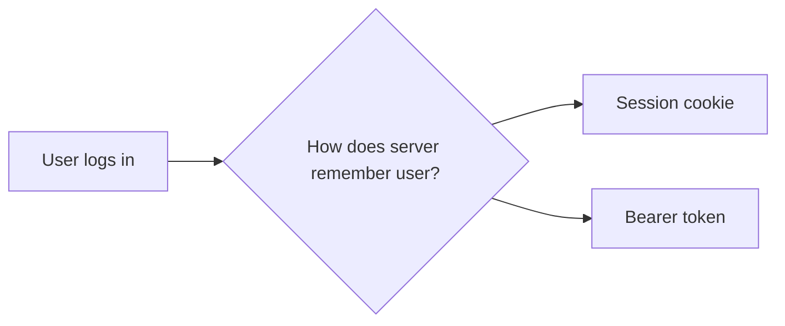
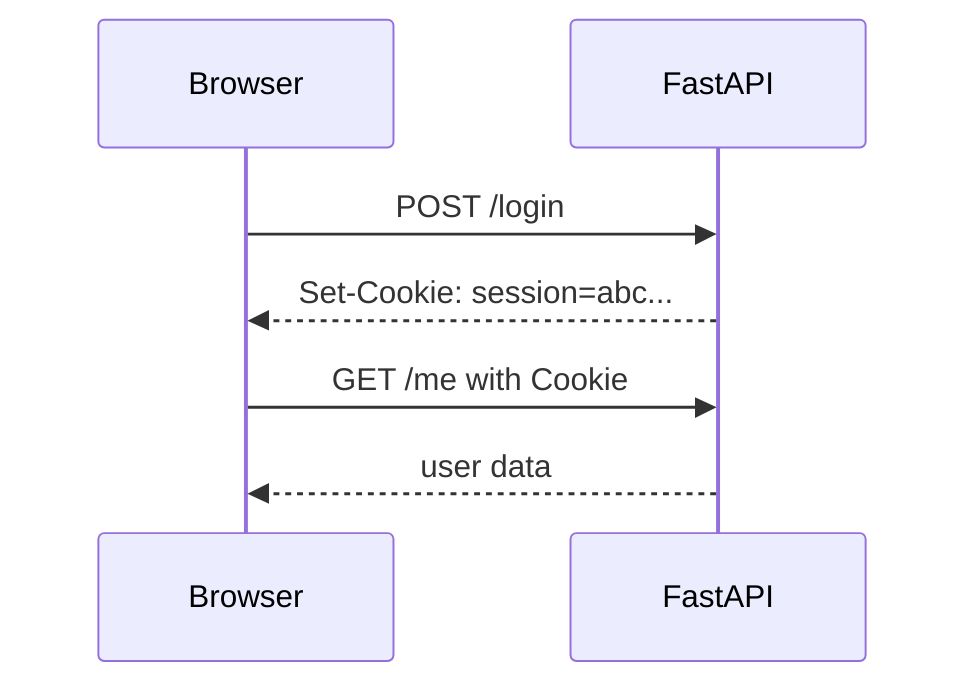
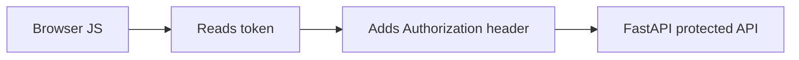
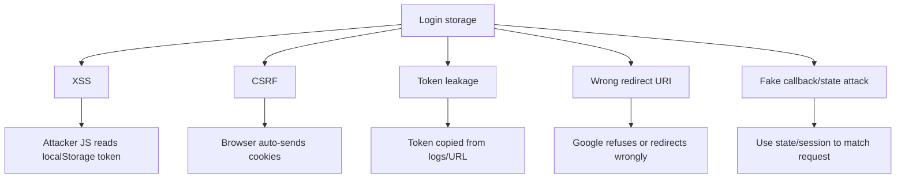
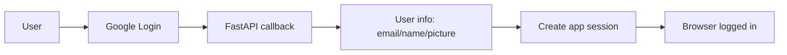
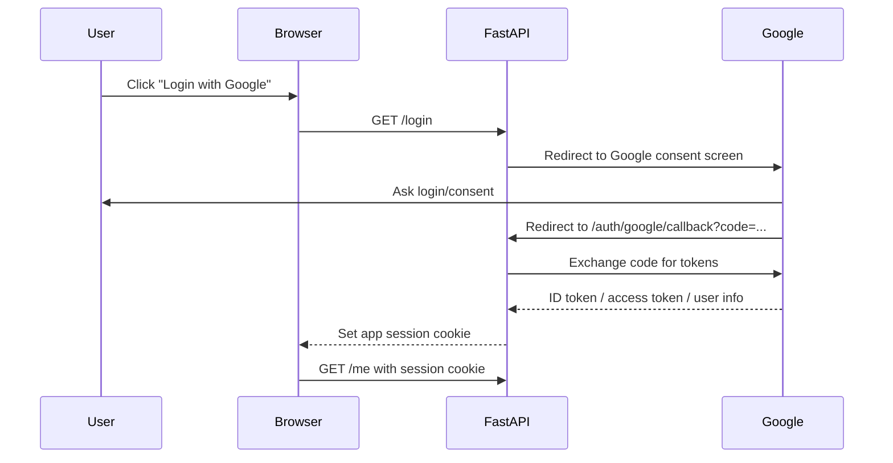
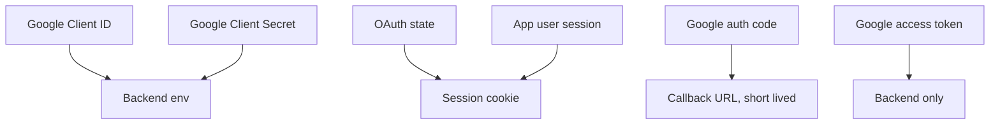
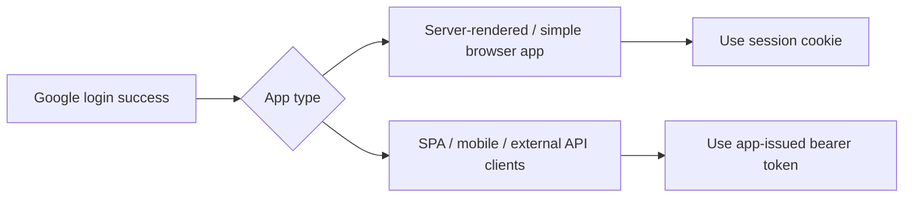

## Google OAuth with FastAPI: sessions, bearer tokens, browser storage

Before Google OAuth, understand two login styles.



A **session** means the browser stores a small cookie. On every request, the browser automatically sends it back.



In FastAPI/Starlette, `SessionMiddleware` gives signed cookie-based sessions, and the session cookie is `HttpOnly`, so JavaScript cannot read it directly.

```python
from starlette.middleware.sessions import SessionMiddleware

app.add_middleware(
    SessionMiddleware,
    secret_key="CHANGE_ME_TO_RANDOM_SECRET",
    same_site="lax",
    https_only=False,  # True in production HTTPS
)
```

A **bearer token** means the client sends a token manually, usually in the `Authorization` header. FastAPI has built-in tools for OAuth2 bearer-token style APIs.

```http
Authorization: Bearer eyJhbGciOi...
```



Where browser can store login data:

```text
Cookie
# auto-sent by browser
# can be HttpOnly
# safer from token stealing by JS
# needs CSRF thinking when used cross-site

localStorage
# easy for frontend JS
# survives tab/browser restart
# risky if XSS happens, because JS can read it

sessionStorage
# similar to localStorage
# cleared when tab closes
# still readable by JS

memory variable
# safest from storage stealing
# lost on refresh
# common for short-lived access tokens
```

Simple mental rule:

```text
Session cookie = browser carries login automatically.
Bearer token = whoever has the token can use it.
Google OAuth = let Google prove who the user is.
```

## What attacks/issues are possible?



Safe habits:

```text
Use HTTPS in production.
Never put client_secret in frontend code.
Do not store tokens in URLs.
Use state/session during OAuth redirect.
Use exact redirect URI in Google Console.
Request only needed scopes.
Use HttpOnly cookies for app session.
```

Google’s web-server OAuth flow is designed for apps that can securely store confidential data and maintain state. It redirects the user to Google, receives an authorization code, then exchanges that code for access/refresh tokens; access tokens should be sent to Google APIs using `Authorization: Bearer`.

## OAuth vs OpenID Connect

For login, we usually use Google with:

```text
openid email profile
```

Meaning:

```text
openid   # ask for identity login
email    # get user's email
profile  # get basic profile like name/picture
```

OAuth is mainly **authorization**: “Can this app access something?”

OpenID Connect on top of OAuth is for **authentication**: “Who is this user?”



## Google OAuth flow in FastAPI



## Create Google OAuth credentials

In Google Cloud Console:

```text
APIs & Services
→ Credentials
→ Create OAuth client ID
→ Application type: Web application
→ Authorized redirect URI:
  http://localhost:8000/auth/google/callback
```

Google’s docs say web apps using server-side languages like Python must specify authorized redirect URIs, and localhost redirect URIs are allowed for testing.

## Minimal FastAPI Google OAuth app

Install:

```bash
uv init google-oauth-fastapi
cd google-oauth-fastapi

uv add fastapi "uvicorn[standard]" authlib itsdangerous python-dotenv
```

Create `.env`.

```bash
GOOGLE_CLIENT_ID="your-google-client-id"
GOOGLE_CLIENT_SECRET="your-google-client-secret"
SESSION_SECRET="generate-a-long-random-secret"
```

Create `main.py`.

```python
import os
from dotenv import load_dotenv
from fastapi import FastAPI, Request
from fastapi.responses import RedirectResponse, JSONResponse
from starlette.middleware.sessions import SessionMiddleware
from authlib.integrations.starlette_client import OAuth

load_dotenv()

app = FastAPI(title="Google OAuth Demo")

# Session is needed to remember temporary OAuth state
# Authlib's FastAPI docs use SessionMiddleware to save temporary code/state
app.add_middleware(
    SessionMiddleware,
    secret_key=os.getenv("SESSION_SECRET"),
    same_site="lax",
    https_only=False,  # Set True in production HTTPS
)

oauth = OAuth()

oauth.register(
    name="google",
    client_id=os.getenv("GOOGLE_CLIENT_ID"),
    client_secret=os.getenv("GOOGLE_CLIENT_SECRET"),
    server_metadata_url="https://accounts.google.com/.well-known/openid-configuration",
    client_kwargs={
        "scope": "openid email profile"
    },
)

@app.get("/")
def home(request: Request):
    user = request.session.get("user")

    if user:
        return {
            "message": "You are logged in",
            "user": user,
            "logout": "/logout",
        }

    return {
        "message": "You are not logged in",
        "login": "/login",
    }

@app.get("/login")
async def login(request: Request):
    # This must exactly match Google Console redirect URI
    redirect_uri = request.url_for("auth_callback")

    # Sends browser to Google login/consent page
    return await oauth.google.authorize_redirect(request, redirect_uri)

@app.get("/auth/google/callback")
async def auth_callback(request: Request):
    # Authlib checks state and exchanges code for token
    token = await oauth.google.authorize_access_token(request)

    # For OpenID Connect, user info is available from the token/userinfo
    user = token.get("userinfo")

    if not user:
        return JSONResponse(
            {"error": "Could not fetch user info"},
            status_code=400,
        )

    # Store only safe, small identity data in session
    request.session["user"] = {
        "email": user.get("email"),
        "name": user.get("name"),
        "picture": user.get("picture"),
    }

    return RedirectResponse(url="/me")

@app.get("/me")
def me(request: Request):
    user = request.session.get("user")

    if not user:
        return JSONResponse(
            {"error": "Not logged in"},
            status_code=401,
        )

    return user

@app.get("/logout")
def logout(request: Request):
    request.session.clear()
    return {"message": "logged out"}
```

Run:

```bash
uv run uvicorn main:app --reload
```

Open the app in browser:

```text
localhost:8000
```

Authlib’s FastAPI OAuth client docs use Starlette’s `SessionMiddleware` because temporary OAuth code/state must be stored during the redirect flow.

## What is stored where?



Keep this mental model:

```text
Frontend should know: user is logged in.
Backend should know: Google secret, token exchange, session details.
Google should know: user consent and app identity.
```

## When to use session vs bearer after Google login?

For a simple FastAPI web app:

```text
Use Google OAuth login
→ create server-side app session
→ browser uses session cookie
```

For API/mobile/SPA style:

```text
Use Google OAuth login
→ backend verifies identity
→ backend issues your own short-lived JWT/bearer token
→ frontend sends Authorization: Bearer token
```

For beginners, start with **session cookie**. It is easier to understand and safer than manually storing bearer tokens in `localStorage`.



## Common mistakes

```text
Mistake: putting GOOGLE_CLIENT_SECRET in frontend JavaScript
Fix: keep it only in backend .env

Mistake: redirect URI mismatch
Fix: Google Console URI must exactly match FastAPI callback URL

Mistake: storing full Google token in browser
Fix: keep sensitive tokens backend-side

Mistake: using OAuth as permission system without app checks
Fix: Google login tells identity; your app still checks roles/permissions

Mistake: requesting too many scopes
Fix: start with openid email profile

Mistake: testing only with curl
Fix: OAuth login flow needs browser redirects

Mistake: using https_only=False in production
Fix: use HTTPS and https_only=True
```

## Important Q&A

**Q: Can I use `localhost` for Google OAuth testing?**
A: Yes, Google allows `localhost` without HTTPS for testing.

**Q: What is the difference between Access Token and ID Token?**
A: An Access Token is used to call APIs (like reading Google Drive). An ID Token is a JWT that proves the user's identity (like email and name) to your app. OpenID Connect relies on the ID Token.

**Q: Where should the session secret come from in production?**
A: Use a strong, random, and unguessable string stored in environment variables. Do not hardcode it in the script.

## Tiny revision checklist

```text
[ ] Session cookie is auto-sent by browser.
[ ] Bearer token must be manually sent in Authorization header.
[ ] localStorage is easy but risky under XSS.
[ ] HttpOnly cookie cannot be read by frontend JS.
[ ] Google OAuth redirects user to Google, then back to FastAPI.
[ ] Callback receives code, backend exchanges it for token/user info.
[ ] Use openid email profile for login.
[ ] Keep client secret only on backend.
[ ] Redirect URI must exactly match Google Console.
[ ] Store small user info in session, not secrets.
[ ] CORS is separate from OAuth.
[ ] OAuth login is not enough; app still needs authorization rules.
```

