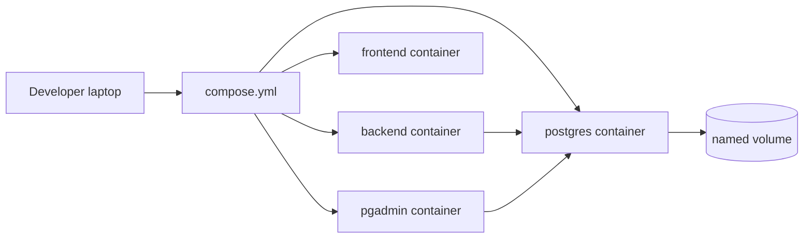
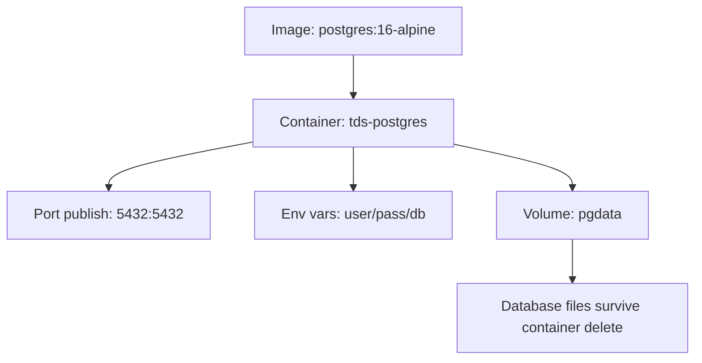
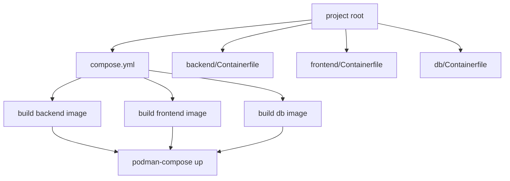
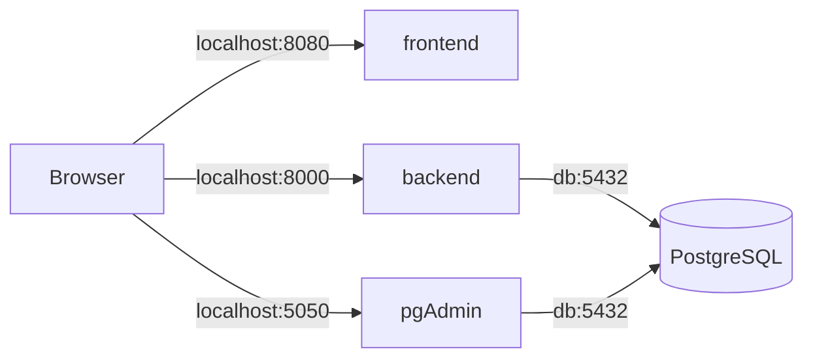

# Podman Compose — Practical Notes

Use containers when your app is not one process anymore. Real projects usually have **API + database + frontend + admin UI + cache**. Podman runs each part in an isolated container; Compose starts/stops them together with one file.



Podman is free and open source (Apache License). `podman-compose` is a Compose implementation for Podman focused on rootless and daemonless use.

### Install, verify, uninstall

```bash
# Ubuntu / Debian
sudo apt-get update
sudo apt-get -y install podman podman-compose

# Fedora
sudo dnf -y install podman podman-compose

# macOS
brew install podman podman-compose
podman machine init
podman machine start

# verify
podman --version
podman info
podman-compose --version

# uninstall: Ubuntu / Debian
sudo apt-get remove -y podman podman-compose
sudo apt-get autoremove -y

# uninstall: Fedora
sudo dnf remove -y podman podman-compose

# uninstall: macOS
podman machine stop
podman machine rm
brew uninstall podman podman-compose
```

`podman-compose` is direct and simple. Newer Podman also has `podman compose`, but that is a wrapper around an installed Compose provider, so beginners should use **one style consistently**: `podman-compose up`, `podman-compose down`, `podman-compose logs`.

First learn single containers. An **image** is the packaged blueprint. A **container** is the running process. `-p` publishes ports as `host_port:container_port`. `-v` attaches storage. Named volumes are safer than random folders for databases.

```bash
# pull small test image
podman pull postgres:16-alpine

# create named volumes
podman volume create pgdata
podman volume create pgadmin_data

# run PostgreSQL
podman run -d \
  --name tds-postgres \
  -e POSTGRES_DB=tdsdb \
  -e POSTGRES_USER=tdsuser \
  -e POSTGRES_PASSWORD=tdspass \
  -p 5432:5432 \
  -v pgdata:/var/lib/postgresql/data \
  postgres:16-alpine

# run pgAdmin
podman run -d \
  --name tds-pgadmin \
  -e PGADMIN_DEFAULT_EMAIL=admin@example.com \
  -e PGADMIN_DEFAULT_PASSWORD=adminpass \
  -p 5050:80 \
  -v pgadmin_data:/var/lib/pgadmin \
  dpage/pgadmin4:latest

# check containers
podman ps
podman ps -a

# open pgAdmin in browser
# http://localhost:5050
# connect host: host.containers.internal or your machine IP if needed
# port: 5432, user: tdsuser, password: tdspass, db: tdsdb

# logs
podman logs tds-postgres
podman logs -f tds-pgadmin

# enter container shell
podman exec -it tds-postgres sh

# run psql inside postgres container
podman exec -it tds-postgres psql -U tdsuser -d tdsdb

# stop / start / restart
podman stop tds-postgres tds-pgadmin
podman start tds-postgres tds-pgadmin
podman restart tds-postgres

# remove stopped containers
podman rm tds-postgres tds-pgadmin

# remove volumes only when you want to delete database data
podman volume ls
podman volume rm pgdata pgadmin_data

# clean unused images/containers/networks
podman system prune
```

Important mental model:



Now build your own app image. In Podman, name the recipe **Containerfile**. Keep `.containerignore` beside it so secrets, virtual environments, and cache do not enter the build context.

```bash
mkdir -p tds-podman-app/backend
cd tds-podman-app/backend

cat > main.py <<'PY'
from fastapi import FastAPI
import os

app = FastAPI()

@app.get("/")
def home():
    return {
        "message": "Backend running with Podman",
        "database_url": os.getenv("DATABASE_URL", "missing")
    }
PY

cat > requirements.txt <<'TXT'
fastapi
uvicorn[standard]
psycopg[binary]
TXT

cat > Containerfile <<'EOF'
FROM python:3.12-slim

WORKDIR /app

COPY requirements.txt .
RUN pip install --no-cache-dir -r requirements.txt

COPY main.py .

EXPOSE 8000

CMD ["uvicorn", "main:app", "--host", "0.0.0.0", "--port", "8000"]
EOF

cat > .containerignore <<'EOF'
.env
__pycache__/
*.pyc
.venv/
.git/
.pytest_cache/
EOF

podman build -t tds-backend .
podman run --rm -p 8000:8000 tds-backend

# browser: http://localhost:8000
```

For multi-folder projects, keep each service isolated:

```text
tds-podman-app/
  compose.yml
  .env
  backend/
    Containerfile
    main.py
    requirements.txt
    .containerignore
  frontend/
    Containerfile
    index.html
    .containerignore
  db/
    Containerfile
    init.sql
```



Create the complete example:

```bash
cd ..
mkdir -p frontend db

cat > frontend/index.html <<'HTML'
<h1>TDS Podman Compose App</h1>
<p>Frontend is running.</p>
<p>Backend: <a href="http://localhost:8000">http://localhost:8000</a></p>
HTML

cat > frontend/Containerfile <<'EOF'
FROM nginx:alpine
COPY index.html /usr/share/nginx/html/index.html
EXPOSE 80
EOF

cat > frontend/.containerignore <<'EOF'
.git/
node_modules/
.env
EOF

cat > db/init.sql <<'SQL'
CREATE TABLE IF NOT EXISTS notes (
  id SERIAL PRIMARY KEY,
  text TEXT NOT NULL
);

INSERT INTO notes (text)
VALUES ('Podman Compose started PostgreSQL successfully');
SQL

cat > db/Containerfile <<'EOF'
FROM postgres:16-alpine
COPY init.sql /docker-entrypoint-initdb.d/init.sql
EOF

cat > .env <<'EOF'
POSTGRES_DB=tdsdb
POSTGRES_USER=tdsuser
POSTGRES_PASSWORD=tdspass
PGADMIN_DEFAULT_EMAIL=admin@example.com
PGADMIN_DEFAULT_PASSWORD=adminpass
EOF

cat > compose.yml <<'YAML'
services:
  db:
    build: ./db
    container_name: tds-db
    env_file:
      - .env
    volumes:
      - pgdata:/var/lib/postgresql/data
    healthcheck:
      test: ["CMD-SHELL", "pg_isready -U tdsuser -d tdsdb"]
      interval: 5s
      timeout: 5s
      retries: 5

  backend:
    build: ./backend
    container_name: tds-backend
    environment:
      DATABASE_URL: postgresql://tdsuser:tdspass@db:5432/tdsdb
    ports:
      - "8000:8000"
    depends_on:
      - db

  frontend:
    build: ./frontend
    container_name: tds-frontend
    ports:
      - "8080:80"
    depends_on:
      - backend

  pgadmin:
    image: dpage/pgadmin4:latest
    container_name: tds-pgadmin
    env_file:
      - .env
    ports:
      - "5050:80"
    volumes:
      - pgadmin_data:/var/lib/pgadmin
    depends_on:
      - db

volumes:
  pgdata:
  pgadmin_data:
YAML
```

Run the whole system:

```bash
# build and start all services
podman-compose up --build

# or run in background
podman-compose up -d --build

# see all services
podman-compose ps
podman ps

# follow all logs
podman-compose logs -f

# follow one service
podman-compose logs -f backend

# rebuild only backend after changing backend code
podman-compose build backend
podman-compose up -d backend

# stop services but keep database volumes
podman-compose down

# stop and delete database/admin volumes too: dangerous
podman-compose down -v

# deep cleanup after experiments
podman system prune
podman volume prune
```

Open:

```text
Frontend: http://localhost:8080
Backend:  http://localhost:8000
pgAdmin:  http://localhost:5050
```

Inside Compose, service names become network names. The backend uses `db:5432`, not `localhost:5432`, because `localhost` inside backend means “backend container itself”.



Profiles are useful when some services are optional. For example, run only app + database normally, and add pgAdmin only when debugging.

```yaml
services:
  pgadmin:
    image: dpage/pgadmin4:latest
    profiles: ["debug"]
    ports:
      - "5050:80"
```

```bash
# normal app
podman-compose up -d

# include debug tools
podman-compose --profile debug up -d
```

Build caching rule: copy dependency files first, then source code. That way, changing `main.py` does not reinstall every package.

```Containerfile
FROM python:3.12-slim
WORKDIR /app

# dependencies change less often
COPY requirements.txt .
RUN pip install --no-cache-dir -r requirements.txt

# app code changes often
COPY . .

CMD ["uvicorn", "main:app", "--host", "0.0.0.0", "--port", "8000"]
```

Beginner mistakes and safe habits:

```text
Mistake: putting secrets directly in compose.yml
Safe: use .env locally, real secrets manager in production

Mistake: using localhost between containers
Safe: use service name, like db:5432

Mistake: deleting volumes accidentally
Safe: podman-compose down keeps volumes; down -v deletes data

Mistake: no .containerignore
Safe: exclude .env, .venv, node_modules, cache, .git

Mistake: random latest image everywhere
Safe: pin versions for serious work, like postgres:16-alpine

Mistake: rebuilding everything after every small change
Safe: podman-compose build backend, then up -d backend

Mistake: assuming container is ready because it started
Safe: add healthcheck for DB-like services
```

## Important Q&A

**Q: Can I use Docker Compose instead of Podman Compose?**
A: Yes. Docker Compose and Podman Compose use the same `compose.yml` file format. If you use Docker, run `docker compose up` instead.

**Q: Why does my backend fail to connect to the database on start?**
A: Containers start at the same time. Even if backend `depends_on` database, the database process might still be booting up. That's why healthchecks are used to delay the backend startup until the database is truly ready.

**Q: How do I rebuild the image if I change `requirements.txt`?**
A: Use `podman-compose up --build backend`. The `--build` flag forces a fresh build using your updated Containerfile and requirements.

---

## Video Resources

Watch these videos to learn the fundamentals of Docker, Podman, and containerization:

[](https://youtu.be/YXfA5O5Mr18)

[](https://youtu.be/gAkwW2tuIqE)

*   **Optional:** For Windows, see [WSL 2 with Docker getting started](https://youtu.be/5RQbdMn04Oc)

---

Final revision checklist:

```text
[ ] Can install, verify, and uninstall Podman
[ ] Know image vs container vs volume vs port publish
[ ] Can run PostgreSQL + pgAdmin using podman run
[ ] Can build an app using Containerfile
[ ] Can keep builds clean using .containerignore
[ ] Can structure backend/frontend/db folders
[ ] Can combine services using compose.yml
[ ] Can run up, up -d, logs, ps, build, down, down -v
[ ] Know that service-to-service uses service names, not localhost
[ ] Never delete volumes unless you really want to wipe data
```

