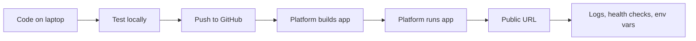
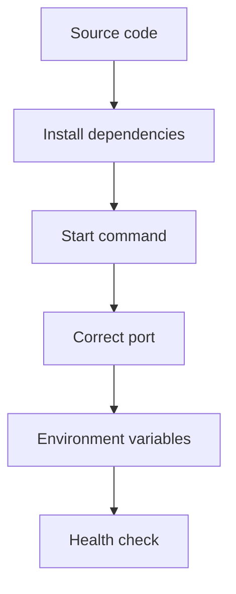
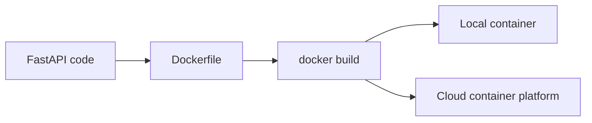
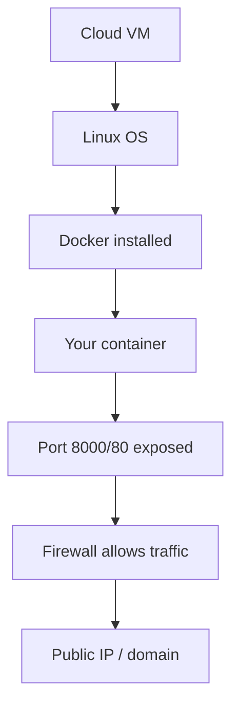
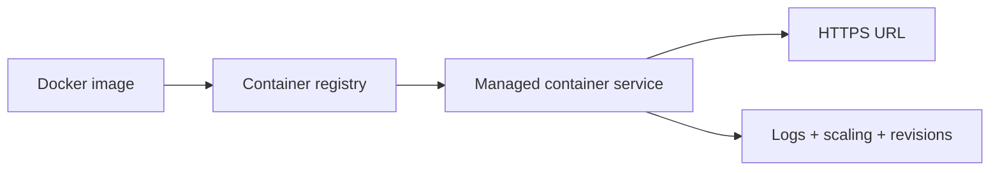
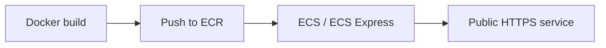
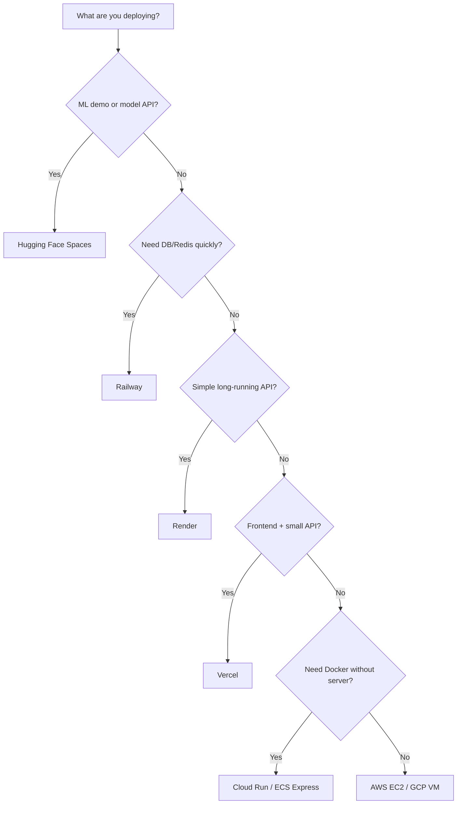

# Deployment Platforms — Practical Notes

Deployment means: your app stops living only on `localhost` and starts running on a public URL.

Real developer flow:



Use deployment platforms when you want to share APIs, demos, dashboards, ML apps, assignments, prototypes, or production services.

The basic rule:

```text
simple ML demo / model API       -> Hugging Face Spaces
simple backend API               -> Render
backend + database + Redis       -> Railway
frontend / serverless FastAPI    -> Vercel
full control Linux server        -> AWS EC2 / GCP VM
managed Docker container         -> GCP Cloud Run / AWS ECS Express
```

## Start with one tiny FastAPI app

Create the same app once, then deploy it anywhere.

```bash
# create project
mkdir deploy-demo
cd deploy-demo

# create uv project
uv init
uv add fastapi uvicorn

# create main.py
cat > main.py <<'PY'
import os
from fastapi import FastAPI

app = FastAPI()

@app.get("/")
def home():
    return {
        "message": "Hello from deployed FastAPI",
        "env": os.getenv("APP_ENV", "local")
    }

@app.get("/health")
def health():
    return {"status": "ok"}

@app.get("/ready")
def ready():
    # in real apps, also check DB, Redis, model files, etc.
    return {"status": "ready"}
PY

# run locally
uv run uvicorn main:app --reload --host 0.0.0.0 --port 8000

# test from another terminal
curl http://localhost:8000/
curl http://localhost:8000/health
```

Every platform needs the same 5 things:



The most common beginner mistake is hardcoding the port. Locally you may use `8000`, but many platforms inject `$PORT`.

```bash
# good platform-safe pattern
uv run uvicorn main:app --host 0.0.0.0 --port ${PORT:-8000}
```

---

# Platform notes

## Hugging Face Spaces

Best for ML demos, model APIs, Gradio/Streamlit apps, and Docker-based AI apps. Use Docker Spaces with port `7860` in the `README.md` metadata.

Project structure:

```text
deploy-demo/
├── main.py
├── pyproject.toml
├── uv.lock
├── Dockerfile
└── README.md
```

`Dockerfile`:

```dockerfile
FROM python:3.12-slim

# HF Spaces commonly runs apps as UID 1000
RUN useradd -m -u 1000 user
WORKDIR /app

RUN pip install uv

COPY --chown=user pyproject.toml uv.lock ./
RUN uv sync --frozen --no-dev

COPY --chown=user . .
USER user

EXPOSE 7860

CMD ["uv", "run", "uvicorn", "main:app", "--host", "0.0.0.0", "--port", "7860"]
```

`README.md`:

```md
---
title: My TDS API
emoji: 🚀
colorFrom: blue
colorTo: purple
sdk: docker
app_port: 7860
pinned: false
---

# My TDS API

FastAPI service deployed on Hugging Face Spaces.
```

Deploy:

```bash
# first push your code to GitHub or local git
git init
git add .
git commit -m "deploy fastapi app"

# add HF Space remote
git remote add space https://huggingface.co/spaces/YOUR_USERNAME/my-api

# deploy
git push space main
```

Use HF when your app is demo-first. Avoid storing production databases inside a free Space.

---

## Render

Best for normal APIs, background workers, cron jobs, and apps that need simple GitHub auto-deploy. Define deployment config in `render.yaml`, use `$PORT`, and add a health check path.

`render.yaml`:

```yaml
services:
  - type: web
    name: tds-api
    runtime: python
    buildCommand: pip install uv && uv sync --frozen
    startCommand: uv run uvicorn main:app --host 0.0.0.0 --port $PORT
    healthCheckPath: /health
    envVars:
      - key: APP_ENV
        value: production
      - key: SECRET_KEY
        generateValue: true
```

Deploy pattern:

```bash
git add .
git commit -m "add render config"
git push origin main

# then in Render dashboard:
# New Web Service -> connect GitHub repo -> deploy
```

Use Render when you want simple backend hosting. Safe habit: always check logs after deploy.

```bash
# common local check before pushing
uv run uvicorn main:app --host 0.0.0.0 --port 8000
curl http://localhost:8000/health
```

---

## Railway

Best for full-stack student projects where API + PostgreSQL + Redis should live together. Railway injects `DATABASE_URL` and `REDIS_URL` automatically when you add those services.

CLI flow:

```bash
# install Railway CLI
npm install -g @railway/cli

# login and create project
railway login
railway init

# add services if needed
railway add postgresql
railway add redis

# deploy current folder
railway up
```

In code:

```python
import os

DATABASE_URL = os.getenv("DATABASE_URL")
REDIS_URL = os.getenv("REDIS_URL")
```

Optional `railway.json`:

```json
{
  "$schema": "https://railway.com/railway.schema.json",
  "build": {
    "builder": "RAILPACK"
  },
  "deploy": {
    "startCommand": "uv run uvicorn main:app --host 0.0.0.0 --port ${PORT:-8000}"
  }
}
```

Use Railway when your app needs managed DB quickly. Safe habit: do not create database tables manually only from your laptop; use migrations later.

---

## Vercel

Best for frontend apps, serverless APIs, Next.js, and small FastAPI endpoints. FastAPI apps become Vercel Functions when placed in `app.py`, `index.py`, `server.py`, or under `src/`.

Simple structure:

```text
vercel-fastapi/
├── src/
│   └── index.py
├── pyproject.toml
└── vercel.json
```

`src/index.py`:

```python
from fastapi import FastAPI

app = FastAPI()

@app.get("/")
def home():
    return {"message": "FastAPI on Vercel"}

@app.get("/health")
def health():
    return {"status": "ok"}
```

Deploy:

```bash
npm install -g vercel

vercel login
vercel

# production deploy
vercel --prod
```

Use Vercel for lightweight APIs near a frontend. Avoid it for long-running workers, large model loading, or heavy background tasks.

---

# Docker once, deploy many places

Docker gives you a portable package: same app, same dependencies, same start command.



`Dockerfile`:

```dockerfile
FROM python:3.12-slim

WORKDIR /app

RUN pip install uv

COPY pyproject.toml uv.lock ./
RUN uv sync --frozen --no-dev

COPY . .

EXPOSE 8000

CMD ["sh", "-c", "uv run uvicorn main:app --host 0.0.0.0 --port ${PORT:-8000}"]
```

Local Docker test:

```bash
# build image
docker build -t deploy-demo .

# run container locally
docker run --rm -p 8000:8000 -e APP_ENV=docker deploy-demo

# test
curl http://localhost:8000/
curl http://localhost:8000/health
```

---

# AWS / GCP virtual machines

A VM is a Linux machine in the cloud. You install Docker, run your container, open firewall ports, and manage updates yourself.

VM mental model:



## AWS EC2 VM Docker deploy

```bash
# on your laptop
# 1. create EC2 instance from AWS console
# 2. allow inbound SSH 22 from your IP
# 3. allow inbound HTTP 80 or app port 8000

# SSH into EC2
ssh -i my-key.pem ec2-user@EC2_PUBLIC_IP

# on Amazon Linux 2023
sudo yum update -y
sudo yum install -y docker
sudo service docker start
sudo usermod -aG docker ec2-user

# logout and login again so docker group applies
exit
ssh -i my-key.pem ec2-user@EC2_PUBLIC_IP
```

Run your app:

```bash
# option A: clone repo on VM
git clone https://github.com/YOUR_USERNAME/deploy-demo.git
cd deploy-demo

docker build -t deploy-demo .
docker run -d \
  --name deploy-demo \
  --restart unless-stopped \
  -p 80:8000 \
  -e APP_ENV=production \
  deploy-demo

# check
docker ps
docker logs deploy-demo
curl http://localhost/health
```

Update:

```bash
git pull
docker build -t deploy-demo .
docker stop deploy-demo
docker rm deploy-demo

docker run -d \
  --name deploy-demo \
  --restart unless-stopped \
  -p 80:8000 \
  -e APP_ENV=production \
  deploy-demo
```

Safe habits:

```bash
# see running containers
docker ps

# see logs
docker logs -f deploy-demo

# stop safely
docker stop deploy-demo

# remove old unused images
docker image prune
```

## GCP Compute Engine VM Docker deploy

GCP VM flow is almost the same: create VM, SSH, install Docker, open firewall. Avoid allowing unrestricted SSH from the internet.

```bash
# create VM from Google Cloud Console
# allow HTTP traffic if using port 80
# use browser SSH or gcloud compute ssh

# on Ubuntu/Debian VM
sudo apt update
sudo apt install -y docker.io git
sudo systemctl enable docker
sudo systemctl start docker
sudo usermod -aG docker $USER

# logout/login again, then:
git clone https://github.com/YOUR_USERNAME/deploy-demo.git
cd deploy-demo

docker build -t deploy-demo .
docker run -d \
  --name deploy-demo \
  --restart unless-stopped \
  -p 80:8000 \
  -e APP_ENV=production \
  deploy-demo
```

Use VMs when you need full control. Do not use VMs when you only want easy deployment and no server maintenance.

---

# Managed Docker: GCP Cloud Run and AWS ECS Express

Managed Docker means: you provide a container image; the cloud handles scaling, HTTPS, restarts, and much of the infrastructure.



## GCP Cloud Run

Best simple managed container platform on GCP. Cloud Run requires your container to listen on the port provided by the `PORT` environment variable.

```bash
# login and set project
gcloud auth login
gcloud config set project YOUR_PROJECT_ID

# enable required services
gcloud services enable run.googleapis.com artifactregistry.googleapis.com cloudbuild.googleapis.com

# deploy from source; Cloud Run can build for you
gcloud run deploy deploy-demo \
  --source . \
  --region asia-south1 \
  --allow-unauthenticated \
  --set-env-vars APP_ENV=production
```

Docker image path:

```bash
# build and submit image to Google Artifact Registry / Cloud Build
gcloud builds submit --tag gcr.io/YOUR_PROJECT_ID/deploy-demo

# deploy image
gcloud run deploy deploy-demo \
  --image gcr.io/YOUR_PROJECT_ID/deploy-demo \
  --region asia-south1 \
  --allow-unauthenticated \
  --set-env-vars APP_ENV=production
```

Use Cloud Run when you want Docker without managing a VM.

## AWS ECS Express / ECS

For AWS Docker deployment, use ECS Express Mode or ECS/Fargate. ECS Express Mode deploys containerized apps with production-ready defaults: Fargate, load balancer, TLS, autoscaling.

Typical AWS container flow:



Basic ECR push pattern:

```bash
# configure AWS CLI first
aws configure

# create ECR repository
aws ecr create-repository --repository-name deploy-demo

# login Docker to ECR
aws ecr get-login-password --region ap-south-1 \
  | docker login --username AWS --password-stdin ACCOUNT_ID.dkr.ecr.ap-south-1.amazonaws.com

# build and tag
docker build -t deploy-demo .
docker tag deploy-demo:latest ACCOUNT_ID.dkr.ecr.ap-south-1.amazonaws.com/deploy-demo:latest

# push
docker push ACCOUNT_ID.dkr.ecr.ap-south-1.amazonaws.com/deploy-demo:latest
```

Then create an ECS Express Mode service from console/CLI using the image URI and container port. Use this when you want AWS-style production hosting without hand-managing EC2.

---

# Environment variables and secrets

Never commit secrets.

```bash
# good
echo ".env" >> .gitignore
echo "DATABASE_URL=postgresql://..." > .env

# bad
git add .env
```

Platform patterns:

```text
Local laptop        -> .env
GitHub Actions     -> Repository secrets
Hugging Face       -> Space settings / repository secrets
Render             -> Service Environment tab or render.yaml
Railway            -> Variables tab
Vercel             -> Project Environment Variables
Cloud Run          -> --set-env-vars or Secret Manager
VM                 -> systemd env file / docker -e / compose env_file
```

In Python:

```python
import os

APP_ENV = os.getenv("APP_ENV", "local")
DATABASE_URL = os.getenv("DATABASE_URL")
SECRET_KEY = os.getenv("SECRET_KEY", "dev-only")
```

---

# Health checks

Health checks tell the platform: "Is my app alive?" Always expose `/health` and `/ready`.

```python
@app.get("/health")
def health():
    return {"status": "ok"}

@app.get("/ready")
def ready():
    # check DB/model/cache here in real apps
    return {"status": "ready"}
```

Use:

```bash
curl https://YOUR_APP_URL/health
curl https://YOUR_APP_URL/ready
```

Difference:

```text
/health -> process is running
/ready  -> process + dependencies are ready
```

---

# One complete practical example

Goal: same app deployable to Render, Railway, HF Spaces, Cloud Run, or VM.

```bash
mkdir tds-deploy-api
cd tds-deploy-api

uv init
uv add fastapi uvicorn

cat > main.py <<'PY'
import os
from fastapi import FastAPI

app = FastAPI()

@app.get("/")
def home():
    return {
        "app": "tds-deploy-api",
        "env": os.getenv("APP_ENV", "local")
    }

@app.get("/health")
def health():
    return {"status": "ok"}

@app.get("/ready")
def ready():
    return {"status": "ready"}
PY

cat > Dockerfile <<'DOCKER'
FROM python:3.12-slim
WORKDIR /app
RUN pip install uv
COPY pyproject.toml uv.lock ./
RUN uv sync --frozen --no-dev
COPY . .
EXPOSE 8000
CMD ["sh", "-c", "uv run uvicorn main:app --host 0.0.0.0 --port ${PORT:-8000}"]
DOCKER

cat > render.yaml <<'YAML'
services:
  - type: web
    name: tds-deploy-api
    runtime: python
    buildCommand: pip install uv && uv sync --frozen
    startCommand: uv run uvicorn main:app --host 0.0.0.0 --port $PORT
    healthCheckPath: /health
    envVars:
      - key: APP_ENV
        value: production
YAML

cat > railway.json <<'JSON'
{
  "$schema": "https://railway.com/railway.schema.json",
  "deploy": {
    "startCommand": "uv run uvicorn main:app --host 0.0.0.0 --port ${PORT:-8000}"
  }
}
JSON

echo ".env" >> .gitignore

uv run uvicorn main:app --reload --host 0.0.0.0 --port 8000
```

Test Docker:

```bash
docker build -t tds-deploy-api .
docker run --rm -p 8000:8000 -e APP_ENV=docker tds-deploy-api
curl http://localhost:8000/health
```

Push:

```bash
git init
git add .
git commit -m "deployable FastAPI app"
git branch -M main
git remote add origin https://github.com/YOUR_USERNAME/tds-deploy-api.git
git push -u origin main
```

Then choose:

```text
Render      -> connect GitHub repo
Railway     -> railway up
HF Spaces   -> add README metadata + push to Space
Cloud Run   -> gcloud run deploy --source .
VM          -> git clone + docker build + docker run
```

---

# Beginner mistakes and safe habits

```text
Mistake: app works locally but fails online
Fix: bind to 0.0.0.0, not 127.0.0.1

Mistake: hardcoded port 8000
Fix: use $PORT where platform provides it

Mistake: committed .env
Fix: add .env to .gitignore and rotate leaked keys

Mistake: no health endpoint
Fix: always add /health

Mistake: no logs checked
Fix: read deploy logs before changing random code

Mistake: using SQLite file DB on stateless platform
Fix: use managed PostgreSQL for deployed apps

Mistake: using VM but forgetting firewall
Fix: open only needed ports; restrict SSH to your IP

Mistake: deploying huge ML model to serverless
Fix: use HF Spaces GPU, Cloud Run GPU, VM GPU, or dedicated inference server
```

---

# Quick platform chooser



---

## Important Q&A

**Q: Can I use SQLite when deploying to Render or Railway?**
A: No, platforms like Render and Railway use ephemeral file systems. Any data written to a local SQLite database will be lost on the next deployment or restart. Use a managed PostgreSQL database instead.

**Q: Why do I need to bind to `0.0.0.0` instead of `127.0.0.1`?**
A: `127.0.0.1` binds the server to loopback only, meaning the platform's load balancer cannot reach your app from the outside. `0.0.0.0` tells your app to listen on all network interfaces.

**Q: What is a `Dockerfile` vs `render.yaml` vs `railway.json`?**
A: A `Dockerfile` is a universal standard for building containers. Specific platform files (`render.yaml`, `railway.json`) are platform-specific configs that tell the platform how to handle infrastructure (like connecting databases and setting env vars).

---

## Video Resources

Watch these videos to learn about deployment workflows on Vercel and Hugging Face Spaces:

[](https://youtu.be/sPmat30SE4k)

[](https://youtu.be/8R-cetf_sZ4)

[](https://www.youtube.com/watch?v=DQjze1SlYd4)

---

# Final revision checklist

```text
[ ] App runs locally
[ ] App uses 0.0.0.0
[ ] App uses platform PORT or ${PORT:-8000}
[ ] /health endpoint exists
[ ] .env is in .gitignore
[ ] Secrets are in platform dashboard, not GitHub code
[ ] Docker image builds locally
[ ] Logs checked after deploy
[ ] Public URL tested with curl
[ ] Billing/free-tier limits checked before leaving app running
```

