# Python + FastAPI Logging and Testing — practical notes

In real developer work, **logging** answers “what happened in the running app?” and **testing** answers “does the code still work after changes?”

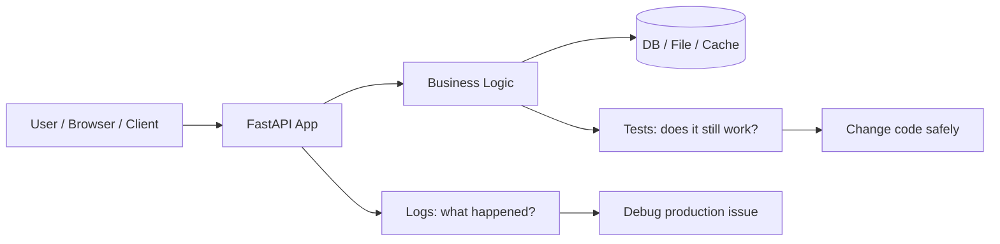

Python’s standard `logging` module is the normal built-in way to create loggers with `logging.getLogger(__name__)`, and pytest is commonly used for small readable tests that scale to bigger apps. FastAPI’s `TestClient` lets you test API endpoints using normal Python test functions and normal `assert` statements.

---

## Start with one clean project

```bash
mkdir fastapi-logging-testing
cd fastapi-logging-testing

python -m venv .venv

# Linux / macOS
source .venv/bin/activate

# Windows PowerShell
# .venv\Scripts\Activate.ps1

python -m pip install --upgrade pip

python -m pip install fastapi uvicorn pytest httpx
```

Use `python -m ...` often. It means: “run this installed package/module using the current Python environment.” It avoids many “wrong pytest / wrong pip / wrong uvicorn” problems.

```bash
python -m pytest
python -m uvicorn app.main:app --reload
python -m pip install requests
```

Project shape:

```text
fastapi-logging-testing/
├── app/
│   ├── __init__.py
│   ├── main.py
│   ├── store.py
│   └── logging_config.py
├── tests/
│   ├── __init__.py
│   ├── conftest.py
│   ├── test_store.py
│   └── test_api.py
├── logs/
└── pytest.ini
```

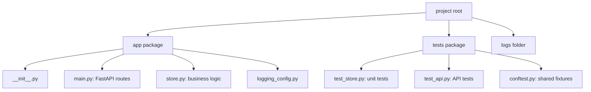

`__init__.py` makes a folder behave as a Python package. In simple projects it can be empty. Python docs describe `__init__.py` as the file that makes Python treat a directory as a package, except for advanced namespace package cases.

```bash
mkdir app tests logs
touch app/__init__.py tests/__init__.py
```

---

## Logging: replace “random print debugging” with useful evidence

Use `print()` for normal CLI output. Use `logger.info()`, `logger.warning()`, `logger.error()`, etc. for app events. Python’s logging HOWTO separates normal display output from operational events, warnings, and errors.

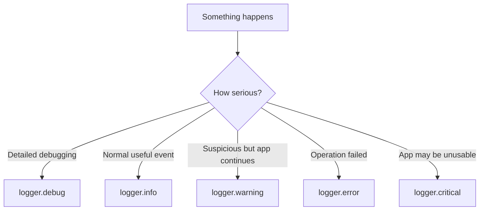

Good logging rule:

```python
# Good
logger.info("created todo id=%s title=%s", todo_id, title)

# Avoid
print("created todo", todo_id)

# Avoid logging secrets
logger.info("login token=%s", token)  # bad habit
```

Why `%s` instead of f-string?

```python
# Better for logging
logger.info("created todo id=%s", todo_id)

# Works, but message is formatted even if log level is disabled
logger.info(f"created todo id={todo_id}")
```

Create logging config once.

```python
# app/logging_config.py
import logging.config
from pathlib import Path

LOG_DIR = Path("logs")
LOG_DIR.mkdir(exist_ok=True)

def setup_logging() -> None:
    logging.config.dictConfig(
        {
            "version": 1,
            "disable_existing_loggers": False,
            "formatters": {
                "standard": {
                    "format": "%(asctime)s | %(levelname)s | %(name)s | %(message)s"
                }
            },
            "handlers": {
                "console": {
                    "class": "logging.StreamHandler",
                    "formatter": "standard",
                    "level": "INFO",
                },
                "file": {
                    "class": "logging.handlers.RotatingFileHandler",
                    "filename": "logs/app.log",
                    "maxBytes": 200_000,
                    "backupCount": 3,
                    "formatter": "standard",
                    "level": "DEBUG",
                },
            },
            "root": {
                "handlers": ["console", "file"],
                "level": "DEBUG",
            },
        }
    )
```

This uses `dictConfig`, which is Python’s dictionary-based logging configuration API, and `RotatingFileHandler`, which rotates log files so one file does not grow forever.

```mermaid
flowchart LR
    Logger[logger = logging.getLogger(__name__)]
    Logger --> Record[LogRecord]
    Record --> Handler1[Console handler]
    Record --> Handler2[Rotating file handler]
    Handler1 --> Terminal[Terminal]
    Handler2 --> File[logs/app.log]
```

---

## Small business logic first: easy to test

```python
# app/store.py
from itertools import count

class TodoStore:
    def __init__(self) -> None:
        self._ids = count(1)
        self._todos: dict[int, dict] = {}

    def create(self, title: str) -> dict:
        title = title.strip()

        if not title:
            raise ValueError("title cannot be empty")

        todo_id = next(self._ids)
        todo = {"id": todo_id, "title": title, "done": False}
        self._todos[todo_id] = todo
        return todo

    def list_all(self) -> list[dict]:
        return list(self._todos.values())

    def mark_done(self, todo_id: int) -> dict:
        if todo_id not in self._todos:
            raise KeyError(todo_id)

        self._todos[todo_id]["done"] = True
        return self._todos[todo_id]
```

Keep business logic outside `main.py`. This makes testing easier.

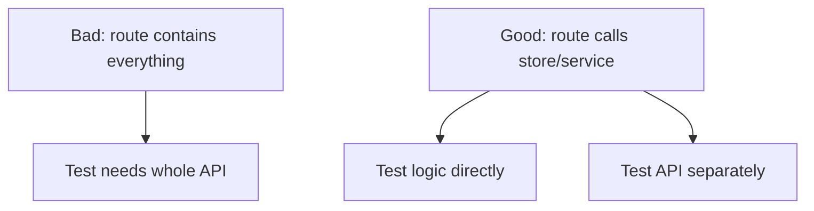

---

## FastAPI app with logging

```python
# app/main.py
import logging

from fastapi import Depends, FastAPI, HTTPException
from pydantic import BaseModel

from app.logging_config import setup_logging
from app.store import TodoStore

setup_logging()

logger = logging.getLogger(__name__)

app = FastAPI(title="Todo API with Logging and Testing")

store = TodoStore()

class TodoIn(BaseModel):
    title: str

def get_store() -> TodoStore:
    return store

@app.get("/health")
def health() -> dict:
    logger.debug("health check called")
    return {"status": "ok"}

@app.post("/todos", status_code=201)
def create_todo(payload: TodoIn, todo_store: TodoStore = Depends(get_store)) -> dict:
    try:
        todo = todo_store.create(payload.title)
    except ValueError as exc:
        logger.warning("invalid todo title")
        raise HTTPException(status_code=400, detail=str(exc))

    logger.info("created todo id=%s title=%s", todo["id"], todo["title"])
    return todo

@app.get("/todos")
def list_todos(todo_store: TodoStore = Depends(get_store)) -> list[dict]:
    logger.info("listed todos")
    return todo_store.list_all()

@app.patch("/todos/{todo_id}/done")
def mark_done(todo_id: int, todo_store: TodoStore = Depends(get_store)) -> dict:
    try:
        todo = todo_store.mark_done(todo_id)
    except KeyError:
        logger.warning("todo not found id=%s", todo_id)
        raise HTTPException(status_code=404, detail="todo not found")

    logger.info("marked todo done id=%s", todo_id)
    return todo
```

Run it:

```bash
python -m uvicorn app.main:app --reload
```

Test manually:

```bash
curl http://127.0.0.1:8000/health

curl -X POST http://127.0.0.1:8000/todos \
  -H "content-type: application/json" \
  -d '{"title": "learn logging"}'

curl http://127.0.0.1:8000/todos

curl -X PATCH http://127.0.0.1:8000/todos/1/done
```

The log flow:

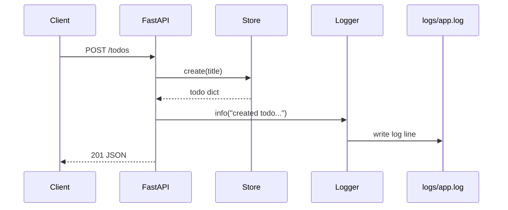

---

## Testing: small checks that protect your code

pytest discovers files like `test_*.py` and functions like `test_something`. You normally write plain `assert` statements; pytest shows useful failure details.

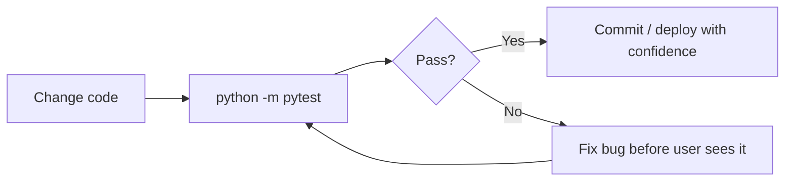

Create pytest config:

```ini
# pytest.ini
[pytest]
testpaths = tests
pythonpath = .
addopts = -q
```

Unit test the business logic first:

```python
# tests/test_store.py
import pytest

from app.store import TodoStore

def test_create_todo():
    store = TodoStore()

    todo = store.create("learn testing")

    assert todo["id"] == 1
    assert todo["title"] == "learn testing"
    assert todo["done"] is False

def test_empty_title_is_rejected():
    store = TodoStore()

    with pytest.raises(ValueError, match="title cannot be empty"):
        store.create("   ")

def test_mark_done():
    store = TodoStore()
    todo = store.create("finish notes")

    updated = store.mark_done(todo["id"])

    assert updated["done"] is True

def test_mark_done_missing_id():
    store = TodoStore()

    with pytest.raises(KeyError):
        store.mark_done(999)
```

Run:

```bash
python -m pytest
python -m pytest tests/test_store.py
python -m pytest tests/test_store.py::test_create_todo
```

Testing pattern:

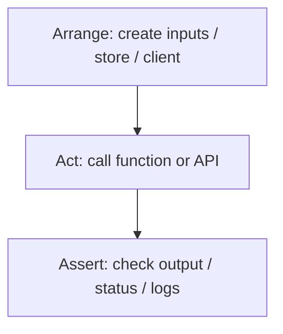

---

## Test FastAPI routes with TestClient

FastAPI’s docs show that `TestClient` is created by passing your FastAPI app, then tests use normal `def`, not `async def`, and normal client calls like `client.get()` or `client.post()`.

For API tests, do not share the real global store across tests. Override the dependency.

```python
# tests/conftest.py
import pytest
from fastapi.testclient import TestClient

from app.main import app, get_store
from app.store import TodoStore

@pytest.fixture
def test_store() -> TodoStore:
    return TodoStore()

@pytest.fixture
def client(test_store: TodoStore):
    app.dependency_overrides[get_store] = lambda: test_store

    with TestClient(app) as test_client:
        yield test_client

    app.dependency_overrides.clear()
```

FastAPI supports `app.dependency_overrides` for replacing dependencies during tests. The override dictionary maps the original dependency function to the testing replacement function.

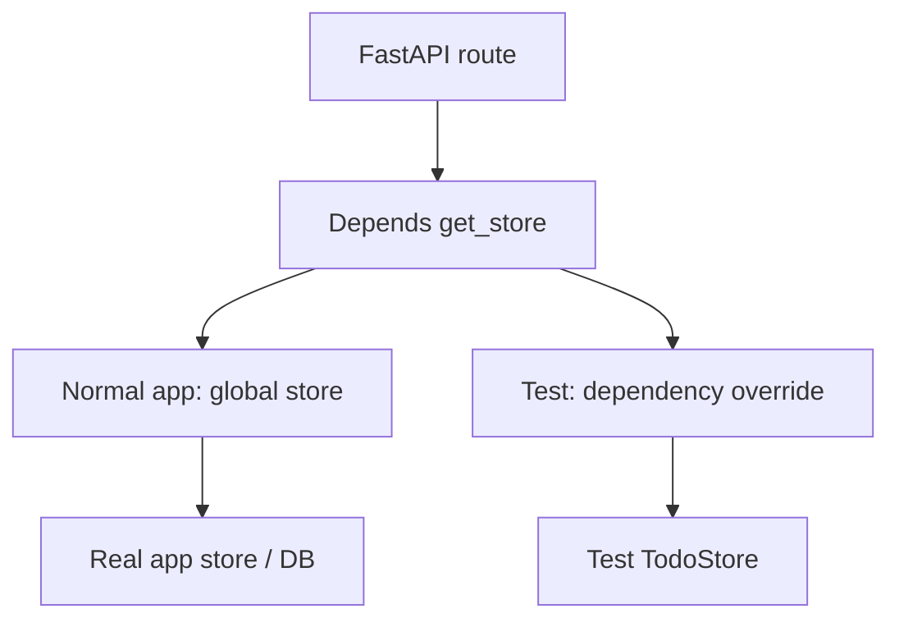

Now test the API:

```python
# tests/test_api.py
import logging

def test_health(client):
    response = client.get("/health")

    assert response.status_code == 200
    assert response.json() == {"status": "ok"}

def test_create_todo(client):
    response = client.post("/todos", json={"title": "learn FastAPI tests"})

    assert response.status_code == 201
    assert response.json()["title"] == "learn FastAPI tests"
    assert response.json()["done"] is False

def test_create_todo_empty_title(client):
    response = client.post("/todos", json={"title": "   "})

    assert response.status_code == 400
    assert response.json()["detail"] == "title cannot be empty"

def test_list_todos(client):
    client.post("/todos", json={"title": "one"})
    client.post("/todos", json={"title": "two"})

    response = client.get("/todos")

    assert response.status_code == 200
    assert len(response.json()) == 2

def test_mark_done(client):
    created = client.post("/todos", json={"title": "ship code"}).json()

    response = client.patch(f"/todos/{created['id']}/done")

    assert response.status_code == 200
    assert response.json()["done"] is True

def test_mark_done_missing(client):
    response = client.patch("/todos/999/done")

    assert response.status_code == 404
    assert response.json()["detail"] == "todo not found"

def test_create_todo_logs_message(client, caplog):
    caplog.set_level(logging.INFO, logger="app.main")

    response = client.post("/todos", json={"title": "check logs"})

    assert response.status_code == 201
    assert "created todo" in caplog.text
```

pytest’s `caplog` fixture captures log messages and allows tests to check logs or change log levels for a test.

Run:

```bash
python -m pytest

# Show logs while running tests
python -m pytest --log-cli-level=INFO

# Stop after first failure
python -m pytest -x

# Run tests matching a name
python -m pytest -k "todo"
```

---

## Normal running vs module running

This is a common beginner confusion.

```bash
python app/main.py
```

This runs the file as a script. Relative imports may break because Python treats it like a standalone file.

```bash
python -m app.main
```

This runs `app.main` as a module inside the `app` package.

For FastAPI, prefer:

```bash
python -m uvicorn app.main:app --reload
```

Meaning:

```text
app.main:app
│   │    │
│   │    └── variable named app inside main.py
│   └────── module main.py
└────────── package folder app/
```

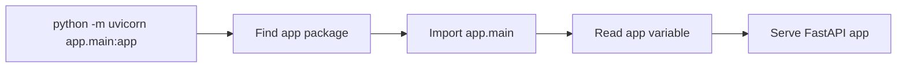

Good import style:

```python
# Good absolute imports
from app.store import TodoStore
from app.logging_config import setup_logging
```

Avoid running package files directly when they depend on package imports.

---

## Circular imports: why they happen and how to avoid them

Circular import means file A imports file B while file B imports file A.

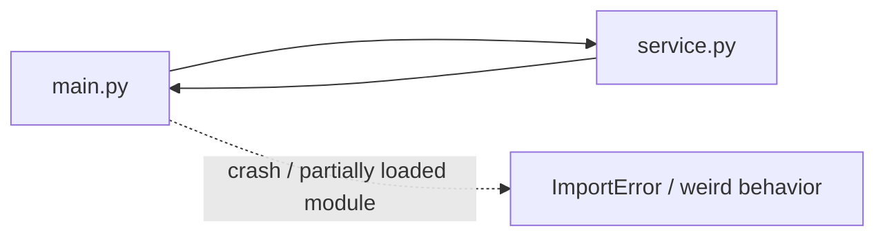

Bad structure:

```python
# app/main.py
from app.service import create_user

app = FastAPI()
```

```python
# app/service.py
from app.main import app  # bad: service imports main again
```

Better structure:

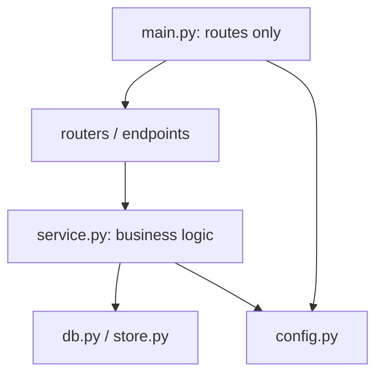

Safe habits:

```python
# service.py should not import app from main.py
# service.py should contain normal Python functions/classes
# main.py should import service and connect it to HTTP routes
```

If you see circular import errors, ask:

```text
1. Is a lower-level file importing a higher-level file?
2. Is service.py importing main.py?
3. Can I move shared code into config.py, models.py, schemas.py, or dependencies.py?
4. Can I pass dependency as a function argument instead of importing global app/state?
```

---

## Testing folder structure: what goes where

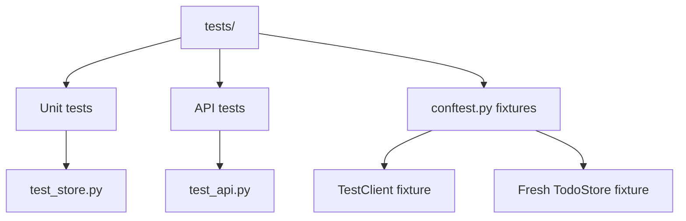

Use this split:

```text
tests/test_store.py   -> tests pure Python logic
tests/test_api.py     -> tests FastAPI routes
tests/conftest.py     -> shared pytest fixtures
pytest.ini            -> pytest settings
```

Fixtures are reusable setup functions. Example:

```python
@pytest.fixture
def test_store():
    return TodoStore()
```

Then use it by name:

```python
def test_something(test_store):
    todo = test_store.create("hello")
    assert todo["id"] == 1
```

pytest also has useful built-in fixtures like `tmp_path` for temporary files and `caplog` for logs. The official pytest guide shows `tmp_path` as a unique temporary directory per test and `pytest.raises()` for expected exceptions.

```python
def test_write_file(tmp_path):
    file = tmp_path / "hello.txt"

    file.write_text("hello")

    assert file.read_text() == "hello"
```

---

## Important commands and patterns

```bash
# Install
python -m pip install fastapi uvicorn pytest httpx

# Run API
python -m uvicorn app.main:app --reload

# Run all tests
python -m pytest

# Run one file
python -m pytest tests/test_api.py

# Run one test
python -m pytest tests/test_api.py::test_create_todo

# Run matching tests
python -m pytest -k "health or logs"

# Show print/log output
python -m pytest -s --log-cli-level=INFO

# See available fixtures
python -m pytest --fixtures
```

Useful logging pattern:

```python
import logging

logger = logging.getLogger(__name__)

def do_work(user_id: int) -> None:
    logger.info("starting work user_id=%s", user_id)

    try:
        risky_step()
    except Exception:
        logger.exception("risky step failed user_id=%s", user_id)
        raise
```

`logger.exception()` should be used inside an `except` block. It logs the traceback automatically.

---

## Beginner mistakes and safe habits

| Mistake                                        | Better habit                                  |
| ---------------------------------------------- | --------------------------------------------- |
| Using `print()` everywhere in API code         | Use `logger = logging.getLogger(__name__)`    |
| Configuring logging in every file              | Configure once at app startup                 |
| Logging passwords, tokens, full request bodies | Mask or avoid secrets                         |
| Putting all logic inside FastAPI route         | Move logic to service/store functions         |
| Tests depend on order                          | Each test should create its own data          |
| Tests use real production DB/API               | Use dependency override, fake store, temp DB  |
| Running `python app/main.py` and imports break | Use `python -m uvicorn app.main:app --reload` |
| `service.py` imports `main.py`                 | Keep imports one-directional                  |
| Testing only happy path                        | Test success, bad input, missing item, logs   |
| Ignoring failing tests                         | Treat failing tests as a warning light        |

Safe testing mindset:

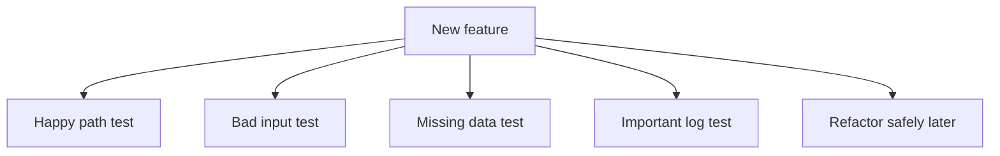

---

## Important Q&A

**Q: Should I write tests for my database queries?**
A: Yes, but keep them separate from pure logic tests. Use an in-memory SQLite database or a test database container, and configure your app to use it during tests so you don't overwrite real data.

**Q: Is `logging.info` the same as `logger.info`?**
A: `logging.info` uses the root logger, which is shared by all installed packages. `logger.info` uses the specific logger created for your module (`logger = logging.getLogger(__name__)`). Always use the specific logger so you know exactly which file generated the log.

**Q: Why doesn't `pytest` find my tests?**
A: Pytest looks for files starting with `test_` or ending with `_test.py`, and functions starting with `test_`. If your test is named `check_api()`, pytest will ignore it.

## Final revision checklist

```text
Logging
[ ] I use logging, not random print debugging.
[ ] I create logger = logging.getLogger(__name__) in each module.
[ ] I configure logging once during app startup.
[ ] I know DEBUG, INFO, WARNING, ERROR, CRITICAL.
[ ] I do not log secrets.
[ ] I write useful messages with IDs and context.

Testing
[ ] I can run python -m pytest.
[ ] My test files are named test_*.py.
[ ] My test functions start with test_.
[ ] I use Arrange -> Act -> Assert.
[ ] I test business logic separately from API routes.
[ ] I use TestClient for FastAPI endpoints.
[ ] I use dependency_overrides for fake test dependencies.
[ ] I use pytest.raises for expected errors.
[ ] I use caplog when logs are important.

Project structure
[ ] app/ has __init__.py so it is a package.
[ ] tests/ has clear test files.
[ ] main.py wires HTTP routes to business logic.
[ ] store.py/service.py contains normal Python logic.
[ ] Lower-level modules do not import main.py.
[ ] I run FastAPI as python -m uvicorn app.main:app --reload.
```

Core idea: **logs help you understand running software; tests help you change software without fear.**

