# Observability + Prometheus with Python/FastAPI

Observability means: **when your app runs, you can understand what is happening from outside**. OpenTelemetry defines observability around telemetry data such as **logs, metrics, and traces**; the application must be instrumented to emit this data. Prometheus is mainly for **metrics**: it collects/scrapes metric values from HTTP endpoints, stores them as time series, and lets you query them with PromQL.

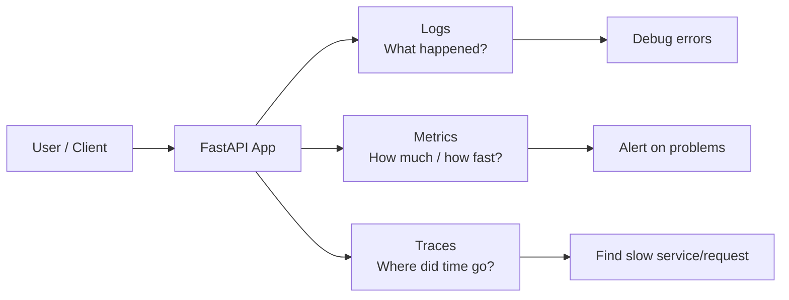

In simple words:

| Signal  | Example question                   | Example                                           |
| ------- | ---------------------------------- | ------------------------------------------------- |
| Logs    | What exactly happened?             | `user_id=12 login failed`                         |
| Metrics | How many / how slow / how much?    | `http_requests_total`, `request_duration_seconds` |
| Traces  | Where did this request spend time? | API → DB → Payment API                            |

---

## Logs vs metrics vs traces

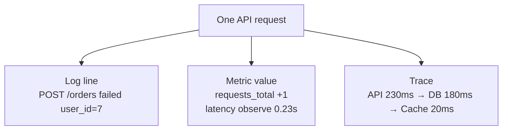

Use **logs** for details, **metrics** for dashboards/alerts, and **traces** for request journey.

Bad production debugging:

```text
User says: "App is slow"
Developer says: "It works on my laptop"
```

Good production debugging:

```text
Dashboard says:
- p95 latency increased
- 500 errors increased
- /search endpoint is slow
- logs show DB timeout
```

---

## Prometheus mental model

Prometheus usually follows a **pull model**: your app exposes a `/metrics` endpoint, and Prometheus periodically scrapes it. The official Python client is `prometheus-client`, and its purpose is to instrument Python apps and expose metrics for Prometheus.

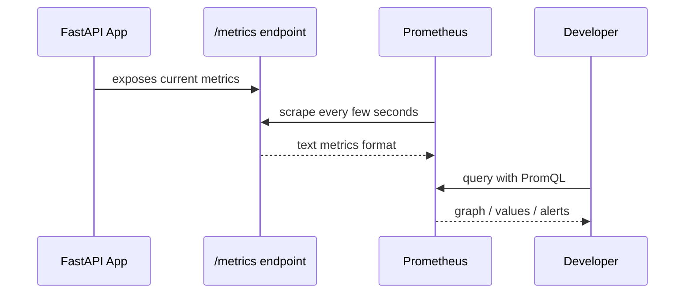

Main metric types:

| Type      | Meaning                                    | Use                                                       |
| --------- | ------------------------------------------ | --------------------------------------------------------- |
| Counter   | Only increases or resets                   | total requests, total errors                              |
| Gauge     | Goes up and down                           | active users, queue size                                  |
| Histogram | Observes values in buckets                 | request latency                                           |
| Summary   | Observes values with client-side summaries | less common for normal Prometheus server-side aggregation |

Prometheus documents Counter, Gauge, Histogram, and Summary as its core metric types; histograms are especially useful for request durations because they count observations in configurable buckets and keep sums/counts.

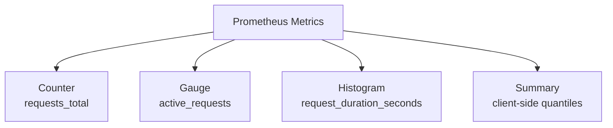

---

## Small FastAPI + Prometheus demo

Create project:

```bash
mkdir fastapi-observability-demo
cd fastapi-observability-demo

python -m venv .venv

# Linux / macOS
source .venv/bin/activate

# Windows PowerShell
# .venv\Scripts\Activate.ps1

python -m pip install --upgrade pip
python -m pip install fastapi uvicorn prometheus-client
```

Folder:

```text
fastapi-observability-demo/
├── app/
│   ├── __init__.py
│   └── main.py
├── prometheus.yml
└── docker-compose.yml
```

```bash
mkdir app
touch app/__init__.py
```

Now create app:

```python
# app/main.py
import logging
import random
import time

from fastapi import FastAPI, Request
from fastapi.responses import Response
from prometheus_client import Counter, Gauge, Histogram, generate_latest, CONTENT_TYPE_LATEST

logging.basicConfig(
    level=logging.INFO,
    format="%(asctime)s | %(levelname)s | %(name)s | %(message)s",
)

logger = logging.getLogger(__name__)

app = FastAPI(title="FastAPI Observability Demo")

REQUEST_COUNT = Counter(
    "http_requests_total",
    "Total HTTP requests",
    ["method", "endpoint", "status_code"],
)

REQUEST_LATENCY = Histogram(
    "http_request_duration_seconds",
    "HTTP request duration in seconds",
    ["method", "endpoint"],
)

ACTIVE_REQUESTS = Gauge(
    "http_active_requests",
    "Number of active HTTP requests",
)

@app.middleware("http")
async def observe_requests(request: Request, call_next):
    # Middleware runs before and after every request
    start = time.perf_counter()
    ACTIVE_REQUESTS.inc()

    try:
        response = await call_next(request)
        return response
    finally:
        duration = time.perf_counter() - start

        endpoint = request.url.path
        method = request.method
        status_code = getattr(locals().get("response", None), "status_code", 500)

        REQUEST_COUNT.labels(
            method=method,
            endpoint=endpoint,
            status_code=str(status_code),
        ).inc()

        REQUEST_LATENCY.labels(
            method=method,
            endpoint=endpoint,
        ).observe(duration)

        ACTIVE_REQUESTS.dec()

        logger.info(
            "request method=%s endpoint=%s status=%s duration=%.4fs",
            method,
            endpoint,
            status_code,
            duration,
        )

@app.get("/")
def home():
    return {"message": "FastAPI observability demo"}

@app.get("/work")
def work():
    # Simulate variable work
    delay = random.uniform(0.05, 0.5)
    time.sleep(delay)
    return {"delay": delay}

@app.get("/fail")
def fail():
    # Simulate an error
    logger.warning("intentional failure endpoint called")
    return Response("something failed", status_code=500)

@app.get("/metrics")
def metrics():
    # Prometheus scrapes this endpoint
    return Response(generate_latest(), media_type=CONTENT_TYPE_LATEST)
```

FastAPI middleware runs before a request reaches the specific path operation and after the response is produced, which makes it a good place to measure request count, latency, and active requests.

Run app:

```bash
python -m uvicorn app.main:app --reload
```

Try requests:

```bash
curl http://127.0.0.1:8000/
curl http://127.0.0.1:8000/work
curl http://127.0.0.1:8000/fail
curl http://127.0.0.1:8000/metrics
```

You will see metrics like:

```text
http_requests_total{endpoint="/work",method="GET",status_code="200"} 3.0
http_request_duration_seconds_bucket{endpoint="/work",method="GET",le="0.25"} 2.0
http_active_requests 1.0
```

---

## Run Prometheus with Docker

Create `prometheus.yml`:

```yaml
global:
  scrape_interval: 5s

scrape_configs:
  - job_name: "fastapi-demo"
    metrics_path: "/metrics"
    static_configs:
      - targets: ["host.docker.internal:8000"]
```

Create `docker-compose.yml`:

```yaml
services:
  prometheus:
    image: prom/prometheus
    container_name: prometheus-demo
    ports:
      - "9090:9090"
    volumes:
      - ./prometheus.yml:/etc/prometheus/prometheus.yml
```

Run:

```bash
docker compose up
```

Open Prometheus in browser:

```text
http://localhost:9090
```

If `host.docker.internal` does not work on Linux, use this compose file instead:

```yaml
services:
  prometheus:
    image: prom/prometheus
    container_name: prometheus-demo
    ports:
      - "9090:9090"
    extra_hosts:
      - "host.docker.internal:host-gateway"
    volumes:
      - ./prometheus.yml:/etc/prometheus/prometheus.yml
```

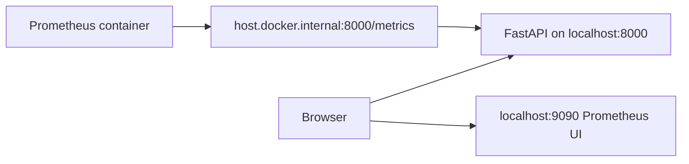

---

## Useful PromQL queries

PromQL is Prometheus’s query language for time-series metrics. Prometheus highlights PromQL as a core feature for querying, correlating, and transforming time series data.

```promql
# Total requests by endpoint
sum by (endpoint) (http_requests_total)

# Requests per second over last 1 minute
sum by (endpoint) (rate(http_requests_total[1m]))

# Error requests per second
sum(rate(http_requests_total{status_code=~"5.."}[1m]))

# Average request duration
sum(rate(http_request_duration_seconds_sum[1m]))
/
sum(rate(http_request_duration_seconds_count[1m]))

# p95 latency from histogram
histogram_quantile(
  0.95,
  sum by (le, endpoint) (rate(http_request_duration_seconds_bucket[5m]))
)

# Active requests
http_active_requests
```

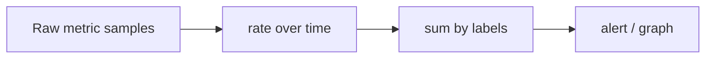

---

## What to log vs what to metric

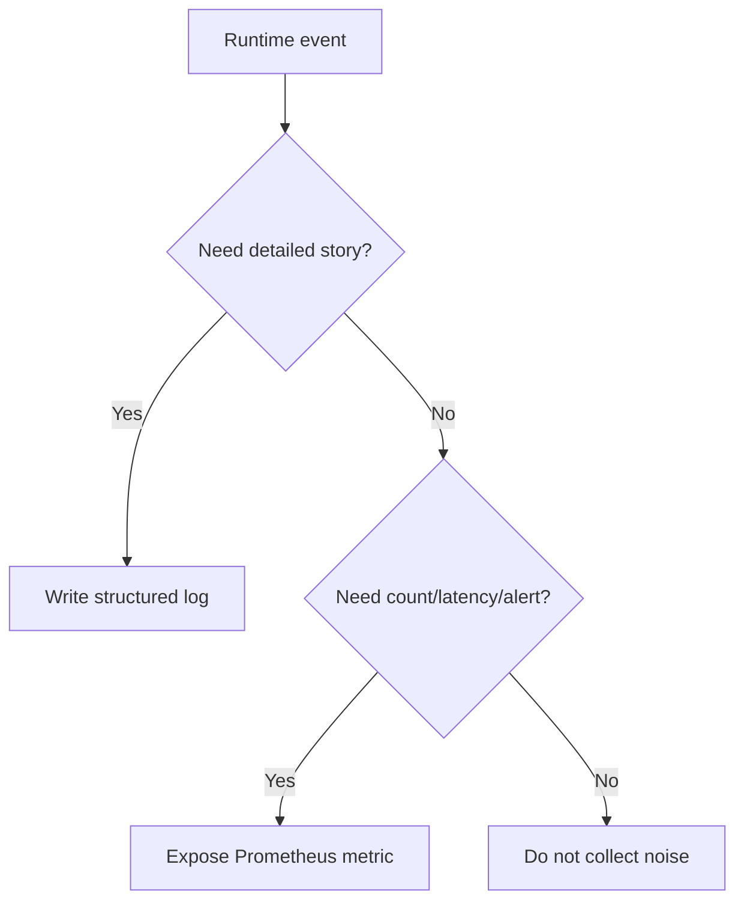

Examples:

| Situation                                | Use                    |
| ---------------------------------------- | ---------------------- |
| User login failed because password wrong | log                    |
| Number of failed logins per minute       | metric                 |
| API request took 3.2 seconds             | log + histogram metric |
| Current queue size                       | gauge metric           |
| Payment API returned timeout             | log + counter metric   |
| Full user password/token                 | never log              |

---

## Production-safe habits

Use **low-cardinality labels**. This is very important.

Good:

```python
REQUEST_COUNT.labels(method="GET", endpoint="/users/{id}", status_code="200").inc()
```

Risky:

```python
REQUEST_COUNT.labels(method="GET", endpoint="/users/928374", status_code="200").inc()
```

Why risky? Because every unique label combination creates a separate time series. User IDs, request IDs, emails, and raw URLs can explode metric count.

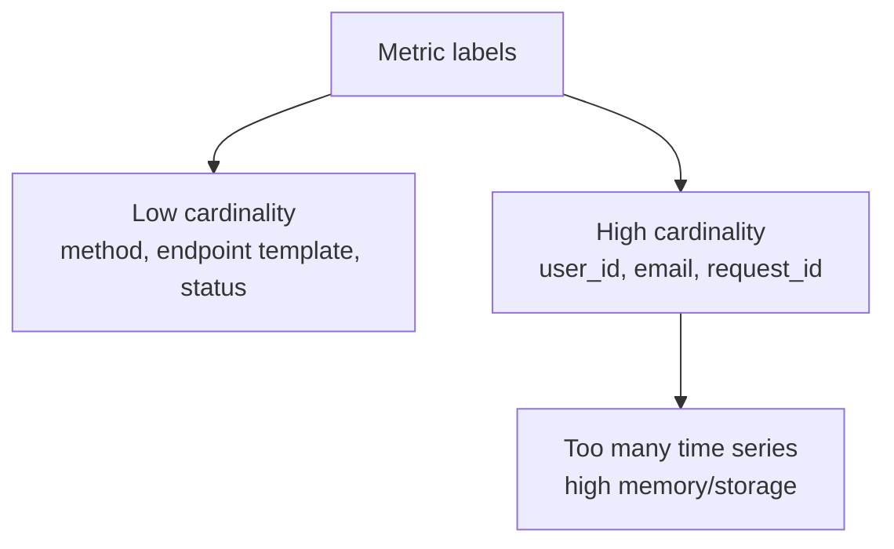

Safe checklist:

```text
[ ] Logs contain context but no secrets.
[ ] Metrics use low-cardinality labels.
[ ] Every important endpoint has request count and latency.
[ ] 4xx and 5xx errors are visible.
[ ] App exposes /health and /metrics.
[ ] Prometheus scrape interval is reasonable.
[ ] Alerts are based on symptoms, not only causes.
[ ] Dashboards answer: traffic, errors, latency, saturation.
```

The common SRE dashboard pattern is called **RED**:

```text
R = Rate      -> requests per second
E = Errors    -> failed requests
D = Duration  -> latency
```

And for infrastructure, people often use **USE**:

```text
U = Utilization -> CPU/memory/disk usage
S = Saturation  -> queue/backlog/waiting
E = Errors      -> failed operations
```

---

## Interview Q&A

### 1. What is observability?

Observability is the ability to understand the internal state of a running system by looking at its external outputs: logs, metrics, and traces. In practical developer work, it means you can debug production without guessing.

---

### 2. Difference between monitoring and observability?

Monitoring usually checks known things: CPU high, service down, error rate high. Observability helps investigate unknown problems by giving enough telemetry to ask new questions.

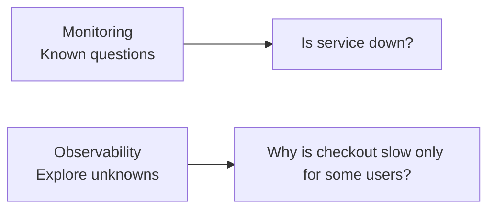

---

### 3. What are logs, metrics, and traces?

Logs are event records. Metrics are numeric measurements over time. Traces show the path of one request across services.

---

### 4. When should you use logs?

Use logs when you need details: user ID, order ID, error message, external API response code, or exception traceback. Do not use logs as your only dashboard.

---

### 5. When should you use metrics?

Use metrics for counting and alerting: request rate, error rate, latency, queue size, DB connection count, cache hit ratio.

---

### 6. What is Prometheus?

Prometheus is an open-source monitoring system and time-series database. It collects metrics from configured targets at intervals, evaluates rules, displays results, and can trigger alerts.

---

### 7. How does Prometheus collect metrics?

Usually by scraping an HTTP endpoint like `/metrics`. Your app exposes current metric values, and Prometheus pulls them periodically.

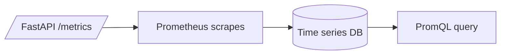

---

### 8. What is a Counter?

A Counter is a value that only increases or resets. Use it for total requests, total errors, total jobs processed, etc.

Example:

```python
REQUEST_COUNT = Counter(
    "http_requests_total",
    "Total HTTP requests",
    ["method", "endpoint", "status_code"],
)
```

---

### 9. What is a Gauge?

A Gauge can go up and down. Use it for current memory usage, active requests, queue size, active users.

Example:

```python
ACTIVE_REQUESTS = Gauge(
    "http_active_requests",
    "Number of active HTTP requests",
)
```

---

### 10. What is a Histogram?

A Histogram records observations into buckets. It is commonly used for request duration and response size. Prometheus histograms also provide count and sum values.

Example:

```python
REQUEST_LATENCY = Histogram(
    "http_request_duration_seconds",
    "HTTP request duration in seconds",
    ["method", "endpoint"],
)
```

---

### 11. What is p95 latency?

p95 latency means 95% of requests were faster than this value, and 5% were slower. It is better than average latency for user experience because a few slow requests can be hidden by averages.

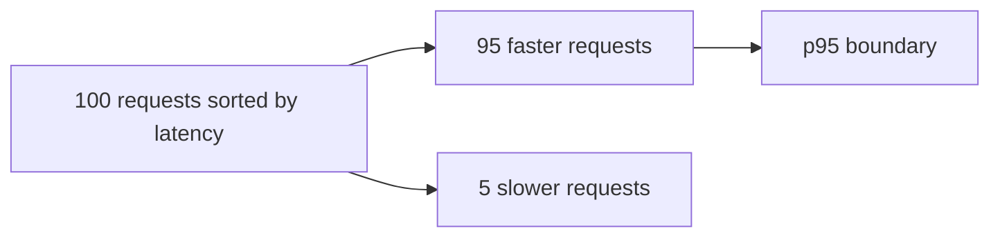

---

### 12. Why is average latency sometimes misleading?

Because a few very slow requests may not strongly affect the average. p95 or p99 tells you about slow users.

---

### 13. What is label cardinality?

Cardinality means how many unique time series are created by labels. Labels like `method` and `status_code` are safe. Labels like `user_id`, `email`, or `request_id` are dangerous because they create too many unique series.

---

### 14. What should you never put in Prometheus labels?

Do not put passwords, tokens, emails, user IDs, raw URLs, request IDs, or any high-cardinality/private values.

---

### 15. What is FastAPI middleware useful for in observability?

Middleware can run before and after every request. So it is perfect for request logging, timing, counting, adding request IDs, and collecting metrics. FastAPI documents middleware as code that works with every request before path handling and every response before returning.

---

### 16. Difference between `/health` and `/metrics`?

`/health` tells whether the app is alive or ready. `/metrics` exposes numeric measurements for Prometheus.

```text
GET /health   -> {"status": "ok"}
GET /metrics  -> http_requests_total{...} 123
```

---

### 17. What is an alert?

An alert is a rule that fires when a metric crosses a dangerous condition.

Example ideas:

```promql
# High 5xx error rate
sum(rate(http_requests_total{status_code=~"5.."}[5m])) > 1

# High p95 latency
histogram_quantile(
  0.95,
  sum by (le) (rate(http_request_duration_seconds_bucket[5m]))
) > 1
```

---

### 18. What should a good dashboard show?

A good API dashboard should show traffic, errors, latency, and saturation.

```text
Traffic     -> requests/sec
Errors      -> 4xx, 5xx
Latency     -> avg, p95, p99
Saturation  -> CPU, memory, queue, active requests
```

---

### 19. What is the difference between `rate()` and raw counter value?

Raw counter value shows total count since process start. `rate(counter[1m])` shows per-second increase over the last minute. Prometheus docs mention that `rate()` is used with counters to calculate how fast values increase over time.

---

### 20. What is the best beginner observability setup for a FastAPI app?

Start with:

```text
1. Structured logs with request method, path, status, duration
2. /health endpoint
3. /metrics endpoint
4. Prometheus scraping /metrics
5. Metrics:
   - http_requests_total
   - http_request_duration_seconds
   - http_active_requests
6. Basic PromQL:
   - request rate
   - error rate
   - p95 latency
```

---

## Final revision checklist

```text
[ ] I can explain logs, metrics, and traces.
[ ] I know Prometheus scrapes /metrics.
[ ] I know Counter, Gauge, Histogram, Summary.
[ ] I can add FastAPI middleware to count requests and measure latency.
[ ] I can expose /metrics using prometheus-client.
[ ] I can run Prometheus with Docker Compose.
[ ] I can query request rate, error rate, and p95 latency.
[ ] I avoid high-cardinality labels.
[ ] I never log secrets.
[ ] I can answer basic observability interview questions.
```

Core idea: **testing tells you the app should work; observability tells you what the app is doing after it is deployed.**

