# Cloudflare Tunnel + other tunnels — practical developer notes

A tunnel is used when your app is running on your laptop/server, but someone outside your network needs to access it. Example: webhook testing, demo to professor, mobile app testing, temporary API sharing, or exposing a home server safely.

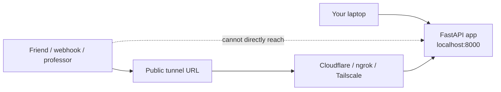

---

## First understand localhost, 127.0.0.1, 0.0.0.0, LAN IP, public IP

When you run FastAPI normally:

```bash
python -m uvicorn app.main:app
```

Uvicorn’s default host is `127.0.0.1`, meaning only your own machine can access it. Uvicorn docs say `--host 0.0.0.0` makes the app available on your local network, not automatically on the public internet.

```bash
python -m uvicorn app.main:app --host 0.0.0.0 --port 8000
```

Important idea:

| Address / Term | Meaning |
| :--- | :--- |
| `127.0.0.1` | Only my own machine |
| `localhost` | Usually points to `127.0.0.1` |
| `0.0.0.0` | Bind/listen on all network interfaces |
| `192.168.x.x` | My private Wi-Fi/LAN IP |
| public IP | Router/ISP-facing internet IP |

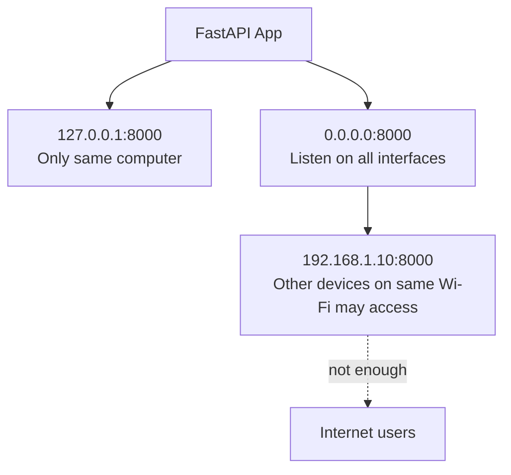

`0.0.0.0` is not a magic public URL. It only tells your server: “listen on all available local network interfaces.” From another device, you do **not** open:

```text
http://0.0.0.0:8000
```

You open the actual LAN IP:

```text
http://192.168.1.10:8000
```

Find LAN IP:

```bash
# Linux / macOS
hostname -I
ip addr

# Windows
ipconfig
```

---

## Why `0.0.0.0` still does not work from the internet

Most home/college/office networks use **private IPs** like:

* `10.0.0.0/8`
* `172.16.0.0/12`
* `192.168.0.0/16`

These private IPv4 ranges are defined by RFC 1918 for internal networks, not normal public internet routing.

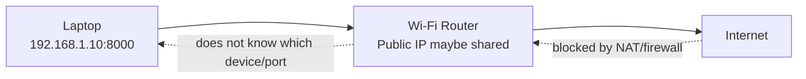

Your outbound request works:

```text
Laptop -> Router -> Internet -> Website
```

But inbound request usually fails:

```text
Internet -> Router -> Laptop
```

because of:

1. Private IP is not publicly routable.
2. Router NAT hides many devices behind one public IP.
3. Router firewall blocks random inbound traffic.
4. ISP may use CGNAT, so even your router may not have a true public IPv4.
5. College/company networks usually block inbound ports.

Traditional solution:

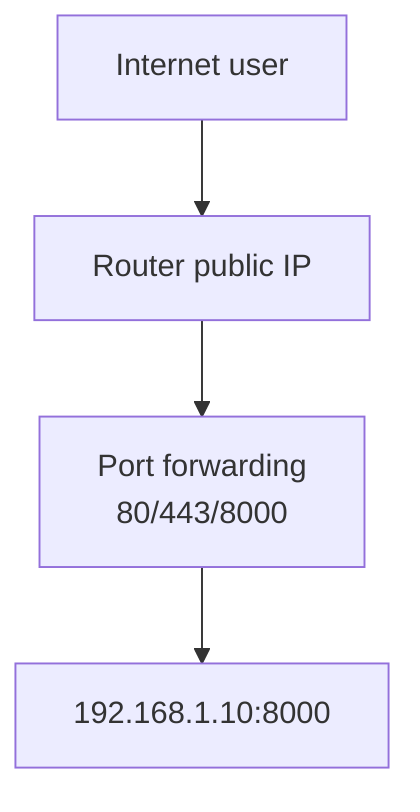

But port forwarding is often painful and unsafe for beginners.

---

## What a tunnel does

A tunnel reverses the direction.

Instead of the internet connecting directly to your laptop, your laptop makes an **outbound** connection to the tunnel provider. Outbound connections are usually allowed by NAT/firewalls.

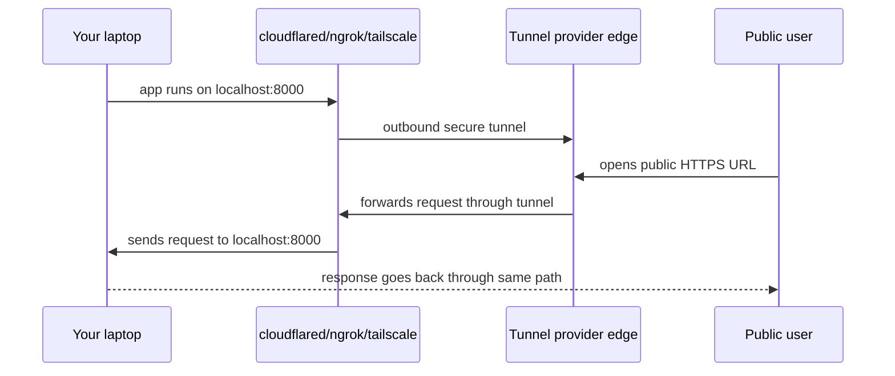

Cloudflare Tunnel works this way: `cloudflared` creates outbound-only connections to Cloudflare, so your origin server does not need a publicly routable IP. Cloudflare’s docs also say `cloudflared` can connect HTTP servers, SSH, remote desktops, and other protocols to Cloudflare without opening inbound firewall holes.

---

## Cloudflare Tunnel: quick development demo

Start a simple FastAPI app:

```bash
mkdir tunnel-demo
cd tunnel-demo

python -m venv .venv
source .venv/bin/activate

# Windows PowerShell:
# .venv\Scripts\Activate.ps1

python -m pip install fastapi uvicorn
```

```python
# main.py
from fastapi import FastAPI

app = FastAPI()

@app.get("/")
def home():
    return {"message": "Hello from local FastAPI"}

@app.get("/health")
def health():
    return {"status": "ok"}
```

Run locally:

```bash
python -m uvicorn main:app --host 127.0.0.1 --port 8000
```

Install `cloudflared`. Cloudflare documents macOS Homebrew, Windows executable/MSI, Linux packages, and Docker options for installing `cloudflared`.

On macOS:

```bash
brew install cloudflared
```

On Ubuntu/Debian, use Cloudflare’s package repo method from their docs. On Windows, download the executable/MSI from Cloudflare’s official download page.

Now expose localhost quickly:

```bash
cloudflared tunnel --url http://localhost:8000
```

Cloudflare Quick Tunnels generate a random `trycloudflare.com` subdomain and proxy traffic to your local server; Cloudflare labels Quick Tunnels as development/testing, with limits and not for production use.

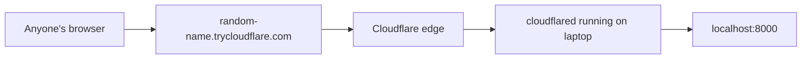

Use this for:

- Quick demo
- Testing webhook locally
- Testing mobile app with local backend
- Sharing temporary work

Do not use Quick Tunnel for:

- Serious production
- Permanent domain
- Sensitive unauthenticated admin panels
- Apps with secrets/debug endpoints exposed

---

## Cloudflare Tunnel with your own domain

For a proper setup, you normally create a named tunnel and route a domain/subdomain to it. Cloudflare docs say a tunnel route connects a public hostname such as `app.example.com` to a local service such as `http://localhost:8080`; Cloudflare creates DNS pointing to a tunnel subdomain like `<UUID>.cfargotunnel.com`.

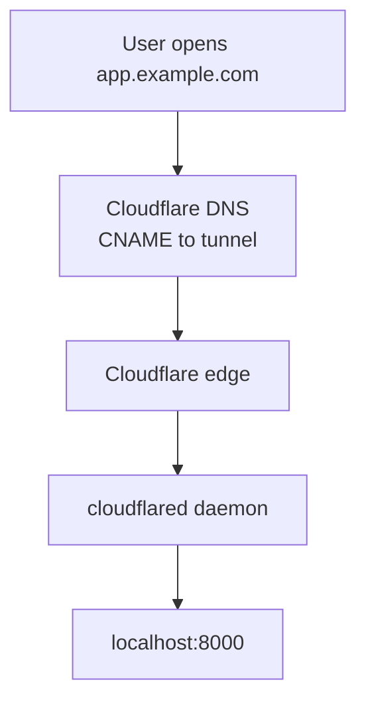

Typical dashboard flow:

1. Add your domain to Cloudflare.
2. Go to Zero Trust / Networking → Tunnels.
3. Create tunnel.
4. Choose `cloudflared` connector.
5. Add public hostname: `app.example.com` -> `http://localhost:8000`
6. Copy and run the `cloudflared` command on your machine/server.

Cloudflare’s current setup docs describe creating tunnels from the dashboard and choosing `cloudflared` as the connector type.

---

## Config-file style for multiple local services

For a locally managed tunnel, a config file is useful when one tunnel should route multiple services. Cloudflare’s docs say config files are useful for multiple services or origin-specific settings.

Example idea:

```yaml
# ~/.cloudflared/config.yml
tunnel: your-tunnel-id
credentials-file: /home/user/.cloudflared/your-tunnel-id.json

ingress:
  - hostname: api.example.com
    service: http://localhost:8000

  - hostname: docs.example.com
    service: http://localhost:3000

  - hostname: admin.example.com
    service: http://localhost:8080

  - service: http_status:404
```

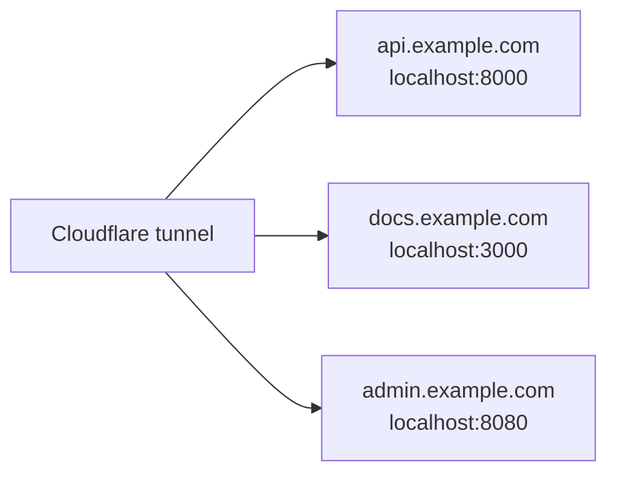

Run:

```bash
cloudflared tunnel run your-tunnel-name
```

For long-running servers, install it as a service so it starts on boot. Cloudflare documents service installation for Linux/macOS/Windows; Linux uses a `cloudflared.service` systemd service.

---

## Other good tunnel tools

### 1. ngrok

ngrok is very popular for webhooks, demos, API testing, and request inspection. Its docs say ngrok establishes secure tunnels between the ngrok cloud service and your local machine, allowing internet traffic to reach localhost without exposing your machine directly or opening inbound ports.

```bash
# Example style
ngrok http 8000
```

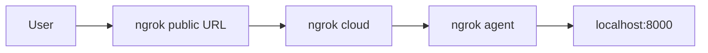

Good for:

- Webhooks
- Quick API testing
- Request inspection
- Demos

---

### 2. Tailscale Funnel

Tailscale Funnel exposes a local resource publicly through a Funnel URL. Tailscale docs say Funnel creates an encrypted tunnel from the internet to a specific resource on your device using a TCP proxy and Funnel relay servers.

```bash
# Example style
tailscale funnel 8000
```

Good for:

- Exposing something from a device in your Tailscale network
- Secure personal/team networking
- Simple public HTTPS sharing

Tailscale also has **Serve**, but their docs distinguish it from Funnel: Serve is for sharing inside your tailnet, while Funnel is for public internet sharing.

---

### 3. LocalTunnel

LocalTunnel is simple and Node-friendly. Its site says it assigns a unique publicly accessible URL that proxies requests to your local web server.

```bash
npx localtunnel --port 8000
```

Good for:

- Very quick demos
- Node/npm users
- No DNS setup

Less ideal for:

- Serious production
- Strong security controls
- Stable professional setup

---

### 4. localhost.run / Serveo style SSH reverse tunnel

These use SSH reverse port forwarding. Serveo docs show:

```bash
ssh -R 80:localhost:3000 serveo.net
```

and explain that `-R` asks the SSH server to forward traffic to your local host/port.

General pattern:

```bash
ssh -R 80:localhost:8000 nokey@localhost.run
```

Good for:

- No extra install
- When SSH is already available
- Quick experiments

---

### 5. zrok

zrok can share web services and also supports TCP/UDP tunnel modes. Its docs say TCP/UDP modes forward the raw data payload directly, useful for SSH, databases, and custom protocols.

```bash
zrok share public localhost:8000
```

Good for:

- Open-source/self-hostable style workflows
- Sharing web, files, TCP/UDP services

---

## Which one should you use?

| Need                                   | Good choice                                 |
| -------------------------------------- | ------------------------------------------- |
| Quick public URL without domain        | Cloudflare Quick Tunnel, ngrok, LocalTunnel |
| Stable domain like `api.example.com`   | Cloudflare Tunnel                           |
| Webhook testing with inspection        | ngrok                                       |
| Private team/device networking         | Tailscale Serve                             |
| Public sharing from Tailscale device   | Tailscale Funnel                            |
| SSH-only quick reverse tunnel          | localhost.run / Serveo                      |
| Open-source/self-hostable tunnel style | zrok                                        |

My practical recommendation:

* **For student demos:** Cloudflare Quick Tunnel or ngrok
* **For serious demo with domain:** Cloudflare Tunnel
* **For team/internal access:** Tailscale
* **For webhook debugging:** ngrok

---

## Common beginner mistakes

| Mistake                                           | Correct understanding                                               |
| ------------------------------------------------- | ------------------------------------------------------------------- |
| “I used `0.0.0.0`, so it is public.”              | No. It is usually only LAN-accessible.                              |
| Opening `http://0.0.0.0:8000` in browser          | Use `localhost` on same machine or real LAN IP from another device. |
| Sharing `127.0.0.1:8000` with friend              | That points to friend’s own computer, not yours.                    |
| Exposing admin/debug app publicly                 | Add auth or do not expose it.                                       |
| Logging secrets while using public tunnel         | Anyone with access may trigger sensitive flows.                     |
| Keeping temporary tunnel running forever          | Stop it after demo/testing.                                         |
| Using raw path labels in metrics with tunnel URLs | Avoid high-cardinality labels like user IDs/tokens.                 |
| Thinking tunnel hides app bugs/security issues    | Tunnel only routes traffic; your app still needs auth/security.     |

---

## Safety checklist before exposing anything

- [ ] Is this app safe to put on the public internet?
- [ ] Did I disable debug mode?
- [ ] Are secrets not printed on pages/logs?
- [ ] Are admin routes protected?
- [ ] Is CORS configured correctly?
- [ ] Is authentication needed?
- [ ] Am I exposing only the needed port?
- [ ] Did I stop the tunnel after the demo?

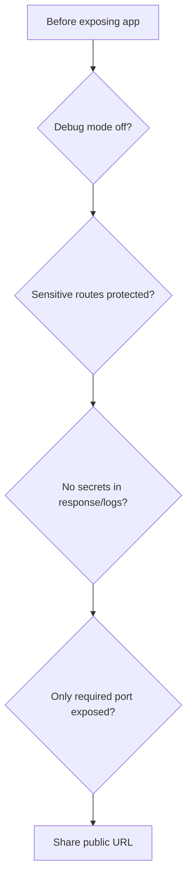

---

## Final mental model

* **localhost / 127.0.0.1:** Only this machine
* **0.0.0.0:** Listen on all local interfaces
* **192.168.x.x / 10.x.x.x:** Private LAN IP, not public internet
* **public IP:** Internet-facing IP, often on router/ISP side
* **port forwarding:** Opens router path from internet to local machine
* **tunnel:** Local machine connects outward to provider; provider gives public URL; traffic comes back through the existing outbound tunnel

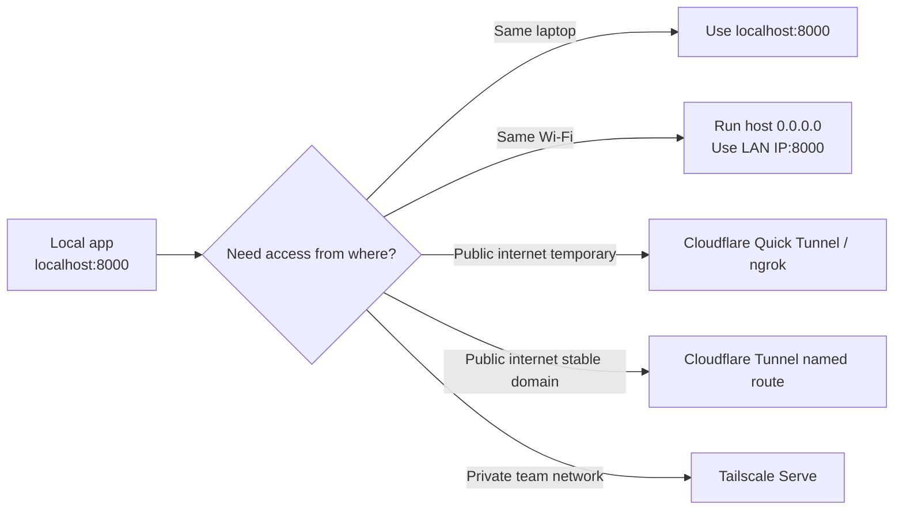

Core idea: **`0.0.0.0` opens your app to your network interface; a tunnel gives outsiders a safe public doorway without needing your laptop/server to have a public IP or open inbound ports.**

