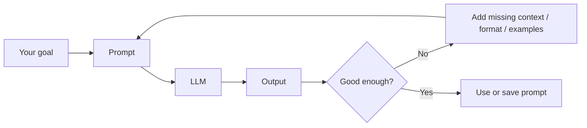
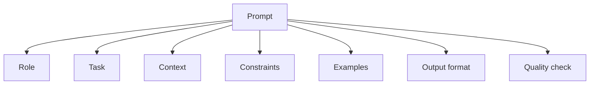
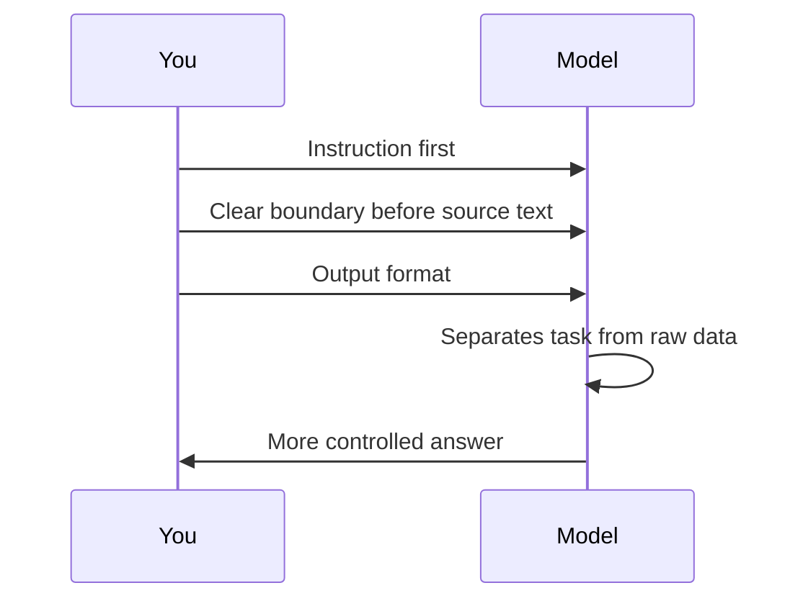
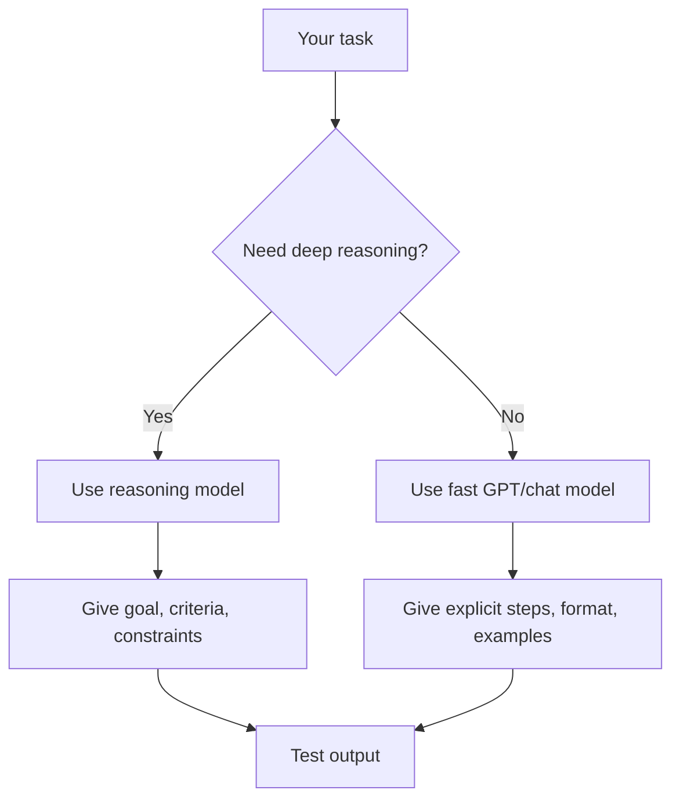
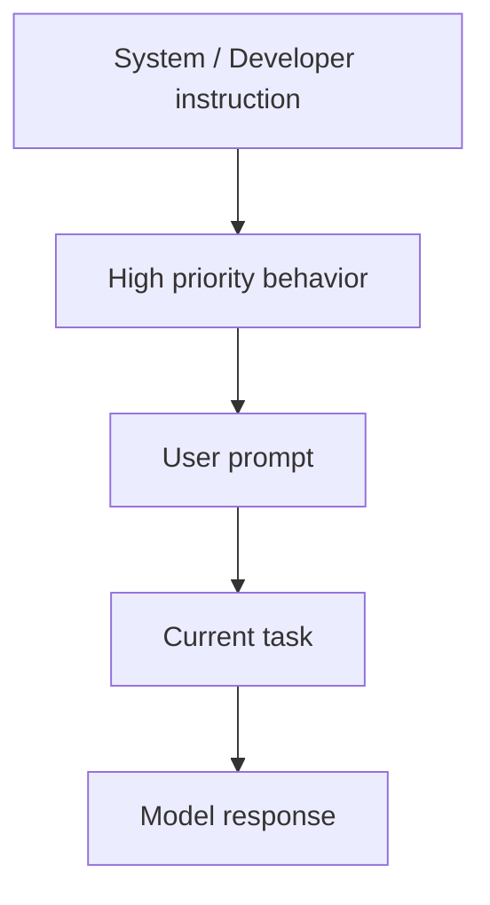

# Prompt Engineering — Chapter 1: Foundations

[](https://www.youtube.com/watch?v=2BpCk4d2Cc0)

[](https://www.youtube.com/watch?v=_ZvnD73m40o)

Prompt engineering is not magic wording. It is the habit of giving an AI model a clear task, useful context, strong boundaries, and a verifiable output format.

A good beginner rule:

```text
Bad prompt  = vague wish
Good prompt = task + context + constraints + output format + examples when needed
```



Official docs from OpenAI and Anthropic agree on the core idea: be clear, specific, structured, and iterative. Claude additionally recommends XML tags heavily for complex prompts. OpenAI recommends putting important instructions first, separating context clearly, and using examples/output formats for reliability.

## The mental model first

An LLM predicts useful next text from your input. It does not “know your mind”. Treat it like a brilliant new teammate who has skill but no hidden context about your project, grading style, audience, or expected format.

```text
Weak:
Explain prompt engineering.

Better:
Explain prompt engineering to a beginner Python student.
Keep it under 250 words.
Use one analogy and one practical example.
End with 3 revision points.
```

The better prompt works because it answers the model’s hidden questions:

| Hidden question | What you should provide |
|---|---|
| What is the task? | Explain, summarize, classify, extract, rewrite, plan, debug |
| Who is the audience? | Beginner, developer, manager, customer, examiner |
| What context matters? | Source text, data, scenario, goal, constraints |
| What should output look like? | Markdown, table, JSON, bullets, code, checklist |
| What should be avoided? | Hallucination, extra prose, unsupported claims, long answers |
| How will quality be judged? | Rubric, examples, acceptance criteria |

## Prompt anatomy

Use this structure for most prompts:

```text
Role: You are a practical teaching assistant for beginner developers.

Task: Create concise notes on prompt engineering foundations.

Context: Students know basic Python and use ChatGPT/Claude for learning and coding.

Constraints:
- Keep the language simple.
- Use practical examples, not theory-heavy paragraphs.
- Mention common mistakes.
- Do not invent sources.

Output format:
- Markdown
- Few headings
- Mermaid diagrams where useful
- Final revision checklist
```



You do not always need every part. For a tiny task, one clear sentence is enough. For important work, use the full structure.

```text
Tiny task:
Rewrite this sentence in a polite professional tone: "Send me the report now."

Important task:
You are a professional editor. Rewrite the email below for a professor.
Keep it respectful, short, and specific. Do not add new facts.
Return only the final email.

Email:
"sir i need extension because project not complete"
```

## Put instructions before data

When you paste a long article, log, email, or code file, first tell the model what to do. Then paste the data inside clear boundaries.

```text
Summarize the text below for a beginner.
Return:
1. 5 key points
2. 3 important terms
3. 1 practical example

Text:
"""
<paste text here>
"""
```

Why this works:



For Claude, XML-style tags are especially useful when the prompt has multiple parts:

```text
<task>
Summarize the document for a beginner developer.
</task>

<context>
The student is learning API design and FastAPI.
</context>

<document>
Paste the source text here.
</document>

<output_format>
- Short explanation
- Table of key terms
- Final checklist
</output_format>
```

Use simple separators if you are in ChatGPT and do not want XML:

```text
TASK:
Extract project requirements.

SOURCE:
"""
Paste meeting notes here.
"""

OUTPUT:
Markdown table with columns: Requirement, Priority, Owner, Open question.
```

## Be specific about the output

Models are easier to guide when the output shape is visible.

```text
Weak:
Extract useful information from this.

Better:
Extract the following fields from the text.
Return valid JSON only.
If a field is missing, use null.

Schema:
{
  "name": "string or null",
  "email": "string or null",
  "deadline": "YYYY-MM-DD or null",
  "action_items": ["string"]
}

Text:
"""
Hi Riya, please send the cleaned dataset by Friday. Use the college email.
"""
```

For notes and teaching content, specify style directly:

```text
Create beginner-friendly Markdown notes on CORS.
Style:
- Practical and short
- Use one Mermaid diagram
- Use code comments inside code blocks
- Avoid too many headings
- End with a revision checklist
```

For coding tasks, specify the environment:

```text
Write a FastAPI app.
Use Python 3.12.
Use only fastapi and uvicorn.
Keep everything in main.py.
Add comments inside the code.
After the code, give exact run commands.
```

## Zero-shot, one-shot, few-shot

Shot prompting means giving examples.

| Type | Meaning | Use when |
|---|---|---|
| Zero-shot | No example, only instruction | Simple or common task |
| One-shot | One input-output example | Format matters but task is simple |
| Few-shot | Multiple examples | You need consistency, tone, labels, edge cases |

Zero-shot:

```text
Classify this review as Positive, Neutral, or Negative.
Return one word only.

Review: The product works, but delivery was late.
```

One-shot:

```text
Classify the review sentiment.
Return one word only.

Example:
Review: Sound quality is amazing.
Sentiment: Positive

Now classify:
Review: The product works, but delivery was late.
Sentiment:
```

Few-shot:

```text
Classify the review sentiment.
Return one word only: Positive, Neutral, or Negative.

Examples:
Review: Sound quality is amazing.
Sentiment: Positive

Review: Battery is okay but the build feels cheap.
Sentiment: Neutral

Review: Terrible support. I want a refund.
Sentiment: Negative

Now classify:
Review: The product works, but delivery was late.
Sentiment:
```

For Claude, keep examples structured:

```text
<examples>
  <example>
    <input>Sound quality is amazing.</input>
    <output>Positive</output>
  </example>
  <example>
    <input>Battery is okay but the build feels cheap.</input>
    <output>Neutral</output>
  </example>
</examples>

<input>
The product works, but delivery was late.
</input>

Return only the label.
```

## Model choice and model settings

Prompting also depends on the model. A small fast model may need more explicit structure. A strong reasoning model may work better with a clear goal and fewer forced steps.



Practical defaults:

| Need | Prompting habit |
|---|---|
| Quick rewrite | Short direct prompt |
| Summary from pasted text | Instruction first, text in delimiters |
| JSON extraction | Schema + valid JSON only |
| Teaching notes | Audience + style + checklist |
| Coding | Environment + files + constraints + tests |
| Reasoning | Goal + constraints + ask to verify final answer |
| Production prompt | Add examples, eval cases, version history |

Common settings you will see:

| Setting | Meaning | Practical note |
|---|---|---|
| `temperature` | Randomness/creativity control | Lower = focused; higher = varied, where supported |
| `top_p` | Another sampling control | Usually tune either temperature or top_p, not both |
| `max_tokens` / `max_output_tokens` | Output length ceiling | Too low can cut answers; too high may waste cost |
| `reasoning.effort` | How much reasoning budget to use, where supported | Use higher for hard reasoning, lower for quick tasks |
| `text.verbosity` | Controls answer length/detail, where supported | Use low for concise answers, higher for detailed notes |

Important current note: some recent Claude models do not accept non-default `temperature`, `top_p`, or `top_k` in the Messages API. For those models, guide behavior through the prompt instead of sampling parameters.

## System / developer / user instructions

In normal chat, you mostly write user prompts. In API or custom assistants, there are higher-level instructions too.



Use higher-level instructions for stable behavior:

```text
You are a practical teaching assistant.
Explain with small examples.
Avoid theory-heavy paragraphs.
When code is needed, include runnable code and commands.
End long notes with a revision checklist.
```

Use the user prompt for the current task:

```text
Create notes on FastAPI middleware and CORS for beginner developers.
```

Do not put everything into system instructions. Keep stable style in system/developer instructions. Keep task-specific details in the user prompt.

## The smallest reliable prompt template

Use this when you are confused and want a strong prompt quickly:

```text
You are [role].

Task: [exact task]

Context:
[important background or pasted source]

Rules:
- [constraint 1]
- [constraint 2]
- [what not to invent]

Output format:
[table / markdown / JSON / code / checklist]

Before final answer, check:
- Is the answer complete?
- Did it follow the format?
- Did it avoid unsupported claims?
```

Example for learning notes:

```text
You are a practical technical teacher.

Task: Create short revision notes on Python logging.

Context:
Students know basic Python functions but not production debugging.

Rules:
- Keep it beginner-friendly.
- Use runnable examples.
- Put comments inside code.
- Avoid unnecessary theory.

Output format:
Markdown with one Mermaid diagram, common mistakes, Q&A, and final checklist.
```

Example for debugging code:

````text
You are a senior Python developer.

Task: Debug the code below.

Rules:
- First explain the likely bug in plain language.
- Then give corrected code.
- Keep the same library choices.
- Do not rewrite the whole project unless necessary.

Code:
```python
# paste code here
```
````

## Practical mini-lab: improve one weak prompt

Start with this weak prompt:

```text
Make notes on APIs.
```

Improve it step by step:

```text
Make beginner-friendly notes on REST APIs.
```

Add audience:

```text
Make beginner-friendly notes on REST APIs for students who know basic Python.
```

Add style:

```text
Make beginner-friendly notes on REST APIs for students who know basic Python.
Use practical examples, not theory-heavy paragraphs.
```

Add output shape:

```text
Make beginner-friendly notes on REST APIs for students who know basic Python.
Use practical examples, not theory-heavy paragraphs.
Include:
- One Mermaid diagram
- One curl example
- One Python requests example
- Common mistakes
- Final revision checklist
```

Add quality control:

```text
Make beginner-friendly notes on REST APIs for students who know basic Python.
Use practical examples, not theory-heavy paragraphs.
Include:
- One Mermaid diagram
- One curl example
- One Python requests example
- Common mistakes
- Final revision checklist

Before finalizing, check that the examples are runnable and the notes are short enough to revise later.
```

This is prompt engineering: not fancy words, just removing ambiguity.

## Common mistakes

```text
Mistake:
Explain this.

Fix:
Explain this to a beginner in 5 bullet points, using one example.
```

```text
Mistake:
Pasting a long article first and asking the question at the bottom.

Fix:
Put the instruction first, paste the article inside delimiters, then repeat the output format.
```

```text
Mistake:
Asking for JSON but also saying "explain your answer".

Fix:
Say "Return valid JSON only" or separate explanation and JSON into different sections.
```

```text
Mistake:
Using too many negative rules: do not do X, do not do Y, do not do Z.

Fix:
Tell the model what to do instead.
```

```text
Mistake:
Expecting one prompt to solve a large project perfectly.

Fix:
Break the project into steps: plan → draft → test → revise.
```

```text
Mistake:
Trusting the answer without checking.

Fix:
Ask for assumptions, tests, citations, or verification depending on the task.
```

## Important Q&A

**Q: Is prompt engineering just writing long prompts?**  
A: No. Good prompts are as short as possible but as specific as necessary. A simple task needs a simple prompt. A risky or complex task needs structure.

**Q: Should I always use few-shot examples?**  
A: No. Start zero-shot. Add examples only when format, tone, labels, or edge cases are inconsistent.

**Q: Should I always ask the model to think step by step?**  
A: Not always. For simple tasks, it adds noise. For reasoning tasks, ask it to reason carefully and verify the final answer. In many production settings, ask for the final answer plus a brief rationale, not a long hidden reasoning trace.

**Q: What is the best delimiter: triple quotes, Markdown, XML, or YAML?**  
A: Any clear delimiter can work. Use triple quotes for pasted text, Markdown headings for readable prompts, XML tags for complex Claude prompts, and JSON/schema when output must be machine-readable.

**Q: Why did the model ignore my instruction?**  
A: Usually one of these happened: the instruction was vague, contradicted another instruction, appeared after too much context, lacked examples, or asked for something the model/tool cannot do.

## Final revision checklist

```text
[ ] I can explain prompt engineering as clear task design, not magic wording.
[ ] I know the basic prompt parts: role, task, context, constraints, examples, output format.
[ ] I put important instructions before long source text.
[ ] I use delimiters like """ or XML tags to separate data from instructions.
[ ] I can choose zero-shot, one-shot, or few-shot prompting.
[ ] I specify audience, tone, length, and output format when needed.
[ ] I know that different models need different prompting styles.
[ ] I understand that some model settings may not exist or may behave differently across providers.
[ ] I can improve a vague prompt by adding context and acceptance criteria.
[ ] I verify important outputs instead of blindly trusting them.
```

## Sources checked

- OpenAI Help: Prompt engineering best practices for ChatGPT  
  https://help.openai.com/en/articles/10032626-prompt-engineering-best-practices-for-chatgpt
- OpenAI Help: Best practices for prompt engineering with the OpenAI API  
  https://help.openai.com/en/articles/6654000-best-practices-for-prompt-engineering-with-openai-api
- OpenAI Developers: Prompt engineering guide  
  https://developers.openai.com/api/docs/guides/prompt-engineering
- OpenAI Cookbook: GPT-4.1 prompting guide  
  https://developers.openai.com/cookbook/examples/gpt4-1_prompting_guide
- Anthropic / Claude Docs: Prompt engineering overview  
  https://platform.claude.com/docs/en/build-with-claude/prompt-engineering/overview
- Anthropic / Claude Docs: Prompting best practices  
  https://platform.claude.com/docs/en/build-with-claude/prompt-engineering/claude-prompting-best-practices
- Anthropic / Claude Docs: Prompting tools, templates, variables, and prompt improver  
  https://platform.claude.com/docs/en/build-with-claude/prompt-engineering/prompting-tools
