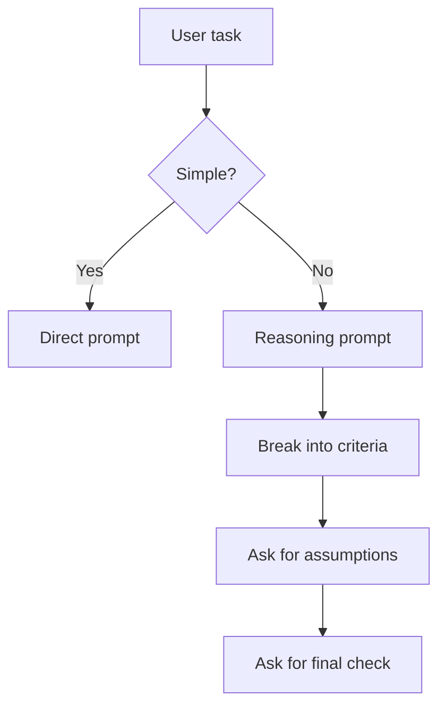
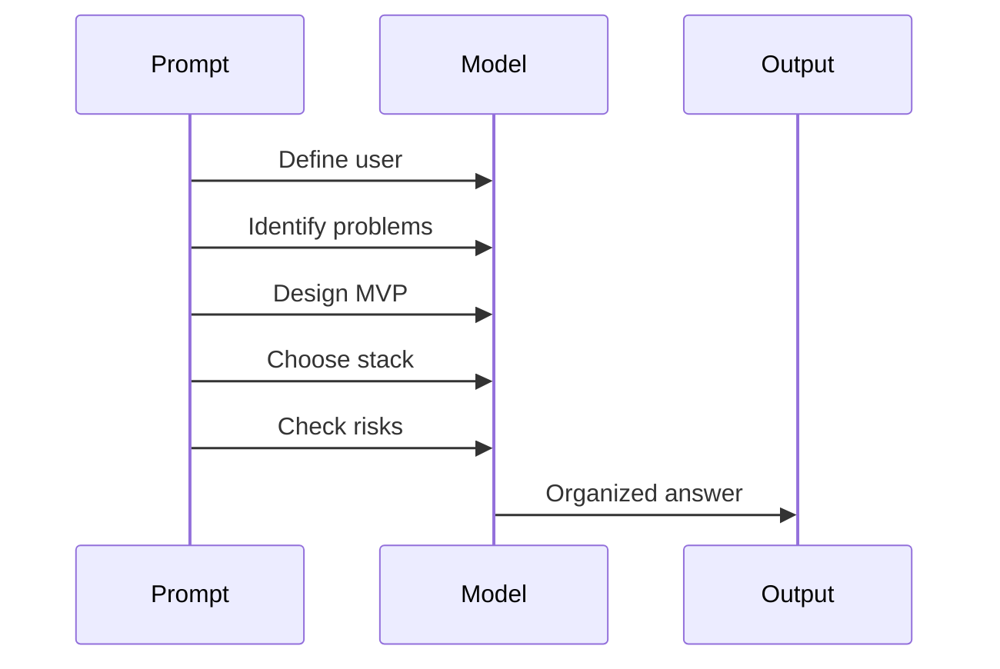
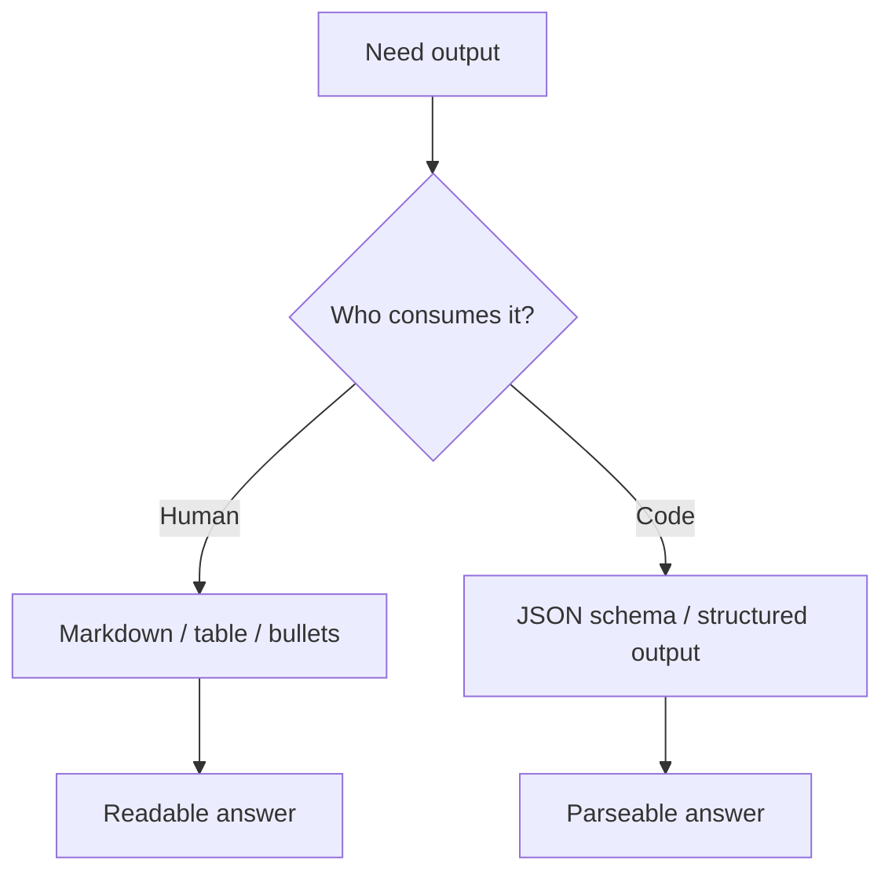

# Prompt Engineering — Chapter 2: Reliable Reasoning and Output Control

Chapter 1 gave the basic prompt parts: task, context, constraints, examples, and output format. Chapter 2 is about making the model **reason better**, **avoid vague answers**, and **return output you can actually use**.

A good mental model:

```text
Beginner prompt  = ask the model to answer
Reliable prompt  = ask the model to solve + check + format
```


Do not chase hundreds of fancy prompting tricks. Most reliable prompting comes from five habits:

```text
1. Split complex work into clear steps.
2. Give the model the right evidence/context.
3. Ask for assumptions and uncertainty when needed.
4. Force a useful output format.
5. Add a final quality check.
```

## Reasoning prompts are for hard tasks, not every task

Use a simple direct prompt when the task is easy:

```text
Rewrite this sentence politely:
"Send me the report now."
```

Use a reasoning-style prompt when the task has multiple constraints:

```text
I need to choose between SQLite and PostgreSQL for a student project.
Compare them for:
- setup time
- deployment difficulty
- multi-user support
- future scalability

Return a recommendation for a beginner FastAPI app.
Mention assumptions clearly.
End with a 5-point checklist.
```



Official guidance from OpenAI and Anthropic now treats reasoning as model- and task-dependent. Stronger reasoning models can think internally, use reasoning tokens, and may need fewer hand-written steps. For hard tasks, guide the goal, criteria, constraints, and final output instead of forcing a long manual thought process.

## Do not ask for hidden chain-of-thought by default

Earlier prompt engineering often said:

```text
Think step by step and show all reasoning.
```

That is not always the best habit now. For learning, debugging, and explanation, ask for a **brief rationale** or **steps the user can verify**. For production, prefer final answer + checks + evidence, not long private reasoning.

Better pattern:

```text
Solve the problem carefully.
Return:
1. Final answer
2. Brief explanation of the key steps
3. Checks that confirm the answer
```

For coding:

```text
Debug this code.
Do not rewrite everything.
Return:
1. Most likely bug
2. Corrected code
3. Why the fix works
4. One command to test it
```

For decisions:

```text
Evaluate the options using the criteria below.
Return:
- Recommendation
- 3 reasons
- Assumptions
- When this recommendation would change
```

## Pattern 1: Decompose the work

Large prompts fail when they mix too many goals in one instruction.

Weak:

```text
Make a business plan for my AI app.
```

Better:

```text
Create a simple business plan for a student AI app.
Work in this order:
1. Define the target user.
2. List the top 3 user problems.
3. Suggest one MVP feature set.
4. Suggest a free/cheap tech stack.
5. List risks and how to reduce them.

Keep it practical for a beginner developer.
```

The order matters when later steps depend on earlier steps.



Use decomposition for:

| Task | Good decomposition |
|---|---|
| Debugging | reproduce → locate bug → fix → test |
| Writing notes | audience → concepts → examples → mistakes → checklist |
| Data analysis | question → columns → cleaning → analysis → conclusion |
| Research | claim → evidence → counterpoint → summary |
| App planning | user → workflow → data → API → deployment |

## Pattern 2: Ask for assumptions before final answer

Models often answer confidently even when input is incomplete. Make assumptions visible.

```text
Plan a 2-day learning path for FastAPI.
Before the plan, list the assumptions you are making about the learner.
If an assumption is important, mark it as [important].
```

For technical choices:

```text
Recommend a database for this project.
Context:
- 5 users initially
- FastAPI backend
- deployed on a cheap VM
- simple login and chat history

Return:
1. Recommendation
2. Assumptions
3. Why not the other options
4. Migration path if users grow
```

This makes the answer easier to correct.

```text
Bad result:
"Use PostgreSQL."

Better result:
"Use SQLite for local demo if single-user/simple. Use PostgreSQL if multiple users and deployment reliability matter. Assumption: you want real multi-user access."
```

## Pattern 3: Give success criteria

A model cannot optimize quality if it does not know how quality is judged.

Weak:

```text
Improve this prompt.
```

Better:

```text
Improve this prompt for a beginner learning note.
Success criteria:
- clear task
- practical examples
- minimal headings
- one Mermaid diagram
- final checklist
- no long theory paragraphs

Return the improved prompt only.
```

For project work:

```text
Review this README.
Success criteria:
- a beginner can install the project
- commands are copy-pasteable
- environment variables are documented
- common errors are explained
- no secret keys are included

Return a table: Issue, Why it matters, Fix.
```


## Pattern 4: Use a final self-check

For important outputs, add a small verification step. Do not ask for a huge second essay. Ask for a short check against the actual requirements.

```text
Before finalizing, check:
- Did you answer the exact question?
- Did you follow the requested format?
- Did you avoid inventing facts?
- Are the commands/code runnable?

Then return only the final answer.
```

For coding:

```text
Before finalizing, mentally test the code for:
- missing imports
- syntax errors
- wrong file names
- commands that will not run

Then give the final code and run commands.
```

For data extraction:

```text
Extract the fields from the text.
If a field is not present, use null.
Before returning JSON, check that every value is supported by the text.
Return JSON only.
```

Self-check is useful because it tells the model what mistakes matter.

## Pattern 5: Use examples for consistency

Examples are not only for beginners. They are one of the strongest ways to control tone, labels, and output shape.

Use examples when:

```text
The model changes format every time.
The labels are confusing.
The tone must match a specific style.
The task has edge cases.
The output will be parsed by code or checked by humans.
```

Example for classification:

```text
Classify the support ticket into one label:
Billing, Bug, Feature Request, Account, Other.
Return the label only.

Examples:
Ticket: I was charged twice this month.
Label: Billing

Ticket: The export button gives a 500 error.
Label: Bug

Ticket: Please add dark mode.
Label: Feature Request

Now classify:
Ticket: I cannot reset my password.
Label:
```

Example for notes style:

````text
Create notes in this style:

Example style:
```markdown
# Topic

One short explanation.

```bash
# runnable command
command here
```

Common mistakes:
```text
Mistake: ...
Fix: ...
```
```

Now create the same style for: FastAPI dependency injection.
````

For Claude-style complex prompts, keep examples inside tags:

```text
<examples>
  <example>
    <input>I was charged twice this month.</input>
    <output>Billing</output>
  </example>
  <example>
    <input>The export button gives a 500 error.</input>
    <output>Bug</output>
  </example>
</examples>

<input>
I cannot reset my password.
</input>

Return only the label.
```

## Pattern 6: Force structured output when the output will be reused

If humans will read the answer, Markdown is fine. If code will read the answer, use a strict structure.

Good for humans:

```text
Return a Markdown table with columns:
Concept, Meaning, Example, Common mistake.
```

Good for programs:

```text
Extract task information from the email.
Return valid JSON only.
If missing, use null.

Schema:
{
  "sender_name": "string or null",
  "deadline": "YYYY-MM-DD or null",
  "tasks": ["string"],
  "priority": "low | medium | high | null"
}

Email:
"""
Hi Rahul, please send the cleaned CSV by Friday morning. This is urgent.
"""
```

For real applications, official provider APIs now support structured outputs or schema-based response formats. Use those when you need machine-checked JSON. Prompt-only JSON is useful for learning and quick prototypes, but schema-backed structured output is better for production.



## Pattern 7: Chain prompts for complex work

One giant prompt is often weaker than a small workflow.

Instead of:

```text
Research, plan, write, edit, format, and check a complete article on prompt engineering.
```

Use this chain:


Example workflow:

```text
Prompt 1: Create an outline for beginner notes on prompt engineering reasoning.
Prompt 2: Expand only section 1 with examples.
Prompt 3: Review the section for clarity and remove fluff.
Prompt 4: Add common mistakes and a checklist.
Prompt 5: Return the final Markdown.
```

Use prompt chaining when:

```text
The task is long.
The output quality matters.
You want review before final writing.
There are multiple modes: research, coding, editing, testing.
```

Do not chain when one direct prompt works. Chaining adds control but also takes more time.

## Practical template: reasoning answer

Use this for decisions, debugging, planning, and comparison.

```text
You are a practical technical advisor.

Task:
[what you want]

Context:
[important background]

Decision criteria:
- [criterion 1]
- [criterion 2]
- [criterion 3]

Rules:
- State assumptions clearly.
- Do not invent facts.
- Prefer practical trade-offs over theory.
- Keep the final answer concise.

Output format:
1. Recommendation
2. Why this is the best choice
3. Assumptions
4. Risks / when this could be wrong
5. Final checklist

Before finalizing, check the answer against the decision criteria.
```

Example:

```text
You are a practical technical advisor.

Task:
Choose between SQLite, PostgreSQL, and MongoDB for a small FastAPI chat app.

Context:
- Student demo project
- 5 to 20 users
- login with email/password
- store chat history
- deploy on a cheap VM

Decision criteria:
- easiest local development
- safe multi-user deployment
- future migration path

Rules:
- State assumptions clearly.
- Do not over-engineer.
- Prefer practical trade-offs.

Output format:
1. Recommendation
2. Why
3. When to switch
4. Final checklist
```

## Practical template: answer from source text

Use this when summarizing PDFs, docs, emails, logs, meeting notes, or long text.

```text
Task:
Answer the question using only the source text.

Question:
[write question]

Rules:
- Use only the source text.
- If the source does not contain the answer, say "Not found in source".
- Quote short phrases only when needed.
- Do not add outside knowledge.

Source:
"""
[paste source]
"""

Output:
- Direct answer
- Evidence from source
- Missing information, if any
```

This reduces hallucination because the answer must be grounded in the provided text.

## Practical template: coding prompt

Use this when asking for code that should run on a student laptop.

````text
You are a senior Python developer and teacher.

Task:
Build a small FastAPI app that demonstrates [topic].

Environment:
- Python 3.12
- Use uv for environment commands
- Use FastAPI and Uvicorn only unless necessary

Rules:
- Keep the app in main.py.
- Add comments inside the code.
- Keep the example beginner-friendly.
- Include exact run commands.
- Include one curl test.
- Do not add Docker unless asked.

Output format:
1. Files to create
2. Code blocks
3. Run commands
4. Test commands
5. Common mistakes

Before finalizing, check imports, file names, and commands.
````

## Practical template: JSON extraction

Use this for extracting data from text.

```text
Extract structured information from the text.
Return valid JSON only.
If a field is not present, use null.
Do not guess.

Schema:
{
  "person_name": "string or null",
  "email": "string or null",
  "deadline": "YYYY-MM-DD or null",
  "tasks": ["string"],
  "confidence": "low | medium | high"
}

Text:
"""
Hi Asha, please email the final report to me by 18 June 2026.
"""
```

Expected style of output:

```json
{
  "person_name": "Asha",
  "email": null,
  "deadline": "2026-06-18",
  "tasks": ["email the final report"],
  "confidence": "high"
}
```

## Small mini-lab: improve a weak reasoning prompt

Start with:

```text
Tell me which laptop is best.
```

Improve it:

```text
Recommend a laptop for a beginner developer.
Context:
- Budget: ₹60,000
- Work: Python, VS Code, browser, light Docker
- Need: good keyboard, 16GB RAM preferred, SSD
- Country: India

Return:
1. What specs to prioritize
2. What specs to avoid
3. Example configuration, not exact product
4. Final buying checklist

Do not invent live prices unless you browse current listings.
```

Notice the important rule at the end. If the answer needs current prices, availability, law, schedules, or model names, ask the AI to browse or verify from current sources.

## Reasoning prompt patterns at a glance

| Pattern | Use when | Prompt phrase |
|---|---|---|
| Decompose | Task has many steps | `Work in this order...` |
| Assumptions | Input is incomplete | `State assumptions clearly.` |
| Success criteria | Quality matters | `Judge the answer by...` |
| Self-check | Mistakes are costly | `Before finalizing, check...` |
| Few-shot examples | Format/labels vary | `Examples: input → output` |
| Structured output | Code will parse it | `Return valid JSON only...` |
| Prompt chain | Task is large | `First create plan, then draft...` |

## Common mistakes

```text
Mistake:
Asking every simple task to "think step by step".

Fix:
Use direct prompts for simple tasks. Use reasoning prompts only when the task needs it.
```

```text
Mistake:
Asking for detailed reasoning but not specifying the final output.

Fix:
Ask for final answer + brief rationale + checks.
```

```text
Mistake:
Using one giant prompt for research, writing, editing, and formatting.

Fix:
Use prompt chaining: plan → draft → review → final.
```

```text
Mistake:
Asking for JSON but adding extra prose requirements.

Fix:
Say "Return valid JSON only" and provide a schema.
```

```text
Mistake:
Giving examples that do not match real cases.

Fix:
Use relevant, diverse examples, including edge cases.
```

```text
Mistake:
Expecting prompt-only JSON to be production-safe.

Fix:
Use official structured output / schema features where available.
```

```text
Mistake:
Trusting a confident answer without checking assumptions.

Fix:
Ask for assumptions, uncertainty, and verification criteria.
```

## Important Q&A

**Q: Should I always use chain-of-thought prompting?**  
A: No. Use reasoning guidance for hard tasks. For most practical work, ask the model to solve carefully and return the final answer with a brief explanation and checks.

**Q: What is better: one huge prompt or multiple smaller prompts?**  
A: For simple tasks, one prompt is better. For complex work, split into a chain: plan, draft, review, final.

**Q: Do examples really improve prompts?**  
A: Yes, especially for classification, formatting, tone, and edge cases. Bad examples can also teach the wrong pattern, so keep them realistic.

**Q: Is JSON in a prompt enough for production?**  
A: It is okay for practice and prototypes. For production, use schema-backed structured output when your provider supports it.

**Q: What should I do when the model gives a wrong but confident answer?**  
A: Add grounding, assumptions, evidence requirements, and a self-check. For current facts, make it browse or verify from reliable sources.

**Q: When should I use a reasoning model?**  
A: Use it for complex problem solving, coding, planning, scientific/mathematical reasoning, and multi-step workflows. For short rewrites or simple classification, a fast non-reasoning model is usually enough.

## Final revision checklist

```text
[ ] I know when to use a direct prompt vs a reasoning prompt.
[ ] I avoid asking for long hidden reasoning by default.
[ ] I can ask for final answer + brief rationale + checks.
[ ] I can decompose a complex task into ordered steps.
[ ] I can make assumptions visible.
[ ] I can give success criteria before asking for output.
[ ] I can add a useful self-check for important answers.
[ ] I can use examples to control labels, tone, and format.
[ ] I can request Markdown for humans and JSON/schema for programs.
[ ] I know when to split work into a prompt chain.
[ ] I verify current facts instead of trusting stale model memory.
[ ] I can turn a vague prompt into a reliable prompt.
```

## Official references

Use these as the authentic sources. Vendor behavior changes, so always prefer the latest official docs over old prompt-engineering blog posts.

| Source | Link | Why it matters here |
|---|---|---|
| OpenAI Developers: Prompt engineering guide | [Prompt engineering](https://developers.openai.com/api/docs/guides/prompt-engineering) | General prompting structure, instruction hierarchy, Markdown/XML formatting, and prompt versioning guidance |
| OpenAI Developers: Reasoning models and reasoning best practices | [Reasoning models](https://developers.openai.com/api/docs/guides/reasoning) + [Reasoning best practices](https://developers.openai.com/api/docs/guides/reasoning-best-practices/) | When to use reasoning models, reasoning effort, reasoning tokens, and how prompting differs for harder tasks |
| OpenAI Developers: Structured Outputs | [Structured model outputs](https://developers.openai.com/api/docs/guides/structured-outputs) | Use schema-backed output when an app needs reliable JSON instead of prompt-only formatting |
| OpenAI Developers: Prompting and prompts in applications | [Prompting](https://developers.openai.com/api/docs/guides/prompting) + [Prompt engineering](https://developers.openai.com/api/docs/guides/prompt-engineering) | Prompting basics, message formatting, reusable/code-managed prompts, and application-level prompt habits |
| OpenAI Developers: Optimizing LLM accuracy | [Optimizing LLM accuracy](https://developers.openai.com/api/docs/guides/optimizing-llm-accuracy) + [Model optimization](https://developers.openai.com/api/docs/guides/model-optimization) | How to improve reliability using prompt engineering, evals, RAG, and fine-tuning instead of guessing |
| Anthropic / Claude Docs: Prompting best practices | [Claude prompting best practices](https://platform.claude.com/docs/en/build-with-claude/prompt-engineering/claude-prompting-best-practices) | Claude-specific guidance for clarity, examples, XML-style structure, and thinking behavior |
| Anthropic / Claude Docs: Extended/adaptive thinking | [Extended thinking](https://platform.claude.com/docs/en/build-with-claude/extended-thinking) + [Adaptive thinking](https://platform.claude.com/docs/en/build-with-claude/adaptive-thinking) | How Claude handles deeper reasoning and why adaptive thinking is preferred on newer Claude models |
| Anthropic / Claude Docs: Increase output consistency | [Increase output consistency](https://platform.claude.com/docs/en/test-and-evaluate/strengthen-guardrails/increase-consistency) | Practical consistency techniques, plus when to use Structured Outputs instead of prompt-only JSON |
| Google AI Developers: Gemini prompt design strategies and structured outputs | [Prompt design strategies](https://ai.google.dev/gemini-api/docs/prompting-strategies) + [Structured outputs](https://ai.google.dev/gemini-api/docs/structured-output) | Gemini prompting patterns and schema-backed output for predictable JSON responses |
