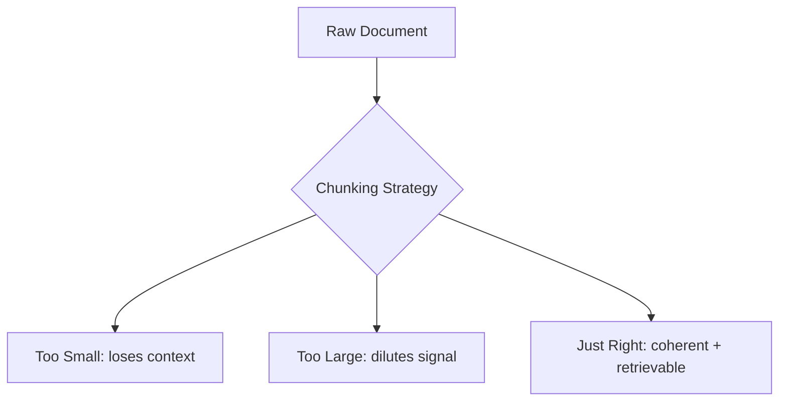

# Chunking Strategies

> **The most underrated step in RAG.** Better chunking → better retrieval → better answers. No amount of fancy reranking rescues bad chunks.

---

## Why Chunking Matters

Your embedding model has a token limit (typically 512–8192 tokens). You can't embed an entire PDF at once. But chunks that are too small lose context; chunks too large dilute the signal.

The goal: **chunks that are semantically coherent and self-contained enough to answer a question on their own.**



---

## The Five Strategies

### 1. Fixed-Size Chunking (Baseline)

Split every N characters or tokens, with M tokens of overlap.

```python
from langchain.text_splitter import RecursiveCharacterTextSplitter

splitter = RecursiveCharacterTextSplitter(
    chunk_size=500,       # characters per chunk
    chunk_overlap=50,     # overlap between consecutive chunks
    separators=["\n\n", "\n", ". ", " ", ""]  # try these in order
)

text = open("document.txt").read()
chunks = splitter.split_text(text)
print(f"Created {len(chunks)} chunks")
print(chunks[0])
```

**Pros:** Simple, fast, works everywhere.  
**Cons:** Splits mid-sentence, mid-thought. Loses paragraph/section structure.

**Best for:** Quick prototyping, homogeneous plain-text corpora.

---

### 2. Sentence / Paragraph Chunking

Respect natural text boundaries — sentences and paragraphs.

```python
import nltk
nltk.download('punkt')

from langchain.text_splitter import NLTKTextSplitter

splitter = NLTKTextSplitter(chunk_size=500)
chunks = splitter.split_text(text)
```

Or with spaCy for smarter sentence detection:

```python
import spacy
nlp = spacy.load("en_core_web_sm")

def sentence_chunks(text, max_tokens=200):
    doc = nlp(text)
    chunks, current, count = [], [], 0
    for sent in doc.sents:
        tokens = len(sent)
        if count + tokens > max_tokens and current:
            chunks.append(" ".join(s.text for s in current))
            current, count = [], 0
        current.append(sent)
        count += tokens
    if current:
        chunks.append(" ".join(s.text for s in current))
    return chunks
```

---

### 3. Header-Based (Markdown / Structured Documents)

Split on Markdown headers to preserve section structure.

```python
from langchain.text_splitter import MarkdownHeaderTextSplitter

headers_to_split_on = [
    ("#", "h1"),
    ("##", "h2"),
    ("###", "h3"),
]

splitter = MarkdownHeaderTextSplitter(headers_to_split_on=headers_to_split_on)
docs = splitter.split_text(markdown_text)

# Each doc carries metadata about which section it belongs to
for doc in docs[:3]:
    print(doc.metadata)  # {'h1': 'Introduction', 'h2': 'Background'}
    print(doc.page_content[:100])
    print("---")
```

**Best for:** Documentation sites, course notes, textbooks with clear structure.

---

### 4. Parent-Child Chunking

Store large "parent" chunks for context, index small "child" chunks for retrieval. When a child chunk matches, return the parent.

```python
from langchain.retrievers import ParentDocumentRetriever
from langchain.storage import InMemoryStore
from langchain.vectorstores import Chroma
from langchain_openai import OpenAIEmbeddings
from langchain.text_splitter import RecursiveCharacterTextSplitter

# Parent = big chunks (for LLM context)
parent_splitter = RecursiveCharacterTextSplitter(chunk_size=2000)
# Child = small chunks (for embedding + retrieval)
child_splitter = RecursiveCharacterTextSplitter(chunk_size=200)

vectorstore = Chroma(
    collection_name="full_documents",
    embedding_function=OpenAIEmbeddings()
)
store = InMemoryStore()

retriever = ParentDocumentRetriever(
    vectorstore=vectorstore,
    docstore=store,
    child_splitter=child_splitter,
    parent_splitter=parent_splitter,
)

# Index documents
from langchain.document_loaders import TextLoader
loader = TextLoader("document.txt")
docs = loader.load()
retriever.add_documents(docs)

# Retrieve — small chunk matches, but returns big parent
results = retriever.invoke("What is chunking?")
print(f"Returned {len(results)} parent chunks")
print(f"Parent chunk length: {len(results[0].page_content)} chars")
```

**Best for:** Long documents where you need precision in retrieval but rich context for generation.

---

### 5. Semantic Chunking

Group sentences by semantic similarity — split when the meaning shifts.

```python
from langchain_experimental.text_splitter import SemanticChunker
from langchain_openai import OpenAIEmbeddings

# Uses embedding distance between consecutive sentences to decide split points
splitter = SemanticChunker(
    OpenAIEmbeddings(),
    breakpoint_threshold_type="percentile",   # or "standard_deviation"
    breakpoint_threshold_amount=95,           # split when > 95th percentile shift
)

chunks = splitter.split_text(text)
print(f"Semantic chunks: {len(chunks)}")
```

**Best for:** Heterogeneous documents, articles that shift topics mid-page.  
**Cons:** Slower (requires embedding every sentence), higher API cost.

---

## Token-Based Chunking (Production-Grade)

Always chunk by **tokens**, not characters — your embedding model counts tokens.

```python
import tiktoken

def token_chunker(text: str, model: str = "text-embedding-3-small",
                  max_tokens: int = 512, overlap: int = 50):
    enc = tiktoken.encoding_for_model(model)
    tokens = enc.encode(text)
    chunks = []
    start = 0
    while start < len(tokens):
        end = min(start + max_tokens, len(tokens))
        chunk_tokens = tokens[start:end]
        chunks.append(enc.decode(chunk_tokens))
        start += max_tokens - overlap
    return chunks

chunks = token_chunker(text, max_tokens=512, overlap=50)
print(f"Token-based chunks: {len(chunks)}")
```

---

## Strategy Decision Guide

| Document Type | Best Strategy |
|---------------|---------------|
| Plain text, articles | Recursive character + overlap |
| Markdown / docs site | Header-based splitter |
| PDFs with structure | Header-based after parsing |
| Legal / academic papers | Semantic chunking |
| Long books with chapters | Parent-child |
| Code files | Language-specific splitters |

---

## Common Mistakes

| Mistake | Fix |
|---------|-----|
| Too-small chunks (< 100 tokens) | Missing context, can't answer questions alone |
| No overlap | Answers split across chunk boundaries get lost |
| Ignoring metadata | Always store source, page number, section header |
| Chunking before cleaning | Remove headers/footers/page numbers first |

---

## Adding Metadata to Chunks

Always attach metadata — you'll need it for citations later.

```python
from langchain.schema import Document

def chunk_with_metadata(filepath: str, chunks: list[str]) -> list[Document]:
    docs = []
    for i, chunk in enumerate(chunks):
        docs.append(Document(
            page_content=chunk,
            metadata={
                "source": filepath,
                "chunk_id": i,
                "total_chunks": len(chunks),
            }
        ))
    return docs
```

---

## Quick Reference

```python
# Install everything you need
uv add langchain langchain-openai langchain-experimental tiktoken nltk spacy

# The go-to splitter for most use cases
from langchain.text_splitter import RecursiveCharacterTextSplitter

splitter = RecursiveCharacterTextSplitter(
    chunk_size=512,    # tokens (or characters if you don't use tiktoken)
    chunk_overlap=64,
)
```

---

## Further Reading

- [LangChain Text Splitters Docs](https://python.langchain.com/docs/modules/data_connection/document_transformers/)
- [Chunking Strategies for LLM Applications (Pinecone)](https://www.pinecone.io/learn/chunking-strategies/)
- [SemanticChunker Paper — Greg Kamradt](https://github.com/FullStackRetrieval-com/RetrievalTutorials)

---

