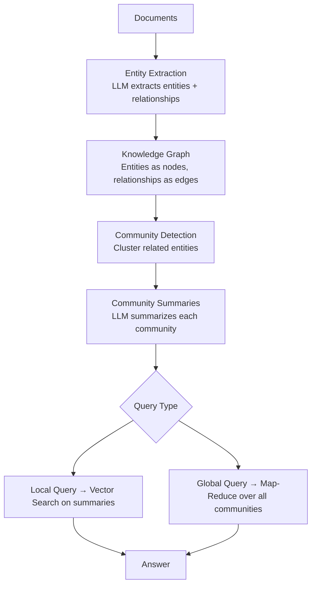

# GraphRAG

> Vector search finds similar passages. GraphRAG finds patterns, relationships, and themes across the entire corpus.

[](https://youtu.be/r09tJfON6kE "GraphRAG Explained — Microsoft Research")

---

## Why Vector Search Fails at Global Questions

Standard RAG answers "local" questions well — questions answered by one or a few passages.

**It struggles with:**
- "What are the main themes across all documents?"
- "How do these companies relate to each other?"
- "What is the overall sentiment trend in these reports?"

These require **synthesizing** information across the entire corpus — not just finding a relevant chunk.

---

## How GraphRAG Works



---

## Setup: Microsoft GraphRAG

```bash
uv add graphrag
mkdir my_graphrag_project
cd my_graphrag_project
python -m graphrag init --root .
```

This creates:
```
my_graphrag_project/
├── .env                  # API keys
├── settings.yaml         # Configuration
├── input/                # Put your documents here
└── output/               # GraphRAG writes results here
```

### Configure

```yaml
# settings.yaml (key sections)
llm:
  api_key: ${GRAPHRAG_API_KEY}
  model: gpt-4o-mini
  model_supports_json: true

embeddings:
  llm:
    api_key: ${GRAPHRAG_API_KEY}
    model: text-embedding-3-small

input:
  base_dir: "input"
  file_pattern: ".*\\.txt$"

entity_extraction:
  prompt: "prompts/entity_extraction.txt"
  max_gleanings: 1
```

```bash
# .env
GRAPHRAG_API_KEY=your-openai-api-key
```

### Add Documents & Index

```bash
# Add your text files
cp your_documents/*.txt input/

# Run indexing (builds the knowledge graph)
python -m graphrag index --root .
# This takes a few minutes — it calls LLM to extract entities
```

---

## Query GraphRAG

```python
import asyncio
from graphrag.query.cli import run_local_search, run_global_search

# Global search — synthesizes across all communities
# Good for: "What are the main themes?"
async def global_query(question: str, root_dir: str = ".") -> str:
    result = await run_global_search(
        config_filepath=f"{root_dir}/settings.yaml",
        data_dir=f"{root_dir}/output",
        root_dir=root_dir,
        community_level=2,
        response_type="Multiple Paragraphs",
        query=question,
    )
    return result

# Local search — vector search on entity/community summaries
# Good for: "Tell me about entity X"
async def local_query(question: str, root_dir: str = ".") -> str:
    result = await run_local_search(
        config_filepath=f"{root_dir}/settings.yaml",
        data_dir=f"{root_dir}/output",
        root_dir=root_dir,
        community_level=2,
        response_type="Multiple Paragraphs",
        query=question,
    )
    return result

# Usage
answer = asyncio.run(global_query("What are the main themes across all documents?"))
print(answer)
```

### Command-Line Queries

```bash
# Global search
python -m graphrag query \
  --root . \
  --method global \
  --query "What are the main themes in these documents?"

# Local search
python -m graphrag query \
  --root . \
  --method local \
  --query "What do we know about Anthropic?"
```

---

## Build a Lightweight GraphRAG from Scratch

For learning — or when you want full control:

```python
import json
import networkx as nx
from openai import OpenAI
from collections import defaultdict

client = OpenAI()

# --- Step 1: Extract entities from each chunk ---
def extract_entities(chunk: str) -> dict:
    """Extract entities and relationships from a text chunk."""
    response = client.chat.completions.create(
        model="gpt-4o-mini",
        messages=[
            {
                "role": "system",
                "content": """Extract entities and relationships from the text.
Return JSON with:
{
  "entities": [{"name": str, "type": str, "description": str}],
  "relationships": [{"source": str, "target": str, "relation": str}]
}
Return ONLY valid JSON."""
            },
            {"role": "user", "content": chunk}
        ],
        response_format={"type": "json_object"},
        temperature=0,
    )
    return json.loads(response.choices[0].message.content)

# --- Step 2: Build knowledge graph ---
def build_graph(chunks: list[str]) -> nx.Graph:
    G = nx.Graph()
    
    for chunk in chunks:
        extracted = extract_entities(chunk)
        
        # Add entities as nodes
        for entity in extracted.get("entities", []):
            node_id = entity["name"].lower()
            if G.has_node(node_id):
                G.nodes[node_id]["description"] += " " + entity["description"]
            else:
                G.add_node(node_id, **entity)
        
        # Add relationships as edges
        for rel in extracted.get("relationships", []):
            src = rel["source"].lower()
            tgt = rel["target"].lower()
            if not G.has_node(src):
                G.add_node(src, name=rel["source"], type="Unknown", description="")
            if not G.has_node(tgt):
                G.add_node(tgt, name=rel["target"], type="Unknown", description="")
            G.add_edge(src, tgt, relation=rel["relation"])
    
    return G

# --- Step 3: Detect communities ---
def detect_communities(G: nx.Graph) -> dict:
    """Use Louvain community detection."""
    try:
        from community import best_partition
        partition = best_partition(G)
    except ImportError:
        # Fallback: connected components
        partition = {}
        for i, component in enumerate(nx.connected_components(G)):
            for node in component:
                partition[node] = i
    return partition

# --- Step 4: Summarize communities ---
def summarize_community(community_nodes: list[str], G: nx.Graph) -> str:
    """Use LLM to summarize what a community of entities represents."""
    entity_descriptions = []
    for node in community_nodes[:20]:  # limit to 20 nodes
        data = G.nodes[node]
        desc = data.get("description", "")
        entity_descriptions.append(f"- {data.get('name', node)}: {desc}")
    
    edges = []
    for u, v, data in G.edges(data=True):
        if u in community_nodes and v in community_nodes:
            edges.append(f"- {u} → {data.get('relation', 'relates to')} → {v}")
    
    prompt = (
        f"Entities:\n" + "\n".join(entity_descriptions[:15]) +
        f"\n\nRelationships:\n" + "\n".join(edges[:10]) +
        "\n\nSummarize what this group of entities is about in 2-3 sentences."
    )
    
    response = client.chat.completions.create(
        model="gpt-4o-mini",
        messages=[{"role": "user", "content": prompt}],
        temperature=0,
    )
    return response.choices[0].message.content

# --- Example usage ---
docs = [
    "OpenAI developed GPT-4, a large language model. Sam Altman is the CEO of OpenAI.",
    "Anthropic built Claude, an AI assistant focused on safety. Dario Amodei founded Anthropic.",
    "Google DeepMind created Gemini. DeepMind is known for AlphaGo and AlphaFold.",
    "Meta AI Research released LLaMA, an open-source language model. Yann LeCun leads Meta AI.",
]

print("Building knowledge graph...")
G = build_graph(docs)
print(f"Graph: {G.number_of_nodes()} nodes, {G.number_of_edges()} edges")

partition = detect_communities(G)
community_groups = defaultdict(list)
for node, community_id in partition.items():
    community_groups[community_id].append(node)

for cid, nodes in community_groups.items():
    summary = summarize_community(nodes, G)
    print(f"\nCommunity {cid} ({len(nodes)} entities):")
    print(f"  Nodes: {nodes}")
    print(f"  Summary: {summary}")
```

---

## When to Use GraphRAG vs Standard RAG

| Question Type | Use | Example |
|---------------|-----|---------|
| Specific fact lookup | Standard RAG | "When was X founded?" |
| "All documents" synthesis | GraphRAG (global) | "What are the main themes?" |
| Entity deep-dive | GraphRAG (local) | "Tell me everything about X" |
| Relationship queries | GraphRAG | "How does X relate to Y?" |
| High volume, low budget | Standard RAG | GraphRAG is expensive |

---

## Cost Warning

GraphRAG runs many LLM calls during indexing — it extracts entities from **every chunk**. For a 100-page document, expect $0.50–$5 in API costs just for indexing. Use `gpt-4o-mini` and limit gleanings to keep costs low.

---

## Further Reading

- [Microsoft GraphRAG GitHub](https://github.com/microsoft/graphrag)
- [GraphRAG Paper](https://arxiv.org/abs/2404.16130)
- [GraphRAG Docs](https://microsoft.github.io/graphrag/)