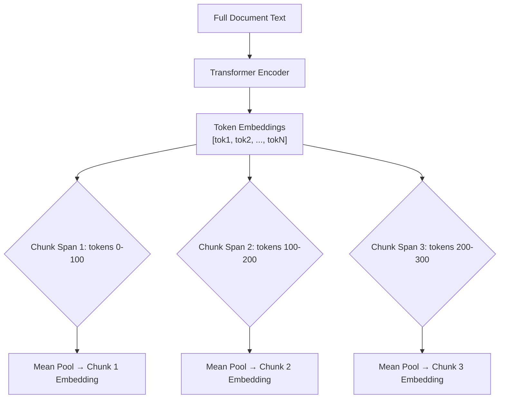

# Late Chunking

> Traditional chunking: chunk → embed. Late chunking: embed → chunk. That order reversal is everything.

---

## The Problem with Early Chunking

When you chunk a document before embedding, each chunk loses context from the rest of the document.

**Example:**

```
Document: "The Eiffel Tower was built in 1889. It is located in Paris.
           This famous landmark attracts millions of visitors annually."

Chunk 1: "The Eiffel Tower was built in 1889."
Chunk 2: "It is located in Paris."          ← "It" has no referent!
Chunk 3: "This famous landmark attracts..."  ← What landmark?
```

Chunk 2's embedding doesn't know "It" refers to the Eiffel Tower. The embedding is incomplete.

---

## The Late Chunking Solution

1. Pass the **full document** through the embedding model
2. Get **token-level embeddings** for every token (not just a single `[CLS]` vector)
3. **Mean-pool** token embeddings within each chunk's span

Each chunk's embedding now contains context from the full document.



---

## Implementation from Scratch

```python
import torch
from transformers import AutoTokenizer, AutoModel
import numpy as np

# Use a long-context embedding model
# jina-embeddings-v2 supports up to 8192 tokens
MODEL_NAME = "jinaai/jina-embeddings-v2-base-en"

tokenizer = AutoTokenizer.from_pretrained(MODEL_NAME, trust_remote_code=True)
model = AutoModel.from_pretrained(MODEL_NAME, trust_remote_code=True)
model.eval()

def mean_pool(token_embeddings: torch.Tensor, attention_mask: torch.Tensor) -> torch.Tensor:
    """Compute mean of token embeddings, ignoring padding."""
    mask_expanded = attention_mask.unsqueeze(-1).expand(token_embeddings.size()).float()
    return torch.sum(token_embeddings * mask_expanded, 1) / torch.clamp(mask_expanded.sum(1), min=1e-9)

def late_chunking_embed(
    document: str,
    chunk_texts: list[str],
) -> list[np.ndarray]:
    """
    Embed chunks using late chunking:
    1. Encode the full document to get token-level embeddings
    2. Mean-pool within each chunk's token span
    
    Returns list of embeddings, one per chunk.
    """
    # Tokenize the full document
    doc_inputs = tokenizer(
        document,
        return_tensors="pt",
        truncation=True,
        max_length=8192,
        return_offsets_mapping=True,  # character offsets for each token
    )
    
    # Get all token embeddings (not just CLS)
    with torch.no_grad():
        outputs = model(
            input_ids=doc_inputs["input_ids"],
            attention_mask=doc_inputs["attention_mask"],
        )
    
    # Shape: (1, seq_len, hidden_dim)
    token_embeddings = outputs.last_hidden_state.squeeze(0)  # (seq_len, hidden_dim)
    
    # Map characters to token indices using offset mapping
    offset_mapping = doc_inputs["offset_mapping"].squeeze(0).tolist()
    
    chunk_embeddings = []
    
    for chunk_text in chunk_texts:
        # Find where this chunk appears in the full document
        chunk_start = document.find(chunk_text)
        if chunk_start == -1:
            # Fallback: encode chunk directly
            chunk_inputs = tokenizer(chunk_text, return_tensors="pt")
            with torch.no_grad():
                out = model(**chunk_inputs)
            emb = mean_pool(out.last_hidden_state, chunk_inputs["attention_mask"])
            chunk_embeddings.append(emb.squeeze().numpy())
            continue
        
        chunk_end = chunk_start + len(chunk_text)
        
        # Find token indices that fall within this character range
        token_indices = [
            i for i, (start, end) in enumerate(offset_mapping)
            if start >= chunk_start and end <= chunk_end and start < end
        ]
        
        if not token_indices:
            # Fallback
            chunk_embeddings.append(token_embeddings[0].numpy())
            continue
        
        # Mean pool the tokens in this chunk's span
        chunk_token_embs = token_embeddings[token_indices]  # (n_tokens, hidden_dim)
        chunk_emb = chunk_token_embs.mean(dim=0)            # (hidden_dim,)
        chunk_embeddings.append(chunk_emb.numpy())
    
    return chunk_embeddings

# --- Demo ---
document = """
The Eiffel Tower was built in 1889 by Gustave Eiffel. It stands 330 meters tall.
It is located in Paris, France, on the Champ de Mars near the Seine River.
This iconic landmark was originally criticized by some Parisians but has since become
one of the most visited monuments in the world, attracting over 6 million visitors annually.
"""

# Split into chunks (simple split here — use any strategy)
chunks = [
    "The Eiffel Tower was built in 1889 by Gustave Eiffel.",
    "It is located in Paris, France, on the Champ de Mars near the Seine River.",
    "This iconic landmark was originally criticized by some Parisians.",
]

# Late chunking
late_embeddings = late_chunking_embed(document, chunks)
print(f"Got {len(late_embeddings)} chunk embeddings")
print(f"Each embedding shape: {late_embeddings[0].shape}")

# Compare with naive chunking (embed each chunk independently)
def naive_chunk_embed(chunks: list[str]) -> list[np.ndarray]:
    embeddings = []
    for chunk in chunks:
        inputs = tokenizer(chunk, return_tensors="pt", truncation=True, max_length=512)
        with torch.no_grad():
            out = model(**inputs)
        emb = mean_pool(out.last_hidden_state, inputs["attention_mask"])
        embeddings.append(emb.squeeze().numpy())
    return embeddings

naive_embeddings = naive_chunk_embed(chunks)

# The late chunking embeddings carry context from the full document
# Chunk 2 ("It is located in Paris") now "knows" It = Eiffel Tower
```

---

## Using Jina's Late Chunking API

Jina provides a hosted endpoint that does late chunking for you:

```python
import requests

JINA_API_KEY = "your-jina-api-key"  # Get at jina.ai

def jina_late_chunk_embed(document: str, chunks: list[str]) -> list[list[float]]:
    """Use Jina's API for late chunking embeddings."""
    response = requests.post(
        "https://api.jina.ai/v1/embeddings",
        headers={
            "Authorization": f"Bearer {JINA_API_KEY}",
            "Content-Type": "application/json",
        },
        json={
            "model": "jina-embeddings-v3",
            "input": [
                {"text": document},           # Full document first
                *[{"text": c} for c in chunks]  # Then individual chunks
            ],
            "late_chunking": True,             # The magic flag
            "task": "retrieval.passage",
        }
    )
    
    data = response.json()
    # Skip the first embedding (full document), return chunk embeddings
    return [item["embedding"] for item in data["data"][1:]]

embeddings = jina_late_chunk_embed(document, chunks)
print(f"Received {len(embeddings)} embeddings from Jina API")
```

---

## When to Use Late Chunking

| Scenario | Verdict |
|----------|---------|
| Documents with pronoun references (it, they, this) | ✅ Use late chunking |
| Technical papers with section cross-references | ✅ Use late chunking |
| Independent, self-contained paragraphs | ❌ Regular chunking is fine |
| Documents > 8192 tokens | ⚠️ Need long-context model or sliding window |
| Short Q&A pairs | ❌ Overkill |

---

## Key Takeaway

Late chunking is a simple idea — embed first, chunk later — that measurably improves retrieval quality for documents with anaphoric references and cross-chunk dependencies. For most production RAG systems handling real-world documents, it's worth the extra complexity.

---

## Further Reading

- [Late Chunking Blog Post — Jina AI](https://jina.ai/news/late-chunking-in-long-context-embedding-models/)
- [Late Chunking Paper](https://arxiv.org/abs/2409.04701)
- [Jina Embeddings v3](https://huggingface.co/jinaai/jina-embeddings-v3)