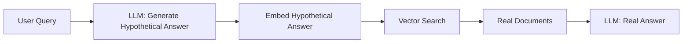

# Query Augmentation

> The query the user types is rarely the best query for retrieval. Fix it before it hits your vector database.

---

## Why Augment Queries?

Users ask vague, short, or jargon-heavy questions. Your retrieval system works best with precise, information-rich queries.

| User Query | What They Mean | Better Retrieval Query |
|------------|---------------|----------------------|
| "How does it work?" | (no context) | Depends on the document! |
| "Python error in loop" | IndexError in for loop | "Python IndexError list index out of range for loop" |
| "Fast RAG" | Low-latency RAG pipelines | "Techniques to reduce latency in retrieval-augmented generation" |

---

## Technique 1: HyDE — Hypothetical Document Embeddings

**Idea:** Instead of embedding the query, generate a *hypothetical* answer document, then embed that.

Why? A generated answer is semantically closer to the actual documents in your corpus than a short query is.



```python
from openai import OpenAI
from langchain.vectorstores import Chroma
from langchain_openai import OpenAIEmbeddings

client = OpenAI()

def hyde_retrieve(query: str, vectorstore, k: int = 5) -> list:
    """
    HyDE: Generate a hypothetical document, then retrieve by its embedding.
    """
    # Step 1: Generate a hypothetical answer
    response = client.chat.completions.create(
        model="gpt-4o-mini",
        messages=[
            {
                "role": "system",
                "content": (
                    "Generate a detailed, factual passage that would appear in "
                    "a technical document and directly answer the question. "
                    "Write 2-3 paragraphs as if you are the document."
                )
            },
            {"role": "user", "content": query}
        ],
        max_tokens=300,
        temperature=0,
    )
    
    hypothetical_doc = response.choices[0].message.content
    print(f"Hypothetical doc preview: {hypothetical_doc[:150]}...")
    
    # Step 2: Retrieve using the hypothetical document as the query
    results = vectorstore.similarity_search(hypothetical_doc, k=k)
    return results

# Usage
vectorstore = Chroma.from_texts(
    texts=[
        "RAG pipelines retrieve context before generating answers.",
        "Vector databases store high-dimensional embeddings for similarity search.",
        "Chunking strategies determine how documents are split for indexing.",
    ],
    embedding=OpenAIEmbeddings()
)

results = hyde_retrieve(
    "Explain how retrieval-augmented generation reduces hallucination",
    vectorstore
)
for r in results:
    print(f"• {r.page_content}")
```

**When HyDE shines:** Factual Q&A domains (medical, legal, technical documentation).  
**When to skip:** Creative or open-ended queries where a hypothetical is hard to generate.

---

## Technique 2: Query Rewriting

Use an LLM to rephrase the query for better retrieval — fixing typos, expanding acronyms, adding domain context.

```python
def rewrite_query(original_query: str, domain: str = "") -> str:
    """
    Rewrite a user query for better retrieval.
    """
    domain_context = f"The search is over documents about: {domain}. " if domain else ""
    
    response = client.chat.completions.create(
        model="gpt-4o-mini",
        messages=[
            {
                "role": "system",
                "content": (
                    f"{domain_context}Rewrite the following user query to be more "
                    "specific and suitable for document retrieval. "
                    "Keep it concise but complete. Return only the rewritten query."
                )
            },
            {"role": "user", "content": original_query}
        ],
        temperature=0,
    )
    
    return response.choices[0].message.content.strip()

# Examples
queries = [
    "explain rag",
    "why my vectors slow",
    "HNSW vs IVF which better?",
]

for q in queries:
    rewritten = rewrite_query(q, domain="vector databases and RAG systems")
    print(f"Original:  {q}")
    print(f"Rewritten: {rewritten}")
    print()
```

---

## Technique 3: Multi-Query Expansion

Generate multiple alternative phrasings of the query and retrieve for each. Merge results with RRF.

```python
from typing import List

def multi_query_expand(query: str, n: int = 3) -> List[str]:
    """
    Generate N alternative queries for the same information need.
    """
    response = client.chat.completions.create(
        model="gpt-4o-mini",
        messages=[
            {
                "role": "system",
                "content": (
                    f"Generate {n} different ways to ask the following question "
                    "for use in document retrieval. Each should approach the "
                    "information need from a different angle. "
                    f"Return exactly {n} queries, one per line."
                )
            },
            {"role": "user", "content": query}
        ],
        temperature=0.7,
    )
    
    lines = response.choices[0].message.content.strip().split("\n")
    # Clean up numbered lists if any
    queries = [l.lstrip("0123456789.-) ").strip() for l in lines if l.strip()]
    return queries[:n]

def multi_query_retrieve(query: str, vectorstore, k: int = 5) -> list:
    """Retrieve using multiple query variations, deduplicate results."""
    all_queries = [query] + multi_query_expand(query, n=3)
    
    seen_content = set()
    all_results = []
    
    for q in all_queries:
        results = vectorstore.similarity_search(q, k=k)
        for r in results:
            if r.page_content not in seen_content:
                seen_content.add(r.page_content)
                all_results.append(r)
    
    return all_results[:k]

# Example
variants = multi_query_expand("How does vector similarity work in RAG?")
for i, v in enumerate(variants, 1):
    print(f"{i}. {v}")
```

---

## Technique 4: Step-Back Prompting

For complex, specific questions — first retrieve general background, then answer the specific question.

```python
def step_back_retrieve(specific_query: str, vectorstore, k: int = 5) -> dict:
    """
    Step-Back: Generate a more general version of the query,
    retrieve for both, then combine.
    """
    # Generate the step-back (more general) query
    response = client.chat.completions.create(
        model="gpt-4o-mini",
        messages=[
            {
                "role": "system",
                "content": (
                    "Given a specific question, generate a more general, "
                    "abstract version that retrieves background knowledge. "
                    "Return only the general question."
                )
            },
            {"role": "user", "content": specific_query}
        ],
        temperature=0,
    )
    
    general_query = response.choices[0].message.content.strip()
    
    # Retrieve for both
    specific_results = vectorstore.similarity_search(specific_query, k=k)
    general_results = vectorstore.similarity_search(general_query, k=k)
    
    return {
        "specific_query": specific_query,
        "general_query": general_query,
        "specific_docs": specific_results,
        "general_docs": general_results,
        "combined_context": specific_results + general_results,
    }

# Example
result = step_back_retrieve(
    "Why does HNSW use logarithmic connections at higher layers?"
)
print(f"Specific: {result['specific_query']}")
print(f"General:  {result['general_query']}")
```

---

## Combining Everything: Augmented Retriever Class

```python
from enum import Enum

class AugmentStrategy(Enum):
    NONE = "none"
    REWRITE = "rewrite"
    HYDE = "hyde"
    MULTI_QUERY = "multi_query"
    STEP_BACK = "step_back"

class AugmentedRetriever:
    def __init__(self, vectorstore, strategy: AugmentStrategy = AugmentStrategy.REWRITE):
        self.vectorstore = vectorstore
        self.strategy = strategy
    
    def retrieve(self, query: str, k: int = 5) -> list:
        if self.strategy == AugmentStrategy.NONE:
            return self.vectorstore.similarity_search(query, k=k)
        
        elif self.strategy == AugmentStrategy.REWRITE:
            improved = rewrite_query(query)
            return self.vectorstore.similarity_search(improved, k=k)
        
        elif self.strategy == AugmentStrategy.HYDE:
            return hyde_retrieve(query, self.vectorstore, k=k)
        
        elif self.strategy == AugmentStrategy.MULTI_QUERY:
            return multi_query_retrieve(query, self.vectorstore, k=k)
        
        elif self.strategy == AugmentStrategy.STEP_BACK:
            result = step_back_retrieve(query, self.vectorstore, k=k)
            return result["combined_context"]
```

---

## When to Use What

| Strategy | Best For | Cost |
|----------|----------|------|
| **No augmentation** | Simple, precise queries | Cheapest |
| **Query rewriting** | Vague / ambiguous user input | Low |
| **HyDE** | Technical Q&A with clear answers | Medium |
| **Multi-query** | Broad topics needing coverage | Medium |
| **Step-back** | Specific questions needing background | Medium |

---

## Further Reading

- [HyDE Paper — Gao et al.](https://arxiv.org/abs/2212.10496)
- [Step-Back Prompting — Google DeepMind](https://arxiv.org/abs/2310.06117)
- [RAG From Scratch — LangChain](https://www.youtube.com/watch?v=wd7TZ4w1mSw)