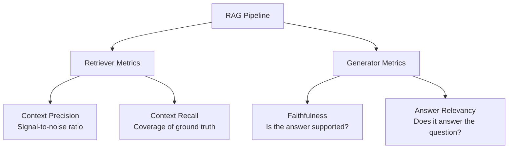

# RAGAS Evaluation

> **"You can't improve what you can't measure."** RAGAS gives you numbers, not vibes.

[](https://youtu.be/IlNglM9bKLw "RAGAS: Automated Evaluation of RAG Pipelines")

---

## Why Evaluate?

RAG systems fail in subtle ways:
- Retrieved the right documents but **hallucinated** the answer  
- Gave a correct-looking answer that **wasn't supported** by context  
- Retrieved **irrelevant** chunks despite having good documents in the corpus  

RAGAS catches all three failure modes with four key metrics.

---

## The Four Core RAGAS Metrics



| Metric | Measures | Requires Ground Truth? |
|--------|----------|----------------------|
| **Faithfulness** | Are claims in the answer supported by retrieved context? | No |
| **Answer Relevancy** | How well does the answer address the question? | No |
| **Context Precision** | Are relevant chunks ranked higher than irrelevant ones? | Yes |
| **Context Recall** | Were all necessary facts retrieved? | Yes |

---

## Install & Setup

```bash
uv add ragas langchain langchain-openai openai
```

```python
import os
os.environ["OPENAI_API_KEY"] = "your-key-here"
```

---

## Minimal Working Example

```python
from ragas import evaluate, EvaluationDataset
from ragas.metrics import LLMContextRecall, Faithfulness, FactualCorrectness, ResponseRelevancy
from ragas.llms import LangchainLLMWrapper
from langchain_openai import ChatOpenAI

# 1. Build your evaluation dataset
#    In production: run your actual RAG pipeline to collect these
data = [
    {
        "user_input": "What is retrieval-augmented generation?",
        "retrieved_contexts": [
            "Retrieval-Augmented Generation (RAG) is a technique that "
            "combines information retrieval with language model generation. "
            "It retrieves relevant documents from a knowledge base and uses "
            "them as context for the language model.",
        ],
        "response": "RAG is a technique that enhances LLMs by retrieving "
                    "relevant documents from an external knowledge base before "
                    "generating a response.",
        "reference": "RAG stands for Retrieval-Augmented Generation, a method "
                     "that fetches relevant information from documents to help "
                     "language models generate accurate answers.",
    },
    {
        "user_input": "What is FAISS?",
        "retrieved_contexts": [
            "FAISS (Facebook AI Similarity Search) is a library developed by "
            "Meta for efficient similarity search and clustering of dense vectors.",
        ],
        "response": "FAISS is a library by Facebook/Meta for fast similarity "
                    "search in high-dimensional vector spaces.",
        "reference": "FAISS is a similarity search library by Facebook AI Research "
                     "designed for efficient nearest-neighbor search.",
    },
]

dataset = EvaluationDataset.from_list(data)

# 2. Set up evaluator LLM
llm = LangchainLLMWrapper(ChatOpenAI(model="gpt-4o-mini"))

# 3. Run evaluation
result = evaluate(
    dataset=dataset,
    metrics=[
        Faithfulness(llm=llm),
        ResponseRelevancy(llm=llm),
        LLMContextRecall(llm=llm),
        FactualCorrectness(llm=llm),
    ],
    llm=llm,
)

print(result)
# {'faithfulness': 0.95, 'answer_relevancy': 0.88, 'context_recall': 1.0, ...}

# Export to pandas for analysis
df = result.to_pandas()
print(df.to_string())
```

---

## End-to-End: Build RAG + Evaluate It

```python
import os
from openai import OpenAI
from langchain.vectorstores import Chroma
from langchain_openai import OpenAIEmbeddings, ChatOpenAI
from langchain.text_splitter import RecursiveCharacterTextSplitter
from langchain.document_loaders import TextLoader
from ragas import evaluate, EvaluationDataset
from ragas.metrics import LLMContextRecall, Faithfulness, FactualCorrectness
from ragas.llms import LangchainLLMWrapper

client = OpenAI()

# ---- 1. Build RAG ----
def build_vectorstore(documents: list[str]) -> Chroma:
    splitter = RecursiveCharacterTextSplitter(chunk_size=300, chunk_overlap=30)
    chunks = splitter.split_text("\n\n".join(documents))
    return Chroma.from_texts(chunks, OpenAIEmbeddings())

def rag_answer(query: str, vectorstore: Chroma, k: int = 3) -> dict:
    """Returns answer + retrieved contexts."""
    docs = vectorstore.similarity_search(query, k=k)
    context = "\n\n".join(d.page_content for d in docs)
    
    response = client.chat.completions.create(
        model="gpt-4o-mini",
        messages=[
            {
                "role": "system",
                "content": (
                    "Answer the question using ONLY the provided context. "
                    "If the answer is not in the context, say 'I don't know.'"
                )
            },
            {
                "role": "user",
                "content": f"Context:\n{context}\n\nQuestion: {query}"
            }
        ],
        temperature=0,
    )
    
    return {
        "answer": response.choices[0].message.content,
        "contexts": [d.page_content for d in docs],
    }

# ---- 2. Collect Evaluation Data ----
corpus = [
    "FAISS is a library for efficient similarity search by Facebook AI Research.",
    "ChromaDB is an open-source vector database for AI applications.",
    "Qdrant is a vector database written in Rust designed for production workloads.",
    "PGVector is a PostgreSQL extension that adds vector similarity search.",
    "RAG combines retrieval with generation to reduce hallucination in LLMs.",
    "Rerankers improve retrieval quality by scoring candidates with cross-encoders.",
    "Chunking splits documents into smaller pieces suitable for embedding.",
    "RAGAS evaluates RAG pipelines with faithfulness, precision, and recall metrics.",
]

vectorstore = build_vectorstore(corpus)

# Your test questions + ground truth answers
eval_questions = [
    {
        "query": "What is FAISS used for?",
        "ground_truth": "FAISS is used for efficient similarity search and was developed by Facebook AI Research.",
    },
    {
        "query": "How does RAG reduce hallucination?",
        "ground_truth": "RAG reduces hallucination by combining retrieval with generation, grounding answers in retrieved documents.",
    },
    {
        "query": "What is Qdrant written in?",
        "ground_truth": "Qdrant is written in Rust.",
    },
]

# Run RAG and collect results
eval_data = []
for item in eval_questions:
    result = rag_answer(item["query"], vectorstore)
    eval_data.append({
        "user_input": item["query"],
        "retrieved_contexts": result["contexts"],
        "response": result["answer"],
        "reference": item["ground_truth"],
    })

# ---- 3. Evaluate ----
dataset = EvaluationDataset.from_list(eval_data)
evaluator_llm = LangchainLLMWrapper(ChatOpenAI(model="gpt-4o-mini"))

scores = evaluate(
    dataset=dataset,
    metrics=[
        Faithfulness(llm=evaluator_llm),
        LLMContextRecall(llm=evaluator_llm),
        FactualCorrectness(llm=evaluator_llm),
    ],
    llm=evaluator_llm,
)

print("\n=== RAGAS Evaluation Results ===")
print(scores)
df = scores.to_pandas()
print("\nPer-question breakdown:")
print(df[["user_input", "faithfulness", "llm_context_recall", "factual_correctness"]])
```

---

## Comparing Retrieval Strategies

RAGAS is most powerful when **comparing** approaches:

```python
from ragas import evaluate, EvaluationDataset
from ragas.metrics import Faithfulness, LLMContextRecall, FactualCorrectness
from ragas.llms import LangchainLLMWrapper
from langchain_openai import ChatOpenAI

evaluator_llm = LangchainLLMWrapper(ChatOpenAI(model="gpt-4o-mini"))
metrics = [Faithfulness(llm=evaluator_llm), LLMContextRecall(llm=evaluator_llm)]

def evaluate_strategy(name: str, retriever_fn, questions: list) -> dict:
    eval_data = []
    for q in questions:
        contexts, answer = retriever_fn(q["query"])
        eval_data.append({
            "user_input": q["query"],
            "retrieved_contexts": contexts,
            "response": answer,
            "reference": q["ground_truth"],
        })
    
    dataset = EvaluationDataset.from_list(eval_data)
    result = evaluate(dataset=dataset, metrics=metrics, llm=evaluator_llm)
    
    print(f"\n{name}:")
    for metric, score in result.items():
        print(f"  {metric}: {score:.4f}")
    
    return dict(result)

# Compare 3 strategies
questions = [
    {"query": "What is FAISS?", "ground_truth": "FAISS is a similarity search library by Meta."},
    {"query": "What is RAG?", "ground_truth": "RAG combines retrieval with generation."},
]

results = {
    "Naive RAG": evaluate_strategy("Naive RAG", naive_retriever, questions),
    "Hybrid RAG": evaluate_strategy("Hybrid RAG", hybrid_retriever, questions),
    "Contextual RAG": evaluate_strategy("Contextual RAG", contextual_retriever, questions),
}

# Print comparison table
import pandas as pd
comparison_df = pd.DataFrame(results).T
print("\n=== Strategy Comparison ===")
print(comparison_df.to_string())
```

---

## Understanding Each Metric

### Faithfulness

```math
\text{Faithfulness} = \frac{\text{claims in answer supported by context}}{\text{total claims in answer}}
```

A score of 1.0 means every statement in the answer is backed by a retrieved chunk. Scores below 0.7 signal hallucination.

### Context Recall

```math
\text{Context Recall} = \frac{\text{ground-truth sentences found in context}}{\text{total ground-truth sentences}}
```

Measures whether you **retrieved** all the information needed. Low recall = missing chunks.

### Factual Correctness

Compares the answer to the ground truth using LLM judgment. Different from faithfulness — an answer can be faithful to a wrong chunk.

### Answer Relevancy

Does the answer actually address the question? Detects answers that are factually correct but off-topic.

---

## What Good Scores Look Like

| Score | Faithfulness | Context Recall | Factual Correctness |
|-------|-------------|----------------|---------------------|
| 🟢 Good | > 0.85 | > 0.85 | > 0.75 |
| 🟡 Acceptable | 0.70–0.85 | 0.70–0.85 | 0.60–0.75 |
| 🔴 Needs work | < 0.70 | < 0.70 | < 0.60 |

---

## Visualizing Results

```python
import matplotlib.pyplot as plt
import numpy as np

strategies = list(results.keys())
metrics_list = ["faithfulness", "llm_context_recall"]

x = np.arange(len(metrics_list))
width = 0.25
fig, ax = plt.subplots(figsize=(10, 6))

for i, strategy in enumerate(strategies):
    values = [results[strategy].get(m, 0) for m in metrics_list]
    bars = ax.bar(x + i * width, values, width, label=strategy, alpha=0.8)
    ax.bar_label(bars, fmt="%.2f", padding=3, fontsize=9)

ax.set_xlabel("Metric")
ax.set_ylabel("Score")
ax.set_title("RAG Strategy Comparison — RAGAS Scores")
ax.set_xticks(x + width)
ax.set_xticklabels(["Faithfulness", "Context Recall"])
ax.legend()
ax.set_ylim(0, 1.1)
plt.tight_layout()
plt.savefig("ragas_comparison.png", dpi=150)
plt.show()
```

---

## Further Reading

- [RAGAS Documentation](https://docs.ragas.io/)
- [RAGAS Paper](https://arxiv.org/abs/2309.15217)
- [RAGAS GitHub](https://github.com/explodinggradients/ragas)