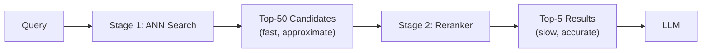

# Reranking

> Retrieve many, rerank few, pass the best to the LLM.

---

## The Two-Stage Retrieval Pattern

First-stage retrieval (vector search) is fast but approximate. Rerankers are slow but accurate. The trick: run the fast stage to get 20-50 candidates, then run the accurate stage on just those candidates.



Cost: vector search on 1M docs + reranking on 50 docs >> vector search alone on 1M docs.

---

## Cross-Encoder Rerankers

A bi-encoder (like your embedding model) encodes query and document **separately**. A cross-encoder encodes them **together** — the model sees the full interaction, so it's much more accurate.

```bash
uv add sentence-transformers
```

```python
from sentence_transformers import CrossEncoder

# Load a cross-encoder model
# ms-marco models are trained on MS MARCO passage ranking
model = CrossEncoder("cross-encoder/ms-marco-MiniLM-L-6-v2")

query = "What is retrieval-augmented generation?"
candidates = [
    "RAG is a technique that combines retrieval and generation.",
    "The sky is blue on a clear day.",
    "Retrieval-Augmented Generation uses external documents to ground LLM answers.",
    "Python is a popular programming language.",
    "RAG reduces hallucination by providing factual context to language models.",
]

# Score all candidate pairs
scores = model.predict([(query, doc) for doc in candidates])

# Sort by score descending
ranked = sorted(zip(candidates, scores), key=lambda x: x[1], reverse=True)

print("Reranked results:")
for rank, (doc, score) in enumerate(ranked, 1):
    print(f"  {rank}. [{score:.3f}] {doc}")
```

---

## Integration: Retriever + Reranker

```python
from sentence_transformers import CrossEncoder
from langchain.vectorstores import Chroma
from langchain_openai import OpenAIEmbeddings
from langchain.schema import Document

class RerankedRetriever:
    def __init__(
        self,
        vectorstore: Chroma,
        reranker_model: str = "cross-encoder/ms-marco-MiniLM-L-6-v2",
        first_stage_k: int = 20,
        final_k: int = 5
    ):
        self.vectorstore = vectorstore
        self.reranker = CrossEncoder(reranker_model)
        self.first_stage_k = first_stage_k
        self.final_k = final_k
    
    def retrieve(self, query: str) -> list[Document]:
        # Stage 1: Fast ANN retrieval (cast wide net)
        candidates = self.vectorstore.similarity_search(
            query, k=self.first_stage_k
        )
        
        if not candidates:
            return []
        
        # Stage 2: Rerank with cross-encoder
        pairs = [(query, doc.page_content) for doc in candidates]
        scores = self.reranker.predict(pairs)
        
        # Sort by reranker score
        reranked = sorted(
            zip(candidates, scores),
            key=lambda x: x[1],
            reverse=True
        )
        
        # Return top-k with reranker scores attached
        results = []
        for doc, score in reranked[:self.final_k]:
            doc.metadata["reranker_score"] = float(score)
            results.append(doc)
        
        return results

# Usage
vectorstore = Chroma.from_texts(
    texts=[
        "FAISS is a library for efficient similarity search in high-dimensional space.",
        "Cross-encoders are slower but more accurate than bi-encoders for reranking.",
        "Reranking improves RAG precision by re-scoring retrieved candidates.",
        "Python is used for data science and machine learning applications.",
        "The transformer architecture powers modern large language models.",
        "Reciprocal Rank Fusion combines multiple ranked lists into one.",
    ],
    embedding=OpenAIEmbeddings()
)

retriever = RerankedRetriever(vectorstore, first_stage_k=6, final_k=3)
results = retriever.retrieve("How does reranking improve RAG?")

for r in results:
    print(f"[{r.metadata['reranker_score']:.3f}] {r.page_content}")
```

---

## Cohere Rerank API

Cohere offers a managed reranker API — no GPU needed, great quality.

```bash
uv add cohere
```

```python
import cohere

co = cohere.Client("YOUR_COHERE_API_KEY")

query = "What are the best practices for chunking in RAG?"
documents = [
    "Fixed-size chunking splits documents by character count.",
    "Semantic chunking groups sentences by topic similarity.",
    "Chunk overlap prevents information loss at boundaries.",
    "Parent-child chunking retrieves small chunks but returns large parents.",
    "Header-based chunking preserves document structure.",
]

response = co.rerank(
    model="rerank-english-v3.0",
    query=query,
    documents=documents,
    top_n=3,
    return_documents=True,
)

print("Cohere Reranked:")
for result in response.results:
    print(f"  Rank {result.index + 1}: [{result.relevance_score:.4f}] {result.document.text}")
```

---

## FlashRank — Fast Local Reranker

FlashRank is a lightweight reranker that runs on CPU, no API costs.

```bash
uv add flashrank
```

```python
from flashrank import Ranker, RerankRequest

# Initialize (downloads model on first use)
ranker = Ranker(model_name="ms-marco-MiniLM-L-12-v2", cache_dir="/tmp/")

passages = [
    {"id": 1, "text": "RAG combines retrieval with language model generation."},
    {"id": 2, "text": "BM25 is a classic information retrieval algorithm."},
    {"id": 3, "text": "Rerankers improve the ordering of retrieved documents."},
    {"id": 4, "text": "Vector databases store embeddings for fast similarity search."},
]

request = RerankRequest(
    query="How does RAG use retrieval?",
    passages=passages
)

results = ranker.rerank(request)
for r in results:
    print(f"Score: {r['score']:.4f} | {r['text']}")
```

---

## ColBERT — Late Interaction Reranking

ColBERT encodes query and document into **per-token** vectors, then computes interaction via MaxSim. More accurate than cross-encoders but also heavier.

```bash
uv add ragatouille
```

```python
from ragatouille import RAGPretrainedModel

# ColBERT-v2 via RAGatouille
RAG = RAGPretrainedModel.from_pretrained("colbert-ir/colbertv2.0")

# Index documents
docs = [
    "ColBERT uses late interaction between query and document tokens.",
    "MaxSim aggregates similarity scores across token pairs.",
    "RAGatouille makes ColBERT easy to use in Python.",
]

RAG.index(
    collection=docs,
    index_name="my_colbert_index",
    max_document_length=256,
    split_documents=True,
)

# Search (retrieves + reranks in one step)
results = RAG.search(
    query="How does ColBERT compute similarity?",
    k=3
)

for r in results:
    print(f"Score: {r['score']:.4f} | {r['content'][:80]}")
```

---

## Benchmarking: Which Reranker Wins?

Quick benchmark pattern for your data:

```python
import time
from sentence_transformers import CrossEncoder
import cohere

def benchmark_reranker(name, rerank_fn, query, docs, n_runs=3):
    times = []
    for _ in range(n_runs):
        start = time.time()
        results = rerank_fn(query, docs)
        times.append(time.time() - start)
    avg_time = sum(times) / len(times)
    print(f"{name}: avg {avg_time*1000:.1f}ms for {len(docs)} docs")
    return results

# Compare local vs API
local_model = CrossEncoder("cross-encoder/ms-marco-MiniLM-L-6-v2")
co = cohere.Client("YOUR_KEY")

test_query = "What is vector similarity?"
test_docs = ["sentence " + str(i) for i in range(20)]

benchmark_reranker(
    "CrossEncoder (local)",
    lambda q, d: local_model.predict([(q, x) for x in d]),
    test_query,
    test_docs
)
```

---

## Summary

| Reranker | Speed | Quality | Cost | Best For |
|----------|-------|---------|------|----------|
| CrossEncoder (local) | Slow | High | Free | Production, on-prem |
| Cohere Rerank API | Fast | Very High | Paid | Quick integration |
| FlashRank | Medium | Good | Free | CPU-only environments |
| ColBERT | Slow | Highest | Free | When quality > speed |

**Rule of thumb:** Use `cross-encoder/ms-marco-MiniLM-L-6-v2` locally for development. Upgrade to Cohere or ColBERT for production.

---

## Further Reading

- [Pretrained Cross-Encoders — SBERT.net](https://www.sbert.net/docs/pretrained_cross-encoders.html)
- [Cohere Rerank API Docs](https://docs.cohere.com/docs/rerank-2)
- [ColBERT Paper](https://arxiv.org/abs/2004.12832)
- [RAGatouille GitHub](https://github.com/bclavie/RAGatouille)