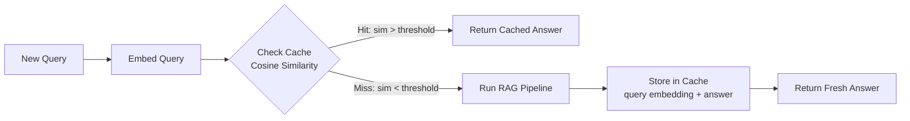

# Semantic Caching

> If two questions mean the same thing, why call the LLM twice?

---

## The Problem

In production RAG, many user questions are semantically identical:
- "What is RAG?" / "Explain RAG" / "How does RAG work?"
- "Who is the CEO?" / "Who leads the company?" / "Who runs this org?"

Standard caching (exact string match) misses all these. Semantic caching catches them.

---

## How Semantic Caching Works



1. Embed the incoming query
2. Search the cache for similar past queries
3. If similarity > threshold (e.g., 0.92) → return cached answer
4. If miss → run full RAG → cache the result

---

## Build a Semantic Cache from Scratch

```python
import numpy as np
import json
import time
from dataclasses import dataclass, asdict
from openai import OpenAI

client = OpenAI()

@dataclass
class CacheEntry:
    query: str
    answer: str
    embedding: list[float]
    timestamp: float
    hit_count: int = 0

class SemanticCache:
    """
    In-memory semantic cache with cosine similarity lookup.
    For production: replace the list with a vector database.
    """
    
    def __init__(
        self,
        similarity_threshold: float = 0.92,
        embedding_model: str = "text-embedding-3-small",
        max_size: int = 1000,
        ttl_seconds: float = 3600,  # 1 hour TTL
    ):
        self.threshold = similarity_threshold
        self.model = embedding_model
        self.max_size = max_size
        self.ttl = ttl_seconds
        self.cache: list[CacheEntry] = []
    
    def _embed(self, text: str) -> list[float]:
        response = client.embeddings.create(input=[text], model=self.model)
        return response.data[0].embedding
    
    def _cosine_similarity(self, a: list[float], b: list[float]) -> float:
        a, b = np.array(a), np.array(b)
        return float(np.dot(a, b) / (np.linalg.norm(a) * np.linalg.norm(b)))
    
    def _is_expired(self, entry: CacheEntry) -> bool:
        return (time.time() - entry.timestamp) > self.ttl
    
    def get(self, query: str) -> tuple[str | None, float]:
        """
        Look up query in cache.
        Returns (answer, similarity) or (None, 0.0) on miss.
        """
        query_embedding = self._embed(query)
        
        best_similarity = 0.0
        best_entry = None
        
        now = time.time()
        for entry in self.cache:
            # Skip expired entries
            if (now - entry.timestamp) > self.ttl:
                continue
            
            sim = self._cosine_similarity(query_embedding, entry.embedding)
            if sim > best_similarity:
                best_similarity = sim
                best_entry = entry
        
        if best_entry and best_similarity >= self.threshold:
            best_entry.hit_count += 1
            print(f"🎯 Cache HIT (sim={best_similarity:.4f}): '{best_entry.query}'")
            return best_entry.answer, best_similarity
        
        print(f"❌ Cache MISS (best sim={best_similarity:.4f})")
        return None, best_similarity
    
    def set(self, query: str, answer: str) -> None:
        """Store a query-answer pair in the cache."""
        if len(self.cache) >= self.max_size:
            # Evict oldest entry (LRU-style)
            self.cache.pop(0)
        
        embedding = self._embed(query)
        entry = CacheEntry(
            query=query,
            answer=answer,
            embedding=embedding,
            timestamp=time.time(),
        )
        self.cache.append(entry)
        print(f"✅ Cached: '{query[:50]}...'")
    
    def stats(self) -> dict:
        now = time.time()
        active = [e for e in self.cache if (now - e.timestamp) <= self.ttl]
        total_hits = sum(e.hit_count for e in active)
        return {
            "total_entries": len(self.cache),
            "active_entries": len(active),
            "total_cache_hits": total_hits,
            "threshold": self.threshold,
        }
    
    def clear(self) -> None:
        self.cache.clear()

# --- Usage with RAG Pipeline ---

def rag_with_cache(
    query: str,
    cache: SemanticCache,
    rag_fn,  # your actual RAG function
) -> dict:
    """
    Wrap any RAG pipeline with semantic caching.
    Returns answer + metadata about cache status.
    """
    start = time.time()
    
    # Check cache first
    cached_answer, similarity = cache.get(query)
    
    if cached_answer:
        return {
            "answer": cached_answer,
            "from_cache": True,
            "similarity": similarity,
            "latency_ms": (time.time() - start) * 1000,
        }
    
    # Cache miss — run full RAG
    answer = rag_fn(query)
    
    # Store result in cache
    cache.set(query, answer)
    
    return {
        "answer": answer,
        "from_cache": False,
        "similarity": similarity,
        "latency_ms": (time.time() - start) * 1000,
    }

# Demo
def dummy_rag(query: str) -> str:
    """Simulates an expensive RAG call (sleep 2 seconds)."""
    time.sleep(2)  # Simulate LLM latency
    return f"Answer to: {query}"

cache = SemanticCache(similarity_threshold=0.92)

queries = [
    "What is retrieval-augmented generation?",
    "Explain RAG to me",                         # Should hit cache
    "How does retrieval augmented generation work?",  # Should hit cache
    "What is a vector database?",                # Cache miss
    "Tell me about vector databases",            # Should hit cache
]

for q in queries:
    result = rag_with_cache(q, cache, dummy_rag)
    status = "HIT" if result["from_cache"] else "MISS"
    print(f"[{status}] {q[:50]} — {result['latency_ms']:.0f}ms")

print("\nCache stats:", cache.stats())
```

---

## Production: Redis + Vector Cache

For production, store embeddings in Redis with vector search:

```bash
uv add redis langchain-community
# Run Redis Stack (includes vector search)
docker run -d -p 6379:6379 redis/redis-stack-server:latest
```

```python
from langchain.cache import RedisSemanticCache
from langchain.globals import set_llm_cache
from langchain_openai import OpenAIEmbeddings, ChatOpenAI

# Set up semantic cache backed by Redis
set_llm_cache(
    RedisSemanticCache(
        redis_url="redis://localhost:6379",
        embedding=OpenAIEmbeddings(model="text-embedding-3-small"),
        score_threshold=0.2,  # Lower = more strict (cosine distance, not similarity)
    )
)

# Now any LangChain LLM call is automatically cached
llm = ChatOpenAI(model="gpt-4o-mini")

# First call — runs LLM
result1 = llm.invoke("What is RAG?")
print("First call:", result1.content[:100])

# Second call (semantically similar) — hits cache
result2 = llm.invoke("Explain retrieval augmented generation")
print("Second call (from cache):", result2.content[:100])
```

---

## GPTCache Integration

GPTCache is a dedicated semantic caching library with many backends:

```bash
uv add gptcache
```

```python
from gptcache import cache
from gptcache.adapter import openai
from gptcache.embedding import OpenAI as OpenAIEmbedding
from gptcache.manager import CacheBase, VectorBase, get_data_manager
from gptcache.similarity_evaluation import SearchDistanceEvaluation

# Initialize GPTCache
cache.init(
    embedding_func=OpenAIEmbedding().to_embeddings,
    data_manager=get_data_manager(
        CacheBase("sqlite"),          # Store metadata in SQLite
        VectorBase("faiss", dimension=1536)  # Store embeddings in FAISS
    ),
    similarity_evaluation=SearchDistanceEvaluation(),
)

# Now use the patched openai client — caching is automatic
from gptcache.adapter import openai as cached_openai

response = cached_openai.ChatCompletion.create(
    model="gpt-4o-mini",
    messages=[{"role": "user", "content": "What is RAG?"}]
)
print(response.choices[0].message.content)

# This call will be served from cache if similar enough
response2 = cached_openai.ChatCompletion.create(
    model="gpt-4o-mini",
    messages=[{"role": "user", "content": "Explain retrieval augmented generation"}]
)
```

---

## Choosing Your Threshold

| Threshold | Effect | Use When |
|-----------|--------|----------|
| 0.98–1.0 | Very strict — near-exact matches only | Safety-critical, must be precise |
| 0.92–0.97 | Good balance — catches paraphrases | Most production RAG |
| 0.85–0.92 | Loose — catches broad synonyms | FAQ systems, limited corpus |
| < 0.85 | Too loose — wrong cache hits | Don't use |

---

## Cache Metrics to Track

```python
# Track these in production
metrics = {
    "cache_hit_rate": hits / (hits + misses),      # Target: > 30% for FAQ use cases
    "avg_latency_hit_ms": ...,                      # Should be < 50ms
    "avg_latency_miss_ms": ...,                     # Your RAG pipeline latency
    "cost_saved": hits * estimated_llm_cost_per_call,
}
```

---

## Further Reading

- [GPTCache GitHub](https://github.com/zilliztech/GPTCache)
- [LangChain Semantic Cache](https://python.langchain.com/docs/integrations/llm_caching/)
- [Redis Vector Search](https://redis.io/docs/interact/search-and-query/advanced-concepts/vectors/)