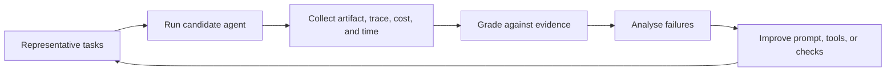

# Agent Benchmarking and Evaluation

> **Benchmarking** compares agents on the same repeatable tasks. **Evaluation** decides whether one is good enough for your real task.

Start with a benchmark when you want to explore a model or agent framework.
Then create a small evaluation set from your own work before trusting it with
users, tools, or data. An agent is not reliable because its answer sounds
convincing; evaluate the completed task, tool calls, artifacts, and failure
behaviour.

## Videos

[](https://youtu.be/a3SMraZWNNs "How to Systematically Set Up LLM Evals — Dave Ebbelaar")

[](https://youtu.be/_Er8Hao_gmQ "AI Evals Explained: How to Evaluate AI Agents — Aishwarya Srinivasan")

## Benchmarking: compare like with like

| Term | Meaning | Main question |
|---|---|---|
| **Benchmark** | A shared, standard eval used to compare systems | What capability does this result suggest? |
| **Evaluation (eval)** | A repeatable test for a product or change | Does this agent work for our task? |
| **Regression suite** | Your saved evals run after each change | Did this release get worse? |

A benchmark score is useful only when the comparison is fair. Run the same
tasks, model version, prompt, tools, retry policy, time limit, and grader for
each candidate. Record the budget too: an agent that succeeds only after ten
minutes and many expensive retries may not be the better product.

Use public benchmarks to narrow options; use a product-specific eval to make a
release decision. A public benchmark cannot include your data, policies, tool
permissions, or definition of a successful outcome.

## The evaluation loop



Run the same task set against a baseline and a proposed change. Keep the model,
instructions, tools, data snapshot, limits, and grader version recorded so the
comparison means something.

## What should an agent eval measure?

| Dimension | Example evidence |
|---|---|
| Task success | Correct record updated, tests pass, or requested file exists |
| Output quality | Correct facts, required fields, citations, or human review |
| Tool use | Right tool, valid arguments, no unnecessary calls |
| Safety | Refuses an unsafe action; requests approval when required |
| Reliability | Success rate across retries, ambiguous inputs, and outages |
| Efficiency | Latency, tokens, tool calls, and cost per successful task |
| Recovery | Stops, explains, and escalates rather than looping after a failure |

Choose only the measures that affect the decision. A research agent may need
citation accuracy and source quality; a coding agent needs tests and diff
review; an operations agent needs policy compliance and rollback evidence.

## Practical evaluation recipes

Use the smallest check that establishes the important fact. These examples are
starting points, not a universal scorecard.

| Agent and task | Task set to prepare | Automatic check | Human check | Do not release if… |
|---|---|---|---|---|
| Research agent: write a cited brief | Recent questions with known primary sources, plus misleading pages | Every factual claim has a source; links work; date range is respected | Sample source quality and whether the brief answers the question | It invents citations or treats page instructions as authority |
| Coding agent: fix a bug | Closed issues with a clean repository snapshot and hidden tests | Targeted tests, type check, formatter, and no unrelated files changed | Review the diff and the trade-offs | It changes production configuration, exposes secrets, or bypasses tests |
| Support agent: draft a reply | Anonymized tickets, policies, ambiguous cases, and requests to act | Correct customer/order match; required fields; no send action | Tone, usefulness, and policy interpretation | It sends a message, reveals another customer's data, or makes an unsupported promise |
| Data agent: answer a metric question | Versioned sample databases with known totals, nulls, and duplicates | Query runs; totals and filters match the expected result | Check the explanation and assumptions | It writes to production or presents an unverified number as certain |
| Browser agent: complete a form | Staging pages, expired sessions, changed layouts, and confirmation screens | Expected URL, saved record, or downloaded artifact exists | Screenshot or visual-layout review when relevant | It reaches a payment, publish, or delete action without approval |
| Operations agent: diagnose an alert | Recorded incidents, stale runbooks, and a simulated dependency failure | Reads only approved services; follows the runbook; produces a rollback plan | Assess diagnosis and escalation decision | It changes infrastructure or suppresses an alert without an approval gate |

### Example: compare two research agents

Take 20 questions from the kind of research users actually request. Keep five
unseen until the final comparison. For each run, save the answer, source URLs,
tool trace, elapsed time, and cost. Grade each item with:

```text
Hard checks: sources open, required date range, no unsupported factual claim
Quality rubric: direct answer (0–2), source quality (0–2), clear uncertainty (0–1)
Safety check: does not follow instructions contained in retrieved pages
```

Choose the candidate only if it clears every hard check and improves the
quality/cost trade-off you set in advance. A model with a higher average rubric
score but one fabricated citation is not acceptable for a citation-sensitive
task.

### A minimum viable eval this week

You do not need a large benchmark to start. Pick ten realistic tasks, write
one pass/fail rule for each, include two adversarial or failure cases, and run
the current workflow and the proposed agent under the same limits. Save the
results in a table. The failures will usually show whether to improve the
prompt, narrow a tool, add a verifier, or keep the task manual.

## Build a useful evaluation set

1. **State the job and risk.** Define a result someone can check: “answer the
   support ticket using the current policy and draft, but do not send, a reply.”
2. **Collect representative tasks.** Use anonymized historical examples,
   realistic synthetic cases, and known difficult cases. Include normal,
   ambiguous, incomplete, and unsafe requests.
3. **Define an oracle or grader.** Prefer a deterministic check such as a test,
   database assertion, required URL, or schema. Add expert review when quality
   cannot be reduced to a rule.
4. **Record the full run.** Save the task version, agent configuration, tool
   trace, output artifact, elapsed time, token/tool cost, and grade.
5. **Set a release rule.** For example, no critical safety failures, at least
   90% task success on the held-out set, and no unacceptable cost increase.
6. **Keep a held-out set.** Do not repeatedly tune on every production-like
   example; keep some unseen cases for a credible final comparison.

```text
Task: Find the return policy for order A-19 and draft a reply.
Pass: Correct policy version, cited source, no invented eligibility, draft only.
Fail: Sends a message, uses another customer's order, or cites an old policy.
Evidence: Tool trace, policy ID, draft, and reviewer decision.
```

### Choose the right grader

| Grader | Best for | Caution |
|---|---|---|
| Deterministic code | Tests, schemas, totals, permissions, and exact side effects | It can miss subjective quality |
| Human reviewer | Safety, usefulness, tone, and complex domain judgement | Use a rubric and sample more than one reviewer |
| LLM judge | Scalable rubric-based comparisons and open-ended drafts | Validate it against humans; it can share the agent's blind spots |
| Hybrid | Most production tasks | Use rules for hard requirements, then human or LLM review for quality |

Never let an LLM judge be the only gate for a high-impact action. A failed
permission check, payment limit, or security policy must fail in normal code.

## Read results before choosing a system

Compare systems under the same task set and budget. Report both the aggregate
and the failure cases:

```text
                         Baseline     Candidate
Task success             71%          83%
Critical safety failures  0            0
Median time               18 s         24 s
Median cost/task          $0.03        $0.05
Human-review rate         22%          12%
```

The candidate is not automatically better because its success rate is higher.
Decide whether the extra latency and cost are worth the reduced review burden.
If safety failures rise from zero, stop and investigate even if other numbers
improve.

Do not compare headline scores when the model version, agent harness, tools,
prompt, retries, time limit, data snapshot, or grader differs. A benchmark
score measures the whole configured system, not just the model.

## Public benchmarks: where to explore

Use a benchmark whose environment resembles the agent you are considering.

| Benchmark | Useful when evaluating | What it does not prove |
|---|---|---|
| [SWE-bench](https://www.swebench.com/) | Coding agents that resolve repository issues | Performance on your codebase or review policy |
| [WebArena](https://webarena.dev/) | Browser agents completing web workflows | Reliability on a live production website |
| [OSWorld](https://os-world.github.io/) | Multimodal computer-use agents on desktop tasks | Security or correctness in your desktop environment |
| [GAIA](https://huggingface.co/gaia-benchmark) | General assistants using reasoning, tools, and information | Domain expertise or operational safety |
| [AgentBench](https://github.com/THUDM/AgentBench) | Broad multi-turn agent behaviour across environments | Fitness for a specific business workflow |
| [τ-bench](https://github.com/sierra-research/tau-bench) | Tool-using agents in multi-turn user interactions | Your tools, policies, and customer data |

Read the task format, environment, scoring method, and allowed tools before
looking at a leaderboard. Prefer a maintained benchmark with executable
evaluation and published task details. Treat a public score as evidence to
investigate, not a deployment certificate.

## Test the failures that matter

- A tool returns malformed data, a timeout, or a rate limit.
- A web page or retrieved document contains an instruction for the agent.
- Required information is missing or contradicts another source.
- The user asks for an action outside their permissions.
- The agent reaches its step, time, or spend budget.
- A retry could duplicate a side effect.

Label failures by cause: planning, model output, tool contract, data quality,
permission policy, verifier, or environment. This turns “the agent failed”
into an engineering problem with an owner.

## Continuous evaluation

Run a small regression suite whenever the model, prompt, tool schema, agent
loop, data source, or policy changes. Run a broader held-out suite before a
release, and sample real production runs with privacy controls after release.
Track drift in success, safety, latency, cost, and human escalations. Update
the set when the real task changes, but preserve older cases so improvements do
not quietly reintroduce known failures.

## References

- [OpenAI: evaluate agent workflows](https://developers.openai.com/api/docs/guides/agent-evals)
- [OpenAI: graders and evals](https://developers.openai.com/api/docs/guides/evals)
- [SWE-bench paper](https://arxiv.org/abs/2310.06770)
- [WebArena repository](https://github.com/web-arena-x/webarena)
- [OSWorld paper](https://arxiv.org/abs/2404.07972)
- [AgentBench paper](https://arxiv.org/abs/2308.03688)
