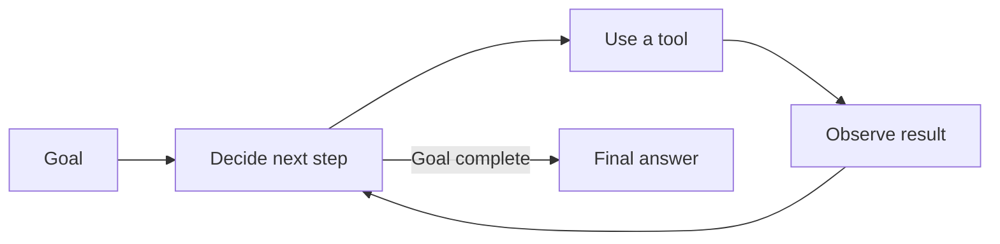

# Agent Fundamentals

> An **AI agent** is a model that can choose and use tools repeatedly to finish a goal.

## Short video

[](https://youtu.be/ZvDkJsKE80k "AI Agents Explained — Tech With Tim")

## Agent vs chatbot

| Chatbot | Agent |
|---|---|
| Usually produces one response | Can take several steps |
| Mainly returns text | Can search, calculate, edit, or call APIs |
| User guides each turn | Agent chooses the next step |
| Low autonomy | Controlled autonomy |

## The agent loop



An agent repeats three simple actions:

1. **Decide:** choose the next useful action.
2. **Act:** call a tool such as search, calculator, or database.
3. **Observe:** read the result and decide whether to continue.

## Main parts

| Part | Purpose |
|---|---|
| **Goal** | Defines what “done” means. |
| **Model** | Chooses the next action. |
| **Tools** | Let the agent interact with other systems. |
| **State** | Keeps the current task, results, and progress. |
| **Rules** | Limit permissions, steps, time, and cost. |
| **Verifier** | Checks whether the result is correct. |

## Common patterns

- **ReAct:** decide, act, observe, and repeat.
- **Plan then execute:** make a short plan before starting.
- **Router:** send each request to the right tool or specialist.
- **Human approval:** pause before sending, paying, deleting, or publishing.

## When to use an agent

Use an agent when the next step depends on information discovered during the task.

Use normal code when the steps are already known. A fixed workflow is usually faster, cheaper, and easier to test.

### Goal, plan, and state

A useful goal is **observable**, not vague. “Research AI” gives the agent no
finish line. “Find three official announcements published this week, write a
150-word digest, and include their links” gives it a result that can be
checked.

A plan is a short list of intended steps. It helps with long tasks, but it is
not a promise: a tool result may show that the plan needs to change. **State**
is the agent's current working record—for example, the task, sources already
read, tool results, remaining budget, and draft answer. Keep state small and
structured so a retry can continue rather than start from zero.

```text
Goal: compare two laptops under a budget
Plan: search → collect specifications → compare → cite sources
State: URLs seen, prices, missing fields, time left
Done: comparison table has both products and source links
```

### Autonomy levels

Not every agent should have the same freedom.

| Level | Agent may do | Example |
|---|---|---|
| **Suggest** | Read and draft | Propose a reply to a support ticket |
| **Assist** | Use safe read-only tools | Search documentation and summarize it |
| **Act with approval** | Prepare a side effect, then pause | Draft a refund or pull request |
| **Limited autonomous** | Complete pre-approved low-risk work | Label issues or refresh a report |

Start at the lowest useful level. Increase autonomy only after observing good
results, reliable checks, and understandable logs.

### A practical agent run

For a support example, an agent can read the ticket, look up the order, check
the return policy, draft a reply, and stop for approval. It should not send the
reply simply because it found a plausible answer. The application must check
the customer's identity, policy version, and approval rule outside the model.

This separation matters: the model is good at choosing and explaining; normal
code is better for permissions, money, dates, and irreversible actions.

### Common failure modes

- **Tool loop:** the agent keeps searching without learning anything new. Set a
  maximum tool-call count and ask it to explain why another call is needed.
- **Wrong tool:** the prompt is vague or tool descriptions overlap. Give tools
  precise names and examples.
- **False completion:** the agent writes “done” without evidence. Check files,
  test output, returned IDs, or source links.
- **Too much context:** long histories hide the important facts. Summarize
  older work and retrieve only what is relevant.
- **Permission confusion:** an agent can see a button but should not be allowed
  to press it. Enforce authorization in the tool implementation.

The smallest dependable agent is often one model, one or two tools, a clear
stop rule, and a verifier.

## Safety checklist

- Give the agent only the tools it needs.
- Limit steps, time, retries, and cost.
- Validate every tool input.
- Require approval for important side effects.
- Keep a log of actions and results.
- Check success with tests or clear rules, not only the model's opinion.

## References

- [ReAct paper](https://arxiv.org/abs/2210.03629)
- [Building Effective AI Agents — Anthropic](https://www.anthropic.com/research/building-effective-agents)
- [OWASP Top 10 for LLM Applications](https://owasp.org/www-project-top-10-for-large-language-model-applications/)
