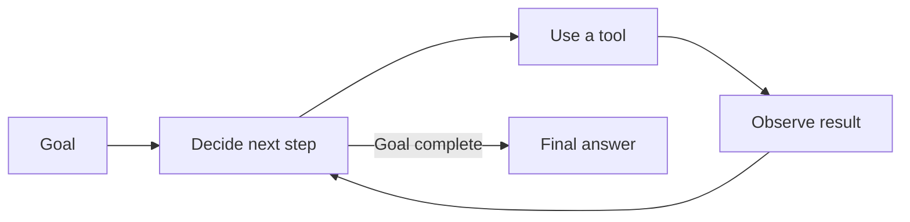

# Agent Fundamentals

> An **AI agent** is a model that can choose and use tools repeatedly to finish a goal.

## Short video

[](https://youtu.be/ZvDkJsKE80k "AI Agents Explained — Tech With Tim")

## Agent vs chatbot

| Chatbot | Agent |
|---|---|
| Usually produces one response | Can take several steps |
| Mainly returns text | Can search, calculate, edit, or call APIs |
| User guides each turn | Agent chooses the next step |
| Low autonomy | Controlled autonomy |

## The agent loop



An agent repeats three simple actions:

1. **Decide:** choose the next useful action.
2. **Act:** call a tool such as search, calculator, or database.
3. **Observe:** read the result and decide whether to continue.

## Main parts

| Part | Purpose |
|---|---|
| **Goal** | Defines what “done” means. |
| **Model** | Chooses the next action. |
| **Tools** | Let the agent interact with other systems. |
| **State** | Keeps the current task, results, and progress. |
| **Rules** | Limit permissions, steps, time, and cost. |
| **Verifier** | Checks whether the result is correct. |

## Common patterns

- **ReAct:** decide, act, observe, and repeat.
- **Plan then execute:** make a short plan before starting.
- **Router:** send each request to the right tool or specialist.
- **Human approval:** pause before sending, paying, deleting, or publishing.

## When to use an agent

Use an agent when the next step depends on information discovered during the task.

Use normal code when the steps are already known. A fixed workflow is usually faster, cheaper, and easier to test.

### Build a minimal agent

Start with a one-tool, read-only agent. Write its run contract before writing a
prompt or choosing a framework:

```yaml
goal: "Find three official announcements from this week and write a 150-word digest."
tools: [web_search]
max_tool_calls: 6
max_elapsed_seconds: 90
must_return: [three_source_urls, 150_word_digest]
done_when: "Three official URLs and a digest are present."
approval_required_for: []
```

The goal, limits, and `done_when` rule are application data—not an informal
model promise. Save a small run record so a retry knows what has already been
checked:

```json
{"task_id":"digest-042","sources":[],"tool_calls":0,"status":"running"}
```

### Choose an autonomy level

| Level | Enable | Example gate |
|---|---|---|
| Suggest | Read and draft only | Human copies the answer |
| Assist | Safe read-only tools | Returned source URLs are checked |
| Act with approval | Prepare a write, then stop | Signed approval ID is required |
| Limited autonomous | Pre-approved low-risk writes | Idempotency key and audit log are required |

Use the lowest row that completes the task. Do not let a prompt decide whether
to send, delete, pay, publish, or deploy; make the write tool require the gate.

### Test the agent before adding tools

| Test input | Expected evidence | If it fails, change |
|---|---|---|
| Normal request | Required artifact and sources exist | Goal or verifier |
| Missing information | It asks or reports the gap | Stop rule |
| Tool timeout | Bounded retry, then safe failure | Timeout/retry policy |
| Prompt injection in a page | It treats page text as data | Tool-result instruction |
| Request to send a message | It stops for approval | Write-tool contract |

Keep one failing example as a regression test. The smallest dependable agent is
usually one model, one or two tools, a clear stop rule, and a verifier.

## Safety checklist

- Give the agent only the tools it needs.
- Limit steps, time, retries, and cost.
- Validate every tool input.
- Require approval for important side effects.
- Keep a log of actions and results.
- Check success with tests or clear rules, not only the model's opinion.

## References

- [ReAct paper](https://arxiv.org/abs/2210.03629)
- [Building Effective AI Agents — Anthropic](https://www.anthropic.com/research/building-effective-agents)
- [OWASP Top 10 for LLM Applications](https://owasp.org/www-project-top-10-for-large-language-model-applications/)
