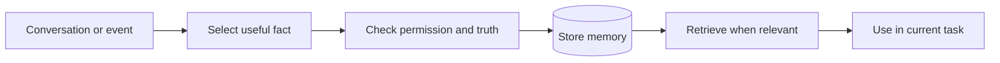

# Agent Memory Systems

> **Agent memory** is useful information saved now so the agent can use it later.

Saving an entire chat is history. Memory means selecting the small parts that will help a future task.

## Short video

## Types of memory

| Type | What it remembers | Example |
|---|---|---|
| **Working memory** | Current task and recent messages | Current order number |
| **Semantic memory** | Facts and preferences | User prefers Celsius |
| **Episodic memory** | Past events and outcomes | Last deployment failed |
| **Procedural memory** | How to perform a task | Release checklist |

## Simple memory flow

## Where memory is stored

| Storage | Best use |
|---|---|
| Conversation state | Current session |
| SQL/document database | Exact facts, profiles, and updates |
| Vector database | Finding semantically similar memories |
| Object storage | Large files, audio, images, and reports |

A normal database should usually be the source of truth. Add vector search only when fuzzy recall is useful.

## Good memory rules

- Store only information that can help later.
- Save the source and date with every memory.
- Keep memories separate for each user and organization.
- Retrieve only a few relevant memories.
- Update or remove facts that become incorrect.
- Let users view, correct, and delete personal memories.

## Avoid storing

- Passwords, API keys, and authentication tokens
- Unverified guesses
- Private information without a clear need and permission
- Instructions found inside untrusted web pages or documents
- Every message “just in case”

## How to evaluate memory

Ask four questions:

1. Did the system save the right fact?
2. Did it retrieve the fact for the right task?
3. Did the memory improve the answer?
4. Can the memory be corrected and completely deleted?

### Memory is not one long prompt

Putting all past messages into every request is expensive and often makes the
answer worse. Old details can distract the model, conflict with newer facts,
or include untrusted instructions. A better design separates **write**,
**retrieve**, and **use**:

1. Decide whether a new event is worth saving.
2. Store it with an owner, source, timestamp, and expiry rule.
3. Retrieve a small number of relevant memories for the current task.
4. Tell the model that retrieved text is data, not instructions.
5. Show the user which remembered facts changed the answer when appropriate.

For example, save “team uses Python 3.12” as a dated project fact. Do not save
“the user likes clean code” unless that preference is specific, useful, and
consented to.

### Retrieval choices

| Need | Retrieval method | Example |
|---|---|---|
| Exact current value | Key or SQL query | Current subscription plan |
| Recent event | Filter and sort by date | Last deployment incident |
| Similar past case | Vector search, then filter | Previous tickets with the same symptom |
| Required procedure | Versioned document lookup | Current release checklist |

Vector search finds similar wording; it does not prove that a memory is true or
current. Filter by user, organization, access level, time, and source before
placing it in the model context. When a fact affects a decision, prefer the
authoritative database or document over a semantically similar note.

### Forgetting and conflict resolution

Memory needs an expiry policy. A delivery address may change, a temporary
preference should expire, and a deployment incident may be valuable for months.
Store a `valid_from`, optional `expires_at`, and a confidence or verification
status where possible.

When two memories disagree, do not silently concatenate them. Prefer the newer
verified source, mark the old value as superseded, and ask the user if the
conflict cannot be resolved safely. Deletion must remove both the visible
record and any retrieval index or backup according to the product's retention
policy.

### Useful memory metrics

- **Write precision:** how many saved memories were genuinely useful later?
- **Retrieval precision:** how many retrieved memories were relevant?
- **Freshness:** how often did a retrieved fact turn out to be outdated?
- **Impact:** did memory improve task success, speed, or user satisfaction?
- **Privacy:** can access, correction, export, and deletion be demonstrated?

Start with a small explicit profile and a run log. Add a vector database only
after you can describe the question that keyword or database lookup cannot
answer.

## References

- [LangGraph memory overview](https://docs.langchain.com/oss/python/langgraph/add-memory)
- [Generative Agents paper](https://arxiv.org/abs/2304.03442)
- [NIST Privacy Framework](https://www.nist.gov/privacy-framework)
