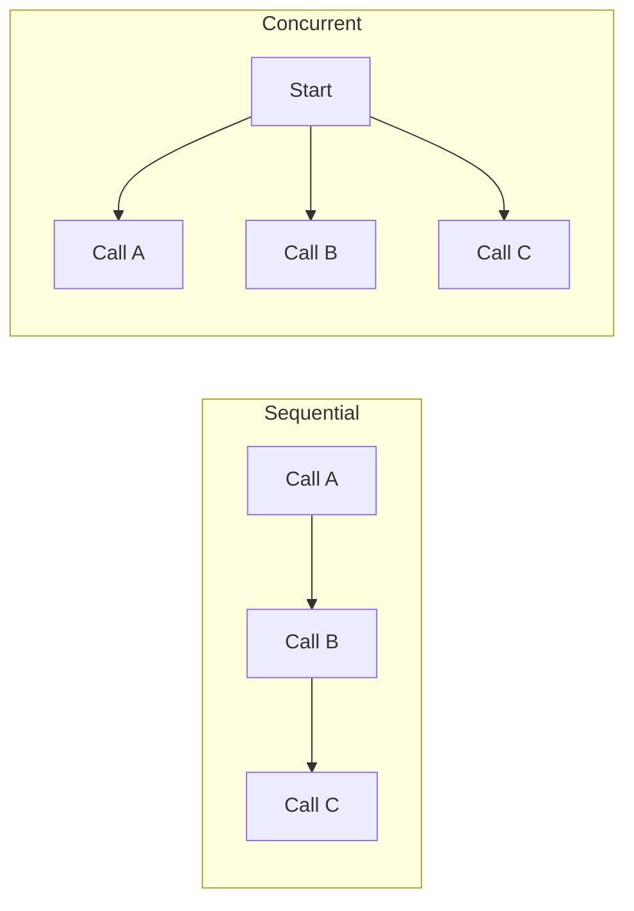

# Async and Parallelism in Agent Systems

> **Async** lets one program work on other tasks while it waits for a network, model, database, or file operation.

Agent systems spend a lot of time waiting, so async can reduce total waiting time.

## Short video

[](https://youtu.be/3E-ADzhr3W8 "Asyncio in Python — Yash Jain")

## Key terms

| Term | Simple meaning |
|---|---|
| **Synchronous** | Finish one task before starting the next. |
| **Asynchronous** | Work on another task while waiting. |
| **Concurrency** | Several tasks make progress during the same period. |
| **Parallelism** | Several tasks run at the exact same time. |
| **Coroutine** | Function declared with `async def`. |
| **`await`** | Pause this coroutine until an operation finishes. |
| **Event loop** | Schedules coroutines that are ready to run. |

## Sequential vs concurrent



## Small example

```python
import asyncio

async def call_api(name):
    await asyncio.sleep(1)  # represents network waiting
    return f"{name} finished"

async def main():
    results = await asyncio.gather(call_api("A"), call_api("B"))
    print(results)

asyncio.run(main())
```

Both calls wait together, so this takes about one second instead of two.

## Which approach should you use?

| Work | Good choice |
|---|---|
| API, model, or database calls | `asyncio` |
| Old blocking I/O library | Thread |
| Heavy CPU calculation | Process |
| Simple dependent steps | Sequential code |

## Practical rules

- Run calls concurrently only when they are independent.
- Set a timeout for every external call.
- Limit concurrency so an API is not overloaded.
- Retry only temporary failures and cap the retry count.
- Do not run blocking code such as `time.sleep()` inside `async def`.
- Keep writes ordered when one action depends on another.

### A bounded parallel-read helper

Use this for independent reads such as fetching several known URLs. It has a
per-call timeout, a concurrency limit, and a result shape that makes partial
failure explicit.

```python
import asyncio
import httpx

limit = asyncio.Semaphore(5)

async def fetch(client: httpx.AsyncClient, url: str) -> dict:
    try:
        async with limit, asyncio.timeout(10):
            response = await client.get(url)
            response.raise_for_status()
            return {"url": url, "status": "ok", "text": response.text}
    except (httpx.HTTPError, TimeoutError) as error:
        return {"url": url, "status": "failed", "error": str(error)}

async def fetch_all(urls: list[str]) -> list[dict]:
    async with httpx.AsyncClient(follow_redirects=True) as client:
        return await asyncio.gather(*(fetch(client, url) for url in urls))
```

```bash
uv add httpx
uv run python fetch_sources.py
```

Do not use this pattern for dependent work: `search → choose source →
summarize` must remain sequential. For writes, add an idempotency key and stop
if any required precondition fails.

### Choose the execution model

| Work | Start with | Practical rule |
|---|---|---|
| Independent HTTP, model, or database reads | `asyncio` | Use a semaphore and timeout |
| Blocking SDK you cannot replace | `asyncio.to_thread()` | Keep shared state out of the thread |
| CPU-heavy parsing or image work | Process | Pass file paths, not huge Python objects |
| Ordered writes or decisions | Sequential code | Verify one step before the next |

### Cancellation and result handling

```python
results = await fetch_all(urls)
successful = [item for item in results if item["status"] == "ok"]
failed = [item for item in results if item["status"] != "ok"]

if not successful:
    raise RuntimeError("No source could be fetched")
```

Use `try`/`finally` around files, database connections, and browser sessions.
Set a clear policy for partial success: a research digest may continue with two
sources; a payment or deployment should fail closed.

## References

- [Python `asyncio` documentation](https://docs.python.org/3/library/asyncio.html)
- [Python coroutines and tasks](https://docs.python.org/3/library/asyncio-task.html)
- [HTTPX async support](https://www.python-httpx.org/async/)
