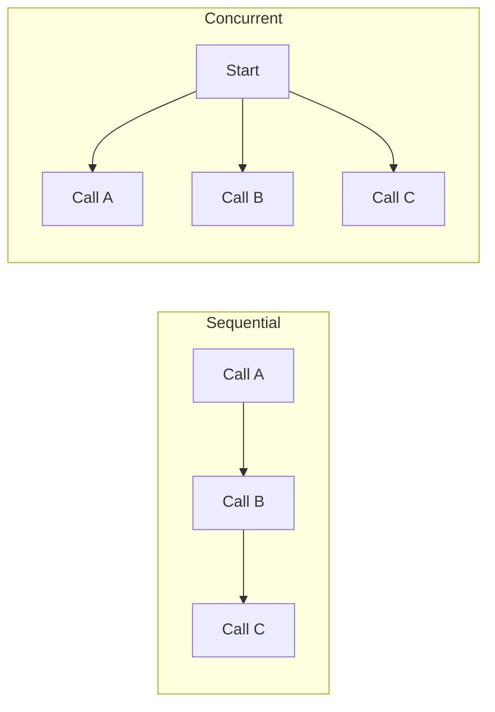

# Async and Parallelism in Agent Systems

> **Async** lets one program work on other tasks while it waits for a network, model, database, or file operation.

Agent systems spend a lot of time waiting, so async can reduce total waiting time.

## Short video

[](https://youtu.be/3E-ADzhr3W8 "Asyncio in Python — Yash Jain")

## Key terms

| Term | Simple meaning |
|---|---|
| **Synchronous** | Finish one task before starting the next. |
| **Asynchronous** | Work on another task while waiting. |
| **Concurrency** | Several tasks make progress during the same period. |
| **Parallelism** | Several tasks run at the exact same time. |
| **Coroutine** | Function declared with `async def`. |
| **`await`** | Pause this coroutine until an operation finishes. |
| **Event loop** | Schedules coroutines that are ready to run. |

## Sequential vs concurrent



## Small example

```python
import asyncio

async def call_api(name):
    await asyncio.sleep(1)  # represents network waiting
    return f"{name} finished"

async def main():
    results = await asyncio.gather(call_api("A"), call_api("B"))
    print(results)

asyncio.run(main())
```

Both calls wait together, so this takes about one second instead of two.

## Which approach should you use?

| Work | Good choice |
|---|---|
| API, model, or database calls | `asyncio` |
| Old blocking I/O library | Thread |
| Heavy CPU calculation | Process |
| Simple dependent steps | Sequential code |

## Practical rules

- Run calls concurrently only when they are independent.
- Set a timeout for every external call.
- Limit concurrency so an API is not overloaded.
- Retry only temporary failures and cap the retry count.
- Do not run blocking code such as `time.sleep()` inside `async def`.
- Keep writes ordered when one action depends on another.

### Why agent systems benefit

An agent may need prices from three sites, metadata from several documents, or
status from a group of services. These are independent **reads**, so starting
them together reduces wall-clock time. It does not make a slow API faster; it
avoids wasting time while another call is waiting on the network.

Do not parallelize decisions that depend on earlier output. For example,
`search → choose source → summarize source` is naturally sequential. Starting
the summary before selecting a source creates extra work and can use the wrong
input.

### Timeouts, limits, and partial success

External calls fail in normal operation. Give each call a timeout and decide
what a partial result means. A dashboard can show the two successful sources
and label the third as unavailable. A money transfer should fail closed and do
nothing unless every required check succeeds.

Use a semaphore to cap the number of requests. This protects rate limits and
prevents a large input list from creating thousands of connections at once.

```python
import asyncio

limit = asyncio.Semaphore(5)

async def limited_fetch(url):
    async with limit:
        return await fetch_with_timeout(url)

results = await asyncio.gather(
    *(limited_fetch(url) for url in urls),
    return_exceptions=True,
)
```

With `return_exceptions=True`, inspect every result. Do not accidentally treat
an exception object as valid content.

### Cancellation and cleanup

When the user cancels a task or one essential request fails, cancel work that
is no longer useful. Use `try`/`finally` to close files, HTTP clients, database
connections, and browser sessions. Cancellation is cooperative: a coroutine
usually stops at an `await`, so long CPU loops need a process or a redesign.

### Choosing threads and processes

Threads are useful for a blocking library that cannot be replaced, but shared
mutable state can make them difficult to reason about. Processes give CPU-heavy
work a separate interpreter and can use multiple cores, but transferring large
data has overhead. For a simple agent workflow, sequential code is often the
clearest choice until measurements show that waiting is the bottleneck.

### Common mistakes

- Calling a synchronous SDK directly inside `async def` and blocking the event
  loop.
- Launching unlimited requests, then receiving rate-limit errors.
- Retrying all failures immediately instead of using bounded exponential
  backoff for temporary errors.
- Writing the same record from parallel tasks without an idempotency key or
  transaction.
- Using concurrency to hide an unclear workflow rather than separating truly
  independent work.

## References

- [Python `asyncio` documentation](https://docs.python.org/3/library/asyncio.html)
- [Python coroutines and tasks](https://docs.python.org/3/library/asyncio-task.html)
- [HTTPX async support](https://www.python-httpx.org/async/)
