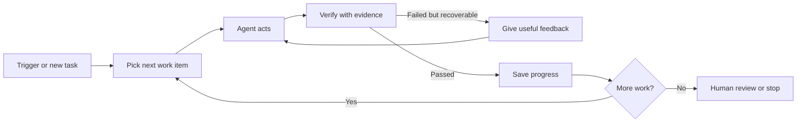

# Loop Engineering

> **Loop engineering** is the practice of designing how an AI agent repeatedly finds work, acts, checks the result, remembers progress, and stops safely.

It is an emerging term from 2026. The underlying ideas—feedback loops, verification, state, and stop conditions—are established software and agent-design practices.

## Short video

[](https://youtu.be/4biXYSNkn9Y "Loop Engineering Explained — Caleb Writes Code")

## The loop



## Four engineering layers

| Layer | Main question |
|---|---|
| **Prompt engineering** | What instruction should the model receive? |
| **Context engineering** | What files, facts, and history should it see? |
| **Harness engineering** | Which tools, permissions, and checks support one run? |
| **Loop engineering** | What triggers repeated runs, preserves progress, and stops them? |

These layers work together. Loop engineering does not replace good prompts or good code.

## Six parts of a useful loop

1. **Trigger:** schedule, event, issue, or user request that starts work.
2. **Queue:** clear list of work items and priorities.
3. **Worker:** agent with limited tools and permissions.
4. **Verifier:** tests or rules that produce evidence.
5. **State:** completed work, failures, and the next task.
6. **Stop rule:** success, budget limit, repeated failure, or human gate.

## Small example

```python
for attempt in range(3):
    result = agent.run(task)
    check = run_tests(result)

    if check.passed:
        save_progress(result)
        break

    task = add_feedback(task, check.errors)
else:
    request_human_help(task)
```

The important part is not the `for` loop. It is the **evidence** from `run_tests`, the attempt limit, saved state, and safe escalation.

## Good verification

| Task | Useful evidence |
|---|---|
| Fix code | Tests, type checks, and reviewed diff |
| Update documentation | Required sections and working links |
| Research | Claims supported by primary sources |
| Process data | Schema, row counts, and reconciled totals |
| Change infrastructure | Plan output, health check, and rollback path |

Do not use “the agent says it is done” as the only verifier.

## Safety rules

- Use a clean branch, worktree, container, or VM for each run.
- Limit attempts, tokens, time, concurrent workers, and spend.
- Keep the worker and verifier separate when risk is high.
- Save structured progress so restarts do not repeat completed work.
- Make writes idempotent so retries do not duplicate side effects.
- Stop after repeated identical failures.
- Require human approval before merge, deployment, deletion, payment, or publishing.

## When to use it

Use loop engineering for recurring, measurable work such as dependency updates, backlog triage, test repair, document maintenance, and scheduled research.

Do not build an autonomous loop when the task has no objective check, requires broad production access, or is cheaper for a human to complete once.

### A loop is a small state machine

Thinking in states makes a loop easier to debug than thinking only in prompts.
For example, a documentation-maintenance loop can move through:

```text
queued → researching → drafting → checking → published
                         ↓              ↓
                      blocked         retrying → blocked
```

Each state needs an owner, allowed actions, and a record of why it changed. A
run that is **blocked** should preserve the task and its evidence, then stop.
It must not keep spending tokens on the same missing permission or broken API.

### Feedback must be specific

“Try again” is weak feedback. A useful verifier returns a concrete gap the
agent can act on:

| Weak feedback | Useful feedback |
|---|---|
| “Tests failed” | “`test_total` expects 12 but received 10; preserve cancelled items” |
| “Research is poor” | “Two claims lack source URLs; use official sources published this week” |
| “Invalid document” | “Add a title, an owner, and a rollback section” |

The agent should receive only the smallest relevant error report. Long raw logs
can hide the cause and may include secrets or untrusted text.

### Idempotency and checkpoints

A retry must not create duplicate side effects. Give each work item a stable
ID, save completed steps, and use an idempotency key for actions such as sending
an email, creating an issue, or charging a payment. Before writing, check
whether the expected output already exists and whether it matches the current
task version.

Checkpoint after useful milestones: fetched source URLs, generated artifact,
verification result, approval result, and publication ID. On restart, load the
checkpoint and continue from the first incomplete safe step. Do not merely
store a free-form summary if code needs to make the next decision.

### Budget and observability

Every loop should have measurable limits: maximum attempts, total tool calls,
deadline, model-token budget, concurrent runs, and money spent. Record enough
information to answer: What started this run? Which tools were called? What
evidence passed or failed? What changed? Why did it stop?

Useful operational metrics include success rate, retries per successful run,
mean time to completion, human-escalation rate, duplicate-action rate, and
cost per completed item. Compare these to a simpler baseline; automation that
costs more and fails more often is not an improvement.

### Example: daily research loop

A scheduler starts one run. The agent reads yesterday's digest and a small
watchlist, chooses several searches, and collects source URLs. Code rejects
uncited claims and repeated stories. If the digest passes, the system writes a
dated Markdown file, updates memory, and publishes once. If the same check
fails twice, it stores a failure record and asks for human review the next day.
That is loop engineering: trigger, bounded work, evidence, memory, and a stop
condition working together.

## References

- [Unrolling the Codex agent loop — OpenAI](https://openai.com/index/unrolling-the-codex-agent-loop/)
- [Building Effective AI Agents — Anthropic](https://www.anthropic.com/research/building-effective-agents)
- [ReAct paper](https://arxiv.org/abs/2210.03629)
- [What Is Loop Engineering? — practical guide](https://loopengineering.run/blog/what-is-loop-engineering)
