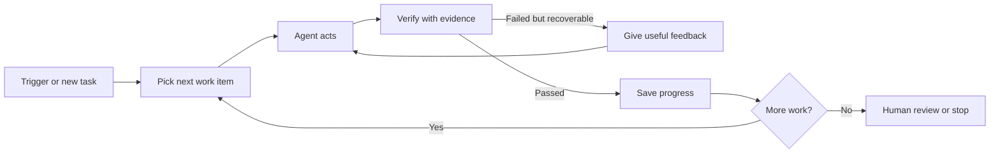

# Loop Engineering

> **Loop engineering** is the practice of designing how an AI agent repeatedly finds work, acts, checks the result, remembers progress, and stops safely.

It is an emerging term from 2026. The underlying ideas—feedback loops, verification, state, and stop conditions—are established software and agent-design practices.

## Short video

[](https://youtu.be/4biXYSNkn9Y "Loop Engineering Explained — Caleb Writes Code")

## The loop



## Four engineering layers

| Layer | Main question |
|---|---|
| **Prompt engineering** | What instruction should the model receive? |
| **Context engineering** | What files, facts, and history should it see? |
| **Harness engineering** | Which tools, permissions, and checks support one run? |
| **Loop engineering** | What triggers repeated runs, preserves progress, and stops them? |

These layers work together. Loop engineering does not replace good prompts or good code.

## Six parts of a useful loop

1. **Trigger:** schedule, event, issue, or user request that starts work.
2. **Queue:** clear list of work items and priorities.
3. **Worker:** agent with limited tools and permissions.
4. **Verifier:** tests or rules that produce evidence.
5. **State:** completed work, failures, and the next task.
6. **Stop rule:** success, budget limit, repeated failure, or human gate.

## Small example

```python
for attempt in range(3):
    result = agent.run(task)
    check = run_tests(result)

    if check.passed:
        save_progress(result)
        break

    task = add_feedback(task, check.errors)
else:
    request_human_help(task)
```

The important part is not the `for` loop. It is the **evidence** from `run_tests`, the attempt limit, saved state, and safe escalation.

## Good verification

| Task | Useful evidence |
|---|---|
| Fix code | Tests, type checks, and reviewed diff |
| Update documentation | Required sections and working links |
| Research | Claims supported by primary sources |
| Process data | Schema, row counts, and reconciled totals |
| Change infrastructure | Plan output, health check, and rollback path |

Do not use “the agent says it is done” as the only verifier.

## Safety rules

- Use a clean branch, worktree, container, or VM for each run.
- Limit attempts, tokens, time, concurrent workers, and spend.
- Keep the worker and verifier separate when risk is high.
- Save structured progress so restarts do not repeat completed work.
- Make writes idempotent so retries do not duplicate side effects.
- Stop after repeated identical failures.
- Require human approval before merge, deployment, deletion, payment, or publishing.

## When to use it

Use loop engineering for recurring, measurable work such as dependency updates, backlog triage, test repair, document maintenance, and scheduled research.

Do not build an autonomous loop when the task has no objective check, requires broad production access, or is cheaper for a human to complete once.

### Store a run record

Treat a loop as a persisted state machine. This record lets a cancelled run
resume safely and gives a human something concrete to inspect:

```json
{
  "run_id": "digest-2026-07-23",
  "state": "checking",
  "attempt": 1,
  "max_attempts": 2,
  "tool_calls": 4,
  "artifacts": ["sources.json", "digest.md"],
  "last_check": {"passed": false, "error": "Two claims have no URLs"},
  "idempotency_key": "digest-2026-07-23-publish"
}
```

Use states such as `queued`, `working`, `checking`, `retrying`, `blocked`, and
`complete`. A `blocked` run saves its evidence and stops; it must not keep
spending on the same broken tool or missing permission.

### A retry loop you can adapt

```python
for attempt in range(run["max_attempts"]):
    artifact = agent.run(task, previous_error=run.get("last_check"))
    check = verify(artifact)
    save_checkpoint(run, artifact, check)

    if check.passed:
        publish_once(artifact, idempotency_key=run["idempotency_key"])
        mark_complete(run)
        break

    run["last_check"] = check.smallest_actionable_error
else:
    mark_blocked(run, reason="verification failed repeatedly")
```

Return a specific verifier error, not “try again”:

| Weak feedback | Useful feedback |
|---|---|
| “Tests failed” | “`test_total` expects 12; preserve cancelled items.” |
| “Research is poor” | “Two claims lack source URLs; use official sources this week.” |
| “Invalid document” | “Add title, owner, and rollback section.” |

### Pre-flight checklist

- Stable task ID and idempotency key for every write
- Maximum attempts, time, tool calls, tokens, and spend
- One file or record per checkpoint
- Deterministic verifier where possible
- Human escalation rule for blocked or high-impact work
- Dashboard fields: success, retry count, duration, cost, and stop reason

## References

- [Unrolling the Codex agent loop — OpenAI](https://openai.com/index/unrolling-the-codex-agent-loop/)
- [Building Effective AI Agents — Anthropic](https://www.anthropic.com/research/building-effective-agents)
- [ReAct paper](https://arxiv.org/abs/2210.03629)
- [What Is Loop Engineering? — practical guide](https://loopengineering.run/blog/what-is-loop-engineering)
