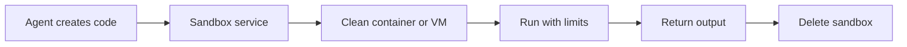

# LXD / Incus Sandboxing for Agents

> A **sandbox** is an isolated environment that limits what agent-generated code can access and damage.

LXD and Incus can run lightweight Linux system containers or stronger-isolation virtual machines.

## Short video

[](https://youtu.be/bm6jegefGyY "Create a Python Sandbox for Agents — Trelis Research")

## Execution flow



## Container vs VM

| Container | Virtual machine |
|---|---|
| Shares the host kernel | Has its own guest kernel |
| Starts quickly | Starts more slowly |
| Uses fewer resources | Uses more resources |
| Good for ordinary isolated tasks | Better for hostile or high-risk code |

Containers reduce risk but are not as strong a boundary as a VM.

## Small LXD example

```bash
# Create a disposable Ubuntu container.
lxc launch ubuntu:24.04 agent-run

# Limit CPU, memory, and processes.
lxc config set agent-run limits.cpu=2 limits.memory=2GiB limits.processes=256

# Run code with a 30-second limit.
lxc file push task.py agent-run/home/ubuntu/task.py
lxc exec agent-run --user 1000 --group 1000 -- \
  timeout 30s python3 /home/ubuntu/task.py

# Delete the container after collecting the output.
lxc delete agent-run --force
```

The Incus commands are similar; replace `lxc` with `incus`.

## Important safety rules

- Never give the agent access to the LXD, Incus, or Docker control socket.
- Use an unprivileged container and run code as a non-root user.
- Set CPU, memory, process, disk, output, and time limits.
- Deny network access by default; allow only required destinations.
- Do not mount the host home directory or secrets.
- Copy only the required input files.
- Use a clean image for every run.
- Delete the instance and temporary storage afterward.
- Use a VM or separate machine for deliberately hostile code.

## What limits prevent

| Risk | Main control |
|---|---|
| Infinite loop | Wall-time and CPU limit |
| Fork bomb | Process limit |
| Secret theft | No secret or host mounts |
| Data exfiltration | Network restrictions |
| Persistent malware | Disposable instance |
| Output flooding | Output-size limit |

### Threat model first

The right sandbox depends on what the generated code can do and what it can
reach. Code that only transforms a provided CSV is lower risk than code that
installs packages, receives arbitrary files, or makes network requests. List
the assets worth protecting: host files, credentials, internal network,
compute budget, customer data, and the availability of the sandbox host.

An LXD/Incus container is a useful isolation layer, but it is not magic. A
container shares the host kernel, so a kernel vulnerability or unsafe host
configuration can weaken the boundary. Use a VM or separate worker machine
when running untrusted code for different users or code designed to be hostile.

### Network and filesystem policy

Default-deny is easier to reason about than trying to block dangerous sites one
by one. If a task requires packages or one API, give it a narrow egress proxy
or allowlist rather than broad internet access. Do not rely on a model promise
that it will not call a URL.

Create a fresh input directory, copy only approved files into it, and write
outputs to a separate reviewed directory. Never bind-mount the repository,
home directory, cloud credentials, SSH agent, or container-control socket.
Treat files produced by the sandbox as untrusted until scanned and validated.

### A safer execution contract

```text
Input: task code + approved data files
Identity: unprivileged user inside a fresh instance
Limits: 2 CPUs, 2 GiB RAM, 256 processes, 30 seconds, bounded output
Network: disabled unless a named allowlist is required
Output: stdout/stderr capture plus files from one output directory
Cleanup: delete instance, temporary volume, and short-lived credentials
```

The controller—not the agent—creates this contract. It should enforce timeouts
outside the process as well, because code can ignore an internal timeout or
spawn child processes.

### Operational details

Use a clean, versioned base image and patch it regularly. Give every run a
unique ID, keep audit logs outside the sandbox, and capture only a bounded
amount of output. A full disk can be a denial-of-service issue just as easily
as an infinite CPU loop.

If a run needs a secret, prefer a short-lived credential scoped to one action.
Inject it only for that run, avoid printing it, and revoke it when the run ends.
For many learning exercises, the safest answer is simpler: run without any
secrets or network access.

### Before using it with agents

- Test that the agent cannot see host paths, sockets, or environment secrets.
- Test CPU, memory, process, disk, wall-time, and output limits separately.
- Test that failed or cancelled runs are still deleted.
- Test network denial and the smallest required allowlist.
- Have an incident path: disable new runs, preserve safe evidence, and rotate
  any credential that may have been exposed.

## References

- [LXD security hardening](https://documentation.ubuntu.com/lxd/latest/howto/security_harden/)
- [LXD instance options](https://documentation.ubuntu.com/lxd/latest/reference/instance_options/)
- [Incus documentation](https://linuxcontainers.org/incus/docs/main/)
- [Incus containers and VMs](https://linuxcontainers.org/incus/docs/main/explanation/instances/)
