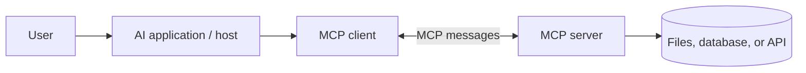

# Model Context Protocol (MCP)

> **MCP** is a standard way for AI applications to connect to external tools and data sources.

Instead of writing a different integration for every AI application, a developer can build one MCP server that compatible applications can use.

**Current stable specification (22 July 2026):** `2025-11-25`.

## Short video

[](https://youtu.be/cGuyrANVi4A "How Model Context Protocol Actually Works — Google Cloud Tech")

## Architecture



| Part | Meaning |
|---|---|
| **Host** | AI application used by the user. |
| **Client** | Connection from the host to one server. |
| **Server** | Program that exposes tools or data. |
| **Transport** | How messages travel between client and server. |

## Main server features

| Feature | Purpose | Example |
|---|---|---|
| **Tools** | Perform an action or calculation | Create issue, query database |
| **Resources** | Provide read-only context | File, record, API response |
| **Prompts** | Provide a reusable prompt template | Review this code |

MCP also supports optional client features such as **roots**, **sampling**, and **elicitation**. Learn these after the three core server features.

## Transports

| Transport | Use |
|---|---|
| **stdio** | Local server launched as a process |
| **Streamable HTTP** | Remote server reached over HTTP |

Older HTTP+SSE transport is being replaced by Streamable HTTP.

## MCP vs other concepts

| Concept | What it connects |
|---|---|
| Tool calling | Model to a function in its application |
| MCP | AI application to an external capability server |
| A2A | Independent agent service to another agent service |

## Security checklist

- Install servers only from trusted sources.
- Give every server the minimum permissions it needs.
- Show important tool arguments before an action runs.
- Keep secrets out of prompts and tool results.
- Use authentication and TLS for remote servers.
- Treat server output as untrusted data.
- Log calls without storing passwords or tokens.

### The connection lifecycle

An MCP client normally connects, negotiates supported capabilities, and then
discovers the server's tools, resources, and prompts. The host decides what to
show the user and when to let the model call a tool. The server remains the
authority for its own data and permissions.

```text
Host starts/connects client → initialize and negotiate capabilities
→ list tools/resources/prompts → user or model selects a capability
→ client sends request → server authorizes and responds → host displays result
```

This explains an important boundary: MCP standardizes communication, but it
does not automatically make a server safe, accurate, or authorized. Those are
still product and server responsibilities.

### Choosing the right feature

| If the user/model needs… | Prefer | Why |
|---|---|---|
| A calculation or a controlled action | Tool | It has typed input and can validate permissions |
| A known read-only item | Resource | It has a stable URI and no side effect |
| A reusable guided task | Prompt | It gives users a consistent starting template |
| A live changing list | Tool or resource template | The server can fetch it when requested |

For example, `customer://123` can be a resource only if access checks happen
before returning it. `find_customers(name)` should be a tool because it accepts
a query and may need rate limits and result filtering.

### Local versus remote servers

`stdio` is simple for a local trusted integration: the host launches the
process and communicates over standard input/output. It is not a reason to
skip review—local servers can still read files or call services using the
user's permissions.

Use Streamable HTTP when the server is shared or hosted remotely. It needs
normal web-service controls: TLS, authentication, token validation, rate
limits, logging, request size limits, and a clear tenant boundary. Do not
expose a development server to the internet merely to make it convenient to
connect.

### Practical design rules

- Keep tool names and schemas stable; version or deprecate intentional changes.
- Return compact structured results with source and timestamp when data can
  change.
- Separate read scopes from write scopes, and require confirmation for writes.
- Protect against confused-deputy problems: the server must authorize the
  actual caller, not only trust a request made by a model.
- Treat resource text and tool results as untrusted data; a document can try to
  instruct the model to reveal secrets or call another tool.

MCP is most useful when it turns a well-designed existing capability into a
reusable integration. It is not a replacement for ordinary API design.

## References

- [MCP architecture](https://modelcontextprotocol.io/docs/learn/architecture)
- [MCP specification `2025-11-25`](https://modelcontextprotocol.io/specification/2025-11-25)
- [Understanding MCP servers](https://modelcontextprotocol.io/docs/learn/server-concepts)
- [MCP security best practices](https://modelcontextprotocol.io/specification/2025-11-25/basic/security_best_practices)
