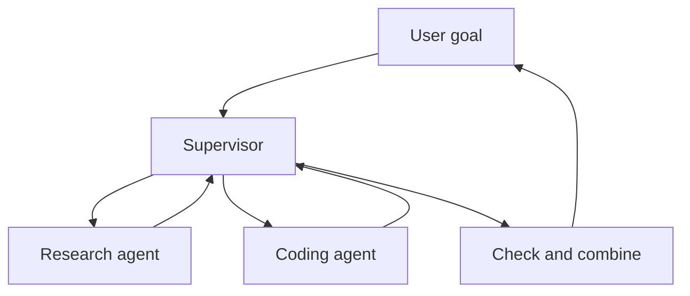

# Multi-Agent Systems

> A **multi-agent system** uses several agents with different roles to complete one larger goal.

More agents do not automatically mean better results. Use them only when tasks can be separated or require different tools and permissions.

## Short video

[](https://youtu.be/sWH0T4Zez6I "Multi-Agent Systems Explained — IBM Technology")

## Supervisor pattern



The supervisor divides the work, gives each worker a clear task, and combines the results.

## Common patterns

| Pattern | Simple flow | Good for |
|---|---|---|
| **Supervisor-workers** | Manager assigns tasks | Parallel research or implementation |
| **Router-specialists** | Request goes to one expert | Different domains |
| **Pipeline** | Agent A → Agent B → Agent C | Draft, review, publish |
| **Generator-critic** | One creates, one checks | Code, tests, compliance |
| **Peer handoff** | One agent transfers the task | Support or triage |

## A good handoff contains

- The exact task
- Required inputs
- Allowed tools and permissions
- Expected output format
- Success conditions
- Time, step, and cost limits

Do not send a large unfiltered conversation when a short task summary is enough.

## A2A and MCP

- **A2A** helps independent agent services discover and communicate with each other.
- **MCP** gives an AI application access to tools and data.
- An A2A agent can use MCP servers internally.

## When multiple agents help

- Workers can run independent tasks at the same time.
- Different tasks need different tools or private data.
- One worker can verify another worker's artifact.
- Separate teams or services own different parts of the work.

## When one agent is better

- The task is small or strongly sequential.
- Every agent needs the same context.
- Communication costs more than the work itself.
- There is no objective way to combine or check results.

### Coordination costs are real

Every extra agent needs a task description, relevant context, a tool budget,
and a way to report back. The supervisor then needs to compare reports and
resolve contradictions. This costs tokens, time, and engineering effort. Split
work only when the benefit is larger than that cost.

Good splits are independent and produce clear artifacts:

```text
Research worker → source list with dates and links
Data worker     → validated table with query and row count
Writer          → draft using only supplied artifacts
Reviewer        → checklist with pass/fail evidence
```

“Work on this somehow” is not a handoff. It creates overlap, duplicated
searches, and vague results that are hard to combine.

### Shared state and message design

Use a small shared task record rather than passing every conversation to every
worker. Useful fields include task ID, goal, assumptions, allowed tools,
artifact locations, status, owner, deadline, and acceptance tests. Store large
artifacts in files or a database and pass references when possible.

Messages should distinguish facts, assumptions, and requests. A research worker
can say “confirmed: link A”, “unconfirmed: publication date”, and “need:
access to document B.” This helps a supervisor make a safe next decision.

### Conflict and failure handling

Workers can disagree. A supervisor should not simply average their answers.
Prefer evidence: primary source over summary, successful test over confident
claim, current version over older version. When evidence is equal, send a
targeted follow-up or escalate to a human.

If one optional research worker fails, the task may continue with a note. If a
security or payment checker fails, the whole workflow should stop. Define this
before execution using required versus optional workers and explicit deadlines.

### A practical starting design

Start with one agent and record where it is slow, unreliable, or needs a
different permission boundary. Then add one specialized worker for that single
bottleneck. Measure task success, elapsed time, token cost, and human review
time against the one-agent baseline.

Many real systems need only a **generator + verifier** pair. This gives an
independent check without the complexity of a large agent team.

### Evaluation questions

- Did each worker receive only the information and tools it needed?
- Are artifact formats explicit enough to be checked automatically?
- Can a failed handoff be retried without repeating completed work?
- Does the final owner cite the evidence used to resolve disagreements?
- Is the multi-agent system better than a sequential workflow on accuracy,
  latency, cost, or access separation?

## Safety checklist

- Give each agent minimum permissions.
- Set a maximum number of workers and retries.
- Keep one owner responsible for the final result.
- Record every handoff and artifact.
- Check the combined output for conflicts and duplication.
- Compare quality, time, and cost with a single-agent baseline.

## References

- [A2A protocol documentation](https://a2a-protocol.org/latest/)
- [A2A specification](https://a2a-protocol.org/latest/specification/)
- [MCP architecture](https://modelcontextprotocol.io/docs/learn/architecture)
- [Anthropic multi-agent research system](https://www.anthropic.com/engineering/multi-agent-research-system)
