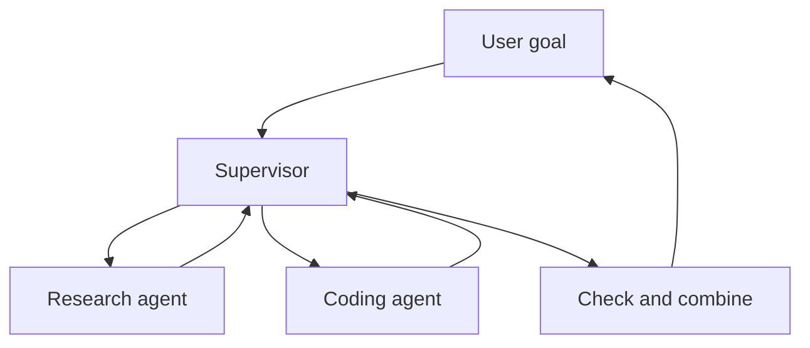

# Multi-Agent Systems

> A **multi-agent system** uses several agents with different roles to complete one larger goal.

More agents do not automatically mean better results. Use them only when tasks can be separated or require different tools and permissions.

## Short video

[](https://youtu.be/sWH0T4Zez6I "Multi-Agent Systems Explained — IBM Technology")

## Supervisor pattern



The supervisor divides the work, gives each worker a clear task, and combines the results.

## Common patterns

| Pattern | Simple flow | Good for |
|---|---|---|
| **Supervisor-workers** | Manager assigns tasks | Parallel research or implementation |
| **Router-specialists** | Request goes to one expert | Different domains |
| **Pipeline** | Agent A → Agent B → Agent C | Draft, review, publish |
| **Generator-critic** | One creates, one checks | Code, tests, compliance |
| **Peer handoff** | One agent transfers the task | Support or triage |

## A good handoff contains

- The exact task
- Required inputs
- Allowed tools and permissions
- Expected output format
- Success conditions
- Time, step, and cost limits

Do not send a large unfiltered conversation when a short task summary is enough.

## A2A and MCP

- **A2A** helps independent agent services discover and communicate with each other.
- **MCP** gives an AI application access to tools and data.
- An A2A agent can use MCP servers internally.

## When multiple agents help

- Workers can run independent tasks at the same time.
- Different tasks need different tools or private data.
- One worker can verify another worker's artifact.
- Separate teams or services own different parts of the work.

## When one agent is better

- The task is small or strongly sequential.
- Every agent needs the same context.
- Communication costs more than the work itself.
- There is no objective way to combine or check results.

### Use an artifact-based handoff

Do not pass full chats between workers. Give each worker a small task file and
an expected artifact:

```yaml
task_id: weekly-digest-042
owner: research-worker
goal: "Find three official announcements published this week."
allowed_tools: [web_search, fetch_page]
input_artifacts: [watchlist.yaml]
output_artifact: sources.json
acceptance_test: "Three distinct official URLs, each with title and date."
deadline_seconds: 90
```

The worker returns structured output, not a status paragraph:

```json
{"status":"complete","artifact":"sources.json","facts":["..."],"unknowns":[],"evidence":["https://..."]}
```

### A supervisor recipe

```text
1. Create one task file per independent artifact.
2. Give each worker only its permitted tools and input artifacts.
3. Run independent workers in parallel with individual deadlines.
4. Validate each artifact before handing it to the next worker.
5. Send conflicts back as one specific question, or escalate to a human.
6. Keep one final owner responsible for the combined result.
```

Start with a generator + verifier pair. Add another worker only when a measured
bottleneck needs a different tool, context, or permission boundary.

### Failure policy cheat sheet

| Worker result | Supervisor action |
|---|---|
| Optional source search timed out | Continue, label the gap, do not invent a source |
| Required policy check failed | Stop the workflow |
| Two workers disagree | Prefer primary evidence; otherwise ask one focused follow-up |
| Artifact fails its schema | Retry that worker with the validation error only |
| Worker exhausts budget | Preserve its artifact and escalate or finish with a stated limitation |

Compare the multi-agent version with one agent on task success, elapsed time,
token cost, and human-review time. More workers are useful only if the result
improves on one of these measures.

## Safety checklist

- Give each agent minimum permissions.
- Set a maximum number of workers and retries.
- Keep one owner responsible for the final result.
- Record every handoff and artifact.
- Check the combined output for conflicts and duplication.
- Compare quality, time, and cost with a single-agent baseline.

## References

- [A2A protocol documentation](https://a2a-protocol.org/latest/)
- [A2A specification](https://a2a-protocol.org/latest/specification/)
- [MCP architecture](https://modelcontextprotocol.io/docs/learn/architecture)
- [Anthropic multi-agent research system](https://www.anthropic.com/engineering/multi-agent-research-system)
