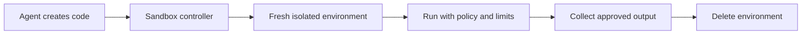

# Sandboxing Agent Code

> A **sandbox** is an isolated environment that limits what agent-generated code can access and damage.

Sandboxing is a security boundary, not a particular product. Containers,
application kernels, microVMs, virtual machines, and managed code-execution
services can all be useful. The right choice depends on what the code can do,
which data it can reach, and the cost of a breakout or mistake.

## Videos

[](https://youtu.be/bm6jegefGyY "Create a Python Sandbox for Agents — Trelis Research")

[](https://youtu.be/sV8HKlwsFag "Running Untrusted Code with gVisor — Linux Foundation")

## Execution flow



The **controller** creates the sandbox, supplies approved inputs, applies
limits, collects output, and cleans up. The agent should not control the
sandbox host, choose its own permissions, or access a container runtime socket.

## Choose an isolation boundary

| Boundary | Isolation and trade-off | Good fit |
|---|---|---|
| Process sandbox | Lowest overhead; same host and usually same kernel | Trusted short scripts with very limited access |
| Container | Fast and resource-efficient; shares the host kernel | Ordinary disposable data or build tasks |
| Application kernel | Adds a kernel-like boundary around a container | Workloads needing stronger isolation without a full VM |
| MicroVM or VM | Stronger boundary; more startup and operational cost | Untrusted multi-user or higher-risk code |
| Managed code environment | Provider operates the runtime; less control | Analysis or calculation that fits its documented limits |

Start with the task's threat model, not the tool name. Code that transforms a
supplied CSV is different from code that installs packages, receives arbitrary
files, uses a browser, or can reach credentials and an internal network.

## A sandbox execution contract

Before choosing Docker, Incus, gVisor, or another tool, write the contract that
every implementation must enforce:

```text
Input: task code + approved data files
Identity: unprivileged user in a fresh environment
Limits: CPU, memory, processes, disk, wall time, and output size
Network: disabled unless a named allowlist is necessary
Output: captured stdout/stderr and one reviewed output directory
Cleanup: delete the environment, temporary storage, and short-lived credentials
```

Enforce timeouts outside the process. Code can ignore an internal timeout or
spawn child processes. Treat all files produced by the sandbox as untrusted
until they have been scanned and validated.

## Three short tool recipes

These are deliberately small starting points. Read the product security
documentation and test each control in your own environment before using it
with untrusted code.

### 1. Docker or Podman: disposable container

Use a container for ordinary, short-lived tasks when sharing the host kernel is
acceptable. Create separate input and output directories; do not mount the
repository, home directory, credential directories, SSH agent, or Docker
socket.

```bash
mkdir -p sandbox-input sandbox-output

docker run --rm \
  --network none \
  --read-only \
  --cap-drop ALL \
  --security-opt no-new-privileges \
  --pids-limit 128 --memory 1g --cpus 1 \
  --user "$(id -u):$(id -g)" \
  --tmpfs /tmp:rw,noexec,nosuid,size=64m \
  -v "$PWD/sandbox-input:/input:ro" \
  -v "$PWD/sandbox-output:/output:rw" \
  -w /output \
  python:3.12-slim \
  timeout 30s python /input/task.py
```

Put `task.py` and only approved input data in `sandbox-input`. Collect only
the expected files from `sandbox-output`. Podman can use the same command with
`podman run`; rootless Podman is a useful extra protection, not a substitute
for the limits above.

### 2. gVisor: stronger container boundary

gVisor runs a container with an application kernel between the workload and
host kernel. It is a good next option when the Docker/Podman workflow is useful
but a plain container is not a strong enough boundary. An administrator must
install and configure the `runsc` runtime first.

```bash
# Confirm that the runtime is available, then use the Docker recipe above.
docker info | rg -i runsc

docker run --rm --runtime=runsc \
  --network none --read-only --cap-drop ALL \
  --pids-limit 128 --memory 1g --cpus 1 \
  --user "$(id -u):$(id -g)" \
  -v "$PWD/sandbox-input:/input:ro" \
  -v "$PWD/sandbox-output:/output:rw" \
  python:3.12-slim timeout 30s python /input/task.py
```

Keep the input/output mounts and time, memory, process, and network limits
from the first recipe. `--runtime=runsc` changes the runtime; it does not make
unsafe mounts, credentials, or broad network access safe.

### 3. Incus or LXD: fresh system container

System containers are useful when a task needs a fuller Linux environment. A
dedicated profile can set the resource limits and omit a network interface. The
storage pool name below (`default`) is an example; use the pool available on
your host.

```bash
incus profile create agent-sandbox
incus profile set agent-sandbox limits.cpu=1 limits.memory=1GiB \
  limits.processes=128 security.privileged=false
incus profile device add agent-sandbox root disk path=/ pool=default

incus launch images:ubuntu/24.04 agent-run --profile agent-sandbox
incus exec agent-run -- useradd --create-home --shell /bin/bash agent
incus file push sandbox-input/task.py agent-run/tmp/task.py
incus exec agent-run --user 1000 -- sh -c \
  'mkdir -p /tmp/output && timeout 30s python3 /tmp/task.py'
incus file pull -r agent-run/tmp/output sandbox-output
incus delete agent-run --force
```

This profile has no NIC, so it denies network access by omission. Copy approved
inputs in with `incus file push`; the recipe creates an unprivileged `agent`
user and returns only `/tmp/output` with `incus file pull`. LXD uses equivalent
`lxc` commands. Never give the agent access to the Incus, LXD, or Docker
control socket.

## Important safety rules

- Run code as an unprivileged user; never use a privileged container.
- Deny network access by default. If one API is required, use a narrow egress
  proxy or allowlist rather than open internet access.
- Set CPU, memory, process, disk, wall-time, and output-size limits.
- Copy only approved files in and return files through one reviewed directory.
- Use a clean, versioned image for every run and patch it regularly.
- Give secrets only when necessary, scope them to one action, and revoke them
  after the run. Many learning tasks should have no secrets at all.
- Use a VM, microVM, or separate worker for hostile code or untrusted users.

## What limits prevent

| Risk | Main control |
|---|---|
| Infinite loop | Wall-time and CPU limit |
| Fork bomb | Process limit |
| Disk exhaustion | Disk quota and bounded output |
| Secret theft | No secret or host mounts |
| Data exfiltration | Default-deny network policy |
| Persistent malware | Fresh environment and cleanup |

## Validate the sandbox, not only the code

Test the controls separately before giving the environment to an agent:

1. Try to read a host path and a mounted secret; both must fail.
2. Try a CPU loop, memory growth, many child processes, and large output.
3. Try a blocked network request and the smallest allowed destination.
4. Cancel a run and confirm that child processes, volumes, and credentials are
   removed.
5. Record a run ID, safe command summary, limits, result, and cleanup status
   outside the sandbox.

An agent prompt saying “do not access the network” is not a sandbox policy.
The platform must enforce the policy even when the model is confused or the
input is malicious.

## References

- [NIST application container security guide](https://csrc.nist.gov/pubs/sp/800/190/final)
- [Docker runtime security](https://docs.docker.com/engine/security/)
- [gVisor documentation](https://gvisor.dev/docs/)
- [LXD security hardening](https://documentation.ubuntu.com/lxd/latest/howto/security_harden/)
- [Incus documentation](https://linuxcontainers.org/incus/docs/main/)
