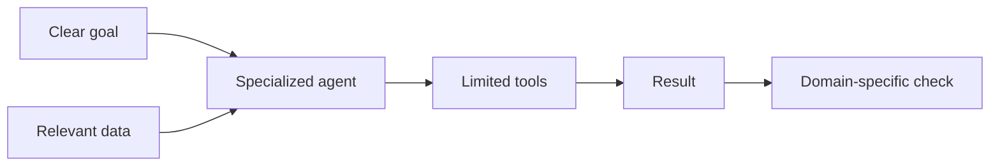

# Specialized Agents

> A **specialized agent** is designed for one type of work and receives only the tools, data, and permissions needed for that work.

Specialization is more than giving the model a role in a prompt. The tools and checks must also match the role.

## Short video

## Basic design

## Useful specializations

| Agent | Tools | How to check it |
|---|---|---|
| **Browser agent** | Browser automation | Page state or screenshot |
| **Coding agent** | Editor, shell, tests | Tests, types, and diff review |
| **Data agent** | SQL and notebooks | Constraints and totals |
| **Research agent** | Search and document tools | Primary-source citations |
| **Document agent** | PDF/Office parsers | Rendered-page review |
| **Operations agent** | Logs and runbooks | Health check and rollback state |

## Browser agents

Browser agents can read pages, fill forms, and click controls. Prefer page roles and labels such as “Search” or “Submit” over screen coordinates because they are more stable.

Use screenshots when visual layout matters and structured page data when exact text or controls matter.

## Coding agents

A coding agent should receive:

- A clear issue or specification
- Only the relevant repository
- A disposable branch or sandbox
- Commands for tests and formatting
- A rule that deployment or merge needs approval

## Good design steps

1. Give the agent one clear role.
2. Provide only relevant information.
3. Give it a small set of task-specific tools.
4. Define an objective success check.
5. Set time, step, token, and cost limits.
6. Ask a human when the task is unclear or high impact.

## Common mistakes

- Calling an agent an “expert” without giving it expert tools or data
- Giving a database agent production write access by default
- Using vision clicks when stable page controls are available
- Accepting citations without checking the linked source
- Letting a coding agent access host secrets
- Retrying a broken website forever

### Specialize the whole system, not just the prompt

“You are a research expert” is not enough to create a research agent. A useful
research agent needs search or document tools, a source policy, a citation
format, and a verifier that checks the cited pages. The same idea applies to
every role: the **data**, **tools**, **permissions**, and **success test** must
fit the job.

| Role | Inputs to provide | Permission boundary | Useful output |
|---|---|---|---|
| Research | Question, date range, trusted sources | Read-only web/documents | Claims with source URLs |
| Coding | Issue, repository, tests | Sandbox and branch only | Diff plus test results |
| Data | Schema, metric definition, sample data | Read-only database by default | Query, result, checks |
| Operations | Runbook, service scope, alert | Scoped diagnostic access | Diagnosis and rollback plan |

This design reduces accidental power. A research agent should not have a shell;
a coding agent should not need customer records; an operations agent should not
have authority to delete infrastructure without a separate approval tool.

### Match verification to the artifact

An answer can sound professional and still be wrong. Verify the artifact the
agent created, not just its explanation:

- Browser agent: element state, URL, downloaded file, and screenshot when
  visual layout matters.
- Coding agent: focused tests, formatter, type check, security scan, and diff
  review.
- Data agent: row counts, null checks, constraints, totals, and a saved query.
- Research agent: source quality, publication date, quotation accuracy, and
  claim-to-citation match.
- Document agent: rendered pages, headings, page numbers, and link targets.

### Tool design examples

A browser agent benefits from `find_by_role`, `click`, `fill`, and
`get_page_text`, not one unrestricted “browse anywhere” command. A data agent
benefits from a parameterized read-only query tool with maximum row limits. A
coding agent needs commands that run selected tests, not a production deploy
tool.

Smaller tools make logs more meaningful and make permissions possible to
enforce. They also let students diagnose whether the failure came from model
reasoning, the tool, the data, or the verification rule.

### When to generalize

Keep a specialist when its inputs, permissions, and verifier remain stable.
Create a new specialist only when the work genuinely has a different boundary.
If two agents use the same tools, same context, and same checks, one simpler
agent with a routing prompt is usually easier to maintain.

## References

- [Playwright locators](https://playwright.dev/python/docs/locators)
- [SWE-bench](https://www.swebench.com/)
- [OSWorld computer-use benchmark](https://os-world.github.io/)
- [OWASP Prompt Injection guidance](https://genai.owasp.org/llmrisk/llm01-prompt-injection/)
